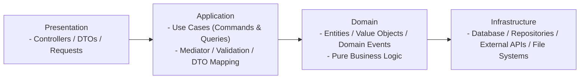
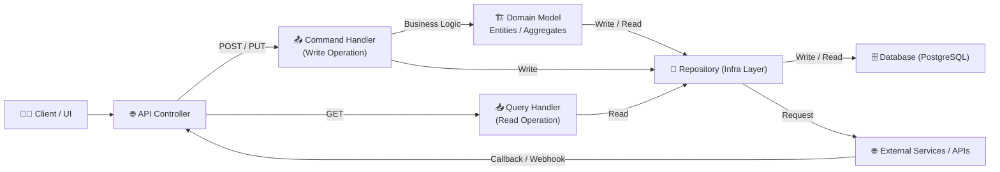

# 🧱 Products Service – Clean Architecture (CQRS + DDD)

## 📘 Summary

The **Service** is built as a modular, maintainable foundation for the SaaS ecosystem.  
By applying **Clean Architecture**, **CQRS**, and **DDD**, the system ensures flexibility, scalability, and long-term maintainability — ready to evolve for new domains and products.

## 🚀 Advantages

✅ Independent scaling and deployment per layer  
✅ Easy testing and maintenance  
✅ Framework-agnostic core logic  
✅ Clean and predictable data flow  
✅ High code reusability across services  

## 🧭 Architecture Concept

The **Products Service** is built using **Clean Architecture** and **Domain-Driven Design (DDD)**, combined with the **CQRS (Command Query Responsibility Segregation)** pattern.  
This architecture provides:

- Clear separation of concerns  
- High maintainability and testability  
- Scalable and extendable design  
- Independent business logic (domain-centric)

## 🧩 Architecture Overview



## 🧠 Layer Responsibilities

| Layer              | Description                                                                          | Depends On          |
| ------------------ | ------------------------------------------------------------------------------------ | ------------------- |
| **Presentation**   | Handles API requests, input validation, and DTO mapping.                             | Application         |
| **Application**    | Contains CQRS handlers (commands/queries), mediators, and orchestrates domain logic. | Domain              |
| **Domain**         | Core business entities, value objects, and domain events. No external dependencies.  | None                |
| **Infrastructure** | Database, repositories, integrations, file storage, and external services.           | Application, Domain |

## 🧠 Installed Packages / Dependencies per Layer

### 📌 Presentation

- `Microsoft.AspNetCore.Mvc`
- `FluentValidation.AspNetCore`
- `Swashbuckle.AspNetCore` (Swagger / OpenAPI)

### 📌 Application

- `MediatR`
- `FluentValidation`
- `AutoMapper`
- `Ardalis.GuardClauses` (optional for validation)

### 📌 Domain

- `System.ComponentModel.Annotations` (validation attributes)
- `LanguageExt` (optional for functional programming)

### 📌 Infrastructure

- `Microsoft.EntityFrameworkCore`
- `Npgsql.EntityFrameworkCore.PostgreSQL`
- `RestSharp` (for external APIs)
- `Dapper` (optional lightweight SQL)

### 📌 Shared

- `Microsoft.Extensions.DependencyInjection`
- `Serilog`
- `Newtonsoft.Json` (optional for serialization)

### 📌 Tests

- `xUnit`
- `Moq`
- `FluentAssertions`
- `Respawn` (optional, for database reset)

## 🔄 CQRS Data Flow (Simplified)



## ✅ Architecture Pros / Cons Matrix

| 🗂 Matrix                 | 👍 Pros Description                      | 💡 Pros Example                                                                  | ⚠️ Cons Description                  | ❌ Cons Example                                                           |
| ------------------------ | --------------------------------------- | ------------------------------------------------------------------------------- | ----------------------------------- | ------------------------------------------------------------------------ |
| 🔹 Separation of Concerns | Clear separation of concerns            | Presentation layer only handles API requests, no business logic                 | Slightly higher learning curve      | New developers need to understand multiple layers and patterns           |
| 🔹 CQRS                   | Supports CQRS for scalable operations   | Commands handle writes, Queries handle reads independently                      | More project files                  | Need separate folders for Commands, Queries, DTOs, Validators            |
| 🔹 Domain Layer           | Domain layer is framework-agnostic      | Domain models can be tested without ASP.NET or EF Core                          | Increased boilerplate               | Writing mediators, validators, and mapping classes for each feature      |
| 🔹 External Integrations  | Easy integration with external services | Repository calls external REST API or file storage                              | Slightly complex debugging          | Issues may propagate across command handlers, repositories, and services |
| 🔹 Reusability            | High reusability of shared modules      | Shared extensions or helper services used in multiple layers                    | Requires discipline                 | Developers must strictly follow dependency rules and naming conventions  |
| 🔹 Data Flow              | Predictable data flow and auditing      | All write operations go through commands, all read through queries              | Not ideal for extremely simple apps | Overhead is high for CRUD-only services without complex business logic   |
| 🔹 Extensibility          | Facilitates long-term extensibility     | Adding a new feature only requires new command/query classes and domain updates | Initial setup time                  | Setting up full architecture scaffolding for a small service             |

## 🧠 Installed Packages / Dependencies per Layer

### 📌 Presentation

- AutoMapper 15.0.1
- AutoMapper.Extensions.Microsoft.DependencyInjection 12.0.1
- FluentValidation 12.0.0
- FluentValidation.DependencyInjectionExtensions 12.0.0
- MediatR 13.0.0
- Microsoft.AspNetCore.OpenApi 9.0.9
- Microsoft.EntityFrameworkCore 9.0.9
- Microsoft.EntityFrameworkCore.Design 9.0.9
- Microsoft.EntityFrameworkCore.Relational 9.0.9
- Npgsql.EntityFrameworkCore.PostgreSQL 9.0.4
- Serilog.AspNetCore 9.0.0
- Serilog.Settings.Configuration 9.0.0
- Swashbuckle.AspNetCore 9.0.4

### 📌 Application

- AutoMapper 15.0.1
- AutoMapper.Extensions.Microsoft.DependencyInjection 12.0.1
- FluentValidation 12.0.0
- FluentValidation.DependencyInjectionExtensions 12.0.0
- MediatR 13.0.0

### 📌 Domain

- MediatR 13.0.0
- Microsoft.Extensions.DependencyInjection 9.0.9

### 📌 Infrastructure

- AutoMapper 15.0.1
- AutoMapper.Extensions.Microsoft.DependencyInjection 12.0.1
- MediatR 13.0.0
- Microsoft.EntityFrameworkCore 9.0.9
- Microsoft.EntityFrameworkCore.Design 9.0.9
- Microsoft.EntityFrameworkCore.Relational 9.0.9
- Microsoft.Extensions.DependencyInjection 9.0.9
- Npgsql.EntityFrameworkCore.PostgreSQL 9.0.4

### 📌 Migrator

- Microsoft.Extensions.Configuration 9.0.9
- Microsoft.Extensions.Configuration.Binder 9.0.9
- Microsoft.Extensions.Configuration.Json 9.0.9
- Microsoft.Extensions.DependencyInjection 9.0.9
- Microsoft.Extensions.Logging 9.0.9
- Npgsql 9.0.3

## ⚙️ Project Structure

```text
📦 {SOLUTION NAME}.sln
├── 📂 src
│   ├── 📂 Domain
│   │   ├── Entities/
│   │   ├── Events/
│   │   ├── ValueObjects/
│   │   └── DependencyInjection.cs
│   │
│   ├── 📂 Application
│   │   ├── Features/
│   │   │   ├── Commands/
│   │   │   ├── Queries/
│   │   │   ├── Validators/
│   │   │   └── Mapping/
│   │   ├── DTOs/
│   │   ├── Behaviors/
│   │   └── DependencyInjection.cs
│   │
│   ├── 📂 Infrastructure
│   │   ├── Persistence/
│   │   ├── Repositories/
│   │   └── DependencyInjection.cs
│   │
│   ├── 📂 Presentation
│   │   ├── Controllers/
│   │   ├── Requests/
│   │   ├── Models/
│   │   └── appsettings.json
│   │
│   └── 📂 Shared
│       ├── Common/
│       └── Extensions/
│
└── 📂 tests
    ├── Domain.Tests/
    └── Application.Tests/
```

## 🧩 Design Principles

| Principle                  | Description                                                                      |
| -------------------------- | -------------------------------------------------------------------------------- |
| **Separation of Concerns** | Each layer has a single, well-defined purpose.                                   |
| **Dependency Inversion**   | Outer layers depend on abstractions, not implementations.                        |
| **CQRS**                   | Separate command (write) and query (read) models.                                |
| **DDD**                    | Domain layer models the real business processes and rules.                       |
| **Testability**            | Domain and application layers are easily testable without external dependencies. |
| **Extensibility**          | New features or integrations can be added with minimal impact.                   |

## Installation

### 1️⃣ Prerequisites

```text
# Install .NET SDK 8+
# macOS / Linux
brew install --cask dotnet-sdk

# Windows
# Download from https://dotnet.microsoft.com/en-us/download/dotnet
```

### 2️⃣ Make Script Executable & Run

```text
chmod +x init.sh
./init.sh
```

## 🧾 Credits & Author

**Developed by:**

- 🧠 System Analyst - Ittikorn Sopawan

**Architecture by:**

- ⛬ Solution Architecture - Ittikorn Sopawan

**Development by:**

- 📑 Softawre Developer - Ittikorn Sopawan

<!-- **Organization:** Socket9 <br/> -->
**Year:** 2025

> © 2025 Ittikorn Sopawan – All Rights Reserved  
> Designed with ❤️ for scalable and maintainable software systems.
