# 🧩 Overview

| Title            | Description                                                                                                                                             |
| ---------------- | ------------------------------------------------------------------------------------------------------------------------------------------------------- |
| Design By        | Ittikorn Sopawan                                                                                                                                        |
| Design At        | 20-Oct-2025                                                                                                                                             |
| Version          | 1.0.0                                                                                                                                                   |
| Service Name     | IAM Service - For Ecosystem                                                                                                                             |
| Service Detailed | Identity & Access Management for users, roles, permissions,authentication (login/2FA/social),authorization (RBAC/ABAC),sessions & attribute management. |

## Change History

- **20-Oct-2025:** - Ittikorn Sopawan
  - Initial design of IAM Service. Created schemas and tables:
    - **Public Schema:**- 
      - `m_parameters`
      - `t_addresses`
      - `t_contacts`
      - `t_files`
      - `t_personal_info`
      - `t_personal_contacts`
      - `t_personal_addresses`
    - **Authentication Schema:**
      - `t_users`
      - `t_user_authentications`
      - `t_user_referrer_mappings`
    - **Authorization Schema:**
      - `m_attributes`
      - `t_policies`
      - `t_policy_attribute_mappings`
      - `t_policy_decision_logs`
      - `t_user_attribute_mappings`
      - `m_user_groups`
      - `t_user_group_mappings`
      - `t_policy_user_group_mappings`
    - **Algorithm Schema:**
      - `m_algorithms`
    - **Key Schema:**
      - `m_key_types`
      - `m_keys`
    - **Consent Schema:**
      - `m_consent_types`
      - `m_consents`
      - `t_user_consent_mappings`
    - > All tables include primary keys, foreign keys, indexes, and comments for columns and tables.

## ER Diagram

```mermaid
erDiagram
    %% Public Schema
    m_parameters {
        UUID id PK
        UUID created_by FK
        TIMESTAMP created_at
        UUID updated_by FK
        TIMESTAMP updated_at
        BOOLEAN is_active
        TIMESTAMP inactive_at
        UUID inactive_by FK
        BOOLEAN is_deleted
        TIMESTAMP deleted_at
        UUID deleted_by FK
        TIMESTAMP effective_at
        TIMESTAMP expires_at
        VARCHAR key
        VARCHAR category
        VARCHAR language
        TEXT value
    }

    t_addresses {
        UUID id PK
        UUID created_by FK
        TIMESTAMP created_at
        UUID updated_by FK
        TIMESTAMP updated_at
        BOOLEAN is_active
        TIMESTAMP inactive_at
        UUID inactive_by FK
        BOOLEAN is_deleted
        TIMESTAMP deleted_at
        UUID deleted_by FK
        TIMESTAMP effective_at
        TIMESTAMP expires_at
        VARCHAR type
        BYTEA address
        BYTEA address_additional
        VARCHAR country_code
        VARCHAR country_name
        VARCHAR state
        VARCHAR city
        VARCHAR district
        VARCHAR sub_district
        VARCHAR postal_code
        GEOGRAPHY geofence_area
        GEOGRAPHY geofence_center
        INT geofence_radius_meters
    }

    t_contacts {
        UUID id PK
        UUID created_by FK
        TIMESTAMP created_at
        UUID updated_by FK
        TIMESTAMP updated_at
        BOOLEAN is_active
        TIMESTAMP inactive_at
        UUID inactive_by FK
        BOOLEAN is_deleted
        TIMESTAMP deleted_at
        UUID deleted_by FK
        VARCHAR channel
        VARCHAR contact
        VARCHAR contact_name
        JSONB available
        TEXT remark
    }

    t_files {
        UUID id PK
        UUID created_by FK
        TIMESTAMP created_at
        UUID updated_by FK
        TIMESTAMP updated_at
        BOOLEAN is_active
        TIMESTAMP inactive_at
        UUID inactive_by FK
        BOOLEAN is_deleted
        TIMESTAMP deleted_at
        UUID deleted_by FK
        TIMESTAMP effective_at
        TIMESTAMP expires_at
        VARCHAR usage_type
        VARCHAR file_path
        VARCHAR file_name
        BIGINT file_size
        VARCHAR file_size_unit
        VARCHAR file_dimension
        VARCHAR file_extension
        VARCHAR mime_type
        TEXT description
        VARCHAR storage_provider
        VARCHAR storage_bucket
        TEXT storage_key
    }

    t_personal_info {
        UUID id PK
        UUID created_by FK
        TIMESTAMP created_at
        UUID updated_by FK
        TIMESTAMP updated_at
        BOOLEAN is_active
        TIMESTAMP inactive_at
        UUID inactive_by FK
        BOOLEAN is_deleted
        TIMESTAMP deleted_at
        UUID deleted_by FK
        BYTEA sid
        BYTEA prefix_name
        BYTEA first_name
        BYTEA middle_name
        BYTEA last_name
        BYTEA nick_name
        BYTEA gender
        BYTEA date_of_birth
    }

    t_personal_contacts {
        UUID id PK
        UUID created_by FK
        TIMESTAMP created_at
        UUID updated_by FK
        TIMESTAMP updated_at
        BOOLEAN is_active
        TIMESTAMP inactive_at
        UUID inactive_by FK
        BOOLEAN is_deleted
        TIMESTAMP deleted_at
        UUID deleted_by FK
        UUID personal_id FK
        UUID contact_id FK
    }

    t_personal_addresses {
        UUID id PK
        UUID created_by FK
        TIMESTAMP created_at
        UUID updated_by FK
        TIMESTAMP updated_at
        BOOLEAN is_active
        TIMESTAMP inactive_at
        UUID inactive_by FK
        BOOLEAN is_deleted
        TIMESTAMP deleted_at
        UUID deleted_by FK
        UUID personal_id FK
        UUID address_id FK
    }

    %% Authentication Schema
    t_users {
        UUID id PK
        UUID created_by FK
        TIMESTAMP created_at
        UUID updated_by FK
        TIMESTAMP updated_at
        BOOLEAN is_active
        TIMESTAMP inactive_at
        UUID inactive_by FK
        BOOLEAN is_deleted
        TIMESTAMP deleted_at
        UUID deleted_by FK
        VARCHAR code
        VARCHAR username
    }

    t_user_authentications {
        UUID id PK
        UUID created_by FK
        TIMESTAMP created_at
        UUID updated_by FK
        TIMESTAMP updated_at
        BOOLEAN is_active
        TIMESTAMP inactive_at
        UUID inactive_by FK
        BOOLEAN is_deleted
        TIMESTAMP deleted_at
        UUID deleted_by FK
        TIMESTAMP effective_at
        TIMESTAMP expires_at
        UUID user_id FK
        BOOLEAN is_temporary
        UUID algorithm_id FK
        JSONB algorithm_keys
        BYTEA password_hash
    }

    t_user_referrer_mappings {
        UUID id PK
        UUID created_by FK
        TIMESTAMP created_at
        UUID referrer_id FK
        UUID user_id FK
    }

    %% Authorization Schema
    m_attributes {
        UUID id PK
        UUID created_by FK
        TIMESTAMP created_at
        UUID updated_by FK
        TIMESTAMP updated_at
        BOOLEAN is_active
        TIMESTAMP inactive_at
        UUID inactive_by FK
        BOOLEAN is_deleted
        TIMESTAMP deleted_at
        UUID deleted_by FK
        BOOLEAN is_parameter
        BOOLEAN is_required
        BOOLEAN is_display
        VARCHAR category
        VARCHAR key
        VARCHAR data_type
        VARCHAR title
        TEXT description
    }

    t_policies {
        UUID id PK
        UUID created_by FK
        TIMESTAMP created_at
        UUID updated_by FK
        TIMESTAMP updated_at
        BOOLEAN is_active
        TIMESTAMP inactive_at
        UUID inactive_by FK
        BOOLEAN is_deleted
        TIMESTAMP deleted_at
        UUID deleted_by FK
        VARCHAR name
        TEXT description
        VARCHAR code
        VARCHAR effect
        VARCHAR action
        VARCHAR resource
        TEXT condition_logic
    }

    t_policy_attribute_mappings {
        UUID id PK
        UUID created_by FK
        TIMESTAMP created_at
        UUID updated_by FK
        TIMESTAMP updated_at
        BOOLEAN is_active
        TIMESTAMP inactive_at
        UUID inactive_by FK
        BOOLEAN is_deleted
        TIMESTAMP deleted_at
        UUID deleted_by FK
        UUID policy_id FK
        UUID attribute_id FK
        VARCHAR operator
        TEXT expected_value
        VARCHAR logic_group
    }

    t_policy_decision_logs {
        UUID id PK
        UUID created_by FK
        TIMESTAMP created_at
        UUID user_id FK
        UUID policy_id FK
        VARCHAR resource
        VARCHAR action
        VARCHAR decision
        JSONB evaluated_attributes
        TEXT reason
    }

    t_user_attribute_mappings {
        UUID id PK
        UUID created_by FK
        TIMESTAMP created_at
        UUID updated_by FK
        TIMESTAMP updated_at
        BOOLEAN is_active
        TIMESTAMP inactive_at
        UUID inactive_by FK
        BOOLEAN is_deleted
        TIMESTAMP deleted_at
        UUID deleted_by FK
        UUID user_id FK
        UUID attribute_id FK
        TEXT value
    }

    m_user_groups {
        UUID id PK
        UUID created_by FK
        TIMESTAMP created_at
        UUID updated_by FK
        TIMESTAMP updated_at
        BOOLEAN is_active
        TIMESTAMP inactive_at
        UUID inactive_by FK
        BOOLEAN is_deleted
        TIMESTAMP deleted_at
        UUID deleted_by FK
        VARCHAR name
        TEXT description
    }

    t_user_group_mappings {
        UUID id PK
        UUID created_by FK
        TIMESTAMP created_at
        UUID updated_by FK
        TIMESTAMP updated_at
        BOOLEAN is_active
        TIMESTAMP inactive_at
        UUID inactive_by FK
        BOOLEAN is_deleted
        TIMESTAMP deleted_at
        UUID deleted_by FK
        TIMESTAMP effective_at
        TIMESTAMP expires_at
        UUID user_group_id FK
        UUID user_id FK
    }

    t_policy_user_group_mappings {
        UUID id PK
        UUID created_by FK
        TIMESTAMP created_at
        UUID updated_by FK
        TIMESTAMP updated_at
        BOOLEAN is_active
        TIMESTAMP inactive_at
        UUID inactive_by FK
        BOOLEAN is_deleted
        TIMESTAMP deleted_at
        UUID deleted_by FK
        UUID policy_id FK
        UUID user_group_id FK
        VARCHAR operator
        TEXT expected_value
        VARCHAR logic_group
    }

    %% Consent Schema
    m_consent_types {
        UUID id PK
        UUID created_by FK
        TIMESTAMP created_at
        UUID updated_by FK
        TIMESTAMP updated_at
        BOOLEAN is_active
        TIMESTAMP inactive_at
        UUID inactive_by FK
        BOOLEAN is_deleted
        TIMESTAMP deleted_at
        UUID deleted_by FK
        VARCHAR name
        VARCHAR title
        TEXT description
    }

    m_consents {
        UUID id PK
        UUID created_by FK
        TIMESTAMP created_at
        UUID updated_by FK
        TIMESTAMP updated_at
        BOOLEAN is_active
        TIMESTAMP inactive_at
        UUID inactive_by FK
        BOOLEAN is_deleted
        TIMESTAMP deleted_at
        UUID deleted_by FK
        UUID type_id FK
        VARCHAR name
        VARCHAR title
        TEXT content
        VARCHAR version
        BOOLEAN is_required
        TEXT description
    }

    t_user_consent_mappings {
        UUID id PK
        UUID created_by FK
        TIMESTAMP created_at
        UUID consent_id FK
        UUID type_id FK
        VARCHAR version
        UUID user_id FK
        BOOLEAN result
    }

    %% Algorithm Schema
    m_algorithms {
        UUID id PK
        UUID created_by FK
        TIMESTAMP created_at
        UUID updated_by FK
        TIMESTAMP updated_at
        BOOLEAN is_active
        TIMESTAMP inactive_at
        UUID inactive_by FK
        BOOLEAN is_deleted
        TIMESTAMP deleted_at
        UUID deleted_by FK
        TIMESTAMP effective_at
        TIMESTAMP expires_at
        VARCHAR name
        BYTEA algorithm
        JSONB key_required
    }

    %% Key Schema
    m_key_types {
        UUID id PK
        UUID created_by FK
        TIMESTAMP created_at
        UUID updated_by FK
        TIMESTAMP updated_at
        BOOLEAN is_active
        TIMESTAMP inactive_at
        UUID inactive_by FK
        BOOLEAN is_deleted
        TIMESTAMP deleted_at
        UUID deleted_by FK
        TIMESTAMP effective_at
        TIMESTAMP expires_at
        VARCHAR name
        VARCHAR title
        TEXT description
    }

    m_keys {
        UUID id PK
        UUID created_by FK
        TIMESTAMP created_at
        UUID updated_by FK
        TIMESTAMP updated_at
        BOOLEAN is_active
        TIMESTAMP inactive_at
        UUID inactive_by FK
        BOOLEAN is_deleted
        TIMESTAMP deleted_at
        UUID deleted_by FK
        TIMESTAMP effective_at
        TIMESTAMP expires_at
        UUID type_id FK
        BYTEA key
    }

    %% Relationships
    t_users ||--o{ t_user_authentications : has
    t_users ||--o{ t_user_referrer_mappings : has
    t_users ||--o{ t_user_attribute_mappings : has
    t_users ||--o{ t_user_group_mappings : has
    t_users ||--o{ t_policy_decision_logs : created_by
    t_users ||--o{ m_parameters : created_by
    t_users ||--o{ t_contacts : created_by
    t_users ||--o{ t_files : created_by
    t_users ||--o{ t_personal_info : created_by
    t_users ||--o{ t_personal_contacts : created_by
    t_users ||--o{ t_personal_addresses : created_by
    t_users ||--o{ m_user_groups : created_by

    t_personal_info ||--o{ t_personal_contacts : id
    t_personal_info ||--o{ t_personal_addresses : id
    t_contacts ||--o{ t_personal_contacts : id
    t_addresses ||--o{ t_personal_addresses : id

    m_attributes ||--o{ t_user_attribute_mappings : id
    m_attributes ||--o{ t_policy_attribute_mappings : id
    t_policies ||--o{ t_policy_attribute_mappings : id
    t_policies ||--o{ t_policy_decision_logs : id
    m_user_groups ||--o{ t_user_group_mappings : id
    t_user_group_mappings ||--o{ t_policy_user_group_mappings : id
    t_policies ||--o{ t_policy_user_group_mappings : id

    m_consent_types ||--o{ m_consents : id
    m_consent_types ||--o{ t_user_consent_mappings : id
    m_consents ||--o{ t_user_consent_mappings : id

    m_key_types ||--o{ m_keys : id
    m_algorithms ||--o{ t_user_authentications : id
```



## Schema: Public

### Table: public.m_parameters

Stores system parameters, configuration settings, or key-value pairs for various modules.

#### Table Columns

| Key | Column Name  | Data Type    | Default           | Description                              |
| --- | ------------ | ------------ | ----------------- | ---------------------------------------- |
| PK  | id           | UUID         | GEN_RANDOM_UUID() | Primary key of the table, UUID           |
| FK  | created_by   | UUID         |                   | User who created the record              |
|     | created_at   | TIMESTAMP    | CURRENT_TIMESTAMP | Timestamp when the record was created    |
| FK  | updated_by   | UUID         |                   | User who last updated the record         |
|     | updated_at   | TIMESTAMP    |                   | Timestamp of last update                 |
|     | is_active    | BOOLEAN      | FALSE             | Indicates if the parameter is active     |
| FK  | inactive_by  | UUID         |                   | Timestamp when parameter became inactive |
|     | inactive_at  | TIMESTAMP    |                   | User who set inactive                    |
|     | is_deleted   | BOOLEAN      | FALSE             | Indicates if the parameter is deleted    |
| FK  | deleted_by   | UUID         |                   | Timestamp when parameter was deleted     |
|     | deleted_at   | TIMESTAMP    |                   | User who deleted the record              |
|     | effective_at | TIMESTAMP    | CURRENT_TIMESTAMP | Effective start timestamp                |
|     | expires_at   | TIMESTAMP    |                   | Expiration timestamp                     |
|     | category     | VARCHAR(128) |                   | Category of the parameter                |
|     | key          | VARCHAR(128) |                   | Parameter key                            |
|     | language     | VARCHAR(16)  |                   | Language of the parameter value          |
|     | value        | TEXT         |                   | Parameter value                          |

#### Table Constraints

| Constraint Type | Column Name | Constraint Name      | Description                                 |
| --------------- | ----------- | -------------------- | ------------------------------------------- |
| PRIMARY KEY     | id          |                      | Defines `id` as the primary key             |
| FOREIGN KEY     | created_by  |                      | References `authentication.t_users(id)`     |
| FOREIGN KEY     | updated_by  |                      | References `authentication.t_users(id)`     |
| FOREIGN KEY     | inactive_by |                      | References `authentication.t_users(id)`     |
| FOREIGN KEY     | deleted_by  |                      | References `authentication.t_users(id)`     |
| INDEX           | key         | idx_m_parameters_key | Creates an index on `key` for faster lookup |

#### Query

```SQL
CREATE TABLE IF NOT EXISTS m_parameters
(
    id UUID NOT NULL DEFAULT GEN_RANDOM_UUID() PRIMARY KEY,
    created_by UUID NOT NULL REFERENCES authentication.t_users(id),
    created_at TIMESTAMP NOT NULL DEFAULT CURRENT_TIMESTAMP,
    updated_by UUID REFERENCES authentication.t_users(id),
    updated_at TIMESTAMP,

    is_active BOOLEAN NOT NULL DEFAULT FALSE,
    inactive_at TIMESTAMP,
    inactive_by UUID REFERENCES authentication.t_users(id),

    is_deleted BOOLEAN NOT NULL DEFAULT FALSE,
    deleted_at TIMESTAMP,
    deleted_by UUID REFERENCES authentication.t_users(id),

    effective_at TIMESTAMP NOT NULL DEFAULT CURRENT_TIMESTAMP,
    expires_at TIMESTAMP CHECK (expires_at IS NULL OR expires_at > effective_at),

    category VARCHAR(128),
    key VARCHAR(128) NOT NULL,
    language VARCHAR(16),
    value TEXT
);
CREATE INDEX IF NOT EXISTS idx_m_parameters_key ON m_parameters(key);

COMMENT ON TABLE m_parameters IS 'Stores system parameters, configuration settings, or key-value pairs for various modules';
COMMENT ON COLUMN m_parameters.id IS 'Primary key of the table, UUID';
COMMENT ON COLUMN m_parameters.created_by IS 'User who created the record';
COMMENT ON COLUMN m_parameters.created_at IS 'Timestamp when the record was created';
COMMENT ON COLUMN m_parameters.updated_by IS 'User who last updated the record';
COMMENT ON COLUMN m_parameters.updated_at IS 'Timestamp of last update';
COMMENT ON COLUMN m_parameters.is_active IS 'Indicates if the parameter is active';
COMMENT ON COLUMN m_parameters.inactive_at IS 'Timestamp when parameter became inactive';
COMMENT ON COLUMN m_parameters.inactive_by IS 'User who set inactive';
COMMENT ON COLUMN m_parameters.is_deleted IS 'Indicates if the parameter is deleted';
COMMENT ON COLUMN m_parameters.deleted_at IS 'Timestamp when parameter was deleted';
COMMENT ON COLUMN m_parameters.deleted_by IS 'User who deleted the record';
COMMENT ON COLUMN m_parameters.effective_at IS 'Effective start timestamp';
COMMENT ON COLUMN m_parameters.expires_at IS 'Expiration timestamp';
COMMENT ON COLUMN m_parameters.category IS 'Category of the parameter';
COMMENT ON COLUMN m_parameters.key IS 'Parameter key';
COMMENT ON COLUMN m_parameters.language IS 'Language of the parameter value';
COMMENT ON COLUMN m_parameters.value IS 'Parameter value';
```

### Table: public.t_addresses

Stores addresses, administrative information, and optional geofence data.

#### Table Columns

| Key | Column Name            | Data Type                | Default           | Description                             |
| --- | ---------------------- | ------------------------ | ----------------- | --------------------------------------- |
| PK  | id                     | UUID                     | GEN_RANDOM_UUID() | Primary key of the table                |
| FK  | created_by             | UUID                     |                   | User who created the address            |
|     | created_at             | TIMESTAMP                | CURRENT_TIMESTAMP | Timestamp when the address was created  |
| FK  | updated_by             | UUID                     |                   | User who last updated the address       |
|     | updated_at             | TIMESTAMP                |                   | Timestamp of last update                |
|     | is_active              | BOOLEAN                  | FALSE             | Indicates if the address is active      |
|     | inactive_at            | TIMESTAMP                |                   | Timestamp when address became inactive  |
| FK  | inactive_by            | UUID                     |                   | User who set inactive                   |
|     | is_deleted             | BOOLEAN                  | FALSE             | Indicates if the address is deleted     |
|     | deleted_at             | TIMESTAMP                |                   | Timestamp when the address was deleted  |
| FK  | deleted_by             | UUID                     |                   | User who deleted the record             |
|     | effective_at           | TIMESTAMP                | CURRENT_TIMESTAMP | Effective start timestamp               |
|     | expires_at             | TIMESTAMP                |                   | Expiration timestamp                    |
|     | type                   | VARCHAR(16)              |                   | Type of address                         |
|     | address                | BYTEA                    |                   | Primary address data (binary)           |
|     | address_additional     | BYTEA                    |                   | Additional address details (binary)     |
|     | country_code           | VARCHAR(32)              |                   | ISO country code                        |
|     | country_name           | VARCHAR(128)             |                   | Country name                            |
|     | state                  | VARCHAR(128)             |                   | State or province                       |
|     | city                   | VARCHAR(128)             |                   | City                                    |
|     | district               | VARCHAR(128)             |                   | District                                |
|     | sub_district           | VARCHAR(128)             |                   | Sub-district                            |
|     | postal_code            | VARCHAR(32)              |                   | Postal code                             |
|     | geofence_area          | GEOGRAPHY(POLYGON, 4326) |                   | Geofence polygon (optional)             |
|     | geofence_center        | GEOGRAPHY(POINT, 4326)   |                   | Geofence center point                   |
|     | geofence_radius_meters | INT                      |                   | Radius in meters around geofence center |

#### Table Constraints

| Constraint Type | Constraint Name                         | Description                                                 |
| --------------- | --------------------------------------- | ----------------------------------------------------------- |
| PRIMARY KEY     | id                                      | Defines `id` as the primary key                             |
| FOREIGN KEY     | created_by                              | References `authentication.t_users(id)` for the creator     |
| FOREIGN KEY     | updated_by                              | References `authentication.t_users(id)` for last updater    |
| FOREIGN KEY     | inactive_by                             | References `authentication.t_users(id)` for inactive setter |
| FOREIGN KEY     | deleted_by                              | References `authentication.t_users(id)` for deleter         |
| INDEX           | idx_t_addresses_country_code_state_city | Creates an index on (country_code, state, city) for queries |
| INDEX (GIST)    | idx_t_addresses_geofence_area           | Creates a GIST index on geofence_area for spatial queries   |

#### Query

```SQL
CREATE TABLE IF NOT EXISTS t_addresses
(
    id UUID NOT NULL DEFAULT GEN_RANDOM_UUID() PRIMARY KEY,
    created_by UUID NOT NULL REFERENCES authentication.t_users(id),
    created_at TIMESTAMP NOT NULL DEFAULT CURRENT_TIMESTAMP,
    updated_by UUID REFERENCES authentication.t_users(id),
    updated_at TIMESTAMP,

    is_active BOOLEAN NOT NULL DEFAULT FALSE,
    inactive_at TIMESTAMP,
    inactive_by UUID REFERENCES authentication.t_users(id),

    is_deleted BOOLEAN NOT NULL DEFAULT FALSE,
    deleted_at TIMESTAMP,
    deleted_by UUID REFERENCES authentication.t_users(id),

    effective_at TIMESTAMP NOT NULL DEFAULT CURRENT_TIMESTAMP,
    expires_at TIMESTAMP CHECK (expires_at IS NULL OR expires_at > effective_at),

    type VARCHAR(16) NOT NULL,

    address BYTEA NOT NULL,
    address_additional BYTEA,

    country_code VARCHAR(32) NOT NULL,
    country_name VARCHAR(128),

    state VARCHAR(128),
    city VARCHAR(128),
    district VARCHAR(128),
    sub_district VARCHAR(128),
    postal_code VARCHAR(32),

    geofence_area GEOGRAPHY(POLYGON, 4326),
    geofence_center GEOGRAPHY(POINT, 4326),
    geofence_radius_meters INT
);
CREATE INDEX IF NOT EXISTS idx_t_addresses_country_code_state_city ON t_addresses(country_code, state, city);
CREATE INDEX IF NOT EXISTS idx_t_addresses_geofence_area ON t_addresses USING GIST(geofence_area);

COMMENT ON TABLE t_addresses IS 'Stores addresses, administrative information, and optional geofence data';
COMMENT ON COLUMN t_addresses.id IS 'Primary key of the table';
COMMENT ON COLUMN t_addresses.created_by IS 'User who created the address';
COMMENT ON COLUMN t_addresses.created_at IS 'Timestamp when the address was created';
COMMENT ON COLUMN t_addresses.updated_by IS 'User who last updated the address';
COMMENT ON COLUMN t_addresses.updated_at IS 'Timestamp of last update';
COMMENT ON COLUMN t_addresses.is_active IS 'Indicates if the address is active';
COMMENT ON COLUMN t_addresses.inactive_at IS 'Timestamp when address became inactive';
COMMENT ON COLUMN t_addresses.inactive_by IS 'User who set inactive';
COMMENT ON COLUMN t_addresses.is_deleted IS 'Indicates if the address is deleted';
COMMENT ON COLUMN t_addresses.deleted_at IS 'Timestamp when the address was deleted';
COMMENT ON COLUMN t_addresses.deleted_by IS 'User who deleted the record';
COMMENT ON COLUMN t_addresses.effective_at IS 'Effective start timestamp';
COMMENT ON COLUMN t_addresses.expires_at IS 'Expiration timestamp';
COMMENT ON COLUMN t_addresses.type IS 'Type of address';
COMMENT ON COLUMN t_addresses.address IS 'Primary address data (binary)';
COMMENT ON COLUMN t_addresses.address_additional IS 'Additional address details (binary)';
COMMENT ON COLUMN t_addresses.country_code IS 'ISO country code';
COMMENT ON COLUMN t_addresses.country_name IS 'Country name';
COMMENT ON COLUMN t_addresses.state IS 'State or province';
COMMENT ON COLUMN t_addresses.city IS 'City';
COMMENT ON COLUMN t_addresses.district IS 'District';
COMMENT ON COLUMN t_addresses.sub_district IS 'Sub-district';
COMMENT ON COLUMN t_addresses.postal_code IS 'Postal code';
COMMENT ON COLUMN t_addresses.geofence_area IS 'Geofence polygon (optional)';
COMMENT ON COLUMN t_addresses.geofence_center IS 'Geofence center point';
COMMENT ON COLUMN t_addresses.geofence_radius_meters IS 'Radius in meters around geofence center';
```

### Table: public.t_contacts

Stores contact information (mobile, email, fax, social media) and availability info.

#### Table Columns

| Key | Column Name  | Data Type    | Default           | Description                                       |
| --- | ------------ | ------------ | ----------------- | ------------------------------------------------- |
| PK  | id           | UUID         | GEN_RANDOM_UUID() | Primary key of the table                          |
| FK  | created_by   | UUID         |                   | User who created the contact                      |
|     | created_at   | TIMESTAMP    | CURRENT_TIMESTAMP | Timestamp when contact was created                |
| FK  | updated_by   | UUID         |                   | User who last updated the contact                 |
|     | updated_at   | TIMESTAMP    |                   | Timestamp of last update                          |
|     | is_active    | BOOLEAN      | FALSE             | Indicates if the contact is active                |
|     | inactive_at  | TIMESTAMP    |                   | Timestamp when contact became inactive            |
| FK  | inactive_by  | UUID         |                   | User who set inactive                             |
|     | is_deleted   | BOOLEAN      | FALSE             | Indicates if the contact is deleted               |
|     | deleted_at   | TIMESTAMP    |                   | Timestamp when contact was deleted                |
| FK  | deleted_by   | UUID         |                   | User who deleted the record                       |
|     | channel      | VARCHAR(16)  |                   | Contact channel: MOBILE, EMAIL, FAX, SOCIAL_MEDIA |
|     | contact      | VARCHAR(128) |                   | Contact value                                     |
|     | contact_name | VARCHAR(512) |                   | Name associated with contact                      |
|     | available    | JSONB        |                   | JSONB storing availability info                   |
|     | remark       | TEXT         |                   | Additional notes                                  |

#### Table Constraints

| Constraint Type | Column Name      | Constraint Name                | Description                                                  |
| --------------- | ---------------- | ------------------------------ | ------------------------------------------------------------ |
| PRIMARY KEY     | id               |                                | Defines `id` as the primary key                              |
| FOREIGN KEY     | created_by       |                                | References `authentication.t_users(id)` for creator          |
| FOREIGN KEY     | updated_by       |                                | References `authentication.t_users(id)` for updater          |
| FOREIGN KEY     | inactive_by      |                                | References `authentication.t_users(id)` for inactive setter  |
| FOREIGN KEY     | deleted_by       |                                | References `authentication.t_users(id)` for deleter          |
| CHECK           | channel          | t_contacts_channel_check       | Ensures `channel` is one of MOBILE, EMAIL, FAX, SOCIAL_MEDIA |
| INDEX           | channel, contact | idx_t_contacts_channel_contact | Index on `channel` + `contact` for fast lookup               |

#### Query

```SQL
CREATE TABLE IF NOT EXISTS t_contacts
(
    id UUID NOT NULL DEFAULT GEN_RANDOM_UUID() PRIMARY KEY,
    created_by UUID NOT NULL REFERENCES authentication.t_users(id),
    created_at TIMESTAMP NOT NULL DEFAULT CURRENT_TIMESTAMP,
    updated_by UUID REFERENCES authentication.t_users(id),
    updated_at TIMESTAMP,

    is_active BOOLEAN NOT NULL DEFAULT FALSE,
    inactive_at TIMESTAMP,
    inactive_by UUID REFERENCES authentication.t_users(id),

    is_deleted BOOLEAN NOT NULL DEFAULT FALSE,
    deleted_at TIMESTAMP,
    deleted_by UUID REFERENCES authentication.t_users(id),

    channel VARCHAR(16) NOT NULL CHECK (channel in ('MOBILE', 'EMAIL', 'FAX', 'SOCIAL_MEDIA')),
    contact VARCHAR(128) NOT NULL,
    contact_name VARCHAR(512) NOT NULL,
    available JSONB,
    remark TEXT
);
CREATE INDEX IF NOT EXISTS idx_t_contacts_channel_contact ON t_contacts(channel, contact);

COMMENT ON TABLE t_contacts IS 'Stores contact information (mobile, email, fax, social media) and availability info';
COMMENT ON COLUMN t_contacts.id IS 'Primary key of the table';
COMMENT ON COLUMN t_contacts.created_by IS 'User who created the contact';
COMMENT ON COLUMN t_contacts.created_at IS 'Timestamp when contact was created';
COMMENT ON COLUMN t_contacts.updated_by IS 'User who last updated the contact';
COMMENT ON COLUMN t_contacts.updated_at IS 'Timestamp of last update';
COMMENT ON COLUMN t_contacts.is_active IS 'Indicates if the contact is active';
COMMENT ON COLUMN t_contacts.inactive_at IS 'Timestamp when contact became inactive';
COMMENT ON COLUMN t_contacts.inactive_by IS 'User who set inactive';
COMMENT ON COLUMN t_contacts.is_deleted IS 'Indicates if the contact is deleted';
COMMENT ON COLUMN t_contacts.deleted_at IS 'Timestamp when contact was deleted';
COMMENT ON COLUMN t_contacts.deleted_by IS 'User who deleted the record';
COMMENT ON COLUMN t_contacts.channel IS 'Contact channel: MOBILE, EMAIL, FAX, SOCIAL_MEDIA';
COMMENT ON COLUMN t_contacts.contact IS 'Contact value';
COMMENT ON COLUMN t_contacts.contact_name IS 'Name associated with contact';
COMMENT ON COLUMN t_contacts.available IS 'JSONB storing availability info';
COMMENT ON COLUMN t_contacts.remark IS 'Additional notes';
```

### Table: public.t_files

#### Table Columns

| Key | Column Name      | Data Type    | Default           | Description                                     |
| --- | ---------------- | ------------ | ----------------- | ----------------------------------------------- |
| PK  | id               | UUID         | GEN_RANDOM_UUID() | Primary key of the table                        |
| FK  | created_by       | UUID         |                   | User who uploaded the file                      |
|     | created_at       | TIMESTAMP    | CURRENT_TIMESTAMP | Timestamp when the file was created             |
| FK  | updated_by       | UUID         |                   | User who last updated the file                  |
|     | updated_at       | TIMESTAMP    |                   | Timestamp of last update                        |
|     | is_active        | BOOLEAN      | FALSE             | Indicates if the file is active                 |
|     | inactive_at      | TIMESTAMP    |                   | Timestamp when the file became inactive         |
| FK  | inactive_by      | UUID         |                   | User who set inactive                           |
|     | is_deleted       | BOOLEAN      | FALSE             | Indicates if the file is deleted                |
|     | deleted_at       | TIMESTAMP    |                   | Timestamp when the file was deleted             |
| FK  | deleted_by       | UUID         |                   | User who deleted the file                       |
|     | effective_at     | TIMESTAMP    | CURRENT_TIMESTAMP | Effective start timestamp                       |
|     | expires_at       | TIMESTAMP    |                   | Expiration timestamp                            |
|     | usage_type       | VARCHAR(32)  |                   | File usage type: DOCUMENT, IMAGE, VIDEO         |
|     | file_path        | VARCHAR(512) |                   | Path of the file                                |
|     | file_name        | VARCHAR(128) |                   | File name                                       |
|     | file_size        | BIGINT       |                   | File size                                       |
|     | file_size_unit   | VARCHAR(2)   | B                 | File size unit: B, KB, MB, GB                   |
|     | file_dimension   | VARCHAR(16)  |                   | File dimension, e.g., width x height for images |
|     | file_extension   | VARCHAR(16)  |                   | File extension                                  |
|     | mime_type        | VARCHAR(128) |                   | File MIME type                                  |
|     | description      | TEXT         |                   | Additional description                          |
|     | storage_provider | VARCHAR(64)  |                   | Storage provider name                           |
|     | storage_bucket   | VARCHAR(256) |                   | Storage bucket name                             |
|     | storage_key      | TEXT         |                   | Storage object key                              |

### Table Constraints

| Constraint Type | Column Name               | Constraint Name                      | Description                                                 |
| --------------- | ------------------------- | ------------------------------------ | ----------------------------------------------------------- |
| PRIMARY KEY     | id                        |                                      | Defines `id` as the primary key                             |
| FOREIGN KEY     | created_by                |                                      | References `authentication.t_users(id)` for uploader        |
| FOREIGN KEY     | updated_by                |                                      | References `authentication.t_users(id)` for updater         |
| FOREIGN KEY     | inactive_by               |                                      | References `authentication.t_users(id)` for inactive setter |
| FOREIGN KEY     | deleted_by                |                                      | References `authentication.t_users(id)` for deleter         |
| CHECK           | usage_type                | t_files_usage_type_check             | Ensures `usage_type` is DOCUMENT, IMAGE, or VIDEO           |
| CHECK           | file_size_unit            | t_files_file_size_unit_check         | Ensures `file_size_unit` is B, KB, MB, GB                   |
| INDEX           | file_name, file_extension | idx_t_files_file_name_file_extension | Index on `file_name` + `file_extension` for fast lookup     |

#### Query

```SQL
CREATE TABLE IF NOT EXISTS t_files
(
    id UUID NOT NULL DEFAULT GEN_RANDOM_UUID() PRIMARY KEY,
    created_by UUID NOT NULL REFERENCES authentication.t_users(id),
    created_at TIMESTAMP NOT NULL DEFAULT CURRENT_TIMESTAMP,
    updated_by UUID REFERENCES authentication.t_users(id),
    updated_at TIMESTAMP,

    is_active BOOLEAN NOT NULL DEFAULT FALSE,
    inactive_at TIMESTAMP,
    inactive_by UUID REFERENCES authentication.t_users(id),

    is_deleted BOOLEAN NOT NULL DEFAULT FALSE,
    deleted_at TIMESTAMP,
    deleted_by UUID REFERENCES authentication.t_users(id),

    effective_at TIMESTAMP NOT NULL DEFAULT CURRENT_TIMESTAMP,
    expires_at TIMESTAMP CHECK (expires_at IS NULL OR expires_at > effective_at),

    usage_type VARCHAR(32) CHECK (usage_type IN ('DOCUMENT', 'IMAGE', 'VIDEO')),

    file_path VARCHAR(512),

    file_name VARCHAR(128),
    file_size BIGINT,
    file_size_unit VARCHAR(2) DEFAULT 'B' CHECK (file_size_unit in ('B', 'KB', 'MB', 'GB')),
    file_dimension VARCHAR(16),
    file_extension VARCHAR(16),
    mime_type VARCHAR(128),
    description TEXT,

    storage_provider VARCHAR(64),
    storage_bucket VARCHAR(256),
    storage_key TEXT
);
CREATE INDEX IF NOT EXISTS idx_t_files_file_name_file_extension ON t_files(file_name, file_extension);

COMMENT ON TABLE t_files IS 'Stores file metadata such as documents, images, videos, and related storage information';
COMMENT ON COLUMN t_files.id IS 'Primary key of the table';
COMMENT ON COLUMN t_files.created_by IS 'User who uploaded the file';
COMMENT ON COLUMN t_files.created_at IS 'Timestamp when the file was created';
COMMENT ON COLUMN t_files.updated_by IS 'User who last updated the file';
COMMENT ON COLUMN t_files.updated_at IS 'Timestamp of last update';
COMMENT ON COLUMN t_files.is_active IS 'Indicates if the file is active';
COMMENT ON COLUMN t_files.inactive_at IS 'Timestamp when the file became inactive';
COMMENT ON COLUMN t_files.inactive_by IS 'User who set inactive';
COMMENT ON COLUMN t_files.is_deleted IS 'Indicates if the file is deleted';
COMMENT ON COLUMN t_files.deleted_at IS 'Timestamp when the file was deleted';
COMMENT ON COLUMN t_files.deleted_by IS 'User who deleted the file';
COMMENT ON COLUMN t_files.effective_at IS 'Effective start timestamp';
COMMENT ON COLUMN t_files.expires_at IS 'Expiration timestamp';
COMMENT ON COLUMN t_files.usage_type IS 'File usage type: DOCUMENT, IMAGE, VIDEO';
COMMENT ON COLUMN t_files.file_path IS 'Path of the file';
COMMENT ON COLUMN t_files.file_name IS 'File name';
COMMENT ON COLUMN t_files.file_size IS 'File size';
COMMENT ON COLUMN t_files.file_size_unit IS 'File size unit: B, KB, MB, GB';
COMMENT ON COLUMN t_files.file_dimension IS 'File dimension, e.g., width x height for images';
COMMENT ON COLUMN t_files.file_extension IS 'File extension';
COMMENT ON COLUMN t_files.mime_type IS 'File MIME type';
COMMENT ON COLUMN t_files.description IS 'Additional description';
COMMENT ON COLUMN t_files.storage_provider IS 'Storage provider name';
COMMENT ON COLUMN t_files.storage_bucket IS 'Storage bucket name';
COMMENT ON COLUMN t_files.storage_key IS 'Storage object key';
```

### Table: public.t_personal_info

Stores encrypted personal information of users or employees.

#### Table Columns

| Key | Column Name   | Data Type | Default           | Description                                             |
| --- | ------------- | --------- | ----------------- | ------------------------------------------------------- |
| PK  | id            | UUID      | GEN_RANDOM_UUID() | Primary key; unique identifier for each personal info   |
| FK  | created_by    | UUID      |                   | Reference to the user who created the record            |
|     | created_at    | TIMESTAMP | CURRENT_TIMESTAMP | Timestamp when the record was created                   |
| FK  | updated_by    | UUID      |                   | Reference to the user who last updated the record       |
|     | updated_at    | TIMESTAMP |                   | Timestamp when the record was last updated              |
|     | is_active     | BOOLEAN   | FALSE             | Indicates whether the record is currently active        |
|     | inactive_at   | TIMESTAMP |                   | Timestamp when the record was marked as inactive        |
| FK  | inactive_by   | UUID      |                   | Reference to the user who marked the record inactive    |
|     | is_deleted    | BOOLEAN   | FALSE             | Indicates whether the record has been soft-deleted      |
|     | deleted_at    | TIMESTAMP |                   | Timestamp when the record was marked as deleted         |
| FK  | deleted_by    | UUID      |                   | Reference to the user who deleted the record            |
|     | sid           | BYTEA     |                   | Encrypted unique identifier such as citizen ID          |
|     | prefix_name   | BYTEA     |                   | Encrypted prefix or title of the person (Mr., Ms., Dr.) |
|     | first_name    | BYTEA     |                   | Encrypted first name                                    |
|     | middle_name   | BYTEA     |                   | Encrypted middle name, if applicable                    |
|     | last_name     | BYTEA     |                   | Encrypted last/family name                              |
|     | nick_name     | BYTEA     |                   | Encrypted nickname, if any                              |
|     | gender        | BYTEA     |                   | Encrypted gender information (Male, Female, Other)      |
|     | date_of_birth | BYTEA     |                   | Encrypted date of birth                                 |

### Table Constraints

| Constraint Type | Column Name                        | Constraint Name                                     | Description                                                 |
| --------------- | ---------------------------------- | --------------------------------------------------- | ----------------------------------------------------------- |
| PRIMARY KEY     | id                                 |                                                     | Defines `id` as the primary key                             |
| FOREIGN KEY     | created_by                         |                                                     | References `authentication.t_users(id)` for creator         |
| FOREIGN KEY     | updated_by                         |                                                     | References `authentication.t_users(id)` for updater         |
| FOREIGN KEY     | inactive_by                        |                                                     | References `authentication.t_users(id)` for inactive setter |
| FOREIGN KEY     | deleted_by                         |                                                     | References `authentication.t_users(id)` for deleter         |
| UNIQUE          | first_name, middle_name, last_name | uq_t_personal_info_first_name_middle_name_last_name | Ensures combination of first, middle, last name is unique   |

#### Query

```SQL
CREATE TABLE IF NOT EXISTS t_personal_info
(
    id UUID NOT NULL DEFAULT GEN_RANDOM_UUID() PRIMARY KEY,
    created_by UUID NOT NULL REFERENCES authentication.t_users(id),
    created_at TIMESTAMP NOT NULL DEFAULT CURRENT_TIMESTAMP,
    updated_by UUID REFERENCES authentication.t_users(id),
    updated_at TIMESTAMP,

    is_active BOOLEAN NOT NULL DEFAULT FALSE,
    inactive_at TIMESTAMP,
    inactive_by UUID REFERENCES authentication.t_users(id),

    is_deleted BOOLEAN NOT NULL DEFAULT FALSE,
    deleted_at TIMESTAMP,
    deleted_by UUID REFERENCES authentication.t_users(id),

    sid BYTEA,

    prefix_name BYTEA,
    first_name BYTEA NOT NULL,
    middle_name BYTEA,
    last_name BYTEA NOT NULL,
    nick_name BYTEA,

    gender BYTEA,
    date_of_birth BYTEA
);
CREATE UNIQUE INDEX IF NOT EXISTS uq_t_personal_info_first_name_middle_name_last_name ON t_personal_info(first_name, middle_name, last_name);

COMMENT ON TABLE t_personal_info IS 'Stores encrypted personal information of users or employees.';
COMMENT ON COLUMN t_personal_info.id IS 'Primary key; unique identifier for each personal information record.';
COMMENT ON COLUMN t_personal_info.created_by IS 'Reference to the user who created the record.';
COMMENT ON COLUMN t_personal_info.created_at IS 'Timestamp when the record was created.';
COMMENT ON COLUMN t_personal_info.updated_by IS 'Reference to the user who last updated the record.';
COMMENT ON COLUMN t_personal_info.updated_at IS 'Timestamp when the record was last updated.';
COMMENT ON COLUMN t_personal_info.is_active IS 'Indicates whether the record is currently active.';
COMMENT ON COLUMN t_personal_info.inactive_at IS 'Timestamp when the record was marked as inactive.';
COMMENT ON COLUMN t_personal_info.inactive_by IS 'Reference to the user who marked the record as inactive.';
COMMENT ON COLUMN t_personal_info.is_deleted IS 'Indicates whether the record has been soft-deleted.';
COMMENT ON COLUMN t_personal_info.deleted_at IS 'Timestamp when the record was marked as deleted.';
COMMENT ON COLUMN t_personal_info.deleted_by IS 'Reference to the user who deleted the record.';
COMMENT ON COLUMN t_personal_info.prefix_name IS 'Encrypted prefix or title of the person (e.g., Mr., Ms., Dr.).';
COMMENT ON COLUMN t_personal_info.first_name IS 'Encrypted first name of the person.';
COMMENT ON COLUMN t_personal_info.middle_name IS 'Encrypted middle name of the person, if applicable.';
COMMENT ON COLUMN t_personal_info.last_name IS 'Encrypted last name or family name of the person.';
COMMENT ON COLUMN t_personal_info.nick_name IS 'Encrypted nickname of the person, if any.';
COMMENT ON COLUMN t_personal_info.gender IS 'Encrypted gender information (e.g., Male, Female, Other).';
COMMENT ON COLUMN t_personal_info.date_of_birth IS 'Encrypted date of birth of the person.';
```

### Table: public.t_personal_contacts

Links personal information records with contact details.

#### Table Columns

| Key | Column Name | Data Type | Default           | Description                                                       |
| --- | ----------- | --------- | ----------------- | ----------------------------------------------------------------- |
| PK  | id          | UUID      | GEN_RANDOM_UUID() | Primary key; unique identifier for each personal contact          |
| FK  | created_by  | UUID      |                   | Reference to the user who created the record                      |
|     | created_at  | TIMESTAMP | CURRENT_TIMESTAMP | Timestamp when the record was created                             |
| FK  | updated_by  | UUID      |                   | Reference to the user who last updated the record                 |
|     | updated_at  | TIMESTAMP |                   | Timestamp when the record was last updated                        |
|     | is_active   | BOOLEAN   | FALSE             | Indicates whether the contact record is currently active          |
|     | inactive_at | TIMESTAMP |                   | Timestamp when the contact record was marked as inactive          |
| FK  | inactive_by | UUID      |                   | Reference to the user who marked the record as inactive           |
|     | is_deleted  | BOOLEAN   | FALSE             | Indicates whether the contact record has been soft-deleted        |
|     | deleted_at  | TIMESTAMP |                   | Timestamp when the contact record was marked as deleted           |
| FK  | deleted_by  | UUID      |                   | Reference to the user who deleted the contact record              |
| FK  | personal_id | UUID      |                   | Reference to the personal information record (t_personal_info.id) |
| FK  | contact_id  | UUID      |                   | Reference to the contact detail record (t_contacts.id)            |

### Table Constraints

| Constraint Type | Column Name | Constraint Name | Description                                                 |
| --------------- | ----------- | --------------- | ----------------------------------------------------------- |
| PRIMARY KEY     | id          |                 | Defines `id` as the primary key                             |
| FOREIGN KEY     | created_by  |                 | References `authentication.t_users(id)` for creator         |
| FOREIGN KEY     | updated_by  |                 | References `authentication.t_users(id)` for updater         |
| FOREIGN KEY     | inactive_by |                 | References `authentication.t_users(id)` for inactive setter |
| FOREIGN KEY     | deleted_by  |                 | References `authentication.t_users(id)` for deleter         |
| FOREIGN KEY     | personal_id |                 | References `t_personal_info(id)`                            |
| FOREIGN KEY     | contact_id  |                 | References `t_contacts(id)`                                 |

#### Query

```SQL
CREATE TABLE IF NOT EXISTS t_personal_contacts
(
    id UUID NOT NULL DEFAULT GEN_RANDOM_UUID() PRIMARY KEY,
    created_by UUID NOT NULL REFERENCES authentication.t_users(id),
    created_at TIMESTAMP NOT NULL DEFAULT CURRENT_TIMESTAMP,
    updated_by UUID REFERENCES authentication.t_users(id),
    updated_at TIMESTAMP,

    is_active BOOLEAN NOT NULL DEFAULT FALSE,
    inactive_at TIMESTAMP,
    inactive_by UUID REFERENCES authentication.t_users(id),

    is_deleted BOOLEAN NOT NULL DEFAULT FALSE,
    deleted_at TIMESTAMP,
    deleted_by UUID REFERENCES authentication.t_users(id),

    personal_id UUID NOT NULL REFERENCES t_personal_info(id),
    contact_id UUID NOT NULL REFERENCES t_contacts(id)
);

COMMENT ON TABLE t_personal_contacts IS 'Links personal information records with contact details.';
COMMENT ON COLUMN t_personal_contacts.id IS 'Primary key; unique identifier for each personal contact record.';
COMMENT ON COLUMN t_personal_contacts.created_by IS 'Reference to the user who created the record.';
COMMENT ON COLUMN t_personal_contacts.created_at IS 'Timestamp when the record was created.';
COMMENT ON COLUMN t_personal_contacts.updated_by IS 'Reference to the user who last updated the record.';
COMMENT ON COLUMN t_personal_contacts.updated_at IS 'Timestamp when the record was last updated.';
COMMENT ON COLUMN t_personal_contacts.is_active IS 'Indicates whether the contact record is currently active.';
COMMENT ON COLUMN t_personal_contacts.inactive_at IS 'Timestamp when the contact record was marked as inactive.';
COMMENT ON COLUMN t_personal_contacts.inactive_by IS 'Reference to the user who marked the contact record as inactive.';
COMMENT ON COLUMN t_personal_contacts.is_deleted IS 'Indicates whether the contact record has been soft-deleted.';
COMMENT ON COLUMN t_personal_contacts.deleted_at IS 'Timestamp when the contact record was marked as deleted.';
COMMENT ON COLUMN t_personal_contacts.deleted_by IS 'Reference to the user who deleted the contact record.';
COMMENT ON COLUMN t_personal_contacts.personal_id IS 'Reference to the personal information record (t_personal_info.id).';
COMMENT ON COLUMN t_personal_contacts.contact_id IS 'Reference to the contact detail record (t_contacts.id).';
```

### Table: public.t_personal_addresses

Links a person record to one or multiple address records.

#### Table Columns

| Key | Column Name | Data Type | Default           | Description                                                   |
| --- | ----------- | --------- | ----------------- | ------------------------------------------------------------- |
| PK  | id          | UUID      | GEN_RANDOM_UUID() | Primary key; unique identifier for each personal-address link |
| FK  | created_by  | UUID      |                   | Reference to the user who created the record                  |
|     | created_at  | TIMESTAMP | CURRENT_TIMESTAMP | Timestamp when the record was created                         |
| FK  | updated_by  | UUID      |                   | Reference to the user who last updated the record             |
|     | updated_at  | TIMESTAMP |                   | Timestamp when the record was last updated                    |
|     | is_active   | BOOLEAN   | FALSE             | Indicates whether the address link is currently active        |
|     | inactive_at | TIMESTAMP |                   | Timestamp when the address link was marked as inactive        |
| FK  | inactive_by | UUID      |                   | Reference to the user who marked the record as inactive       |
|     | is_deleted  | BOOLEAN   | FALSE             | Indicates whether the record has been soft-deleted            |
|     | deleted_at  | TIMESTAMP |                   | Timestamp when the record was marked as deleted               |
| FK  | deleted_by  | UUID      |                   | Reference to the user who deleted the record                  |
| FK  | personal_id | UUID      |                   | Reference to the person record (t_personal_info.id)           |
| FK  | address_id  | UUID      |                   | Reference to the address record (t_addresses.id)              |

### Table Constraints

| Constraint Type | Column Name | Constraint Name | Description                                                 |
| --------------- | ----------- | --------------- | ----------------------------------------------------------- |
| PRIMARY KEY     | id          |                 | Defines `id` as the primary key                             |
| FOREIGN KEY     | created_by  |                 | References `authentication.t_users(id)` for creator         |
| FOREIGN KEY     | updated_by  |                 | References `authentication.t_users(id)` for updater         |
| FOREIGN KEY     | inactive_by |                 | References `authentication.t_users(id)` for inactive setter |
| FOREIGN KEY     | deleted_by  |                 | References `authentication.t_users(id)` for deleter         |
| FOREIGN KEY     | personal_id |                 | References `t_personal_info(id)`                            |
| FOREIGN KEY     | address_id  |                 | References `t_addresses(id)`                                |

#### Query

```SQL
CREATE TABLE IF NOT EXISTS t_personal_addresses
(
    id UUID NOT NULL DEFAULT GEN_RANDOM_UUID() PRIMARY KEY,
    created_by UUID NOT NULL REFERENCES authentication.t_users(id),
    created_at TIMESTAMP NOT NULL DEFAULT CURRENT_TIMESTAMP,
    updated_by UUID REFERENCES authentication.t_users(id),
    updated_at TIMESTAMP,

    is_active BOOLEAN NOT NULL DEFAULT FALSE,
    inactive_at TIMESTAMP,
    inactive_by UUID REFERENCES authentication.t_users(id),

    is_deleted BOOLEAN NOT NULL DEFAULT FALSE,
    deleted_at TIMESTAMP,
    deleted_by UUID REFERENCES authentication.t_users(id),

    personal_id UUID NOT NULL REFERENCES t_personal_info(id),
    address_id UUID NOT NULL REFERENCES t_addresses(id)
);

COMMENT ON TABLE t_personal_addresses IS 'Links a person record to one or multiple address records.';
COMMENT ON COLUMN t_personal_addresses.id IS 'Primary key; unique identifier for each personal-address link record.';
COMMENT ON COLUMN t_personal_addresses.created_by IS 'Reference to the user who created the record.';
COMMENT ON COLUMN t_personal_addresses.created_at IS 'Timestamp when the record was created.';
COMMENT ON COLUMN t_personal_addresses.updated_by IS 'Reference to the user who last updated the record.';
COMMENT ON COLUMN t_personal_addresses.updated_at IS 'Timestamp when the record was last updated.';
COMMENT ON COLUMN t_personal_addresses.is_active IS 'Indicates whether the address link is currently active.';
COMMENT ON COLUMN t_personal_addresses.inactive_at IS 'Timestamp when the address link was marked as inactive.';
COMMENT ON COLUMN t_personal_addresses.inactive_by IS 'Reference to the user who marked the address link as inactive.';
COMMENT ON COLUMN t_personal_addresses.is_deleted IS 'Indicates whether the record has been soft-deleted.';
COMMENT ON COLUMN t_personal_addresses.deleted_at IS 'Timestamp when the record was marked as deleted.';
COMMENT ON COLUMN t_personal_addresses.deleted_by IS 'Reference to the user who deleted the record.';
COMMENT ON COLUMN t_personal_addresses.personal_id IS 'Reference to the person record (t_personal_info.id).';
COMMENT ON COLUMN t_personal_addresses.address_id IS 'Reference to the address record (t_addresses.id).';
```

---

## Schema: consent

### Table: consent.m_consent_types

Stores different types of consent definitions used within the system.

#### Table Columns

| Key | Column Name | Data Type    | Default           | Description                                          |
| --- | ----------- | ------------ | ----------------- | ---------------------------------------------------- |
| PK  | id          | UUID         | GEN_RANDOM_UUID() | Primary key; unique identifier for each consent type |
| FK  | created_by  | UUID         |                   | Reference to the user who created the record         |
|     | created_at  | TIMESTAMP    | CURRENT_TIMESTAMP | Timestamp when the record was created                |
| FK  | updated_by  | UUID         |                   | Reference to the user who last updated the record    |
|     | updated_at  | TIMESTAMP    |                   | Timestamp when the record was last updated           |
|     | is_active   | BOOLEAN      | FALSE             | Indicates whether the consent type is active         |
|     | inactive_at | TIMESTAMP    |                   | Timestamp when the consent type became inactive      |
| FK  | inactive_by | UUID         |                   | Reference to the user who set inactive               |
|     | is_deleted  | BOOLEAN      | FALSE             | Indicates whether the record has been soft-deleted   |
|     | deleted_at  | TIMESTAMP    |                   | Timestamp when the record was marked as deleted      |
| FK  | deleted_by  | UUID         |                   | Reference to the user who deleted the record         |
|     | name        | VARCHAR(128) |                   | Unique internal name of the consent type             |
|     | title       | VARCHAR(512) |                   | Human-readable title of the consent type             |
|     | description | TEXT         |                   | Detailed description of the consent type             |

#### Table Constraints

| Constraint Type | Column Name | Constraint Name          | Description                                    |
| --------------- | ----------- | ------------------------ | ---------------------------------------------- |
| PRIMARY KEY     | id          |                          | Defines `id` as the primary key                |
| FOREIGN KEY     | created_by  |                          | References `authentication.t_users(id)`        |
| FOREIGN KEY     | updated_by  |                          | References `authentication.t_users(id)`        |
| FOREIGN KEY     | inactive_by |                          | References `authentication.t_users(id)`        |
| FOREIGN KEY     | deleted_by  |                          | References `authentication.t_users(id)`        |
| UNIQUE          | name        | idx_m_consent_types_name | Ensures `name` is unique for each consent type |

#### Query

```SQL
CREATE TABLE IF NOT EXISTS consent.m_consent_types
(
    id UUID NOT NULL DEFAULT GEN_RANDOM_UUID() PRIMARY KEY,
    created_by UUID NOT NULL REFERENCES authentication.t_users(id),
    created_at TIMESTAMP NOT NULL DEFAULT CURRENT_TIMESTAMP,
    updated_by UUID REFERENCES authentication.t_users(id),
    updated_at TIMESTAMP,

    is_active BOOLEAN NOT NULL DEFAULT FALSE,
    inactive_at TIMESTAMP,
    inactive_by UUID REFERENCES authentication.t_users(id),

    is_deleted BOOLEAN NOT NULL DEFAULT FALSE,
    deleted_at TIMESTAMP,
    deleted_by UUID REFERENCES authentication.t_users(id),

    name VARCHAR(128) NOT NULL,
    title VARCHAR(512),
    description TEXT
);
CREATE UNIQUE INDEX IF NOT EXISTS idx_m_consent_types_name ON consent.m_consent_types(name);

COMMENT ON TABLE consent.m_consent_types IS 'Stores types of consents in the system';
COMMENT ON COLUMN consent.m_consent_types.id IS 'Primary key of the consent type';
COMMENT ON COLUMN consent.m_consent_types.created_by IS 'User who created the record';
COMMENT ON COLUMN consent.m_consent_types.created_at IS 'Timestamp when the record was created';
COMMENT ON COLUMN consent.m_consent_types.updated_by IS 'User who last updated the record';
COMMENT ON COLUMN consent.m_consent_types.updated_at IS 'Timestamp of last update';
COMMENT ON COLUMN consent.m_consent_types.is_active IS 'Indicates if the consent type is active';
COMMENT ON COLUMN consent.m_consent_types.inactive_at IS 'Timestamp when consent type became inactive';
COMMENT ON COLUMN consent.m_consent_types.inactive_by IS 'User who set inactive';
COMMENT ON COLUMN consent.m_consent_types.is_deleted IS 'Indicates if the consent type is deleted';
COMMENT ON COLUMN consent.m_consent_types.deleted_at IS 'Timestamp when the record was deleted';
COMMENT ON COLUMN consent.m_consent_types.deleted_by IS 'User who deleted the record';
COMMENT ON COLUMN consent.m_consent_types.name IS 'Name of the consent type';
COMMENT ON COLUMN consent.m_consent_types.title IS 'Title of the consent type';
COMMENT ON COLUMN consent.m_consent_types.description IS 'Description of the consent type';
```

### Table: consent.m_consents

Stores individual consent records linked to consent types.

#### Table Columns

| Key | Column Name | Data Type    | Default           | Description                                                |
| --- | ----------- | ------------ | ----------------- | ---------------------------------------------------------- |
| PK  | id          | UUID         | GEN_RANDOM_UUID() | Primary key; unique identifier for each consent record     |
| FK  | created_by  | UUID         |                   | Reference to the user who created the record               |
|     | created_at  | TIMESTAMP    | CURRENT_TIMESTAMP | Timestamp when the record was created                      |
| FK  | updated_by  | UUID         |                   | Reference to the user who last updated the record          |
|     | updated_at  | TIMESTAMP    |                   | Timestamp when the record was last updated                 |
|     | is_active   | BOOLEAN      | FALSE             | Indicates whether the consent record is active             |
|     | inactive_at | TIMESTAMP    |                   | Timestamp when the consent record became inactive          |
| FK  | inactive_by | UUID         |                   | Reference to the user who set inactive                     |
|     | is_deleted  | BOOLEAN      | FALSE             | Indicates whether the record has been soft-deleted         |
|     | deleted_at  | TIMESTAMP    |                   | Timestamp when the record was deleted                      |
| FK  | deleted_by  | UUID         |                   | Reference to the user who deleted the record               |
| FK  | type_id     | UUID         |                   | Reference to the consent type (consent.m_consent_types.id) |
|     | name        | VARCHAR(128) |                   | Internal name for the consent record                       |
|     | title       | VARCHAR(512) |                   | Human-readable title of the consent                        |
|     | content     | TEXT         |                   | Content text of the consent record                         |
|     | version     | VARCHAR(8)   |                   | Version of the consent record                              |
|     | is_required | BOOLEAN      | FALSE             | Indicates if the consent is mandatory                      |
|     | description | TEXT         |                   | Additional notes or description                            |

#### Table Constraints

| Constraint Type | Column Name | Constraint Name        | Description                                         |
| --------------- | ----------- | ---------------------- | --------------------------------------------------- |
| PRIMARY KEY     | id          |                        | Defines `id` as the primary key                     |
| FOREIGN KEY     | created_by  |                        | References `authentication.t_users(id)`             |
| FOREIGN KEY     | updated_by  |                        | References `authentication.t_users(id)`             |
| FOREIGN KEY     | inactive_by |                        | References `authentication.t_users(id)`             |
| FOREIGN KEY     | deleted_by  |                        | References `authentication.t_users(id)`             |
| FOREIGN KEY     | type_id     |                        | References `consent.m_consent_types(id)`            |
| INDEX           | type_id     | idx_m_consents_type_id | Creates an index on `type_id` for query performance |

#### Query

```SQL
CREATE TABLE IF NOT EXISTS consent.m_consents
(
    id UUID NOT NULL DEFAULT GEN_RANDOM_UUID() PRIMARY KEY,
    created_by UUID NOT NULL REFERENCES authentication.t_users(id),
    created_at TIMESTAMP NOT NULL DEFAULT CURRENT_TIMESTAMP,
    updated_by UUID REFERENCES authentication.t_users(id),
    updated_at TIMESTAMP,

    is_active BOOLEAN NOT NULL DEFAULT FALSE,
    inactive_at TIMESTAMP,
    inactive_by UUID REFERENCES authentication.t_users(id),

    is_deleted BOOLEAN NOT NULL DEFAULT FALSE,
    deleted_at TIMESTAMP,
    deleted_by UUID REFERENCES authentication.t_users(id),

    type_id UUID NOT NULL REFERENCES consent.m_consent_types(id),

    name VARCHAR(128) NOT NULL,
    title VARCHAR(512),
    content TEXT NOT NULL,
    version VARCHAR(8) NOT NULL,
    is_required BOOLEAN NOT NULL DEFAULT FALSE,
    description TEXT
);
CREATE INDEX IF NOT EXISTS idx_m_consents_type_id ON consent.m_consents(type_id);

COMMENT ON TABLE consent.m_consents IS 'Stores individual consent records based on consent types';
COMMENT ON COLUMN consent.m_consents.id IS 'Primary key of the consent record';
COMMENT ON COLUMN consent.m_consents.created_by IS 'User who created the record';
COMMENT ON COLUMN consent.m_consents.created_at IS 'Timestamp when the record was created';
COMMENT ON COLUMN consent.m_consents.updated_by IS 'User who last updated the record';
COMMENT ON COLUMN consent.m_consents.updated_at IS 'Timestamp of last update';
COMMENT ON COLUMN consent.m_consents.is_active IS 'Indicates if the consent is active';
COMMENT ON COLUMN consent.m_consents.inactive_at IS 'Timestamp when consent became inactive';
COMMENT ON COLUMN consent.m_consents.inactive_by IS 'User who set inactive';
COMMENT ON COLUMN consent.m_consents.is_deleted IS 'Indicates if the consent is deleted';
COMMENT ON COLUMN consent.m_consents.deleted_at IS 'Timestamp when the record was deleted';
COMMENT ON COLUMN consent.m_consents.deleted_by IS 'User who deleted the record';
COMMENT ON COLUMN consent.m_consents.type_id IS 'Reference to the consent type (consent.m_consent_types.id)';
COMMENT ON COLUMN consent.m_consents.name IS 'Name of the consent';
COMMENT ON COLUMN consent.m_consents.title IS 'Title of the consent';
COMMENT ON COLUMN consent.m_consents.content IS 'Detailed content of the consent';
COMMENT ON COLUMN consent.m_consents.version IS 'Version of the consent';
COMMENT ON COLUMN consent.m_consents.is_required IS 'Indicates if this consent is mandatory';
COMMENT ON COLUMN consent.m_consents.description IS 'Additional description of the consent';
```

### Table: consent.t_user_consent_mappings

Stores mappings of users to their consent records, including result and version.

#### Table Columns

| Key | Column Name | Data Type  | Default           | Description                                                |
| --- | ----------- | ---------- | ----------------- | ---------------------------------------------------------- |
| PK  | id          | UUID       | GEN_RANDOM_UUID() | Primary key; unique identifier for each mapping            |
| FK  | created_by  | UUID       |                   | Reference to the user who created the mapping              |
|     | created_at  | TIMESTAMP  | CURRENT_TIMESTAMP | Timestamp when the mapping was created                     |
| FK  | consent_id  | UUID       |                   | Reference to the consent record (consent.m_consents.id)    |
| FK  | type_id     | UUID       |                   | Reference to the consent type (consent.m_consent_types.id) |
|     | version     | VARCHAR(8) |                   | Version of the consent taken                               |
| FK  | user_id     | UUID       |                   | Reference to the user who provided the consent             |
|     | result      | BOOLEAN    | FALSE             | Indicates if the user gave consent (TRUE/FALSE)            |

#### Table Constraints

| Constraint Type | Column Name | Constraint Name                     | Description                                         |
| --------------- | ----------- | ----------------------------------- | --------------------------------------------------- |
| PRIMARY KEY     | id          |                                     | Defines `id` as the primary key                     |
| FOREIGN KEY     | created_by  |                                     | References `authentication.t_users(id)`             |
| FOREIGN KEY     | consent_id  |                                     | References `consent.m_consents(id)`                 |
| FOREIGN KEY     | type_id     |                                     | References `consent.m_consent_types(id)`            |
| FOREIGN KEY     | user_id     |                                     | References `authentication.t_users(id)`             |
| INDEX           | user_id     | idx_t_user_consent_mappings_user_id | Creates an index on `user_id` for query performance |

#### Query

```SQL
CREATE TABLE IF NOT EXISTS consent.t_user_consent_mappings
(
    id UUID NOT NULL DEFAULT GEN_RANDOM_UUID() PRIMARY KEY,
    created_by UUID NOT NULL REFERENCES authentication.t_users(id),
    created_at TIMESTAMP NOT NULL DEFAULT CURRENT_TIMESTAMP,

    consent_id UUID NOT NULL REFERENCES consent.m_consents(id),
    type_id UUID NOT NULL REFERENCES consent.m_consent_types(id),
    version VARCHAR(8) NOT NULL,
    user_id UUID NOT NULL REFERENCES authentication.t_users(id),
    result BOOLEAN NOT NULL DEFAULT FALSE
);
CREATE INDEX IF NOT EXISTS idx_t_user_consent_mappings_user_id ON consent.t_user_consent_mappings(user_id);

COMMENT ON TABLE consent.t_user_consent_mappings IS 'Maps users to their consent records and tracks the consent result';
COMMENT ON COLUMN consent.t_user_consent_mappings.id IS 'Primary key of the user-consent mapping';
COMMENT ON COLUMN consent.t_user_consent_mappings.created_by IS 'User who created the mapping record';
COMMENT ON COLUMN consent.t_user_consent_mappings.created_at IS 'Timestamp when the mapping record was created';
COMMENT ON COLUMN consent.t_user_consent_mappings.consent_id IS 'Reference to the consent record (consent.m_consents.id)';
COMMENT ON COLUMN consent.t_user_consent_mappings.type_id IS 'Reference to the consent type (consent.m_consent_types.id)';
COMMENT ON COLUMN consent.t_user_consent_mappings.version IS 'Version of the consent at the time of mapping';
COMMENT ON COLUMN consent.t_user_consent_mappings.user_id IS 'Reference to the user (authentication.t_users.id)';
COMMENT ON COLUMN consent.t_user_consent_mappings.result IS 'Indicates whether the user gave consent (TRUE/FALSE)';
```

---

## Schema: authentication

### Table: authentication.t_users

Stores user accounts with unique codes and usernames, including status and audit metadata.

#### Table Columns

| Key | Column Name | Data Type    | Default           | Description                              |
| --- | ----------- | ------------ | ----------------- | ---------------------------------------- |
| PK  | id          | UUID         | GEN_RANDOM_UUID() | Primary key of the user record           |
| FK  | created_by  | UUID         |                   | User who created this record             |
|     | created_at  | TIMESTAMP    | CURRENT_TIMESTAMP | Timestamp when the record was created    |
| FK  | updated_by  | UUID         |                   | User who last updated the record         |
|     | updated_at  | TIMESTAMP    |                   | Timestamp of last update                 |
|     | is_active   | BOOLEAN      | FALSE             | Indicates if the user account is active  |
|     | inactive_at | TIMESTAMP    |                   | Timestamp when the user became inactive  |
| FK  | inactive_by | UUID         |                   | User who marked inactive                 |
|     | is_deleted  | BOOLEAN      | FALSE             | Indicates if the user account is deleted |
|     | deleted_at  | TIMESTAMP    |                   | Timestamp when deleted                   |
| FK  | deleted_by  | UUID         |                   | User who deleted the record              |
|     | code        | VARCHAR(32)  |                   | Unique user code                         |
|     | username    | VARCHAR(128) |                   | Unique username                          |

#### Table Constraints

| Constraint Type | Column Name | Constraint Name      | Description                             |
| --------------- | ----------- | -------------------- | --------------------------------------- |
| PRIMARY KEY     | id          |                      | Defines `id` as the primary key         |
| FOREIGN KEY     | created_by  |                      | References `authentication.t_users(id)` |
| FOREIGN KEY     | updated_by  |                      | References `authentication.t_users(id)` |
| FOREIGN KEY     | inactive_by |                      | References `authentication.t_users(id)` |
| FOREIGN KEY     | deleted_by  |                      | References `authentication.t_users(id)` |
| UNIQUE          | code        | idx_t_users_code     | Ensures `code` is unique                |
| UNIQUE          | username    | idx_t_users_username | Ensures `username` is unique            |

#### Query

```SQL
CREATE TABLE IF NOT EXISTS authentication.t_users
(
    id UUID NOT NULL DEFAULT GEN_RANDOM_UUID() PRIMARY KEY,
    created_by UUID NOT NULL REFERENCES authentication.t_users(id),
    created_at TIMESTAMP NOT NULL DEFAULT CURRENT_TIMESTAMP,
    updated_by UUID REFERENCES authentication.t_users(id),
    updated_at TIMESTAMP,

    is_active BOOLEAN NOT NULL DEFAULT FALSE,
    inactive_at TIMESTAMP,
    inactive_by UUID REFERENCES authentication.t_users(id),

    is_deleted BOOLEAN NOT NULL DEFAULT FALSE,
    deleted_at TIMESTAMP,
    deleted_by UUID REFERENCES authentication.t_users(id),

    code VARCHAR(32) NOT NULL UNIQUE,
    username VARCHAR(128) NOT NULL UNIQUE
);
CREATE UNIQUE INDEX IF NOT EXISTS idx_t_users_code ON authentication.t_users(type_id);
CREATE UNIQUE INDEX IF NOT EXISTS idx_t_users_username ON authentication.t_users(username);

COMMENT ON TABLE authentication.t_users IS 'Stores user accounts with unique codes and usernames, including status and audit metadata';
COMMENT ON COLUMN authentication.t_users.id IS 'Primary key of the user record';
COMMENT ON COLUMN authentication.t_users.created_by IS 'User who created this record';
COMMENT ON COLUMN authentication.t_users.created_at IS 'Timestamp when the record was created';
COMMENT ON COLUMN authentication.t_users.updated_by IS 'User who last updated the record';
COMMENT ON COLUMN authentication.t_users.updated_at IS 'Timestamp of last update';
COMMENT ON COLUMN authentication.t_users.is_active IS 'Indicates if the user account is active';
COMMENT ON COLUMN authentication.t_users.inactive_at IS 'Timestamp when the user became inactive';
COMMENT ON COLUMN authentication.t_users.inactive_by IS 'User who marked inactive';
COMMENT ON COLUMN authentication.t_users.is_deleted IS 'Indicates if the user account is deleted';
COMMENT ON COLUMN authentication.t_users.deleted_at IS 'Timestamp when deleted';
COMMENT ON COLUMN authentication.t_users.deleted_by IS 'User who deleted the record';
COMMENT ON COLUMN authentication.t_users.code IS 'Unique user code';
COMMENT ON COLUMN authentication.t_users.username IS 'Unique username';
```

### Table: authentication.t_user_authentications

Stores authentication credentials for users, including password hash, algorithm info, and validity period.

#### Table Columns

| Key | Column Name    | Data Type | Default           | Description                                       |
| --- | -------------- | --------- | ----------------- | ------------------------------------------------- |
| PK  | id             | UUID      | GEN_RANDOM_UUID() | Primary key of the authentication record          |
| FK  | created_by     | UUID      |                   | User who created the record                       |
|     | created_at     | TIMESTAMP | CURRENT_TIMESTAMP | Timestamp when the record was created             |
| FK  | updated_by     | UUID      |                   | User who last updated the record                  |
|     | updated_at     | TIMESTAMP |                   | Timestamp of last update                          |
|     | is_active      | BOOLEAN   | FALSE             | Indicates if the record is active                 |
|     | inactive_at    | TIMESTAMP |                   | Timestamp when record became inactive             |
| FK  | inactive_by    | UUID      |                   | User who marked inactive                          |
|     | is_deleted     | BOOLEAN   | FALSE             | Indicates if the record has been deleted          |
|     | deleted_at     | TIMESTAMP |                   | Timestamp when the record was deleted             |
| FK  | deleted_by     | UUID      |                   | User who deleted the record                       |
|     | effective_at   | TIMESTAMP | CURRENT_TIMESTAMP | Effective start timestamp                         |
|     | expires_at     | TIMESTAMP |                   | Expiration timestamp (must be after effective_at) |
| FK  | user_id        | UUID      |                   | Reference to the user                             |
|     | is_temporary   | BOOLEAN   | FALSE             | Indicates if this authentication is temporary     |
| FK  | algorithm_id   | UUID      |                   | Reference to the algorithm used                   |
|     | algorithm_keys | JSONB     |                   | Keys or parameters required by the algorithm      |
|     | password_hash  | BYTEA     |                   | Hashed password                                   |

#### Table Constraints

| Constraint Type | Column Name  | Constraint Name                    | Description                                        |
| --------------- | ------------ | ---------------------------------- | -------------------------------------------------- |
| PRIMARY KEY     | id           |                                    | Defines `id` as the primary key                    |
| FOREIGN KEY     | created_by   |                                    | References `authentication.t_users(id)`            |
| FOREIGN KEY     | updated_by   |                                    | References `authentication.t_users(id)`            |
| FOREIGN KEY     | inactive_by  |                                    | References `authentication.t_users(id)`            |
| FOREIGN KEY     | deleted_by   |                                    | References `authentication.t_users(id)`            |
| FOREIGN KEY     | user_id      |                                    | References `authentication.t_users(id)`            |
| FOREIGN KEY     | algorithm_id |                                    | References `algorithm.m_algorithms(id)`            |
| INDEX           | user_id      | idx_t_user_authentications_user_id | Creates an index on `user_id` for query efficiency |

#### Query

```SQL
CREATE TABLE IF NOT EXISTS authentication.t_user_authentications
(
    id UUID NOT NULL DEFAULT GEN_RANDOM_UUID() PRIMARY KEY,
    created_by UUID NOT NULL REFERENCES authentication.t_users(id),
    created_at TIMESTAMP NOT NULL DEFAULT CURRENT_TIMESTAMP,
    updated_by UUID REFERENCES authentication.t_users(id),
    updated_at TIMESTAMP,

    is_active BOOLEAN NOT NULL DEFAULT FALSE,
    inactive_at TIMESTAMP,
    inactive_by UUID REFERENCES authentication.t_users(id),

    is_deleted BOOLEAN NOT NULL DEFAULT FALSE,
    deleted_at TIMESTAMP,
    deleted_by UUID REFERENCES authentication.t_users(id),

    effective_at TIMESTAMP NOT NULL DEFAULT CURRENT_TIMESTAMP,
    expires_at TIMESTAMP CHECK (expires_at IS NOT NULL AND expires_at > effective_at),

    user_id UUID NOT NULL REFERENCES authentication.t_users(id),
    is_temporary BOOLEAN NOT NULL DEFAULT FALSE,

    algorithm_id UUID NOT NULL REFERENCES algorithm.m_algorithms(id),
    algorithm_keys JSONB NOT NULL,

    password_hash BYTEA NOT NULL
);
CREATE INDEX IF NOT EXISTS idx_t_user_authentications_user_id ON authentication.t_user_authentications(user_id);

COMMENT ON TABLE authentication.t_user_authentications IS 'Stores authentication credentials for users, including password hash, algorithm info, and validity period';
COMMENT ON COLUMN authentication.t_user_authentications.id IS 'Primary key of the authentication record';
COMMENT ON COLUMN authentication.t_user_authentications.created_by IS 'User who created the record';
COMMENT ON COLUMN authentication.t_user_authentications.created_at IS 'Timestamp when the record was created';
COMMENT ON COLUMN authentication.t_user_authentications.updated_by IS 'User who last updated the record';
COMMENT ON COLUMN authentication.t_user_authentications.updated_at IS 'Timestamp of last update';
COMMENT ON COLUMN authentication.t_user_authentications.is_active IS 'Indicates if the record is active';
COMMENT ON COLUMN authentication.t_user_authentications.inactive_at IS 'Timestamp when record became inactive';
COMMENT ON COLUMN authentication.t_user_authentications.inactive_by IS 'User who marked inactive';
COMMENT ON COLUMN authentication.t_user_authentications.is_deleted IS 'Indicates if the record has been deleted';
COMMENT ON COLUMN authentication.t_user_authentications.deleted_at IS 'Timestamp when the record was deleted';
COMMENT ON COLUMN authentication.t_user_authentications.deleted_by IS 'User who deleted the record';
COMMENT ON COLUMN authentication.t_user_authentications.effective_at IS 'Effective start timestamp';
COMMENT ON COLUMN authentication.t_user_authentications.expires_at IS 'Expiration timestamp (must be after effective_at)';
COMMENT ON COLUMN authentication.t_user_authentications.user_id IS 'Reference to the user';
COMMENT ON COLUMN authentication.t_user_authentications.is_temporary IS 'Indicates if this authentication is temporary';
COMMENT ON COLUMN authentication.t_user_authentications.algorithm_id IS 'Reference to the algorithm used';
COMMENT ON COLUMN authentication.t_user_authentications.algorithm_keys IS 'Keys or parameters required by the algorithm';
COMMENT ON COLUMN authentication.t_user_authentications.password_hash IS 'Hashed password';
```

### Table: authentication.t_user_referrer_mappings

Stores mappings between users and their referrers.

#### Table Columns

| Key | Column Name | Data Type | Default           | Description                           |
| --- | ----------- | --------- | ----------------- | ------------------------------------- |
| PK  | id          | UUID      | GEN_RANDOM_UUID() | Primary key of the mapping record     |
| FK  | created_by  | UUID      |                   | User who created the record           |
|     | created_at  | TIMESTAMP | CURRENT_TIMESTAMP | Timestamp when the record was created |
| FK  | referrer_id | UUID      |                   | Reference to the referrer user        |
| FK  | user_id     | UUID      |                   | Reference to the user being referred  |

#### Table Constraints

| Constraint Type | Column Name | Constraint Name                      | Description                                        |
| --------------- | ----------- | ------------------------------------ | -------------------------------------------------- |
| PRIMARY KEY     | id          |                                      | Defines `id` as the primary key                    |
| FOREIGN KEY     | created_by  |                                      | References `authentication.t_users(id)`            |
| FOREIGN KEY     | referrer_id |                                      | References `authentication.t_users(id)`            |
| FOREIGN KEY     | user_id     |                                      | References `authentication.t_users(id)`            |
| INDEX           | user_id     | idx_t_user_referrer_mappings_user_id | Creates an index on `user_id` for query efficiency |

#### Query

```SQL
CREATE TABLE IF NOT EXISTS authentication.t_user_referrer_mappings
(
    id UUID NOT NULL DEFAULT GEN_RANDOM_UUID() PRIMARY KEY,
    created_by UUID NOT NULL REFERENCES authentication.t_users(id),
    created_at TIMESTAMP NOT NULL DEFAULT CURRENT_TIMESTAMP,

    referrer_id UUID NOT NULL REFERENCES authentication.t_users(id),
    user_id UUID NOT NULL REFERENCES authentication.t_users(id)
);
CREATE INDEX IF NOT EXISTS idx_t_user_referrer_mappings_user_id ON authentication.t_user_referrer_mappings(user_id);

COMMENT ON TABLE authentication.t_user_referrer_mappings IS 'Stores mappings between users and their referrers';
COMMENT ON COLUMN authentication.t_user_referrer_mappings.id IS 'Primary key of the mapping record';
COMMENT ON COLUMN authentication.t_user_referrer_mappings.created_by IS 'User who created the record';
COMMENT ON COLUMN authentication.t_user_referrer_mappings.created_at IS 'Timestamp when the record was created';
COMMENT ON COLUMN authentication.t_user_referrer_mappings.referrer_id IS 'Reference to the referrer user';
COMMENT ON COLUMN authentication.t_user_referrer_mappings.user_id IS 'Reference to the user being referred';
```

---

## Schema: authorization

### Table: authorization.m_attributes

Stores attribute definitions used for ABAC (Attribute-Based Access Control) policies.

#### Table Columns

| Key | Column Name  | Data Type    | Default           | Description                                                     |
| --- | ------------ | ------------ | ----------------- | --------------------------------------------------------------- |
| PK  | id           | UUID         | GEN_RANDOM_UUID() | Primary key; unique identifier for each attribute               |
| FK  | created_by   | UUID         |                   | Reference to the user who created the attribute                 |
|     | created_at   | TIMESTAMP    | CURRENT_TIMESTAMP | Timestamp when the attribute was created                        |
| FK  | updated_by   | UUID         |                   | Reference to the user who last updated the attribute            |
|     | updated_at   | TIMESTAMP    |                   | Timestamp of last update                                        |
|     | is_active    | BOOLEAN      | FALSE             | Indicates if the attribute is active                            |
|     | inactive_at  | TIMESTAMP    |                   | Timestamp when attribute became inactive                        |
| FK  | inactive_by  | UUID         |                   | Reference to the user who set the attribute inactive            |
|     | is_deleted   | BOOLEAN      | FALSE             | Indicates if the attribute is deleted                           |
|     | deleted_at   | TIMESTAMP    |                   | Timestamp when the attribute was deleted                        |
| FK  | deleted_by   | UUID         |                   | Reference to the user who deleted the attribute                 |
|     | is_parameter | BOOLEAN      | FALSE             | Indicates if the attribute is a parameter for policy evaluation |
|     | is_required  | BOOLEAN      | FALSE             | Indicates if the attribute is required                          |
|     | is_display   | BOOLEAN      | FALSE             | Indicates if the attribute should be displayed in UI            |
|     | category     | VARCHAR(32)  | 'USER'            | Attribute category: USER, RESOURCE, or ENVIRONMENT              |
|     | key          | VARCHAR(128) |                   | Attribute key; must be unique                                   |
|     | data_type    | VARCHAR(64)  |                   | Data type of the attribute (e.g., STRING, BOOLEAN, DATE)        |
|     | title        | VARCHAR(256) |                   | Human-readable title of the attribute                           |
|     | description  | TEXT         |                   | Description or notes for the attribute                          |

#### Table Constraints

| Constraint Type | Column Name | Constraint Name      | Description                             |
| --------------- | ----------- | -------------------- | --------------------------------------- |
| PRIMARY KEY     | id          |                      | Defines `id` as the primary key         |
| FOREIGN KEY     | created_by  |                      | References `authentication.t_users(id)` |
| FOREIGN KEY     | updated_by  |                      | References `authentication.t_users(id)` |
| FOREIGN KEY     | inactive_by |                      | References `authentication.t_users(id)` |
| FOREIGN KEY     | deleted_by  |                      | References `authentication.t_users(id)` |
| UNIQUE          | key         | idx_m_attributes_key | Ensures `key` is unique                 |

#### Query

```SQL
CREATE TABLE IF NOT EXISTS authorization.m_attributes
(
    id UUID NOT NULL DEFAULT GEN_RANDOM_UUID() PRIMARY KEY,
    created_by UUID NOT NULL REFERENCES authentication.t_users(id),
    created_at TIMESTAMP NOT NULL DEFAULT CURRENT_TIMESTAMP,
    updated_by UUID REFERENCES authentication.t_users(id),
    updated_at TIMESTAMP,

    is_active BOOLEAN NOT NULL DEFAULT FALSE,
    inactive_at TIMESTAMP,
    inactive_by UUID REFERENCES authentication.t_users(id),

    is_deleted BOOLEAN NOT NULL DEFAULT FALSE,
    deleted_at TIMESTAMP,
    deleted_by UUID REFERENCES authentication.t_users(id),

    is_parameter BOOLEAN NOT NULL DEFAULT FALSE,
    is_required BOOLEAN NOT NULL DEFAULT FALSE,
    is_display BOOLEAN NOT NULL DEFAULT FALSE,

    category VARCHAR(32) DEFAULT 'USER' CHECK (category IN ('USER','RESOURCE','ENVIRONMENT')),
    key VARCHAR(128) NOT NULL,
    data_type VARCHAR(64) NOT NULL,
    title VARCHAR(256),
    description TEXT
);
CREATE UNIQUE INDEX IF NOT EXISTS idx_m_attributes_key ON authorization.m_attributes(key);

COMMENT ON TABLE authorization.m_attributes IS 'Stores attributes used for authorization, including type, category, and metadata';
COMMENT ON COLUMN authorization.m_attributes.id IS 'Primary key of the attribute';
COMMENT ON COLUMN authorization.m_attributes.created_by IS 'User who created the attribute';
COMMENT ON COLUMN authorization.m_attributes.created_at IS 'Timestamp when the attribute was created';
COMMENT ON COLUMN authorization.m_attributes.updated_by IS 'User who last updated the attribute';
COMMENT ON COLUMN authorization.m_attributes.updated_at IS 'Timestamp of last update';
COMMENT ON COLUMN authorization.m_attributes.is_active IS 'Indicates whether the attribute is active';
COMMENT ON COLUMN authorization.m_attributes.inactive_at IS 'Timestamp when the attribute became inactive';
COMMENT ON COLUMN authorization.m_attributes.inactive_by IS 'User who marked the attribute as inactive';
COMMENT ON COLUMN authorization.m_attributes.is_deleted IS 'Indicates whether the attribute is deleted';
COMMENT ON COLUMN authorization.m_attributes.deleted_at IS 'Timestamp when the attribute was deleted';
COMMENT ON COLUMN authorization.m_attributes.deleted_by IS 'User who deleted the attribute';
COMMENT ON COLUMN authorization.m_attributes.is_parameter IS 'Indicates if the attribute is a system parameter';
COMMENT ON COLUMN authorization.m_attributes.is_required IS 'Indicates if the attribute is required';
COMMENT ON COLUMN authorization.m_attributes.is_display IS 'Indicates if the attribute should be displayed in UI';
COMMENT ON COLUMN authorization.m_attributes.category IS 'Category of the attribute: USER, RESOURCE, or ENVIRONMENT';
COMMENT ON COLUMN authorization.m_attributes.key IS 'Unique key of the attribute';
COMMENT ON COLUMN authorization.m_attributes.data_type IS 'Data type of the attribute';
COMMENT ON COLUMN authorization.m_attributes.title IS 'Title or label of the attribute';
COMMENT ON COLUMN authorization.m_attributes.description IS 'Additional description of the attribute';
```

### Table: authorization.t_policies

Stores ABAC (Attribute-Based Access Control) policy definitions for user access management.

#### Table Columns

| Key | Column Name     | Data Type    | Default           | Description                                         |
| --- | --------------- | ------------ | ----------------- | --------------------------------------------------- |
| PK  | id              | UUID         | GEN_RANDOM_UUID() | Primary key; unique identifier for each policy      |
| FK  | created_by      | UUID         |                   | Reference to the user who created the policy        |
|     | created_at      | TIMESTAMP    | CURRENT_TIMESTAMP | Timestamp when the policy was created               |
| FK  | updated_by      | UUID         |                   | Reference to the user who last updated the policy   |
|     | updated_at      | TIMESTAMP    |                   | Timestamp of last update                            |
|     | is_active       | BOOLEAN      | FALSE             | Indicates if the policy is active                   |
|     | inactive_at     | TIMESTAMP    |                   | Timestamp when the policy became inactive           |
| FK  | inactive_by     | UUID         |                   | Reference to the user who set the policy inactive   |
|     | is_deleted      | BOOLEAN      | FALSE             | Indicates if the policy is deleted                  |
|     | deleted_at      | TIMESTAMP    |                   | Timestamp when the policy was deleted               |
| FK  | deleted_by      | UUID         |                   | Reference to the user who deleted the policy        |
|     | name            | VARCHAR(128) |                   | Policy name                                         |
|     | description     | TEXT         |                   | Description or notes for the policy                 |
|     | code            | VARCHAR(32)  |                   | Unique code for policy identification               |
|     | effect          | VARCHAR(16)  |                   | Policy effect: ALLOW or DENY                        |
|     | action          | VARCHAR(128) |                   | Action(s) the policy applies to                     |
|     | resource        | VARCHAR(256) |                   | Resource(s) the policy governs                      |
|     | condition_logic | TEXT         |                   | Optional condition expression for policy evaluation |

#### Table Constraints

| Constraint Type | Column Name | Constraint Name     | Description                             |
| --------------- | ----------- | ------------------- | --------------------------------------- |
| PRIMARY KEY     | id          |                     | Defines `id` as the primary key         |
| FOREIGN KEY     | created_by  |                     | References `authentication.t_users(id)` |
| FOREIGN KEY     | updated_by  |                     | References `authentication.t_users(id)` |
| FOREIGN KEY     | inactive_by |                     | References `authentication.t_users(id)` |
| FOREIGN KEY     | deleted_by  |                     | References `authentication.t_users(id)` |
| UNIQUE          | name        | idx_t_policies_name | Ensures `name` is unique                |

#### Query

```SQL
CREATE TABLE IF NOT EXISTS authorization.t_policies
(
    id UUID NOT NULL DEFAULT GEN_RANDOM_UUID() PRIMARY KEY,
    created_by UUID NOT NULL REFERENCES authentication.t_users(id),
    created_at TIMESTAMP NOT NULL DEFAULT CURRENT_TIMESTAMP,
    updated_by UUID REFERENCES authentication.t_users(id),
    updated_at TIMESTAMP,

    is_active BOOLEAN NOT NULL DEFAULT FALSE,
    inactive_at TIMESTAMP,
    inactive_by UUID REFERENCES authentication.t_users(id),

    is_deleted BOOLEAN NOT NULL DEFAULT FALSE,
    deleted_at TIMESTAMP,
    deleted_by UUID REFERENCES authentication.t_users(id),

    name VARCHAR(128) NOT NULL,
    description TEXT,

    code VARCHAR(32) NOT NULL,
    effect VARCHAR(16) NOT NULL CHECK (effect IN ('ALLOW', 'DENY')),
    action VARCHAR(128) NOT NULL,
    resource VARCHAR(256) NOT NULL,
    condition_logic TEXT
);
CREATE UNIQUE INDEX IF NOT EXISTS idx_t_policies_name ON authorization.t_policies(name);

COMMENT ON TABLE authorization.t_policies IS 'Stores authorization policies including effect, actions, resources, and conditions';
COMMENT ON COLUMN authorization.t_policies.id IS 'Primary key of the policy';
COMMENT ON COLUMN authorization.t_policies.created_by IS 'User who created the policy';
COMMENT ON COLUMN authorization.t_policies.created_at IS 'Timestamp when the policy was created';
COMMENT ON COLUMN authorization.t_policies.updated_by IS 'User who last updated the policy';
COMMENT ON COLUMN authorization.t_policies.updated_at IS 'Timestamp of last update';
COMMENT ON COLUMN authorization.t_policies.is_active IS 'Indicates whether the policy is active';
COMMENT ON COLUMN authorization.t_policies.inactive_at IS 'Timestamp when the policy became inactive';
COMMENT ON COLUMN authorization.t_policies.inactive_by IS 'User who marked the policy as inactive';
COMMENT ON COLUMN authorization.t_policies.is_deleted IS 'Indicates whether the policy is deleted';
COMMENT ON COLUMN authorization.t_policies.deleted_at IS 'Timestamp when the policy was deleted';
COMMENT ON COLUMN authorization.t_policies.deleted_by IS 'User who deleted the policy';
COMMENT ON COLUMN authorization.t_policies.name IS 'Name of the policy';
COMMENT ON COLUMN authorization.t_policies.description IS 'Description of the policy';
COMMENT ON COLUMN authorization.t_policies.code IS 'Unique code of the policy';
COMMENT ON COLUMN authorization.t_policies.effect IS 'Policy effect: ALLOW or DENY';
COMMENT ON COLUMN authorization.t_policies.action IS 'Action that the policy governs';
COMMENT ON COLUMN authorization.t_policies.resource IS 'Resource that the policy applies to';
COMMENT ON COLUMN authorization.t_policies.condition_logic IS 'Optional logic conditions in JSON or text format';
```

### Table: authorization.t_policy_attribute_mappings

Maps ABAC policy attributes to policies with operators and expected values.

#### Table Columns

| Key | Column Name    | Data Type   | Default           | Description                                                 |
| --- | -------------- | ----------- | ----------------- | ----------------------------------------------------------- |
| PK  | id             | UUID        | GEN_RANDOM_UUID() | Primary key; unique identifier for each mapping             |
| FK  | created_by     | UUID        |                   | Reference to the user who created the mapping               |
|     | created_at     | TIMESTAMP   | CURRENT_TIMESTAMP | Timestamp when the mapping was created                      |
|     | updated_by     | UUID        |                   | Reference to the user who last updated the mapping          |
|     | updated_at     | TIMESTAMP   |                   | Timestamp when the mapping was last updated                 |
|     | is_active      | BOOLEAN     | FALSE             | Indicates if the mapping is active                          |
|     | inactive_at    | TIMESTAMP   |                   | Timestamp when mapping became inactive                      |
| FK  | inactive_by    | UUID        |                   | User who set mapping as inactive                            |
|     | is_deleted     | BOOLEAN     | FALSE             | Indicates if the mapping is deleted (soft delete)           |
|     | deleted_at     | TIMESTAMP   |                   | Timestamp when mapping was deleted                          |
| FK  | deleted_by     | UUID        |                   | User who deleted the mapping                                |
| FK  | policy_id      | UUID        |                   | Reference to the ABAC policy (t_policies.id)                |
| FK  | attribute_id   | UUID        |                   | Reference to the attribute (m_attributes.id)                |
|     | operator       | VARCHAR(32) |                   | Operator used to evaluate the attribute (e.g., =, !=, >, <) |
|     | expected_value | TEXT        |                   | Expected value for the attribute                            |
|     | logic_group    | VARCHAR(16) | 'AND'             | Logical grouping for evaluation (AND/OR)                    |

#### Table Constraints

| Constraint Type | Column Name             | Constraint Name                                        | Description                                                |
| --------------- | ----------------------- | ------------------------------------------------------ | ---------------------------------------------------------- |
| PRIMARY KEY     | id                      |                                                        | Defines `id` as the primary key                            |
| FOREIGN KEY     | created_by              |                                                        | References `authentication.t_users(id)`                    |
| FOREIGN KEY     | policy_id               |                                                        | References `authorization.t_policies(id)`                  |
| FOREIGN KEY     | attribute_id            |                                                        | References `authorization.m_attributes(id)`                |
| INDEX           | policy_id, attribute_id | idx_t_policy_attribute_mappings_policy_id_attribute_id | Index to improve query performance on policy and attribute |

#### Query

```SQL
CREATE TABLE IF NOT EXISTS authorization.t_policy_attribute_mappings
(
    id UUID NOT NULL DEFAULT GEN_RANDOM_UUID() PRIMARY KEY,
    created_by UUID NOT NULL REFERENCES authentication.t_users(id),
    created_at TIMESTAMP NOT NULL DEFAULT CURRENT_TIMESTAMP,
    updated_by UUID REFERENCES authentication.t_users(id),
    updated_at TIMESTAMP,

    is_active BOOLEAN NOT NULL DEFAULT FALSE,
    inactive_at TIMESTAMP,
    inactive_by UUID REFERENCES authentication.t_users(id),

    is_deleted BOOLEAN NOT NULL DEFAULT FALSE,
    deleted_at TIMESTAMP,
    deleted_by UUID REFERENCES authentication.t_users(id),

    policy_id UUID NOT NULL REFERENCES authorization.t_policies(id),
    attribute_id UUID NOT NULL REFERENCES authorization.m_attributes(id),
    operator VARCHAR(32) NOT NULL,
    expected_value TEXT NOT NULL,
    logic_group VARCHAR(16) DEFAULT 'AND' CHECK (logic_group IN ('AND','OR'))
);
CREATE INDEX IF NOT EXISTS idx_t_policy_attribute_mappings_policy_id_attribute_id ON authorization.t_policy_attribute_mappings(policy_id, attribute_id);

COMMENT ON TABLE authorization.t_policy_attribute_mappings IS 'Maps policies to attributes with operators, expected values, and logical grouping';
COMMENT ON COLUMN authorization.t_policy_attribute_mappings.id IS 'Primary key of the mapping';
COMMENT ON COLUMN authorization.t_policy_attribute_mappings.created_by IS 'User who created the mapping';
COMMENT ON COLUMN authorization.t_policy_attribute_mappings.created_at IS 'Timestamp when the mapping was created';
COMMENT ON COLUMN authorization.t_policy_attribute_mappings.updated_by IS 'User who last updated the mapping';
COMMENT ON COLUMN authorization.t_policy_attribute_mappings.updated_at IS 'Timestamp of last update';
COMMENT ON COLUMN authorization.t_policy_attribute_mappings.is_active IS 'Indicates whether the mapping is active';
COMMENT ON COLUMN authorization.t_policy_attribute_mappings.inactive_at IS 'Timestamp when the mapping became inactive';
COMMENT ON COLUMN authorization.t_policy_attribute_mappings.inactive_by IS 'User who marked the mapping as inactive';
COMMENT ON COLUMN authorization.t_policy_attribute_mappings.is_deleted IS 'Indicates whether the mapping is deleted';
COMMENT ON COLUMN authorization.t_policy_attribute_mappings.deleted_at IS 'Timestamp when the mapping was deleted';
COMMENT ON COLUMN authorization.t_policy_attribute_mappings.deleted_by IS 'User who deleted the mapping';
COMMENT ON COLUMN authorization.t_policy_attribute_mappings.policy_id IS 'Reference to the policy (authorization.t_policies.id)';
COMMENT ON COLUMN authorization.t_policy_attribute_mappings.attribute_id IS 'Reference to the attribute (authorization.m_attributes.id)';
COMMENT ON COLUMN authorization.t_policy_attribute_mappings.operator IS 'Operator used for attribute evaluation';
COMMENT ON COLUMN authorization.t_policy_attribute_mappings.expected_value IS 'Expected value for the attribute';
COMMENT ON COLUMN authorization.t_policy_attribute_mappings.logic_group IS 'Logical grouping for multiple conditions: AND or OR';
```

### Table: authorization.t_policy_decision_logs

Stores logs of ABAC policy evaluation decisions per user and resource.

#### Table Columns

| Key | Column Name          | Data Type    | Default           | Description                                             |
| --- | -------------------- | ------------ | ----------------- | ------------------------------------------------------- |
| PK  | id                   | UUID         | GEN_RANDOM_UUID() | Primary key; unique identifier for each decision log    |
| FK  | created_by           | UUID         |                   | Reference to the user who created the log               |
|     | created_at           | TIMESTAMP    | CURRENT_TIMESTAMP | Timestamp when the log was created                      |
| FK  | user_id              | UUID         |                   | Reference to the user for whom the policy was evaluated |
| FK  | policy_id            | UUID         |                   | Reference to the policy evaluated (t_policies.id)       |
|     | resource             | VARCHAR(256) |                   | Resource that the policy was applied to                 |
|     | action               | VARCHAR(128) |                   | Action attempted by the user                            |
|     | decision             | VARCHAR(16)  |                   | Decision result: ALLOW or DENY                          |
|     | evaluated_attributes | JSONB        |                   | Attributes used during policy evaluation                |
|     | reason               | TEXT         |                   | Optional reason or explanation for the decision         |

#### Table Constraints

| Constraint Type | Column Name        | Constraint Name                              | Description                                                  |
| --------------- | ------------------ | -------------------------------------------- | ------------------------------------------------------------ |
| PRIMARY KEY     | id                 |                                              | Defines `id` as the primary key                              |
| FOREIGN KEY     | created_by         |                                              | References `authentication.t_users(id)`                      |
| FOREIGN KEY     | user_id            |                                              | References `authentication.t_users(id)`                      |
| FOREIGN KEY     | policy_id          |                                              | References `authorization.t_policies(id)`                    |
| INDEX           | user_id, policy_id | idx_t_policy_decision_logs_user_id_policy_id | Index to improve query performance for user + policy lookups |

#### Query

```SQL
CREATE TABLE IF NOT EXISTS authorization.t_policy_decision_logs
(
    id UUID NOT NULL DEFAULT GEN_RANDOM_UUID() PRIMARY KEY,
    created_by UUID NOT NULL REFERENCES authentication.t_users(id),
    created_at TIMESTAMP NOT NULL DEFAULT CURRENT_TIMESTAMP,

    user_id UUID NOT NULL REFERENCES authentication.t_users(id),
    policy_id UUID REFERENCES authorization.t_policies(id),
    resource VARCHAR(256),
    action VARCHAR(128),
    decision VARCHAR(16) NOT NULL CHECK (decision IN ('ALLOW','DENY')),
    evaluated_attributes JSONB,
    reason TEXT
);
CREATE INDEX IF NOT EXISTS idx_t_policy_decision_logs_user_id_policy_id ON authorization.t_policy_decision_logs(user_id, policy_id);

COMMENT ON TABLE authorization.t_policy_decision_logs IS 'Stores logs of policy decisions for users and resources';
COMMENT ON COLUMN authorization.t_policy_decision_logs.id IS 'Primary key of the decision log';
COMMENT ON COLUMN authorization.t_policy_decision_logs.created_by IS 'User who created the log entry';
COMMENT ON COLUMN authorization.t_policy_decision_logs.created_at IS 'Timestamp when the log entry was created';
COMMENT ON COLUMN authorization.t_policy_decision_logs.user_id IS 'Reference to the user for whom the policy was evaluated';
COMMENT ON COLUMN authorization.t_policy_decision_logs.policy_id IS 'Reference to the policy that was evaluated';
COMMENT ON COLUMN authorization.t_policy_decision_logs.resource IS 'The resource being accessed or evaluated';
COMMENT ON COLUMN authorization.t_policy_decision_logs.action IS 'The action attempted on the resource';
COMMENT ON COLUMN authorization.t_policy_decision_logs.decision IS 'Result of the policy evaluation: ALLOW or DENY';
COMMENT ON COLUMN authorization.t_policy_decision_logs.evaluated_attributes IS 'JSONB of attributes used in the policy evaluation';
COMMENT ON COLUMN authorization.t_policy_decision_logs.reason IS 'Reason or explanation for the decision';
```

### Table: authorization.t_user_attribute_mappings

Stores user-specific attribute values for ABAC evaluation.

#### Table Columns

| Key | Column Name  | Data Type | Default           | Description                                                    |
| --- | ------------ | --------- | ----------------- | -------------------------------------------------------------- |
| PK  | id           | UUID      | GEN_RANDOM_UUID() | Primary key; unique identifier for each user-attribute mapping |
| FK  | created_by   | UUID      |                   | Reference to the user who created the record                   |
|     | created_at   | TIMESTAMP | CURRENT_TIMESTAMP | Timestamp when the record was created                          |
| FK  | updated_by   | UUID      |                   | Reference to the user who last updated the record              |
|     | updated_at   | TIMESTAMP |                   | Timestamp of last update                                       |
|     | is_active    | BOOLEAN   | FALSE             | Indicates whether the mapping is active                        |
|     | inactive_at  | TIMESTAMP |                   | Timestamp when mapping became inactive                         |
| FK  | inactive_by  | UUID      |                   | Reference to user who set mapping inactive                     |
|     | is_deleted   | BOOLEAN   | FALSE             | Indicates whether the mapping is deleted                       |
|     | deleted_at   | TIMESTAMP |                   | Timestamp when mapping was deleted                             |
| FK  | deleted_by   | UUID      |                   | Reference to user who deleted the mapping                      |
| FK  | user_id      | UUID      |                   | Reference to the user owning the attribute                     |
| FK  | attribute_id | UUID      |                   | Reference to the attribute (m_attributes.id)                   |
|     | value        | TEXT      |                   | Value assigned to the attribute for the user                   |

#### Table Constraints

| Constraint Type | Column Name           | Constraint Name                                    | Description                                                     |
| --------------- | --------------------- | -------------------------------------------------- | --------------------------------------------------------------- |
| PRIMARY KEY     | id                    |                                                    | Defines `id` as the primary key                                 |
| FOREIGN KEY     | created_by            |                                                    | References `authentication.t_users(id)`                         |
| FOREIGN KEY     | updated_by            |                                                    | References `authentication.t_users(id)`                         |
| FOREIGN KEY     | inactive_by           |                                                    | References `authentication.t_users(id)`                         |
| FOREIGN KEY     | user_id               |                                                    | References `authentication.t_users(id)`                         |
| FOREIGN KEY     | attribute_id          |                                                    | References `authorization.m_attributes(id)`                     |
| INDEX           | user_id, attribute_id | idx_t_user_attribute_mappings_user_id_attribute_id | Index to improve query performance for user + attribute lookups |

#### Query

```SQL
CREATE TABLE IF NOT EXISTS authorization.t_user_attribute_mappings
(
    id UUID NOT NULL DEFAULT GEN_RANDOM_UUID() PRIMARY KEY,
    created_by UUID NOT NULL REFERENCES authentication.t_users(id),
    created_at TIMESTAMP NOT NULL DEFAULT CURRENT_TIMESTAMP,
    updated_by UUID REFERENCES authentication.t_users(id),
    updated_at TIMESTAMP,

    is_active BOOLEAN NOT NULL DEFAULT FALSE,
    inactive_at TIMESTAMP,
    inactive_by UUID REFERENCES authentication.t_users(id),

    is_deleted BOOLEAN NOT NULL DEFAULT FALSE,
    deleted_at TIMESTAMP,
    deleted_by UUID REFERENCES authentication.t_users(id),

    user_id UUID NOT NULL REFERENCES authentication.t_users(id),
    attribute_id UUID NOT NULL REFERENCES authorization.m_attributes(id),
    value TEXT NOT NULL
);
CREATE INDEX IF NOT EXISTS idx_t_user_attribute_mappings_user_id_attribute_id ON authorization.t_user_attribute_mappings(user_id, attribute_id);

COMMENT ON TABLE authorization.t_user_attribute_mappings IS 'Maps users to their attributes and corresponding values';
COMMENT ON COLUMN authorization.t_user_attribute_mappings.id IS 'Primary key of the user-attribute mapping';
COMMENT ON COLUMN authorization.t_user_attribute_mappings.created_by IS 'User who created the mapping';
COMMENT ON COLUMN authorization.t_user_attribute_mappings.created_at IS 'Timestamp when the mapping was created';
COMMENT ON COLUMN authorization.t_user_attribute_mappings.updated_by IS 'User who last updated the mapping';
COMMENT ON COLUMN authorization.t_user_attribute_mappings.updated_at IS 'Timestamp of last update';
COMMENT ON COLUMN authorization.t_user_attribute_mappings.is_active IS 'Indicates whether the mapping is active';
COMMENT ON COLUMN authorization.t_user_attribute_mappings.inactive_at IS 'Timestamp when mapping became inactive';
COMMENT ON COLUMN authorization.t_user_attribute_mappings.inactive_by IS 'User who set the mapping as inactive';
COMMENT ON COLUMN authorization.t_user_attribute_mappings.is_deleted IS 'Indicates whether the mapping is deleted';
COMMENT ON COLUMN authorization.t_user_attribute_mappings.deleted_at IS 'Timestamp when mapping was deleted';
COMMENT ON COLUMN authorization.t_user_attribute_mappings.deleted_by IS 'User who deleted the mapping';
COMMENT ON COLUMN authorization.t_user_attribute_mappings.user_id IS 'Reference to the user';
COMMENT ON COLUMN authorization.t_user_attribute_mappings.attribute_id IS 'Reference to the attribute';
COMMENT ON COLUMN authorization.t_user_attribute_mappings.value IS 'Value of the attribute for the user';
```

### Table: authorization.m_user_groups

Master table for defining user groups within the authorization system.

#### Table Columns

| Key | Column Name | Data Type    | Default           | Description                                                         |
| --- | ----------- | ------------ | ----------------- | ------------------------------------------------------------------- |
| PK  | id          | UUID         | GEN_RANDOM_UUID() | Primary key of the user group record.                               |
| FK  | created_by  | UUID         |                   | User who created the user group.                                    |
|     | created_at  | TIMESTAMP    | CURRENT_TIMESTAMP | Timestamp when the user group record was created.                   |
| FK  | updated_by  | UUID         |                   | User who last updated the user group.                               |
|     | updated_at  | TIMESTAMP    |                   | Timestamp of the last update of the user group record.              |
|     | is_active   | BOOLEAN      | FALSE             | Indicates whether the user group is currently active.               |
|     | inactive_at | TIMESTAMP    |                   | Timestamp when the user group was set as inactive.                  |
| FK  | inactive_by | UUID         |                   | User who marked the user group as inactive.                         |
|     | is_deleted  | BOOLEAN      | FALSE             | Indicates whether the user group record has been logically deleted. |
|     | deleted_at  | TIMESTAMP    |                   | Timestamp when the user group record was deleted.                   |
| FK  | deleted_by  | UUID         |                   | User who deleted the user group record.                             |
|     | name        | VARCHAR(128) |                   | Name of the user group.                                             |
|     | description | TEXT         |                   | Detailed description or purpose of the user group.                  |

#### Table Constraints

| Constraint Type | Column Name | Constraint Name        | Description                              |
| --------------- | ----------- | ---------------------- | ---------------------------------------- |
| PRIMARY KEY     | id          |                        | Defines `id` as the primary key.         |
| FOREIGN KEY     | created_by  |                        | References `authentication.t_users(id)`. |
| FOREIGN KEY     | updated_by  |                        | References `authentication.t_users(id)`. |
| FOREIGN KEY     | inactive_by |                        | References `authentication.t_users(id)`. |
| FOREIGN KEY     | deleted_by  |                        | References `authentication.t_users(id)`. |
| UNIQUE INDEX    | name        | idx_m_user_groups_name | Ensures user group names are unique.     |

#### Query

```SQL
CREATE TABLE IF NOT EXISTS authorization.m_user_groups
(
    id UUID NOT NULL DEFAULT GEN_RANDOM_UUID() PRIMARY KEY,
    created_by UUID NOT NULL REFERENCES authentication.t_users(id),
    created_at TIMESTAMP NOT NULL DEFAULT CURRENT_TIMESTAMP,
    updated_by UUID REFERENCES authentication.t_users(id),
    updated_at TIMESTAMP,

    is_active BOOLEAN NOT NULL DEFAULT FALSE,
    inactive_at TIMESTAMP,
    inactive_by UUID REFERENCES authentication.t_users(id),

    is_deleted BOOLEAN NOT NULL DEFAULT FALSE,
    deleted_at TIMESTAMP,
    deleted_by UUID REFERENCES authentication.t_users(id),

    name VARCHAR(128) NOT NULL,
    description TEXT
);
CREATE UNIQUE INDEX IF NOT EXISTS idx_m_user_groups_name ON authorization.m_user_groups(name);

COMMENT ON TABLE authorization.m_user_groups IS 'Master table for defining user groups within the authorization system.';
COMMENT ON COLUMN authorization.m_user_groups.id IS 'Primary key of the user group record.';
COMMENT ON COLUMN authorization.m_user_groups.created_by IS 'User who created the user group.';
COMMENT ON COLUMN authorization.m_user_groups.created_at IS 'Timestamp when the user group record was created.';
COMMENT ON COLUMN authorization.m_user_groups.updated_by IS 'User who last updated the user group.';
COMMENT ON COLUMN authorization.m_user_groups.updated_at IS 'Timestamp of the last update of the user group record.';
COMMENT ON COLUMN authorization.m_user_groups.is_active IS 'Indicates whether the user group is currently active.';
COMMENT ON COLUMN authorization.m_user_groups.inactive_at IS 'Timestamp when the user group was set as inactive.';
COMMENT ON COLUMN authorization.m_user_groups.inactive_by IS 'User who marked the user group as inactive.';
COMMENT ON COLUMN authorization.m_user_groups.is_deleted IS 'Indicates whether the user group record has been logically deleted.';
COMMENT ON COLUMN authorization.m_user_groups.deleted_at IS 'Timestamp when the user group record was deleted.';
COMMENT ON COLUMN authorization.m_user_groups.deleted_by IS 'User who deleted the user group record.';
COMMENT ON COLUMN authorization.m_user_groups.name IS 'Name of the user group.';
COMMENT ON COLUMN authorization.m_user_groups.description IS 'Detailed description or purpose of the user group.';
```

### Table: authorization.t_user_group_mappings

Transaction table mapping users to user groups, including activation and expiration control.

#### Table Columns

| Key | Column Name   | Data Type | Default           | Description                                                       |
| --- | ------------- | --------- | ----------------- | ----------------------------------------------------------------- |
| PK  | id            | UUID      | GEN_RANDOM_UUID() | Primary key of the user-group mapping record.                     |
| FK  | created_by    | UUID      |                   | User who created the mapping record.                              |
|     | created_at    | TIMESTAMP | CURRENT_TIMESTAMP | Timestamp when the mapping record was created.                    |
| FK  | updated_by    | UUID      |                   | User who last updated the mapping record.                         |
|     | updated_at    | TIMESTAMP |                   | Timestamp of the last update.                                     |
|     | is_active     | BOOLEAN   | FALSE             | Indicates whether this mapping is currently active.               |
|     | inactive_at   | TIMESTAMP |                   | Timestamp when the mapping was set to inactive.                   |
| FK  | inactive_by   | UUID      |                   | User who marked the mapping as inactive.                          |
|     | is_deleted    | BOOLEAN   | FALSE             | Indicates whether this mapping record has been logically deleted. |
|     | deleted_at    | TIMESTAMP |                   | Timestamp when the mapping record was deleted.                    |
| FK  | deleted_by    | UUID      |                   | User who deleted the mapping record.                              |
|     | effective_at  | TIMESTAMP | CURRENT_TIMESTAMP | Timestamp when this user-group mapping becomes effective.         |
|     | expires_at    | TIMESTAMP |                   | Timestamp when this user-group mapping expires.                   |
| FK  | user_group_id | UUID      |                   | Reference to the user group that the user belongs to.             |
| FK  | user_id       | UUID      |                   | Reference to the user who is assigned to the group.               |

#### Table Constraints

| Constraint Type | Column Name   | Constraint Name                         | Description                                         |
| --------------- | ------------- | --------------------------------------- | --------------------------------------------------- |
| PRIMARY KEY     | id            |                                         | Defines `id` as the primary key.                    |
| FOREIGN KEY     | created_by    |                                         | References `authentication.t_users(id)`.            |
| FOREIGN KEY     | updated_by    |                                         | References `authentication.t_users(id)`.            |
| FOREIGN KEY     | inactive_by   |                                         | References `authentication.t_users(id)`.            |
| FOREIGN KEY     | deleted_by    |                                         | References `authentication.t_users(id)`.            |
| FOREIGN KEY     | user_group_id |                                         | References `authorization.m_user_groups(id)`.       |
| FOREIGN KEY     | user_id       |                                         | References `authentication.t_users(id)`.            |
| CHECK           | expires_at    |                                         | Ensures `expires_at` > `effective_at` and not null. |
| UNIQUE INDEX    | user_group_id | idx_t_user_group_mappings_user_group_id | Ensures unique mapping by user_group_id.            |
| UNIQUE INDEX    | user_id       | idx_t_user_group_mappings_user_id       | Ensures unique mapping by user_id.                  |

#### Query

```SQL
CREATE TABLE IF NOT EXISTS authorization.t_user_group_mappings
(
    id UUID NOT NULL DEFAULT GEN_RANDOM_UUID() PRIMARY KEY,
    created_by UUID NOT NULL REFERENCES authentication.t_users(id),
    created_at TIMESTAMP NOT NULL DEFAULT CURRENT_TIMESTAMP,
    updated_by UUID REFERENCES authentication.t_users(id),
    updated_at TIMESTAMP,

    is_active BOOLEAN NOT NULL DEFAULT FALSE,
    inactive_at TIMESTAMP,
    inactive_by UUID REFERENCES authentication.t_users(id),

    is_deleted BOOLEAN NOT NULL DEFAULT FALSE,
    deleted_at TIMESTAMP,
    deleted_by UUID REFERENCES authentication.t_users(id),

    effective_at TIMESTAMP NOT NULL DEFAULT CURRENT_TIMESTAMP,
    expires_at TIMESTAMP CHECK (expires_at IS NOT NULL AND expires_at > effective_at),

    user_group_id UUID NOT NULL REFERENCES authorization.m_user_groups(id),
    user_id UUID NOT NULL REFERENCES authentication.t_users(id)
);
CREATE UNIQUE INDEX IF NOT EXISTS idx_t_user_group_mappings_user_group_id ON authorization.m_user_groups(user_group_id);
CREATE UNIQUE INDEX IF NOT EXISTS idx_t_user_group_mappings_user_id ON authorization.m_user_groups(user_id);

COMMENT ON TABLE authorization.t_user_group_mappings IS 'Transaction table mapping users to user groups, including activation and expiration control.';
COMMENT ON COLUMN authorization.t_user_group_mappings.id IS 'Primary key of the user-group mapping record.';
COMMENT ON COLUMN authorization.t_user_group_mappings.created_by IS 'User who created the mapping record.';
COMMENT ON COLUMN authorization.t_user_group_mappings.created_at IS 'Timestamp when the mapping record was created.';
COMMENT ON COLUMN authorization.t_user_group_mappings.updated_by IS 'User who last updated the mapping record.';
COMMENT ON COLUMN authorization.t_user_group_mappings.updated_at IS 'Timestamp of the last update.';
COMMENT ON COLUMN authorization.t_user_group_mappings.is_active IS 'Indicates whether this mapping is currently active.';
COMMENT ON COLUMN authorization.t_user_group_mappings.inactive_at IS 'Timestamp when the mapping was set to inactive.';
COMMENT ON COLUMN authorization.t_user_group_mappings.inactive_by IS 'User who marked the mapping as inactive.';
COMMENT ON COLUMN authorization.t_user_group_mappings.is_deleted IS 'Indicates whether this mapping record has been logically deleted.';
COMMENT ON COLUMN authorization.t_user_group_mappings.deleted_at IS 'Timestamp when the mapping record was deleted.';
COMMENT ON COLUMN authorization.t_user_group_mappings.deleted_by IS 'User who deleted the mapping record.';
COMMENT ON COLUMN authorization.t_user_group_mappings.effective_at IS 'Timestamp when this user-group mapping becomes effective.';
COMMENT ON COLUMN authorization.t_user_group_mappings.expires_at IS 'Timestamp when this user-group mapping expires.';
COMMENT ON COLUMN authorization.t_user_group_mappings.user_group_id IS 'Reference to the user group that the user belongs to.';
COMMENT ON COLUMN authorization.t_user_group_mappings.user_id IS 'Reference to the user who is assigned to the group.';
```

### Table: authorization.t_policy_user_group_mappings

Mapping table linking authorization policies with user groups and defining logical conditions for policy evaluation.

#### Table Columns

| Key | Column Name   | Data Type   | Default           | Description                                                                        |
| --- | ------------- | ----------- | ----------------- | ---------------------------------------------------------------------------------- |
| PK  | id            | UUID        | GEN_RANDOM_UUID() | Primary key of the mapping record.                                                 |
| FK  | created_by    | UUID        |                   | User who created the mapping record.                                               |
|     | created_at    | TIMESTAMP   | CURRENT_TIMESTAMP | Timestamp when the record was created.                                             |
| FK  | updated_by    | UUID        |                   | User who last updated the mapping.                                                 |
|     | updated_at    | TIMESTAMP   |                   | Timestamp of the last update.                                                      |
|     | is_active     | BOOLEAN     | FALSE             | Indicates whether the mapping is currently active.                                 |
|     | inactive_at   | TIMESTAMP   |                   | Timestamp when the mapping was deactivated.                                        |
| FK  | inactive_by   | UUID        |                   | User who deactivated the mapping.                                                  |
|     | is_deleted    | BOOLEAN     | FALSE             | Indicates if the record has been logically deleted.                                |
|     | deleted_at    | TIMESTAMP   |                   | Timestamp when the record was deleted.                                             |
| FK  | deleted_by    | UUID        |                   | User who deleted the record.                                                       |
| FK  | policy_id     | UUID        |                   | Reference to the authorization policy associated with the mapping.                 |
| FK  | user_group_id | UUID        |                   | Reference to the user group affected by this policy.                               |
|     | operator      | VARCHAR(32) |                   | Logical operator used for evaluating the condition (e.g., EQUALS, NOT_EQUALS, IN). |

#### Table Constraints

| Constraint Type | Column Name                        | Constraint Name                                      | Description                                                |
| --------------- | ---------------------------------- | ---------------------------------------------------- | ---------------------------------------------------------- |
| PRIMARY KEY     | id                                 |                                                      | Defines `id` as the primary key.                           |
| FOREIGN KEY     | created_by                         |                                                      | References `authentication.t_users(id)`.                   |
| FOREIGN KEY     | updated_by                         |                                                      | References `authentication.t_users(id)`.                   |
| FOREIGN KEY     | inactive_by                        |                                                      | References `authentication.t_users(id)`.                   |
| FOREIGN KEY     | deleted_by                         |                                                      | References `authentication.t_users(id)`.                   |
| FOREIGN KEY     | policy_id                          |                                                      | References `authorization.t_policies(id)`.                 |
| FOREIGN KEY     | user_group_id                      |                                                      | References `authorization.m_user_groups(id)`.              |
| INDEX           | policy_id                          | idx_t_policy_user_group_mappings_policy_id           | Improves lookup performance by policy_id.                  |
| INDEX           | user_group_id                      | idx_t_policy_user_group_mappings_user_group_id       | Improves lookup performance by user_group_id.              |
| UNIQUE INDEX    | policy_id, user_group_id, operator | idx_t_policy_user_group_mappings_policy_group_unique | Ensures unique combination of policy, group, and operator. |

#### Query

```SQL
CREATE TABLE IF NOT EXISTS authorization.t_policy_user_group_mappings
(
    id UUID NOT NULL DEFAULT GEN_RANDOM_UUID() PRIMARY KEY,
    created_by UUID NOT NULL REFERENCES authentication.t_users(id),
    created_at TIMESTAMP NOT NULL DEFAULT CURRENT_TIMESTAMP,
    updated_by UUID REFERENCES authentication.t_users(id),
    updated_at TIMESTAMP,

    is_active BOOLEAN NOT NULL DEFAULT FALSE,
    inactive_at TIMESTAMP,
    inactive_by UUID REFERENCES authentication.t_users(id),

    is_deleted BOOLEAN NOT NULL DEFAULT FALSE,
    deleted_at TIMESTAMP,
    deleted_by UUID REFERENCES authentication.t_users(id),

    policy_id UUID NOT NULL REFERENCES authorization.t_policies(id),
    user_group_id UUID NOT NULL REFERENCES authorization.m_user_groups(id),
    operator VARCHAR(32) NOT NULL
);
CREATE INDEX IF NOT EXISTS idx_t_policy_user_group_mappings_policy_id ON authorization.t_policy_user_group_mappings(policy_id);
CREATE INDEX IF NOT EXISTS idx_t_policy_user_group_mappings_user_group_id ON authorization.t_policy_user_group_mappings(user_group_id);
CREATE UNIQUE INDEX IF NOT EXISTS idx_t_policy_user_group_mappings_policy_group_unique ON authorization.t_policy_user_group_mappings(policy_id, user_group_id, operator);

COMMENT ON TABLE authorization.t_policy_user_group_mappings IS 'Mapping table linking authorization policies with user groups and defining logical conditions for policy evaluation.';
COMMENT ON COLUMN authorization.t_policy_user_group_mappings.id IS 'Primary key of the mapping record.';
COMMENT ON COLUMN authorization.t_policy_user_group_mappings.created_by IS 'User who created the mapping record.';
COMMENT ON COLUMN authorization.t_policy_user_group_mappings.created_at IS 'Timestamp when the record was created.';
COMMENT ON COLUMN authorization.t_policy_user_group_mappings.updated_by IS 'User who last updated the mapping.';
COMMENT ON COLUMN authorization.t_policy_user_group_mappings.updated_at IS 'Timestamp of the last update.';
COMMENT ON COLUMN authorization.t_policy_user_group_mappings.is_active IS 'Indicates whether the mapping is currently active.';
COMMENT ON COLUMN authorization.t_policy_user_group_mappings.inactive_at IS 'Timestamp when the mapping was deactivated.';
COMMENT ON COLUMN authorization.t_policy_user_group_mappings.inactive_by IS 'User who deactivated the mapping.';
COMMENT ON COLUMN authorization.t_policy_user_group_mappings.is_deleted IS 'Indicates if the record has been logically deleted.';
COMMENT ON COLUMN authorization.t_policy_user_group_mappings.deleted_at IS 'Timestamp when the record was deleted.';
COMMENT ON COLUMN authorization.t_policy_user_group_mappings.deleted_by IS 'User who deleted the record.';
COMMENT ON COLUMN authorization.t_policy_user_group_mappings.policy_id IS 'Reference to the authorization policy associated with the mapping.';
COMMENT ON COLUMN authorization.t_policy_user_group_mappings.user_group_id IS 'Reference to the user group affected by this policy.';
COMMENT ON COLUMN authorization.t_policy_user_group_mappings.operator IS 'Logical operator used for evaluating the condition (e.g., EQUALS, NOT_EQUALS, IN).';
```

---

## Schema: algorithm

### Table: algorithm.m_algorithms

Stores algorithm binaries and metadata for use in the system.

#### Table Columns

| Key | Column Name  | Data Type    | Default           | Description                                       |
| --- | ------------ | ------------ | ----------------- | ------------------------------------------------- |
| PK  | id           | UUID         | GEN_RANDOM_UUID() | Primary key; unique identifier for each algorithm |
| FK  | created_by   | UUID         |                   | Reference to the user who created the record      |
|     | created_at   | TIMESTAMP    | CURRENT_TIMESTAMP | Timestamp when the record was created             |
| FK  | updated_by   | UUID         |                   | Reference to the user who last updated the record |
|     | updated_at   | TIMESTAMP    |                   | Timestamp of last update                          |
|     | is_active    | BOOLEAN      | FALSE             | Indicates whether the algorithm is active         |
|     | inactive_at  | TIMESTAMP    |                   | Timestamp when the algorithm became inactive      |
| FK  | inactive_by  | UUID         |                   | Reference to user who set algorithm inactive      |
|     | is_deleted   | BOOLEAN      | FALSE             | Indicates whether the algorithm record is deleted |
|     | deleted_at   | TIMESTAMP    |                   | Timestamp when the algorithm was deleted          |
| FK  | deleted_by   | UUID         |                   | Reference to user who deleted the record          |
|     | effective_at | TIMESTAMP    | CURRENT_TIMESTAMP | Effective start timestamp                         |
|     | expires_at   | TIMESTAMP    |                   | Expiration timestamp; must be after effective_at  |
|     | name         | VARCHAR(128) |                   | Name of the algorithm                             |
|     | algorithm    | BYTEA        |                   | Algorithm binary data                             |
|     | key_required | JSONB        |                   | JSON object defining required keys or parameters  |

#### Table Constraints

| Constraint Type | Column Name | Constraint Name       | Description                             |
| --------------- | ----------- | --------------------- | --------------------------------------- |
| PRIMARY KEY     | id          |                       | Defines `id` as the primary key         |
| FOREIGN KEY     | created_by  |                       | References `authentication.t_users(id)` |
| FOREIGN KEY     | updated_by  |                       | References `authentication.t_users(id)` |
| FOREIGN KEY     | inactive_by |                       | References `authentication.t_users(id)` |
| FOREIGN KEY     | deleted_by  |                       | References `authentication.t_users(id)` |
| UNIQUE          | name        | idx_m_algorithms_name | Ensures algorithm names are unique      |

#### Query

```SQL
CREATE TABLE IF NOT EXISTS algorithm.m_algorithms
(
    id UUID NOT NULL DEFAULT GEN_RANDOM_UUID() PRIMARY KEY,
    created_by UUID NOT NULL REFERENCES authentication.t_users(id),
    created_at TIMESTAMP NOT NULL DEFAULT CURRENT_TIMESTAMP,
    updated_by UUID REFERENCES authentication.t_users(id),
    updated_at TIMESTAMP,

    is_active BOOLEAN NOT NULL DEFAULT FALSE,
    inactive_at TIMESTAMP,
    inactive_by UUID REFERENCES authentication.t_users(id),

    is_deleted BOOLEAN NOT NULL DEFAULT FALSE,
    deleted_at TIMESTAMP,
    deleted_by UUID REFERENCES authentication.t_users(id),

    effective_at TIMESTAMP NOT NULL DEFAULT CURRENT_TIMESTAMP,
    expires_at TIMESTAMP CHECK (expires_at IS NOT NULL AND expires_at > effective_at),

    name VARCHAR(128) NOT NULL,
    algorithm BYTEA NOT NULL,
    key_required JSONB
);
CREATE UNIQUE INDEX IF NOT EXISTS idx_m_algorithms_name ON algorithm.m_algorithms(name);

COMMENT ON TABLE algorithm.m_algorithms IS 'Stores algorithm definitions including their metadata and required keys';
COMMENT ON COLUMN algorithm.m_algorithms.id IS 'Primary key of the algorithm record';
COMMENT ON COLUMN algorithm.m_algorithms.created_by IS 'User who created the algorithm record';
COMMENT ON COLUMN algorithm.m_algorithms.created_at IS 'Timestamp when the algorithm record was created';
COMMENT ON COLUMN algorithm.m_algorithms.updated_by IS 'User who last updated the algorithm record';
COMMENT ON COLUMN algorithm.m_algorithms.updated_at IS 'Timestamp of last update';
COMMENT ON COLUMN algorithm.m_algorithms.is_active IS 'Indicates whether the algorithm is active';
COMMENT ON COLUMN algorithm.m_algorithms.inactive_at IS 'Timestamp when the algorithm became inactive';
COMMENT ON COLUMN algorithm.m_algorithms.inactive_by IS 'User who set the algorithm as inactive';
COMMENT ON COLUMN algorithm.m_algorithms.is_deleted IS 'Indicates whether the algorithm record is deleted';
COMMENT ON COLUMN algorithm.m_algorithms.deleted_at IS 'Timestamp when the algorithm record was deleted';
COMMENT ON COLUMN algorithm.m_algorithms.deleted_by IS 'User who deleted the algorithm record';
COMMENT ON COLUMN algorithm.m_algorithms.effective_at IS 'Effective start timestamp of the algorithm';
COMMENT ON COLUMN algorithm.m_algorithms.expires_at IS 'Expiration timestamp of the algorithm';
COMMENT ON COLUMN algorithm.m_algorithms.name IS 'Name of the algorithm';
COMMENT ON COLUMN algorithm.m_algorithms.algorithm IS 'Binary representation of the algorithm';
COMMENT ON COLUMN algorithm.m_algorithms.key_required IS 'JSONB containing keys required for the algorithm';
```

## Schema: key

### Table: key.m_key_types

Stores metadata about different types of keys used in the system.

#### Table Columns

| Key | Column Name  | Data Type    | Default           | Description                                       |
| --- | ------------ | ------------ | ----------------- | ------------------------------------------------- |
| PK  | id           | UUID         | GEN_RANDOM_UUID() | Primary key; unique identifier for each key type  |
| FK  | created_by   | UUID         |                   | Reference to the user who created the record      |
|     | created_at   | TIMESTAMP    | CURRENT_TIMESTAMP | Timestamp when the record was created             |
| FK  | updated_by   | UUID         |                   | Reference to the user who last updated the record |
|     | updated_at   | TIMESTAMP    |                   | Timestamp of last update                          |
|     | is_active    | BOOLEAN      | FALSE             | Indicates whether the key type is active          |
|     | inactive_at  | TIMESTAMP    |                   | Timestamp when the key type became inactive       |
| FK  | inactive_by  | UUID         |                   | Reference to user who set key type inactive       |
|     | is_deleted   | BOOLEAN      | FALSE             | Indicates whether the key type is deleted         |
|     | deleted_at   | TIMESTAMP    |                   | Timestamp when the key type was deleted           |
| FK  | deleted_by   | UUID         |                   | Reference to user who deleted the record          |
|     | effective_at | TIMESTAMP    | CURRENT_TIMESTAMP | Effective start timestamp                         |
|     | expires_at   | TIMESTAMP    |                   | Expiration timestamp; must be after effective_at  |
|     | name         | VARCHAR(128) |                   | Key type name                                     |
|     | title        | VARCHAR(512) |                   | Human-readable title for the key type             |
|     | description  | TEXT         |                   | Description of the key type                       |

#### Table Constraints

| Constraint Type | Column Name | Constraint Name      | Description                             |
| --------------- | ----------- | -------------------- | --------------------------------------- |
| PRIMARY KEY     | id          |                      | Defines `id` as the primary key         |
| FOREIGN KEY     | created_by  |                      | References `authentication.t_users(id)` |
| FOREIGN KEY     | updated_by  |                      | References `authentication.t_users(id)` |
| FOREIGN KEY     | inactive_by |                      | References `authentication.t_users(id)` |
| FOREIGN KEY     | deleted_by  |                      | References `authentication.t_users(id)` |
| UNIQUE          | name        | idx_m_key_types_name | Ensures key type names are unique       |

#### Query

```SQL
CREATE SCHEMA IF NOT EXISTS key.m_key_types
(
    id UUID NOT NULL DEFAULT GEN_RANDOM_UUID() PRIMARY KEY,
    created_by UUID NOT NULL REFERENCES authentication.t_users(id),
    created_at TIMESTAMP NOT NULL DEFAULT CURRENT_TIMESTAMP,
    updated_by UUID REFERENCES authentication.t_users(id),
    updated_at TIMESTAMP,

    is_active BOOLEAN NOT NULL DEFAULT FALSE,
    inactive_at TIMESTAMP,
    inactive_by UUID REFERENCES authentication.t_users(id),

    is_deleted BOOLEAN NOT NULL DEFAULT FALSE,
    deleted_at TIMESTAMP,
    deleted_by UUID REFERENCES authentication.t_users(id),

    effective_at TIMESTAMP NOT NULL DEFAULT CURRENT_TIMESTAMP,
    expires_at TIMESTAMP CHECK (expires_at IS NOT NULL AND expires_at > effective_at),

    name VARCHAR(128) NOT NULL,
    title VARCHAR(512),
    description TEXT
);
CREATE UNIQUE INDEX IF NOT EXISTS idx_m_key_types_name ON key.m_key_types(name);

COMMENT ON TABLE key.m_key_types IS 'Stores types of keys along with metadata for key management';
COMMENT ON COLUMN key.m_key_types.id IS 'Primary key of the key type record';
COMMENT ON COLUMN key.m_key_types.created_by IS 'User who created the key type record';
COMMENT ON COLUMN key.m_key_types.created_at IS 'Timestamp when the key type record was created';
COMMENT ON COLUMN key.m_key_types.updated_by IS 'User who last updated the key type record';
COMMENT ON COLUMN key.m_key_types.updated_at IS 'Timestamp of last update';
COMMENT ON COLUMN key.m_key_types.is_active IS 'Indicates whether the key type is active';
COMMENT ON COLUMN key.m_key_types.inactive_at IS 'Timestamp when the key type became inactive';
COMMENT ON COLUMN key.m_key_types.inactive_by IS 'User who set the key type as inactive';
COMMENT ON COLUMN key.m_key_types.is_deleted IS 'Indicates whether the key type record is deleted';
COMMENT ON COLUMN key.m_key_types.deleted_at IS 'Timestamp when the key type record was deleted';
COMMENT ON COLUMN key.m_key_types.deleted_by IS 'User who deleted the key type record';
COMMENT ON COLUMN key.m_key_types.effective_at IS 'Effective start timestamp of the key type';
COMMENT ON COLUMN key.m_key_types.expires_at IS 'Expiration timestamp of the key type';
COMMENT ON COLUMN key.m_key_types.name IS 'Name of the key type';
COMMENT ON COLUMN key.m_key_types.title IS 'Title or label of the key type';
COMMENT ON COLUMN key.m_key_types.description IS 'Detailed description of the key type';
```

### Table: key.m_keys

Stores cryptographic keys along with metadata and type reference.

#### Table Columns

| Key | Column Name  | Data Type | Default           | Description                                  |
| --- | ------------ | --------- | ----------------- | -------------------------------------------- |
| PK  | id           | UUID      | GEN_RANDOM_UUID() | Primary key of the table                     |
| FK  | created_by   | UUID      |                   | Reference to the user who created the record |
|     | created_at   | TIMESTAMP | CURRENT_TIMESTAMP | Timestamp when the record was created        |
| FK  | updated_by   | UUID      |                   | Reference to the user who last updated       |
|     | updated_at   | TIMESTAMP |                   | Timestamp of last update                     |
|     | is_active    | BOOLEAN   | FALSE             | Indicates if the record is active            |
|     | inactive_at  | TIMESTAMP |                   | Timestamp when record became inactive        |
| FK  | inactive_by  | UUID      |                   | User who set inactive                        |
|     | is_deleted   | BOOLEAN   | FALSE             | Indicates if the record is deleted           |
|     | deleted_at   | TIMESTAMP |                   | Timestamp when record was deleted            |
| FK  | deleted_by   | UUID      |                   | User who deleted the record                  |
|     | effective_at | TIMESTAMP | CURRENT_TIMESTAMP | Effective start timestamp                    |
|     | expires_at   | TIMESTAMP |                   | Expiration timestamp                         |
| FK  | type_id      | UUID      |                   | Reference to key type (key.m_key_types.id)   |
|     | key          | BYTEA     |                   | The cryptographic key data                   |

#### Table Constraints

| Constraint Type | Constraint Name    | Description                                                 |
| --------------- | ------------------ | ----------------------------------------------------------- |
| PRIMARY KEY     | id                 | Defines `id` as the primary key                             |
| FOREIGN KEY     | created_by         | References `authentication.t_users(id)` for record creator  |
| FOREIGN KEY     | updated_by         | References `authentication.t_users(id)` for last updater    |
| FOREIGN KEY     | inactive_by        | References `authentication.t_users(id)` for inactive setter |
| FOREIGN KEY     | deleted_by         | References `authentication.t_users(id)` for deleter         |
| FOREIGN KEY     | type_id            | References `key.m_key_types(id)` for key type               |
| INDEX           | idx_t_keys_type_id | Creates an index on `type_id` to improve query performance  |

#### Query

```SQL
CREATE TABLE IF NOT EXISTS key.m_keys
(
    id UUID NOT NULL DEFAULT GEN_RANDOM_UUID() PRIMARY KEY,
    created_by UUID NOT NULL REFERENCES authentication.t_users(id),
    created_at TIMESTAMP NOT NULL DEFAULT CURRENT_TIMESTAMP,
    updated_by UUID REFERENCES authentication.t_users(id),
    updated_at TIMESTAMP,

    is_active BOOLEAN NOT NULL DEFAULT FALSE,
    inactive_at TIMESTAMP,
    inactive_by UUID REFERENCES authentication.t_users(id),

    is_deleted BOOLEAN NOT NULL DEFAULT FALSE,
    deleted_at TIMESTAMP,
    deleted_by UUID REFERENCES authentication.t_users(id),

    effective_at TIMESTAMP NOT NULL DEFAULT CURRENT_TIMESTAMP,
    expires_at TIMESTAMP CHECK (expires_at IS NOT NULL AND expires_at > effective_at),

    type_id UUID NOT NULL REFERENCES key.m_key_types(id),
    key BYTEA NOT NULL
);
CREATE INDEX IF NOT EXISTS idx_t_keys_type_id ON key.m_keys(type_id);

COMMENT ON TABLE key.m_keys IS 'Stores cryptographic keys along with metadata and type reference';
COMMENT ON COLUMN key.m_keys.id IS 'Primary key of the table';
COMMENT ON COLUMN key.m_keys.created_by IS 'Reference to the user who created the record';
COMMENT ON COLUMN key.m_keys.created_at IS 'Timestamp when the record was created';
COMMENT ON COLUMN key.m_keys.updated_by IS 'Reference to the user who last updated the record';
COMMENT ON COLUMN key.m_keys.updated_at IS 'Timestamp of last update';
COMMENT ON COLUMN key.m_keys.is_active IS 'Indicates if the record is active';
COMMENT ON COLUMN key.m_keys.inactive_at IS 'Timestamp when record became inactive';
COMMENT ON COLUMN key.m_keys.inactive_by IS 'User who set inactive';
COMMENT ON COLUMN key.m_keys.is_deleted IS 'Indicates if the record is deleted';
COMMENT ON COLUMN key.m_keys.deleted_at IS 'Timestamp when record was deleted';
COMMENT ON COLUMN key.m_keys.deleted_by IS 'User who deleted the record';
COMMENT ON COLUMN key.m_keys.effective_at IS 'Effective start timestamp';
COMMENT ON COLUMN key.m_keys.expires_at IS 'Expiration timestamp';
COMMENT ON COLUMN key.m_keys.type_id IS 'Reference to key type (key.m_key_types.id)';
COMMENT ON COLUMN key.m_keys.key IS 'The cryptographic key data';
```

---

## Schema: profile

### Table: profile.m_user_profiles

Stores mapping between a user account and their personal information profile.

#### Table Columns

| Key | Column Name | Data Type | Default           | Description                            |
| --- | ----------- | --------- | ----------------- | -------------------------------------- |
| PK  | id          | UUID      | GEN_RANDOM_UUID() | Primary key of the user profile record |
| FK  | created_by  | UUID      |                   | User who created the profile           |
|     | created_at  | TIMESTAMP | CURRENT_TIMESTAMP | Timestamp when the profile was created |
| FK  | updated_by  | UUID      |                   | User who last updated the profile      |
|     | updated_at  | TIMESTAMP |                   | Timestamp of last update               |
|     | is_active   | BOOLEAN   | FALSE             | Indicates if the profile is active     |
|     | inactive_at | TIMESTAMP |                   | Timestamp when profile became inactive |
| FK  | inactive_by | UUID      |                   | User who marked the profile inactive   |
|     | is_deleted  | BOOLEAN   | FALSE             | Indicates if the profile is deleted    |
|     | deleted_at  | TIMESTAMP |                   | Timestamp when profile was deleted     |
| FK  | deleted_by  | UUID      |                   | User who deleted the profile           |
| FK  | user_id     | UUID      |                   | Reference to the user account          |
| FK  | personal_id | UUID      |                   | Reference to the personal info record  |

#### Table Constraints

| Constraint Type | Column Name | Constraint Name                 | Description                                            |
| --------------- | ----------- | ------------------------------- | ------------------------------------------------------ |
| PRIMARY KEY     | id          |                                 | Defines `id` as the primary key                        |
| FOREIGN KEY     | created_by  |                                 | References `authentication.t_users(id)`                |
| FOREIGN KEY     | updated_by  |                                 | References `authentication.t_users(id)`                |
| FOREIGN KEY     | inactive_by |                                 | References `authentication.t_users(id)`                |
| FOREIGN KEY     | deleted_by  |                                 | References `authentication.t_users(id)`                |
| FOREIGN KEY     | user_id     |                                 | References `authentication.t_users(id)`                |
| FOREIGN KEY     | personal_id |                                 | References `t_personal_info(id)`                       |
| INDEX           | user_id     | idx_m_user_profiles_user_id     | Creates an index on `user_id` for query efficiency     |
| INDEX           | personal_id | idx_m_user_profiles_personal_id | Creates an index on `personal_id` for query efficiency |

#### Query

```SQL
CREATE TABLE IF NOT EXISTS profile.m_user_profiles
(
    id UUID NOT NULL DEFAULT GEN_RANDOM_UUID() PRIMARY KEY,
    created_by UUID NOT NULL REFERENCES authentication.t_users(id),
    created_at TIMESTAMP NOT NULL DEFAULT CURRENT_TIMESTAMP,
    updated_by UUID REFERENCES authentication.t_users(id),
    updated_at TIMESTAMP,

    is_active BOOLEAN NOT NULL DEFAULT FALSE,
    inactive_at TIMESTAMP,
    inactive_by UUID REFERENCES authentication.t_users(id),

    is_deleted BOOLEAN NOT NULL DEFAULT FALSE,
    deleted_at TIMESTAMP,
    deleted_by UUID REFERENCES authentication.t_users(id),

    user_id UUID NOT NULL REFERENCES authentication.t_users(id),
    personal_id UUID NOT NULL REFERENCES t_personal_info(id)
);
CREATE INDEX IF NOT EXISTS idx_m_user_profiles_user_id ON attribute.m_user_profiles(user_id);
CREATE INDEX IF NOT EXISTS idx_m_user_profiles_personal_id ON attribute.m_user_profiles(personal_id);

COMMENT ON TABLE profile.m_user_profiles IS 'Stores mapping between a user account and their personal information profile';
COMMENT ON COLUMN profile.m_user_profiles.id IS 'Primary key of the user profile record';
COMMENT ON COLUMN profile.m_user_profiles.created_by IS 'User who created the profile';
COMMENT ON COLUMN profile.m_user_profiles.created_at IS 'Timestamp when the profile was created';
COMMENT ON COLUMN profile.m_user_profiles.updated_by IS 'User who last updated the profile';
COMMENT ON COLUMN profile.m_user_profiles.updated_at IS 'Timestamp of last update';
COMMENT ON COLUMN profile.m_user_profiles.is_active IS 'Indicates if the profile is active';
COMMENT ON COLUMN profile.m_user_profiles.inactive_at IS 'Timestamp when profile became inactive';
COMMENT ON COLUMN profile.m_user_profiles.inactive_by IS 'User who marked the profile inactive';
COMMENT ON COLUMN profile.m_user_profiles.is_deleted IS 'Indicates if the profile is deleted';
COMMENT ON COLUMN profile.m_user_profiles.deleted_at IS 'Timestamp when profile was deleted';
COMMENT ON COLUMN profile.m_user_profiles.deleted_by IS 'User who deleted the profile';
COMMENT ON COLUMN profile.m_user_profiles.user_id IS 'Reference to the user account';
COMMENT ON COLUMN profile.m_user_profiles.personal_id IS 'Reference to the personal information record';
```