# 🧩 Overview

| Title            | Description                                                                                                                                                                                           |
| ---------------- | ----------------------------------------------------------------------------------------------------------------------------------------------------------------------------------------------------- |
| Design By        | Ittikorn Sopawan                                                                                                                                                                                      |
| Design At        | 20-Oct-2025                                                                                                                                                                                           |
| Version          | 1.0.0                                                                                                                                                                                                 |
| Service Name     | IAM Service - For Ecosystem                                                                                                                                                                           |
| Service Detailed | Provides Identity & Access Management for users, roles, permissions, authentication (login/2FA/social), authorization (RBAC/ABAC), session management, and attribute management within the ecosystem. |

## 0. Change History

- **20-Oct-2025:** - Ittikorn Sopawan
  - **Version:** 1.0.0  
  - **Change / Notes:**  
    - Initialize full IAM Service specification  
    - Define service overview, goals, and scope  
    - Outline all domains: Authentication, Authorization (RBAC/ABAC), User Management, Session Management, Attribute Management, Infra/DevOps  
    - Draft all entities, commands, queries, and handlers  
    - Map initial API endpoints per domain  
    - Create initial conceptual workflow diagrams (sequence / flow)  
    - Define token lifecycle (JWT / Refresh / Revocation)  
    - Plan initial observability: logging, metrics, alerts, audit trail  
    - Specify infrastructure considerations (ECS, RDS, Redis, S3, KMS, Secrets Manager, ALB, API Gateway)  
    - Include initial change history & versioning framework

## 1. Service Name

> **Identity & Access Management (IAM) Service**

## 2. Purpose

The **IAM Service** is a centralized system responsible for managing **user identities, authentication, and authorization** across all applications in the ecosystem.  

> It provides:
>
> - **Secure login** using multiple methods (username/password, OTP, social login)
> - **Fine-grained access control** using roles and attributes (RBAC & ABAC)
> - **Centralized user attribute management** for dynamic policy evaluation
> - **Multi-factor authentication (MFA)** integration
> - **Token-based authentication** with JWT or similar tokens
> - **Auditability** of all identity and access events

The service ensures consistency, security, and scalability for all identity-related operations in the platform.

---

## 3. Conceptual Workflow

### 3.1 Authentication

#### 3.1.1. **User initiates login**

- Supported options:
  - Username/password
  - Mobile/email OTP
  - Social login (Google, Facebook, etc.)
  - External 2FA (if enabled)

#### 3.1.2. **IAM validates credentials**

- Passwords are hashed and securely compared
- OTP verified via email/SMS provider
- Social login tokens validated via OAuth2/OpenID Connect

#### 3.1.3. **Issue access tokens**

- JWT access token with short expiration
- Optional refresh token for session renewal
- Tokens include claims, roles, and attributes

#### 3.1.4. **Optional Multi-Factor Authentication (MFA)**

- If 2FA is enabled, a second factor challenge is presented
- Verification must succeed before token issuance

### 3.2 Authorization

#### 3.2.1. **Service receives request with token**

- Token decoded to extract claims, roles, attributes

#### 3.2.2. **Policy evaluation**

- **RBAC**: Check if user’s role grants the required permission
- **ABAC**: Evaluate user attributes and context against defined policy rules

#### 3.2.3. **Grant or deny access**

- Return decision to application
- Log event for auditing and compliance (optional)

### 3.3 User & Attribute Management

- Admins can:
  - Create, update, delete users
  - Assign roles, permissions, and dynamic attributes
- Attributes are leveraged in **ABAC policies** to allow contextual access
- Users can manage their own MFA preferences, recovery methods, and session settings

### 3.4 Token Lifecycle

- **Access Token**
  - Short-lived, used for resource access
  - Contains claims, roles, and attributes
- **Refresh Token**
  - Long-lived, used to obtain new access tokens
- **Token Management**
  - Tokens are signed (JWT_RS256) and optionally encrypted
  - Expiration, revocation, and rotation handled centrally
  - Revoked tokens invalidate active sessions

---

## 4. Key Responsibilities (ABAC Focus)

| Responsibility                | How It Works                                                                                        |
| ----------------------------- | --------------------------------------------------------------------------------------------------- |
| **User Authentication**       | Validate user credentials (password, OTP, social tokens), enforce MFA, and issue access tokens      |
| **User Authorization (ABAC)** | Evaluate access based on user attributes, resource attributes, environment, and context rules       |
| **Attribute Management**      | Maintain centralized storage of user, resource, and environment attributes used for ABAC rules      |
| **Session Management**        | Track issued tokens, support revocation, refresh, and token expiration policies                     |
| **Audit & Logging**           | Record all identity events including login, logout, token issuance/refresh, and failed attempts     |
| **Integration**               | Provide standard REST APIs and endpoints for other services to perform authentication & ABAC checks |

---

## 5. Service Scope

- Acts as the **core identity layer** for internal and external apps
- Supports multi-tenant architecture
- Serves both internal dashboards and customer-facing applications
- Handles authentication, authorization, and attribute management
- Delegates user UI/UX to front-end applications

---

## 6. Non-Goals

- Not responsible for storing business-specific data unrelated to identity
- Does not provide end-user UI (front-end apps handle this)
- Not a general-purpose MFA provider (relies on external 2FA services)
- Does not store sensitive data like credit cards

---

## 7. Technology Stack (initial proposal)

| Component                    | Technology                 |
| ---------------------------- | -------------------------- |
| **Language / Framework**     | .NET 9 (C#)                |
| **Database**                 | PostgreSQL                 |
| **Cache**                    | Redis                      |
| **Message Queue (optional)** | RabbitMQ / Kafka           |
| **Token Management**         | JWT (RS256)                |
| **Secret Management**        | KMS / Vault                |
| **Containerization**         | Docker + Kubernetes        |
| **CI/CD**                    | GitHub Actions / GitLab CI |

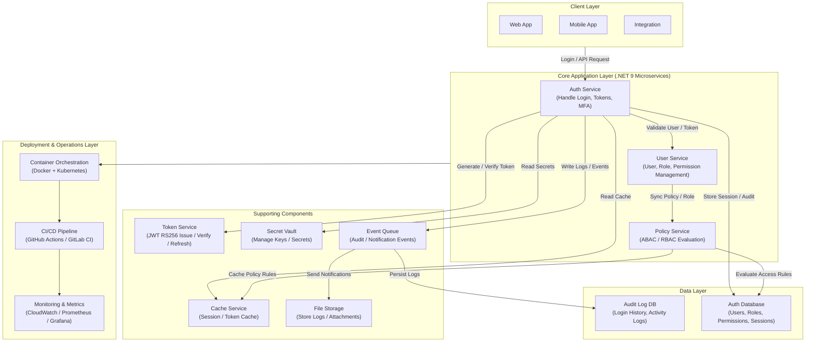

---

## 8. Success Metrics

| Metric                 | Description                  |
| ---------------------- | ---------------------------- |
| Authentication latency | Avg login response < 500ms   |
| Availability           | ≥ 99.9% uptime               |
| Audit coverage         | 100% of auth events logged   |
| API standardization    | All endpoints follow OpenAPI |
| Security compliance    | OWASP ASVS Level 2 compliant |

---

## 9. Ubiquitous Language

| Term                       | Meaning                                                 | Description                                                |
| -------------------------- | ------------------------------------------------------- | ---------------------------------------------------------- |
| Registration               | The process of a user signing up for the service        | May include email or mobile verification                   |
| Login                      | The process of user authentication                      | Different flows: username/password, OTP, social login, SSO |
| Password Policy            | Rules defining how passwords must be created            | Minimum length, complexity, expiry, history                |
| Account Lockout            | Temporarily blocking access after failed login attempts | Can trigger alerts to user or admin                        |
| Session Timeout            | Automatic logout after inactivity                       | Ensures account security                                   |
| Audit Log                  | Recording critical events                               | Useful for compliance and troubleshooting                  |
| Federation                 | Logging in via external identity providers              | Allows single sign-on from other systems                   |
| Consent                    | User permission to access personal data                 | Required for privacy compliance (e.g., GDPR)               |
| MFA Method                 | Method used for multi-factor authentication             | SMS, Email, Authenticator App, Hardware Token              |
| Password Reset             | Process for a user to reset a forgotten password        | Usually via email link or OTP                              |
| Deactivation / Deprovision | Disabling or removing a user account                    | Part of user lifecycle management                          |
| Policy                     | Rules defining access rights                            | Used to determine who can do what                          |
| Role                       | Grouping of permissions                                 | Assigned to users or user groups                           |
| Claim                      | Attribute associated with a user                        | e.g., roles, department, clearance                         |
| Attribute                  | Property of a user                                      | Used to enforce policies and access control                |
| Authorization              | Granting access rights based on rules                   | Determines what resources/actions a user can access        |
| ABAC                       | Access control based on user attributes and context     | Example: Only managers in department X can approve budgets |
| Event                      | Significant action or occurrence related to users       | e.g., UserLoggedIn, PasswordChanged                        |
| Refresh Token              | Token to extend a user's session                        | Helps maintain seamless access                             |
| Identity Provider          | External service that authenticates users               | e.g., Google, Facebook, corporate SSO                      |
| Social Login               | Login via third-party social platforms                  | Federated login using OAuth2                               |
| OTP                        | One-time password for verification                      | Short-lived code via SMS or email                          |
| 2FA                        | Two-factor authentication                               | Adds an extra security layer to login                      |
| User Lifecycle             | The full journey of a user account                      | From registration to deactivation                          |
| Identity Verification      | Confirming a user’s identity                            | KYC, email, or phone verification                          |

## 10. Domain

---

### 10.1. Authentication Domain

- **Entities:**
  - User - Represents a registered system user containing credentials, email, and phone number.
  - AuthToken - Stores access and refresh tokens issued during authentication.
  - LoginAttempt - Records each login attempt with timestamp, IP address, and device information.

- **Use Cases:**
  - Login via username/password
    - **Command:**
      - LoginUserCommand - Authenticate user using username and password.
    - **CommandHandler:**
      - LoginUserCommandHandler - Validates credentials and generates access tokens.
    - **Query:**
      - GetUserSessionQuery - Retrieve the active user session.
    - **QueryHandler:**
      - GetUserSessionQueryHandler - Fetches user session details from cache or database.

  - Login via mobile/OTP
    - **Command:**
      - LoginViaMobileOtpCommand - Authenticate user using mobile number and OTP.
    - **CommandHandler:**
      - LoginViaMobileOtpCommandHandler - Verifies OTP and issues new tokens.
    - **Query:**
      - GetUserSessionQuery - Retrieve session data after mobile OTP verification.
    - **QueryHandler:**
      - GetUserSessionQueryHandler - Returns current session state.

  - Login via email/OTP
    - **Command:**
      - LoginViaEmailOtpCommand - Authenticate user using email and OTP.
    - **CommandHandler:**
      - LoginViaEmailOtpCommandHandler - Validates email OTP and creates a session token.
    - **Query:**
      - GetUserSessionQuery - Retrieve session details.
    - **QueryHandler:**
      - GetUserSessionQueryHandler - Returns user session from storage.

  - Login with 2FA (external 2FA)
    - **Command:**
      - VerifyTwoFactorCommand - Validate user identity with external 2FA provider.
    - **CommandHandler:**
      - VerifyTwoFactorCommandHandler - Confirms the 2FA code and completes login.
    - **Query:**
      - GetUserSessionQuery - Get session info after 2FA verification.
    - **QueryHandler:**
      - GetUserSessionQueryHandler - Fetches active session details.

  - Login via social provider (Google, Facebook, etc.)
    - **Command:**
      - LoginViaSocialCommand - Authenticate via third-party OAuth provider.
    - **CommandHandler:**
      - LoginViaSocialCommandHandler - Validates social token and issues local access tokens.
    - **Query:**
      - GetUserSessionQuery - Retrieve session of authenticated user.
    - **QueryHandler:**
      - GetUserSessionQueryHandler - Returns social-login session data.

---

### 10.2. Authorization Domain

- **Entities:**
  - Role - Represents a predefined access level assigned to one or more users.
  - Permission - Defines specific operations or actions that can be performed on resources.
  - Resource - Represents a protected entity, such as an API endpoint, module, or data object.
  - Policy - Defines access rules based on attributes (ABAC) or roles (RBAC).
  - Attribute - Represents contextual or user-based properties used in ABAC evaluation.

#### 10.2.1. Role-Based Access Control (RBAC)

- **Description:**  
  RBAC provides authorization based on a user's assigned roles and their associated permissions.  
  Access decisions are determined by the static mapping between roles and permissions.

- **Use Cases:**
  - Manage Roles and Permissions
    - **Command:**
      - CreateRoleCommand - Define a new role with specific permissions.
      - UpdateRoleCommand - Modify existing role or its permissions.
      - DeleteRoleCommand - Remove a role and revoke related permissions.
    - **CommandHandler:**
      - CreateRoleCommandHandler - Handles creation of new roles.
      - UpdateRoleCommandHandler - Updates role and permission relationships.
      - DeleteRoleCommandHandler - Safely removes a role from the system.
  - Assign / Revoke User Role
    - **Command:**
      - AssignUserRoleCommand - Assign one or more roles to a user.
      - RevokeUserRoleCommand - Remove assigned roles from a user.
    - **CommandHandler:**
      - AssignUserRoleCommandHandler - Updates user-role relationships.
      - RevokeUserRoleCommandHandler - Handles role removal from users.

  - Role-Based Authorization Check
    - **Query:**
      - CheckRolePermissionQuery - Check if a user’s role grants a specific permission.
    - **QueryHandler:**
      - CheckRolePermissionQueryHandler - Validates access based on predefined role-permission mapping.

---

#### 10.2.2. Attribute-Based Access Control (ABAC)

- **Description:**  
  ABAC authorizes access dynamically based on user, resource, and environmental attributes.  
  Policies define conditions (e.g., department = “HR” AND access_time < 6PM) for fine-grained control.

- **Use Cases:**
  - Manage Access Policies
    - **Command:**
      - CreatePolicyCommand - Define new ABAC policy with attributes and conditions.
      - UpdatePolicyCommand - Modify existing policy rules or attributes.
      - DeletePolicyCommand - Remove policy from the evaluation engine.
    - **CommandHandler:**
      - CreatePolicyCommandHandler - Validates and saves policy definitions.
      - UpdatePolicyCommandHandler - Applies changes to active policy sets.
      - DeletePolicyCommandHandler - Safely removes obsolete or inactive policies.
  - Attribute Management
    - **Command:**
      - AddAttributeCommand - Add new attribute for policy evaluation.
      - UpdateAttributeCommand - Modify attribute values.
      - DeleteAttributeCommand - Remove unused attribute.
    - **CommandHandler:**
      - AddAttributeCommandHandler - Adds attribute to repository or directory.
      - UpdateAttributeCommandHandler - Updates attribute value across system.
      - DeleteAttributeCommandHandler - Deletes attribute safely after validation.
  - Policy Evaluation
    - **Query:**
      - EvaluateAccessQuery - Evaluate access request using user and resource attributes.
      - EvaluatePolicyQuery - Assess access decision based on defined ABAC policy.
    - **QueryHandler:**
      - EvaluateAccessQueryHandler - Evaluates conditions dynamically against attributes.
      - EvaluatePolicyQueryHandler - Executes policy logic and returns access decision (Allow/Deny).

---

**Summary:**  
> **RBAC** ensures simple and consistent access control via roles and permissions, ideal for predictable hierarchies.  
> **ABAC** enhances flexibility by considering dynamic attributes and context, enabling fine-grained, conditional authorization.

---

### 10.3. User Management Domain

- **Entities:**
  - UserProfile - Contains personal details, department, and preferences.
  - UserSettings - Stores account-level configurations and notification preferences.

- **Use Cases:**
  - Create / Update / Delete User
    - **Command:**
      - CreateUserCommand - Register a new user in the system.
      - UpdateUserCommand - Modify existing user data.
      - DeleteUserCommand - Remove user account and related records.
    - **CommandHandler:**
      - CreateUserCommandHandler - Validates input and creates user record.
      - UpdateUserCommandHandler - Applies updates and maintains data consistency.
      - DeleteUserCommandHandler - Deletes user safely with dependency checks.

  - Get User Profile
    - **Query:**
      - GetUserProfileQuery - Retrieve detailed user profile information.
    - **QueryHandler:**
      - GetUserProfileQueryHandler - Fetch profile data from database or cache.

---

### 10.4. Session Management Domain

- **Entities:**
  - Session - Represents an active user session with metadata like device and IP.
  - AuthToken - Contains JWT and refresh tokens for authenticated users.

- **Use Cases:**
  - Validate Session
    - **Query:**
      - ValidateSessionQuery - Check if a session token is valid.
    - **QueryHandler:**
      - ValidateSessionQueryHandler - Validates token expiration and session status.

  - Refresh Token
    - **Command:**
      - RefreshTokenCommand - Request new access token using refresh token.
    - **CommandHandler:**
      - RefreshTokenCommandHandler - Verifies refresh token and issues a new access token.

  - Logout
    - **Command:**
      - LogoutUserCommand - Terminate an active user session.
    - **CommandHandler:**
      - LogoutUserCommandHandler - Revokes tokens and clears session from cache.

---

### 10.5. Attribute Management Domain

- **Entities:**
  - Attribute - Defines an attribute (e.g., department, clearance, location) for ABAC.  
  - AttributeGroup - Groups related attributes for structured access policies.

- **Use Cases:**
  - Manage user attributes
    - **Command:**
      - AddAttributeCommand - Add a new attribute for a user or group.
      - UpdateAttributeCommand - Modify existing attribute details.
      - DeleteAttributeCommand - Remove attribute from the system.
    - **CommandHandler:**
      - AddAttributeCommandHandler - Validates and persists attribute data.
      - UpdateAttributeCommandHandler - Updates attribute records in database.
      - DeleteAttributeCommandHandler - Deletes attribute safely after validation.

  - Query user attributes
    - **Query:**
      - GetUserAttributesQuery - Retrieve all attributes associated with a user.
    - **QueryHandler:**
      - GetUserAttributesQueryHandler - Fetches attribute data for access evaluation.

---

### 10.6. Infra / DevOps Domain

- **Entities:**
  - AuditLog - Records security and system events for compliance and analysis.
  - EventLog - Tracks operational and authentication-related asynchronous events.

- **Use Cases:**
  - Log authentication events
    - **Command:**
      - LogAuthEventCommand - Record authentication or session activities.
    - **CommandHandler:**
      - LogAuthEventCommandHandler - Sends logs to storage or monitoring systems.

  - Monitor failed login attempts
    - **Query:**
      - GetFailedLoginAttemptsQuery - Retrieve failed login records for analysis.
    - **QueryHandler:**
      - GetFailedLoginAttemptsQueryHandler - Fetches aggregated login attempt data.

  - Send notifications / alerts
    - **Command:**
      - SendSecurityAlertCommand - Trigger alert when a security event occurs.
    - **CommandHandler:**
      - SendSecurityAlertCommandHandler - Dispatches alerts via email, SMS, or notification service.

## 11. API Endpoint

### 11.1. Authentication Domain

| Endpoint               | Method | Command / Query                                | Description                                  |
| ---------------------- | ------ | ---------------------------------------------- | -------------------------------------------- |
| /api/auth/login        | POST   | LoginUserCommand / GetUserSessionQuery         | Authenticate user via username/password.     |
| /api/auth/login/mobile | POST   | LoginViaMobileOtpCommand / GetUserSessionQuery | Authenticate user via mobile number + OTP.   |
| /api/auth/login/email  | POST   | LoginViaEmailOtpCommand / GetUserSessionQuery  | Authenticate user via email + OTP.           |
| /api/auth/login/2fa    | POST   | VerifyTwoFactorCommand / GetUserSessionQuery   | Verify login using external 2FA mechanism.   |
| /api/auth/login/social | POST   | LoginViaSocialCommand / GetUserSessionQuery    | Authenticate user via social provider OAuth. |

#### /api/auth/login (POST)

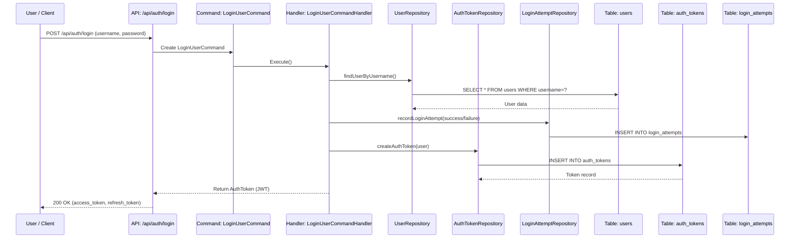

#### /api/auth/login/mobile (POST)

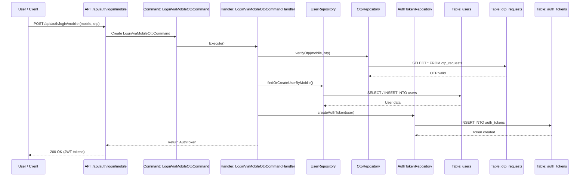

#### /api/auth/login/email (POST)

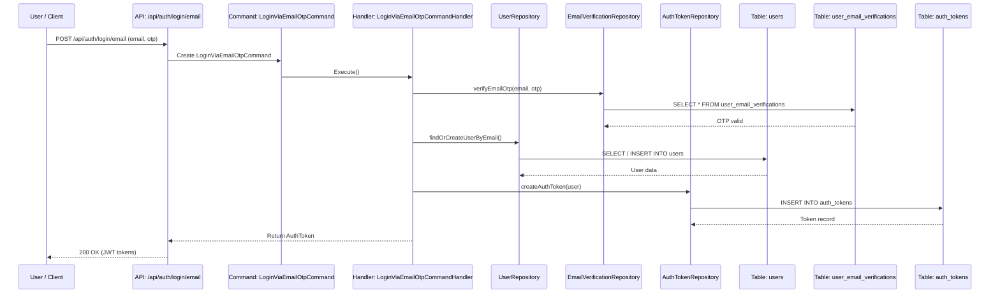

#### /api/auth/login/2fa (POST)

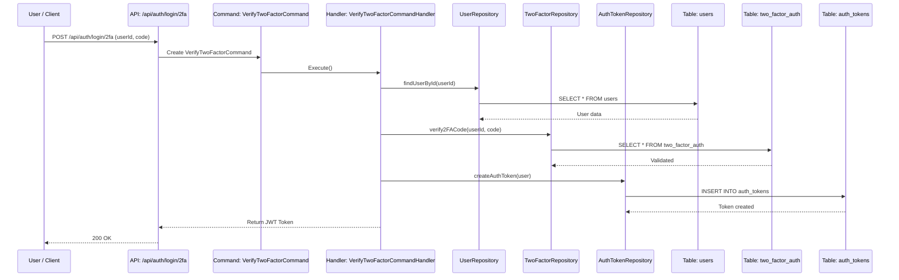

#### /api/auth/login/social (POST)

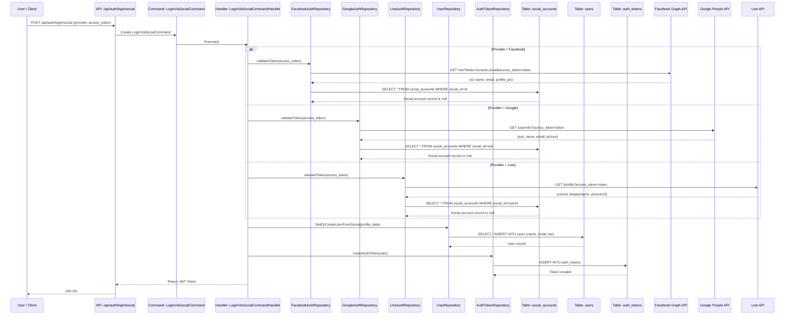

---

### 11.2. Authorization Domain

#### 11.2.1. Role-Based Access Control (RBAC)

| Endpoint                 | Method | Command / Query          | Description                                          |
| ------------------------ | ------ | ------------------------ | ---------------------------------------------------- |
| /api/auth/authorize/rbac | GET    | CheckRolePermissionQuery | Check if a user’s role grants a specific permission. |
| /api/roles               | POST   | CreateRoleCommand        | Create a new role with assigned permissions.         |
| /api/roles/{id}          | PUT    | UpdateRoleCommand        | Update role details or modify permissions.           |
| /api/roles/{id}          | DELETE | DeleteRoleCommand        | Delete an existing role.                             |
| /api/roles/{id}/assign   | POST   | AssignUserRoleCommand    | Assign one or more roles to a user.                  |
| /api/roles/{id}/revoke   | POST   | RevokeUserRoleCommand    | Revoke assigned roles from a user.                   |

##### /api/auth/authorize/rbac (GET)

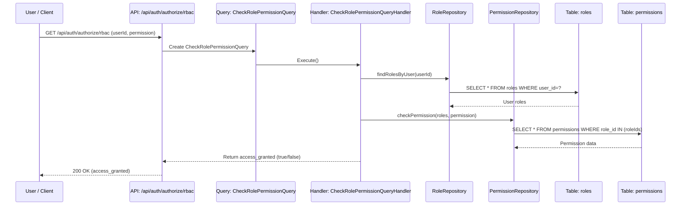

##### /api/roles (POST)

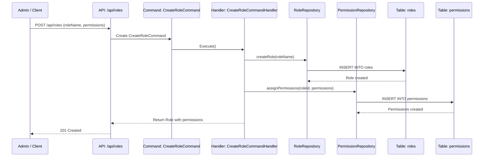

##### /api/roles/{id} (PUT)

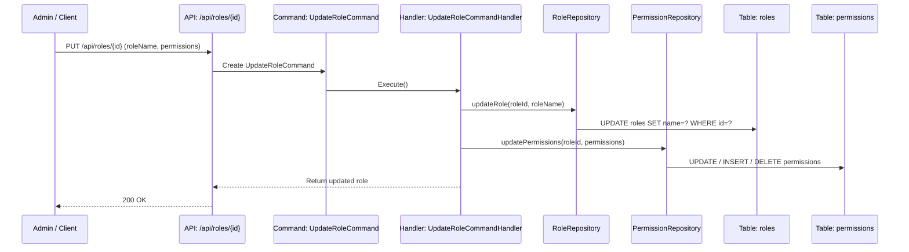

##### /api/roles/{id} (DELETE)

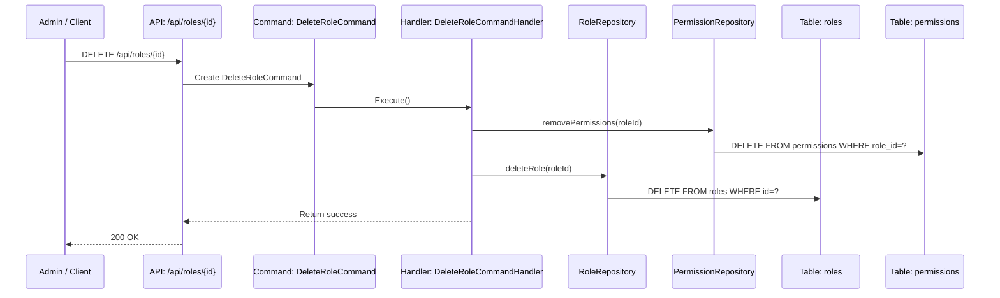

##### /api/roles/{id}/assign (POST)

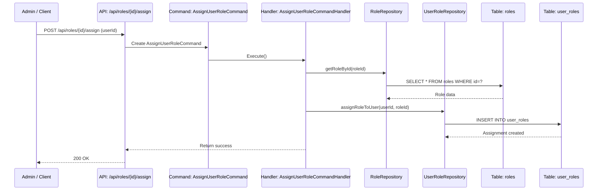

##### /api/roles/{id}/revoke (POST)

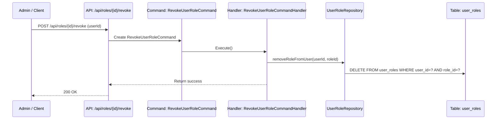

---

#### 11.2.2. Attribute-Based Access Control (ABAC)

| Endpoint                   | Method | Command / Query     | Description                                        |
| -------------------------- | ------ | ------------------- | -------------------------------------------------- |
| /api/auth/authorize/abac   | POST   | EvaluateAccessQuery | Evaluate user access using attributes and context. |
| /api/auth/authorize/policy | POST   | EvaluatePolicyQuery | Assess user access based on defined ABAC policies. |
| /api/policies              | POST   | CreatePolicyCommand | Create a new attribute-based access policy.        |
| /api/policies/{id}         | PUT    | UpdatePolicyCommand | Update existing ABAC policy rules or conditions.   |
| /api/policies/{id}         | DELETE | DeletePolicyCommand | Delete a policy from the ABAC engine.              |

##### /api/auth/authorize/abac (POST)

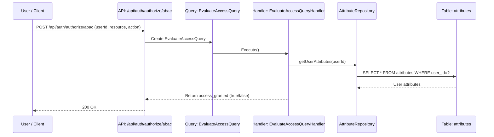

##### /api/auth/authorize/policy (POST)

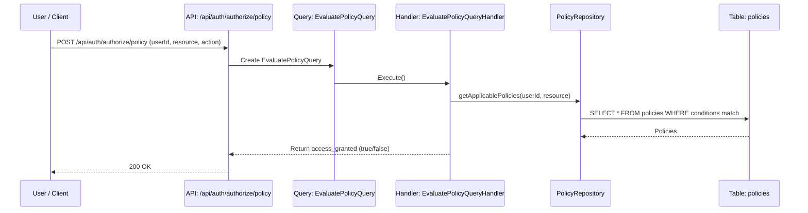

##### /api/policies (POST)

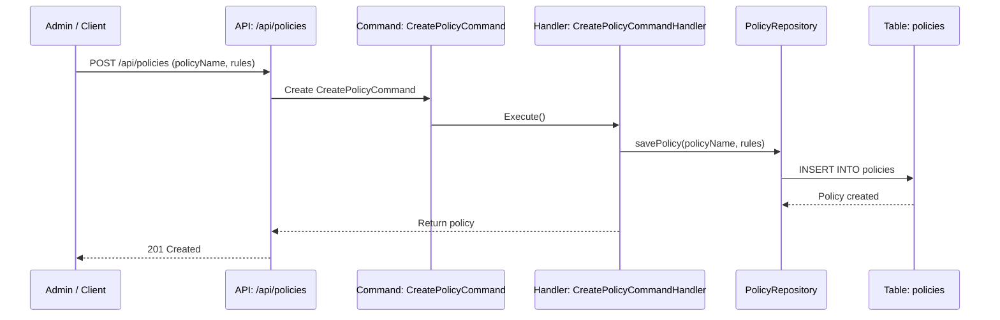

##### /api/policies/{id} (PUT)

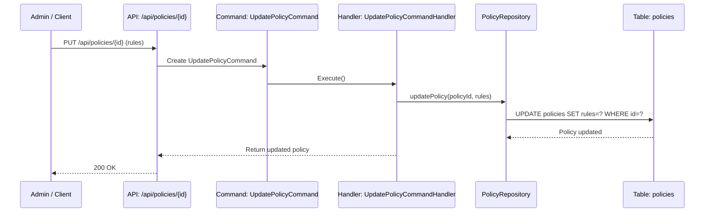

##### /api/policies/{id} (DELETE)

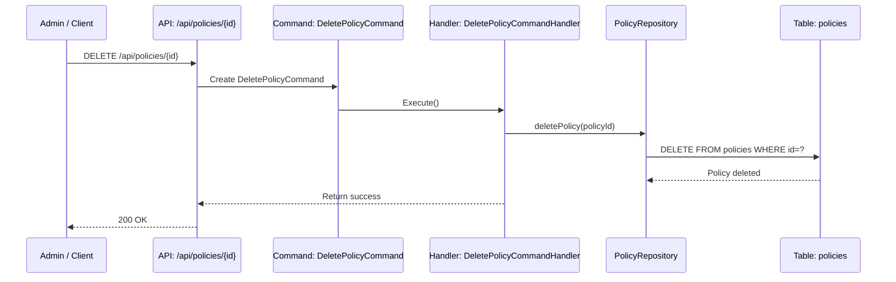

---

### 11.3. User Management Domain

| Endpoint                | Method | Command / Query     | Description                  |
| ----------------------- | ------ | ------------------- | ---------------------------- |
| /api/users              | POST   | CreateUserCommand   | Create a new user record.    |
| /api/users/{id}         | PUT    | UpdateUserCommand   | Update user details.         |
| /api/users/{id}         | DELETE | DeleteUserCommand   | Delete user from the system. |
| /api/users/{id}/profile | GET    | GetUserProfileQuery | Retrieve user profile data.  |

#### /api/users (POST)

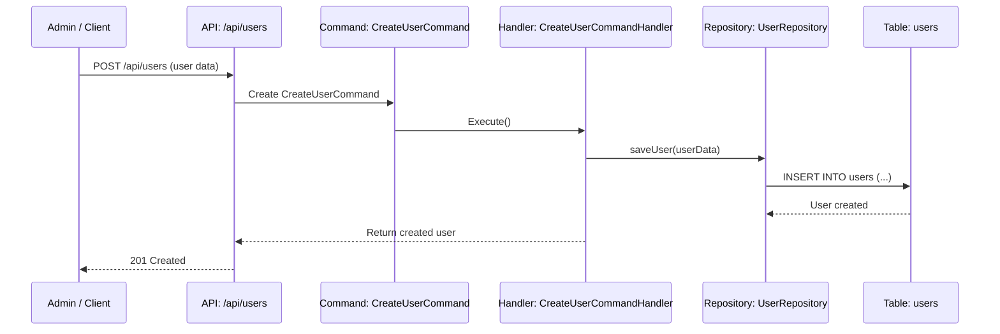

#### /api/users/{id} (PUT)

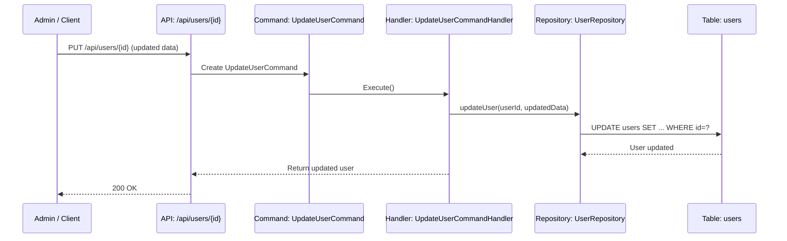

#### /api/users/{id} (DELETE)

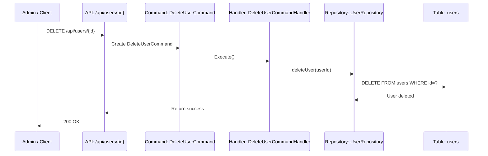

#### /api/users/{id}/profile (GET)

```mermaid
sequenceDiagram
    participant U as Client
    participant API as API: /api/users/{id}/profile
    participant Q as Query: GetUserProfileQuery
    participant H as Handler: GetUserProfileQueryHandler
    participant R as Repository: UserRepository
    participant DB as Table: users

    U->>API: GET /api/users/{id}/profile
    API->>Q: Create GetUserProfileQuery
    Q->>H: Execute()
    H->>R: getUserProfile(userId)
    R->>DB: SELECT * FROM users WHERE id=?
    DB-->>R: User profile
    H-->>API: Return user profile
    API-->>U: 200 OK
```

---

### 11.4. Session Management Domain

| Endpoint               | Method | Command / Query      | Description                                |
| ---------------------- | ------ | -------------------- | ------------------------------------------ |
| /api/sessions/validate | POST   | ValidateSessionQuery | Validate user session or access token.     |
| /api/sessions/refresh  | POST   | RefreshTokenCommand  | Generate a new access token using refresh. |
| /api/sessions/logout   | POST   | LogoutUserCommand    | Logout user and invalidate active session. |

#### /api/sessions/validate (POST)

```mermaid
sequenceDiagram
    participant U as Client
    participant API as API: /api/sessions/validate
    participant Q as Query: ValidateSessionQuery
    participant H as Handler: ValidateSessionQueryHandler
    participant R as Repository: SessionRepository
    participant DB as Table: sessions

    U->>API: POST /api/sessions/validate (token)
    API->>Q: Create ValidateSessionQuery
    Q->>H: Execute()
    H->>R: getSessionByToken(token)
    R->>DB: SELECT * FROM sessions WHERE token=?
    DB-->>R: Session data
    H-->>API: Return validation result
    API-->>U: 200 OK / 401 Unauthorized
```

#### /api/sessions/refresh (POST)

```mermaid
sequenceDiagram
    participant U as Client
    participant API as API: /api/sessions/refresh
    participant CMD as Command: RefreshTokenCommand
    participant H as Handler: RefreshTokenCommandHandler
    participant R as Repository: SessionRepository
    participant DB as Table: sessions

    U->>API: POST /api/sessions/refresh (refresh token)
    API->>CMD: Create RefreshTokenCommand
    CMD->>H: Execute()
    H->>R: refreshSession(refreshToken)
    R->>DB: SELECT * FROM sessions WHERE refresh_token=?
    DB-->>R: Session data
    R->>DB: UPDATE sessions SET token=newToken WHERE id=?
    DB-->>R: Updated session
    H-->>API: Return new access token
    API-->>U: 200 OK
```

#### /api/sessions/logout (POST)

```mermaid
sequenceDiagram
    participant U as Client
    participant API as API: /api/sessions/logout
    participant CMD as Command: LogoutUserCommand
    participant H as Handler: LogoutUserCommandHandler
    participant R as Repository: SessionRepository
    participant DB as Table: sessions

    U->>API: POST /api/sessions/logout (token)
    API->>CMD: Create LogoutUserCommand
    CMD->>H: Execute()
    H->>R: invalidateSession(token)
    R->>DB: UPDATE sessions SET active=false WHERE token=?
    DB-->>R: Session invalidated
    H-->>API: Return logout confirmation
    API-->>U: 200 OK
```

---

### 11.5. Attribute Management Domain

| Endpoint             | Method | Command / Query        | Description                      |
| -------------------- | ------ | ---------------------- | -------------------------------- |
| /api/attributes      | POST   | AddAttributeCommand    | Add a new attribute definition.  |
| /api/attributes/{id} | PUT    | UpdateAttributeCommand | Modify attribute data or values. |
| /api/attributes/{id} | DELETE | DeleteAttributeCommand | Delete an existing attribute.    |
| /api/attributes      | GET    | GetUserAttributesQuery | Retrieve all user attributes.    |

#### /api/attributes (POST)

```mermaid
sequenceDiagram
    participant U as Client
    participant API as API: /api/attributes
    participant CMD as Command: AddAttributeCommand
    participant H as Handler: AddAttributeCommandHandler
    participant R as Repository: AttributeRepository
    participant DB as Table: attributes

    U->>API: POST /api/attributes (attribute data)
    API->>CMD: Create AddAttributeCommand
    CMD->>H: Execute()
    H->>R: addAttribute(data)
    R->>DB: INSERT INTO attributes (...)
    DB-->>R: Insert result
    H-->>API: Return success
    API-->>U: 201 Created
```

#### /api/attributes/{id} (PUT)

```mermaid
sequenceDiagram
    participant U as Client
    participant API as API: /api/attributes/{id}
    participant CMD as Command: UpdateAttributeCommand
    participant H as Handler: UpdateAttributeCommandHandler
    participant R as Repository: AttributeRepository
    participant DB as Table: attributes

    U->>API: PUT /api/attributes/{id} (new attribute data)
    API->>CMD: Create UpdateAttributeCommand
    CMD->>H: Execute()
    H->>R: updateAttribute(id, data)
    R->>DB: UPDATE attributes SET ... WHERE id=?
    DB-->>R: Update result
    H-->>API: Return success
    API-->>U: 200 OK
```

#### /api/attributes/{id} (DELETE)

```mermaid
sequenceDiagram
    participant U as Client
    participant API as API: /api/attributes/{id}
    participant CMD as Command: DeleteAttributeCommand
    participant H as Handler: DeleteAttributeCommandHandler
    participant R as Repository: AttributeRepository
    participant DB as Table: attributes

    U->>API: DELETE /api/attributes/{id}
    API->>CMD: Create DeleteAttributeCommand
    CMD->>H: Execute()
    H->>R: deleteAttribute(id)
    R->>DB: DELETE FROM attributes WHERE id=?
    DB-->>R: Delete result
    H-->>API: Return success
    API-->>U: 200 OK
```

#### /api/attributes (GET)

```mermaid
sequenceDiagram
    participant U as Client
    participant API as API: /api/attributes
    participant Q as Query: GetUserAttributesQuery
    participant H as Handler: GetUserAttributesQueryHandler
    participant R as Repository: AttributeRepository
    participant DB as Table: attributes

    U->>API: GET /api/attributes
    API->>Q: Create GetUserAttributesQuery
    Q->>H: Execute()
    H->>R: getAllAttributes()
    R->>DB: SELECT * FROM attributes
    DB-->>R: List of attributes
    H-->>API: Return attribute list
    API-->>U: 200 OK
```

---

### 11.6. Infra / DevOps Domain

| Endpoint              | Method | Command / Query             | Description                                    |
| --------------------- | ------ | --------------------------- | ---------------------------------------------- |
| /api/logs/auth        | POST   | LogAuthEventCommand         | Log authentication and security events.        |
| /api/logs/auth/failed | GET    | GetFailedLoginAttemptsQuery | Retrieve list of failed login attempts.        |
| /api/alerts/security  | POST   | SendSecurityAlertCommand    | Send security-related notifications or alerts. |

#### /api/logs/auth (POST)

```mermaid
sequenceDiagram
    participant U as Client
    participant API as API: /api/logs/auth
    participant CMD as Command: LogAuthEventCommand
    participant H as Handler: LogAuthEventCommandHandler
    participant R as Repository: AuditLogRepository
    participant DB as Table: audit_logs

    U->>API: POST /api/logs/auth (event data)
    API->>CMD: Create LogAuthEventCommand
    CMD->>H: Execute()
    H->>R: saveEvent(eventData)
    R->>DB: INSERT INTO audit_logs (...)
    DB-->>R: Insert result
    H-->>API: Return success
    API-->>U: 201 Created
```

#### /api/logs/auth/failed (GET)

```mermaid
sequenceDiagram
    participant U as Client
    participant API as API: /api/logs/auth/failed
    participant Q as Query: GetFailedLoginAttemptsQuery
    participant H as Handler: GetFailedLoginAttemptsQueryHandler
    participant R as Repository: AuditLogRepository
    participant DB as Table: audit_logs

    U->>API: GET /api/logs/auth/failed
    API->>Q: Create GetFailedLoginAttemptsQuery
    Q->>H: Execute()
    H->>R: findFailedLogins()
    R->>DB: SELECT * FROM audit_logs WHERE type='failed_login'
    DB-->>R: List of failed logins
    H-->>API: Return list
    API-->>U: 200 OK
```

#### /api/alerts/security (POST)

```mermaid
sequenceDiagram
    participant U as Client
    participant API as API: /api/alerts/security
    participant CMD as Command: SendSecurityAlertCommand
    participant H as Handler: SendSecurityAlertCommandHandler
    participant R as Repository: NotificationRepository
    participant MQ as MessageQueue: SecurityAlertsQueue

    U->>API: POST /api/alerts/security (alert details)
    API->>CMD: Create SendSecurityAlertCommand
    CMD->>H: Execute()
    H->>R: enqueueAlert(alertData)
    R->>MQ: Publish alert message
    MQ-->>R: Acknowledged
    H-->>API: Return success
    API-->>U: 201 Created
```

## 12. Infrastructure

| Component / Responsibility    | AWS Service                        | Instance Name / Identifier             | Purpose / Notes                                                                                              |
| ----------------------------- | ---------------------------------- | -------------------------------------- | ------------------------------------------------------------------------------------------------------------ |
| API Entry                     | Amazon API Gateway                 | iam-api-gateway-1                      | Front door for all incoming requests; handles throttling, routing, CORS                                      |
| Load Balancing                | Application Load Balancer (ALB)    | iam-alb-1                              | Distribute incoming traffic from public subnet to ECS/Fargate services                                       |
| Microservice Runtime          | ECS Fargate / EKS                  | iam-auth-service-1, iam-auth-service-2 | Run stateless .NET 9 containers; private subnet; handles authentication, authorization, and business logic   |
| Relational Database           | Amazon RDS (PostgreSQL)            | iam-rds-1 (primary), iam-rds-replica-1 | Store users, roles, permissions, policies, sessions; replicated for high availability                        |
| Caching Layer                 | Amazon ElastiCache (Redis)         | iam-redis-1                            | Store short-lived session tokens, access tokens, and frequently accessed data                                |
| Token Signing / Encryption    | AWS KMS                            | iam-kms-1                              | Store signing keys for JWT; manage cryptographic operations                                                  |
| Secrets Management            | AWS Secrets Manager                | iam-secrets-1                          | Store DB credentials, OAuth client secrets, and other sensitive information                                  |
| File Storage                  | Amazon S3                          | iam-s3-files-1                         | Store application files, user uploads, and static content                                                    |
| Internal Logs / Audit Storage | Amazon S3                          | iam-s3-internal-1                      | Store internal logs, audit logs, and other immutable data                                                    |
| Observability / Logging       | Amazon CloudWatch (Logs & Metrics) | iam-cloudwatch-1                       | Monitor service health, log events, generate metrics, and set alarms                                         |
| VPC / Networking              | Amazon VPC                         | vpc-iam-1                              | Public subnet (ALB) + Private subnet (ECS, RDS, ElastiCache, S3); isolate resources and control traffic flow |

### 12.1. Infrastructure Diagram

```mermaid
flowchart TD
    %% Clients
    subgraph ClientLayer["Client Layer"]
        direction TB
        subgraph Mobile["Mobile App"]
            Mobile_iOS1["iOS App-1"]
            Mobile_Android1["Android App-1"]
        end
        Web1["Web App-1"]
        Other1["Other App-1 (Windows)"]
    end

    %% DNS Layer (AWS Route53)
    subgraph Route53["AWS Route53"]
        PUBLIC1["Public Hosted Zone-1<br/>AWS: Route53"]
    end

    %% API Gateway (AWS API Gateway)
    subgraph APIGW["AWS API Gateway"]
        GW1["iam-api-gateway-1<br/>AWS: API Gateway"]
    end

    %% VPC Layer
    subgraph VPC["AWS VPC"]
        direction TB

        %% Load Balancer (Public Subnet)
        subgraph PublicLayer["Public Subnet"]
            subgraph ALB["AWS Load Balancer"]
                LB1["iam-alb-1<br/>AWS: ALB"]
            end
        end

        %% Private Layer (Private Subnet)
        subgraph PrivateLayer["Private Subnet"]
            direction TB

            %% Microservices (AWS ECS / Fargate)
            subgraph ECS["AWS ECS / Fargate"]
                direction TB
                MS1["iam-auth-service-1<br/>AWS: ECS / Fargate"]
                MS2["iam-auth-service-2<br/>AWS: ECS / Fargate"]
            end

            %% Database Layer (AWS RDS)
            subgraph RDS["AWS RDS - PostgreSQL"]
                DB_Primary1[(Primary iam-rds-1<br/>Users, Roles, Permissions, Sessions)]
                DB_Replica1[(Read iam-rds-replica-1)]
            end

            %% Cache Layer (AWS ElastiCache)
            subgraph Redis["AWS ElastiCache Redis"]
                C1["iam-redis-1<br/>AWS: ElastiCache Redis"]
            end

            %% Secrets & Keys (AWS Secrets Manager + KMS + S3)
            subgraph Secrets["AWS Secrets & Key Management"]
                S1["iam-secrets-1<br/>AWS: Secrets Manager"]
                K1["iam-kms-1<br/>AWS: KMS"]
                S3_INT1["iam-s3-internal-1<br/>AWS: S3 Internal Storage / Audit Logs"]
            end

            %% File Storage (AWS S3)
            subgraph S3["AWS S3"]
                S3_FS1["iam-s3-files-1<br/>AWS: S3 File Storage"]
            end

            %% Logging & Monitoring (AWS CloudWatch)
            subgraph CloudWatch["AWS CloudWatch"]
                L1["iam-cloudwatch-1<br/>CloudWatch Logs & Metrics"]
            end
        end
    end

    %% Flows from Clients
    Mobile_iOS1 -->|"DNS request"| PUBLIC1
    Mobile_Android1 -->|"DNS request"| PUBLIC1
    Web1 -->|"DNS request"| PUBLIC1
    Other1 -->|"DNS request"| PUBLIC1

    PUBLIC1 -->|"Route request"| GW1
    GW1 -->|"Forward request"| LB1
    LB1 -->|"Distribute to services"| ECS

    ECS -->|"Read/Write"| DB_Primary1
    ECS -->|"Read"| DB_Replica1
    DB_Primary1 -->|"Replicate"| DB_Replica1

    ECS -->|"Cache access"| C1
    ECS -->|"Read secrets"| S1
    ECS -->|"Sign tokens"| K1
    ECS -->|"Store internal logs"| S3_INT1
    ECS -->|"Store / Read files"| S3_FS1
    ECS -->|"Metrics / Logs"| L1
```
