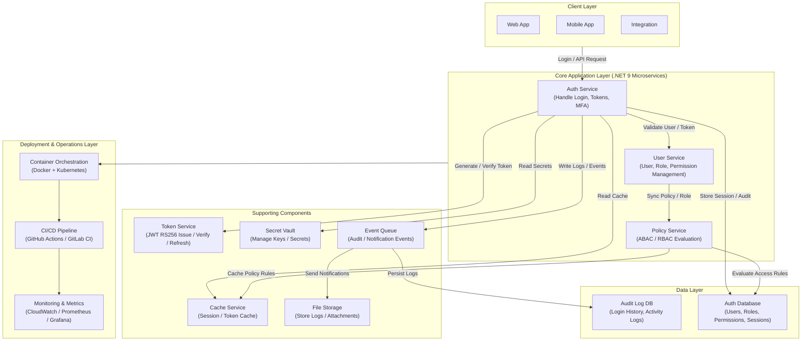
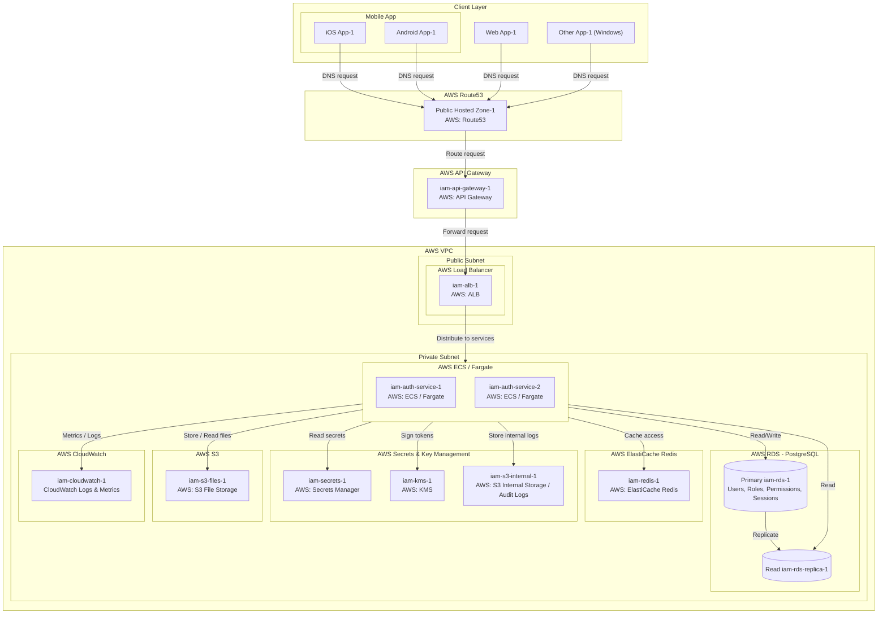

# 🧩 Overview

## 1. Service Name

> **Identity & Access Management (IAM) Service**

## 2. Purpose

The **IAM Service** is a centralized system responsible for managing **user identities, authentication, and authorization** across all applications in the ecosystem.  

It provides:

- **Secure login** using multiple methods (username/password, OTP, social login)
- **Fine-grained access control** using roles and attributes (RBAC & ABAC)
- **Centralized user attribute management** for dynamic policy evaluation
- **Multi-factor authentication (MFA)** integration
- **Token-based authentication** with JWT or similar tokens
- **Auditability** of all identity and access events

The service ensures consistency, security, and scalability for all identity-related operations in the platform.

---

## 3. Conceptual Workflow

### 3.1 Authentication

1. **User initiates login**:
    - Options: username/password, mobile/email OTP, social login, external 2FA
2. **IAM validates credentials**:
    - Passwords hashed & compared
    - OTP verified via email/SMS provider
    - Social login tokens validated via OAuth2/OpenID Connect
3. **Issue access tokens**:
    - JWT access token with short lifetime
    - Optional refresh token for session renewal
4. **Optional MFA**:
    - If 2FA enabled, a second factor challenge is presented
    - Verification must succeed before token issuance

### 3.2 Authorization

1. **Service receives request with token**:
    - Token decoded to extract claims, roles, attributes
2. **Policy evaluation**:
    - Role-based access control (RBAC): Check role permissions
    - Attribute-based access control (ABAC): Evaluate attributes against policy rules
3. **Grant or deny access**:
    - Return decision to application
    - Optionally log event for auditing

### 3.3 User & Attribute Management

- Admins can create/update/delete users
- Assign roles, permissions, and dynamic attributes
- Attributes are used in ABAC policies to allow contextual access
- Users can manage their own MFA preferences and recovery methods

### 3.4 Token Lifecycle

- **Access token**: short-lived, used for resource access
- **Refresh token**: long-lived, used to obtain new access tokens
- Tokens are signed and optionally encrypted
- Expiration and revocation managed centrally

---

## 4. Key Responsibilities (ABAC Focus)

| Responsibility                | How It Works                                                                                        |
| ----------------------------- | --------------------------------------------------------------------------------------------------- |
| **User Authentication**       | Validate user credentials (password, OTP, social tokens), enforce MFA, and issue access tokens      |
| **User Authorization (ABAC)** | Evaluate access based on user attributes, resource attributes, environment, and context rules       |
| **Attribute Management**      | Maintain centralized storage of user, resource, and environment attributes used for ABAC rules      |
| **Session Management**        | Track issued tokens, support revocation, refresh, and token expiration policies                     |
| **Audit & Logging**           | Record all identity events including login, logout, token issuance/refresh, and failed attempts     |
| **Integration**               | Provide standard REST APIs and endpoints for other services to perform authentication & ABAC checks |

---

## 5. Service Scope

- Acts as the **core identity layer** for internal and external apps
- Supports multi-tenant architecture
- Serves both internal dashboards and customer-facing applications
- Handles authentication, authorization, and attribute management
- Delegates user UI/UX to front-end applications

---

## 6. Non-Goals

- Not responsible for storing business-specific data unrelated to identity
- Does not provide end-user UI (front-end apps handle this)
- Not a general-purpose MFA provider (relies on external 2FA services)
- Does not store sensitive data like credit cards

---

## 7. Technology Stack (initial proposal)

| Component                    | Technology                 |
| ---------------------------- | -------------------------- |
| **Language / Framework**     | .NET 9 (C#)                |
| **Database**                 | PostgreSQL                 |
| **Cache**                    | Redis                      |
| **Message Queue (optional)** | RabbitMQ / Kafka           |
| **Token Management**         | JWT (RS256)                |
| **Secret Management**        | KMS / Vault                |
| **Containerization**         | Docker + Kubernetes        |
| **CI/CD**                    | GitHub Actions / GitLab CI |

---

## 8. Success Metrics

| Metric                 | Description                  |
| ---------------------- | ---------------------------- |
| Authentication latency | Avg login response < 500ms   |
| Availability           | ≥ 99.9% uptime               |
| Audit coverage         | 100% of auth events logged   |
| API standardization    | All endpoints follow OpenAPI |
| Security compliance    | OWASP ASVS Level 2 compliant |

---

## 9. Ubiquitous Language

| Term                       | Meaning                                                 | Description                                                |
| -------------------------- | ------------------------------------------------------- | ---------------------------------------------------------- |
| Registration               | The process of a user signing up for the service        | May include email or mobile verification                   |
| Login                      | The process of user authentication                      | Different flows: username/password, OTP, social login, SSO |
| Password Policy            | Rules defining how passwords must be created            | Minimum length, complexity, expiry, history                |
| Account Lockout            | Temporarily blocking access after failed login attempts | Can trigger alerts to user or admin                        |
| Session Timeout            | Automatic logout after inactivity                       | Ensures account security                                   |
| Audit Log                  | Recording critical events                               | Useful for compliance and troubleshooting                  |
| Federation                 | Logging in via external identity providers              | Allows single sign-on from other systems                   |
| Consent                    | User permission to access personal data                 | Required for privacy compliance (e.g., GDPR)               |
| MFA Method                 | Method used for multi-factor authentication             | SMS, Email, Authenticator App, Hardware Token              |
| Password Reset             | Process for a user to reset a forgotten password        | Usually via email link or OTP                              |
| Deactivation / Deprovision | Disabling or removing a user account                    | Part of user lifecycle management                          |
| Policy                     | Rules defining access rights                            | Used to determine who can do what                          |
| Role                       | Grouping of permissions                                 | Assigned to users or user groups                           |
| Claim                      | Attribute associated with a user                        | e.g., roles, department, clearance                         |
| Attribute                  | Property of a user                                      | Used to enforce policies and access control                |
| Authorization              | Granting access rights based on rules                   | Determines what resources/actions a user can access        |
| ABAC                       | Access control based on user attributes and context     | Example: Only managers in department X can approve budgets |
| Event                      | Significant action or occurrence related to users       | e.g., UserLoggedIn, PasswordChanged                        |
| Refresh Token              | Token to extend a user's session                        | Helps maintain seamless access                             |
| Identity Provider          | External service that authenticates users               | e.g., Google, Facebook, corporate SSO                      |
| Social Login               | Login via third-party social platforms                  | Federated login using OAuth2                               |
| OTP                        | One-time password for verification                      | Short-lived code via SMS or email                          |
| 2FA                        | Two-factor authentication                               | Adds an extra security layer to login                      |
| User Lifecycle             | The full journey of a user account                      | From registration to deactivation                          |
| Identity Verification      | Confirming a user’s identity                            | KYC, email, or phone verification                          |

## 10. Domain

### 10.1. Authentication Domain

- **Entities:** User, AuthToken, LoginAttempt
- **Use Cases:**
  - Login via username/password
    - **Command:** LoginUserCommand
    - **CommandHandler:** LoginUserCommandHandler
    - **Query:** GetUserSessionQuery
    - **QueryHandler:** GetUserSessionQueryHandler
  - Login via mobile/OTP
    - **Command:** LoginViaMobileOtpCommand
    - **CommandHandler:** LoginViaMobileOtpCommandHandler
    - **Query:** GetUserSessionQuery
    - **QueryHandler:** GetUserSessionQueryHandler
  - Login via email/OTP
    - **Command:** LoginViaEmailOtpCommand
    - **CommandHandler:** LoginViaEmailOtpCommandHandler
    - **Query:** GetUserSessionQuery
    - **QueryHandler:** GetUserSessionQueryHandler
  - Login with 2FA (external 2FA)
    - **Command:** VerifyTwoFactorCommand
    - **CommandHandler:** VerifyTwoFactorCommandHandler
    - **Query:** GetUserSessionQuery
    - **QueryHandler:** GetUserSessionQueryHandler
  - Login via social provider (Google, Facebook, etc.)
    - **Command:** LoginViaSocialCommand
    - **CommandHandler:** LoginViaSocialCommandHandler
    - **Query:** GetUserSessionQuery
    - **QueryHandler:** GetUserSessionQueryHandler

---

### 10.2. Authorization Domain

- **Entities:** Role, Permission, Resource, Policy
- **Use Cases:**
  - Basic Role-Based Access Control (RBAC)
    - **Query:** CheckRolePermissionQuery
    - **QueryHandler:** CheckRolePermissionQueryHandler
  - Attribute-Based Access Control (ABAC)
    - **Query:** EvaluateAccessQuery
    - **QueryHandler:** EvaluateAccessQueryHandler
  - Dynamic Policy Evaluation
    - **Query:** EvaluatePolicyQuery
    - **QueryHandler:** EvaluatePolicyQueryHandler

---

### 10.3. User Management Domain

- **Entities:** UserProfile, UserSettings
- **Use Cases:**
  - Create / Update / Delete User
    - **Command:** CreateUserCommand / UpdateUserCommand / DeleteUserCommand
    - **CommandHandler:** CreateUserCommandHandler / UpdateUserCommandHandler / DeleteUserCommandHandler
  - Get User Profile
    - **Query:** GetUserProfileQuery
    - **QueryHandler:** GetUserProfileQueryHandler

---

### 10.4. Session Management Domain

- **Entities:** Session, AuthToken
- **Use Cases:**
  - Validate Session
    - **Query:** ValidateSessionQuery
    - **QueryHandler:** ValidateSessionQueryHandler
  - Refresh Token
    - **Command:** RefreshTokenCommand
    - **CommandHandler:** RefreshTokenCommandHandler
  - Logout
    - **Command:** LogoutUserCommand
    - **CommandHandler:** LogoutUserCommandHandler

---

### 10.5. Attribute Management Domain

- **Entities:** Attribute, AttributeGroup
- **Use Cases:**
  - Manage user attributes
    - **Command:** AddAttributeCommand / UpdateAttributeCommand / DeleteAttributeCommand
    - **CommandHandler:** AddAttributeCommandHandler / UpdateAttributeCommandHandler / DeleteAttributeCommandHandler
  - Query user attributes
    - **Query:** GetUserAttributesQuery
    - **QueryHandler:** GetUserAttributesQueryHandler

---

### 10.6. Infra / DevOps Domain

- **Entities:** AuditLog, EventLog
- **Use Cases:**
  - Log authentication events
    - **Command:** LogAuthEventCommand
    - **CommandHandler:** LogAuthEventCommandHandler
  - Monitor failed login attempts
    - **Query:** GetFailedLoginAttemptsQuery
    - **QueryHandler:** GetFailedLoginAttemptsQueryHandler
  - Send notifications / alerts
    - **Command:** SendSecurityAlertCommand
    - **CommandHandler:** SendSecurityAlertCommandHandler

## 11. API Endpoint

### 11.1. Authentication Domain

| Endpoint               | Method | Command / Query                                | Description                 |
| ---------------------- | ------ | ---------------------------------------------- | --------------------------- |
| /api/auth/login        | POST   | LoginUserCommand / GetUserSessionQuery         | Login via username/password |
| /api/auth/login/mobile | POST   | LoginViaMobileOtpCommand / GetUserSessionQuery | Login via mobile + OTP      |
| /api/auth/login/email  | POST   | LoginViaEmailOtpCommand / GetUserSessionQuery  | Login via email + OTP       |
| /api/auth/login/2fa    | POST   | VerifyTwoFactorCommand / GetUserSessionQuery   | Verify login with 2FA       |
| /api/auth/login/social | POST   | LoginViaSocialCommand / GetUserSessionQuery    | Login via social provider   |

---

### 11.2. Authorization Domain

| Endpoint                   | Method | Command / Query          | Description                |
| -------------------------- | ------ | ------------------------ | -------------------------- |
| /api/auth/authorize/rbac   | GET    | CheckRolePermissionQuery | Check access using RBAC    |
| /api/auth/authorize/abac   | POST   | EvaluateAccessQuery      | Evaluate access using ABAC |
| /api/auth/authorize/policy | POST   | EvaluatePolicyQuery      | Evaluate dynamic policies  |

---

### 11.3. User Management Domain

| Endpoint                | Method | Command / Query     | Description          |
| ----------------------- | ------ | ------------------- | -------------------- |
| /api/users              | POST   | CreateUserCommand   | Create a new user    |
| /api/users/{id}         | PUT    | UpdateUserCommand   | Update existing user |
| /api/users/{id}         | DELETE | DeleteUserCommand   | Delete user          |
| /api/users/{id}/profile | GET    | GetUserProfileQuery | Get user profile     |

---

### 11.4. Session Management Domain

| Endpoint               | Method | Command / Query      | Description                      |
| ---------------------- | ------ | -------------------- | -------------------------------- |
| /api/sessions/validate | POST   | ValidateSessionQuery | Validate session or token        |
| /api/sessions/refresh  | POST   | RefreshTokenCommand  | Refresh access token             |
| /api/sessions/logout   | POST   | LogoutUserCommand    | Logout user and invalidate token |

---

### 11.5. Attribute Management Domain

| Endpoint             | Method | Command / Query        | Description           |
| -------------------- | ------ | ---------------------- | --------------------- |
| /api/attributes      | POST   | AddAttributeCommand    | Add a new attribute   |
| /api/attributes/{id} | PUT    | UpdateAttributeCommand | Update attribute      |
| /api/attributes/{id} | DELETE | DeleteAttributeCommand | Delete attribute      |
| /api/attributes      | GET    | GetUserAttributesQuery | Query user attributes |

---

### 11.6. Infra / DevOps Domain

| Endpoint              | Method | Command / Query             | Description                          |
| --------------------- | ------ | --------------------------- | ------------------------------------ |
| /api/logs/auth        | POST   | LogAuthEventCommand         | Log authentication events            |
| /api/logs/auth/failed | GET    | GetFailedLoginAttemptsQuery | Get failed login attempts            |
| /api/alerts/security  | POST   | SendSecurityAlertCommand    | Send security notifications / alerts |

## 12. Infrastructure

| Component / Responsibility    | AWS Service                        | Instance Name / Identifier             | Purpose / Notes                                                                                              |
| ----------------------------- | ---------------------------------- | -------------------------------------- | ------------------------------------------------------------------------------------------------------------ |
| API Entry                     | Amazon API Gateway                 | iam-api-gateway-1                      | Front door for all incoming requests; handles throttling, routing, CORS                                      |
| Load Balancing                | Application Load Balancer (ALB)    | iam-alb-1                              | Distribute incoming traffic from public subnet to ECS/Fargate services                                       |
| Microservice Runtime          | ECS Fargate / EKS                  | iam-auth-service-1, iam-auth-service-2 | Run stateless .NET 9 containers; private subnet; handles authentication, authorization, and business logic   |
| Relational Database           | Amazon RDS (PostgreSQL)            | iam-rds-1 (primary), iam-rds-replica-1 | Store users, roles, permissions, policies, sessions; replicated for high availability                        |
| Caching Layer                 | Amazon ElastiCache (Redis)         | iam-redis-1                            | Store short-lived session tokens, access tokens, and frequently accessed data                                |
| Token Signing / Encryption    | AWS KMS                            | iam-kms-1                              | Store signing keys for JWT; manage cryptographic operations                                                  |
| Secrets Management            | AWS Secrets Manager                | iam-secrets-1                          | Store DB credentials, OAuth client secrets, and other sensitive information                                  |
| File Storage                  | Amazon S3                          | iam-s3-files-1                         | Store application files, user uploads, and static content                                                    |
| Internal Logs / Audit Storage | Amazon S3                          | iam-s3-internal-1                      | Store internal logs, audit logs, and other immutable data                                                    |
| Observability / Logging       | Amazon CloudWatch (Logs & Metrics) | iam-cloudwatch-1                       | Monitor service health, log events, generate metrics, and set alarms                                         |
| VPC / Networking              | Amazon VPC                         | vpc-iam-1                              | Public subnet (ALB) + Private subnet (ECS, RDS, ElastiCache, S3); isolate resources and control traffic flow |

### 12.1. Architecture Diagram

