# 🧩 Overview

| Title            | Description                                                                                                                                      |
| ---------------- | ------------------------------------------------------------------------------------------------------------------------------------------------ |
| Design By        | Ittikorn Sopawan                                                                                                                                 |
| Design At        | 20-Oct-2025                                                                                                                                      |
| Version          | 1.0.0                                                                                                                                            |
| Service Name     | IAM Service - For Ecosystem                                                                                                                      |
| Service Detailed | Identity & Access Management for users, permissions,authentication (login/2FA/social),authorization (RBAC/ABAC),sessions & attribute management. |

## Change History

- **01-Nov-2025:** - Ittikorn Sopawan
  - Remove to current version
    - **Authorization Schema:**
      - `m_user_groups`
      - `t_user_group_mappings`
      - `t_policy_user_group_mappings`
  - Add to current version
    - **Infrastructure Schema:**
      - `infra.t_auth_logs`
      - `infra.t_policy_decision_logs`
      - `infra.t_event_queue_messages`
      - `infra.t_alerts`
    - **Federation Schema:**
      - `federation.t_idp`
      - `federation.t_idp_user_mappings`
      - `federation.t_idp_claim_mappings`
    - **Audit Schema:**
      - `audit.t_data_change_logs`
      - `audit.t_data_change_items`
    - **Token Schema:**
      - `token.t_sessions`
      - `token.t_session_attributes`
- **27-Oct-2025:** - Ittikorn Sopawan
  - Update ERD to current version
- **20-Oct-2025:** - Ittikorn Sopawan
  - Initial design of IAM Service. Created schemas and tables:
    - **Public Schema:**-
      - `m_parameters`
      - `t_addresses`
      - `t_contacts`
      - `t_files`
      - `t_personal_info`
      - `t_personal_contacts`
      - `t_personal_addresses`
    - **Authentication Schema:**
      - `t_users`
      - `t_user_authentications`
      - `t_user_referrer_mappings`
    - **Authorization Schema:**
      - `m_attributes`
      - `t_policies`
      - `t_policy_attribute_mappings`
      - `t_policy_decision_logs`
      - `t_user_attribute_mappings`
      - `m_user_groups`
      - `t_user_group_mappings`
      - `t_policy_user_group_mappings`
    - **Algorithm Schema:**
      - `m_algorithms`
    - **Key Schema:**
      - `m_key_types`
      - `m_keys`
    - **Consent Schema:**
      - `m_consent_types`
      - `m_consents`
      - `t_user_consent_mappings`
    - > All tables include primary keys, foreign keys, indexes, and comments for columns and tables.

## ER Diagram

```mermaid
erDiagram
    %% Public Schema
    m_parameters {
        UUID id PK
        UUID created_by FK
        TIMESTAMP created_at
        UUID updated_by FK
        TIMESTAMP updated_at
        BOOLEAN is_active
        TIMESTAMP inactive_at
        UUID inactive_by FK
        BOOLEAN is_deleted
        TIMESTAMP deleted_at
        UUID deleted_by FK
        TIMESTAMP effective_at
        TIMESTAMP expires_at
        VARCHAR key
        VARCHAR category
        VARCHAR language
        TEXT value
    }

    t_addresses {
        UUID id PK
        UUID created_by FK
        TIMESTAMP created_at
        UUID updated_by FK
        TIMESTAMP updated_at
        BOOLEAN is_active
        TIMESTAMP inactive_at
        UUID inactive_by FK
        BOOLEAN is_deleted
        TIMESTAMP deleted_at
        UUID deleted_by FK
        TIMESTAMP effective_at
        TIMESTAMP expires_at
        VARCHAR type
        BYTEA address
        BYTEA address_additional
        VARCHAR country_code
        VARCHAR country_name
        VARCHAR state
        VARCHAR city
        VARCHAR district
        VARCHAR sub_district
        VARCHAR postal_code
        GEOGRAPHY geofence_area
        GEOGRAPHY geofence_center
        INT geofence_radius_meters
    }

    t_contacts {
        UUID id PK
        UUID created_by FK
        TIMESTAMP created_at
        UUID updated_by FK
        TIMESTAMP updated_at
        BOOLEAN is_active
        TIMESTAMP inactive_at
        UUID inactive_by FK
        BOOLEAN is_deleted
        TIMESTAMP deleted_at
        UUID deleted_by FK
        VARCHAR channel
        VARCHAR contact
        VARCHAR contact_name
        JSONB available
        TEXT remark
    }

    t_files {
        UUID id PK
        UUID created_by FK
        TIMESTAMP created_at
        UUID updated_by FK
        TIMESTAMP updated_at
        BOOLEAN is_active
        TIMESTAMP inactive_at
        UUID inactive_by FK
        BOOLEAN is_deleted
        TIMESTAMP deleted_at
        UUID deleted_by FK
        TIMESTAMP effective_at
        TIMESTAMP expires_at
        VARCHAR usage_type
        VARCHAR file_path
        VARCHAR file_name
        BIGINT file_size
        VARCHAR file_size_unit
        VARCHAR file_dimension
        VARCHAR file_extension
        VARCHAR mime_type
        TEXT description
        VARCHAR storage_provider
        VARCHAR storage_bucket
        TEXT storage_key
    }

    t_personal_info {
        UUID id PK
        UUID created_by FK
        TIMESTAMP created_at
        UUID updated_by FK
        TIMESTAMP updated_at
        BOOLEAN is_active
        TIMESTAMP inactive_at
        UUID inactive_by FK
        BOOLEAN is_deleted
        TIMESTAMP deleted_at
        UUID deleted_by FK
        BYTEA sid
        BYTEA prefix_name
        BYTEA first_name
        BYTEA middle_name
        BYTEA last_name
        BYTEA nick_name
        BYTEA gender
        BYTEA date_of_birth
    }

    t_personal_contacts {
        UUID id PK
        UUID created_by FK
        TIMESTAMP created_at
        UUID updated_by FK
        TIMESTAMP updated_at
        BOOLEAN is_active
        TIMESTAMP inactive_at
        UUID inactive_by FK
        BOOLEAN is_deleted
        TIMESTAMP deleted_at
        UUID deleted_by FK
        UUID personal_id FK
        UUID contact_id FK
    }

    t_personal_addresses {
        UUID id PK
        UUID created_by FK
        TIMESTAMP created_at
        UUID updated_by FK
        TIMESTAMP updated_at
        BOOLEAN is_active
        TIMESTAMP inactive_at
        UUID inactive_by FK
        BOOLEAN is_deleted
        TIMESTAMP deleted_at
        UUID deleted_by FK
        UUID personal_id FK
        UUID address_id FK
    }

    %% Authentication Schema
    t_users {
        UUID id PK
        UUID created_by FK
        TIMESTAMP created_at
        UUID updated_by FK
        TIMESTAMP updated_at
        BOOLEAN is_active
        TIMESTAMP inactive_at
        UUID inactive_by FK
        BOOLEAN is_deleted
        TIMESTAMP deleted_at
        UUID deleted_by FK
        VARCHAR code
        VARCHAR username
        VARCHAR authentication_type
    }

    t_user_authentications {
        UUID id PK
        UUID created_by FK
        TIMESTAMP created_at
        UUID updated_by FK
        TIMESTAMP updated_at
        BOOLEAN is_active
        TIMESTAMP inactive_at
        UUID inactive_by FK
        BOOLEAN is_deleted
        TIMESTAMP deleted_at
        UUID deleted_by FK
        TIMESTAMP effective_at
        TIMESTAMP expires_at
        UUID user_id FK
        BOOLEAN is_temporary
        UUID algorithm_id FK
        JSONB algorithm_keys
        BYTEA password_hash
    }

    t_user_referrer_mappings {
        UUID id PK
        UUID created_by FK
        TIMESTAMP created_at
        UUID referrer_id FK
        UUID user_id FK
    }

    %% Authorization Schema
    m_attributes {
        UUID id PK
        UUID created_by FK
        TIMESTAMP created_at
        UUID updated_by FK
        TIMESTAMP updated_at
        BOOLEAN is_active
        TIMESTAMP inactive_at
        UUID inactive_by FK
        BOOLEAN is_deleted
        TIMESTAMP deleted_at
        UUID deleted_by FK
        BOOLEAN is_parameter
        BOOLEAN is_required
        BOOLEAN is_display
        VARCHAR category
        VARCHAR key
        VARCHAR data_type
        VARCHAR title
        TEXT description
    }

    t_policies {
        UUID id PK
        UUID created_by FK
        TIMESTAMP created_at
        UUID updated_by FK
        TIMESTAMP updated_at
        BOOLEAN is_active
        TIMESTAMP inactive_at
        UUID inactive_by FK
        BOOLEAN is_deleted
        TIMESTAMP deleted_at
        UUID deleted_by FK
        VARCHAR name
        TEXT description
        VARCHAR code
        VARCHAR effect
        VARCHAR action
        VARCHAR resource
        TEXT condition_logic
    }

    t_policy_attribute_mappings {
        UUID id PK
        UUID created_by FK
        TIMESTAMP created_at
        UUID updated_by FK
        TIMESTAMP updated_at
        BOOLEAN is_active
        TIMESTAMP inactive_at
        UUID inactive_by FK
        BOOLEAN is_deleted
        TIMESTAMP deleted_at
        UUID deleted_by FK
        UUID policy_id FK
        UUID attribute_id FK
        VARCHAR operator
        TEXT expected_value
        VARCHAR logic_group
    }

    t_policy_decision_logs {
        UUID id PK
        UUID created_by FK
        TIMESTAMP created_at
        UUID user_id FK
        UUID policy_id FK
        VARCHAR resource
        VARCHAR action
        VARCHAR decision
        JSONB evaluated_attributes
        TEXT reason
    }

    t_user_attribute_mappings {
        UUID id PK
        UUID created_by FK
        TIMESTAMP created_at
        UUID updated_by FK
        TIMESTAMP updated_at
        BOOLEAN is_active
        TIMESTAMP inactive_at
        UUID inactive_by FK
        BOOLEAN is_deleted
        TIMESTAMP deleted_at
        UUID deleted_by FK
        UUID user_id FK
        UUID attribute_id FK
        TEXT value
    }

    %% Consent Schema
    m_consent_types {
        UUID id PK
        UUID created_by FK
        TIMESTAMP created_at
        UUID updated_by FK
        TIMESTAMP updated_at
        BOOLEAN is_active
        TIMESTAMP inactive_at
        UUID inactive_by FK
        BOOLEAN is_deleted
        TIMESTAMP deleted_at
        UUID deleted_by FK
        VARCHAR name
        VARCHAR title
        TEXT description
    }

    m_consents {
        UUID id PK
        UUID created_by FK
        TIMESTAMP created_at
        UUID updated_by FK
        TIMESTAMP updated_at
        BOOLEAN is_active
        TIMESTAMP inactive_at
        UUID inactive_by FK
        BOOLEAN is_deleted
        TIMESTAMP deleted_at
        UUID deleted_by FK
        UUID type_id FK
        VARCHAR name
        VARCHAR title
        TEXT content
        VARCHAR version
        BOOLEAN is_required
        TEXT description
    }

    t_user_consent_mappings {
        UUID id PK
        UUID created_by FK
        TIMESTAMP created_at
        UUID consent_id FK
        UUID type_id FK
        VARCHAR version
        UUID user_id FK
        BOOLEAN result
    }

    %% Algorithm Schema
    m_algorithms {
        UUID id PK
        UUID created_by FK
        TIMESTAMP created_at
        UUID updated_by FK
        TIMESTAMP updated_at
        BOOLEAN is_active
        TIMESTAMP inactive_at
        UUID inactive_by FK
        BOOLEAN is_deleted
        TIMESTAMP deleted_at
        UUID deleted_by FK
        TIMESTAMP effective_at
        TIMESTAMP expires_at
        VARCHAR name
        BYTEA algorithm
        JSONB key_required
    }

    %% Key Schema
    m_key_types {
        UUID id PK
        UUID created_by FK
        TIMESTAMP created_at
        UUID updated_by FK
        TIMESTAMP updated_at
        BOOLEAN is_active
        TIMESTAMP inactive_at
        UUID inactive_by FK
        BOOLEAN is_deleted
        TIMESTAMP deleted_at
        UUID deleted_by FK
        TIMESTAMP effective_at
        TIMESTAMP expires_at
        VARCHAR name
        VARCHAR title
        TEXT description
    }

    m_keys {
        UUID id PK
        UUID created_by FK
        TIMESTAMP created_at
        UUID updated_by FK
        TIMESTAMP updated_at
        BOOLEAN is_active
        TIMESTAMP inactive_at
        UUID inactive_by FK
        BOOLEAN is_deleted
        TIMESTAMP deleted_at
        UUID deleted_by FK
        TIMESTAMP effective_at
        TIMESTAMP expires_at
        UUID type_id FK
        BYTEA key
    }

    %% Token Schema
    t_sessions {
        UUID id PK
        UUID created_by FK
        TIMESTAMP created_at
        UUID updated_by FK
        TIMESTAMP updated_at
        BOOLEAN is_active
        TIMESTAMP inactive_at
        UUID inactive_by FK
        BOOLEAN is_deleted
        TIMESTAMP deleted_at
        UUID deleted_by FK
        UUID user_id FK
        VARCHAR ip_address
        VARCHAR device_info
        TIMESTAMP last_access_at
        TIMESTAMP expires_at
    }

    t_session_attributes {
        UUID id PK
        UUID created_by FK
        TIMESTAMP created_at
        UUID updated_by FK
        TIMESTAMP updated_at
        BOOLEAN is_active
        TIMESTAMP inactive_at
        UUID inactive_by FK
        BOOLEAN is_deleted
        TIMESTAMP deleted_at
        UUID deleted_by FK
        UUID session_id FK
        UUID attribute_id FK
        JSONB values
    }

    %% Federation Schema
    t_idp {
        UUID id PK
        UUID created_by FK
        TIMESTAMP created_at
        UUID updated_by FK
        TIMESTAMP updated_at
        VARCHAR name
        VARCHAR type
        TEXT metadata
    }

    t_idp_user_mappings {
        UUID id PK
        UUID created_by FK
        TIMESTAMP created_at
        UUID user_id FK
        UUID idp_id FK
        VARCHAR external_user_id
    }

    t_idp_claim_mappings {
        UUID id PK
        UUID created_by FK
        TIMESTAMP created_at
        UUID attribute_id FK
        UUID idp_id FK
        VARCHAR external_claim
    }

    %% Infrastructure Schema
    t_auth_logs {
        UUID id PK
        UUID created_by FK
        TIMESTAMP created_at
        UUID user_id FK
        VARCHAR action
        VARCHAR ip_address
        TEXT remark
    }

    t_policy_decision_logs {
        UUID id PK
        UUID created_by FK
        TIMESTAMP created_at
        UUID user_id FK
        UUID policy_id FK
        VARCHAR resource
        VARCHAR action
        VARCHAR decision
        JSONB evaluated_attributes
        TEXT reason
    }

    t_event_queue_messages {
        UUID id PK
        UUID created_by FK
        TIMESTAMP created_at
        VARCHAR queue_name
        JSONB payload
        VARCHAR status
        TIMESTAMP processed_at
    }

    t_alerts {
        UUID id PK
        UUID created_by FK
        TIMESTAMP created_at
        VARCHAR alert_type
        TEXT message
        BOOLEAN resolved
        TIMESTAMP resolved_at
    }

    %% Authentication Relationships
    t_users ||--o{ t_user_authentications : has
    t_users ||--o{ t_user_referrer_mappings : has
    t_users ||--o{ t_user_attribute_mappings : has

    %% Public Relationships
    t_users ||--o{ m_parameters : created_by
    t_users ||--o{ t_contacts : created_by
    t_users ||--o{ t_files : created_by
    t_users ||--o{ t_personal_info : created_by
    t_users ||--o{ t_personal_contacts : created_by
    t_users ||--o{ t_personal_addresses : created_by

    t_personal_info ||--o{ t_personal_contacts : id
    t_personal_info ||--o{ t_personal_addresses : id
    t_contacts ||--o{ t_personal_contacts : id
    t_addresses ||--o{ t_personal_addresses : id

    %% Authorization Relationships
    m_attributes ||--o{ t_user_attribute_mappings : id
    m_attributes ||--o{ t_policy_attribute_mappings : id
    t_policies ||--o{ t_policy_attribute_mappings : id
    t_policies ||--o{ t_policy_decision_logs : id

    %% Consent Relationships
    m_consent_types ||--o{ m_consents : id
    m_consent_types ||--o{ t_user_consent_mappings : id
    m_consents ||--o{ t_user_consent_mappings : id

    %% Key / Algorithm Relationships
    m_key_types ||--o{ m_keys : id
    m_algorithms ||--o{ t_user_authentications : id

    %% Token Relationships
    t_users ||--o{ t_sessions : user_id
    t_sessions ||--o{ t_session_attributes : session_id
    m_attributes ||--o{ t_session_attributes : id

    %% Federation Relationships
    t_users ||--o{ t_idp_user_mappings : user_id
    t_idp ||--o{ t_idp_user_mappings : idp_id
    m_attributes ||--o{ t_idp_claim_mappings : id
    t_idp ||--o{ t_idp_claim_mappings : idp_id

    %% Infrastructure Relationships
    t_users ||--o{ t_auth_logs : user_id
    t_users ||--o{ t_policy_decision_logs : user_id
```



## Schema: Public

### Table: public.m_parameters

Stores system parameters, configuration settings, or key-value pairs for various modules.

#### Table Columns

| Key | Column Name  | Data Type    | Default           | Description                              |
| --- | ------------ | ------------ | ----------------- | ---------------------------------------- |
| PK  | id           | UUID         | GEN_RANDOM_UUID() | Primary key of the table, UUID           |
| FK  | created_by   | UUID         |                   | User who created the record              |
|     | created_at   | TIMESTAMP    | CURRENT_TIMESTAMP | Timestamp when the record was created    |
| FK  | updated_by   | UUID         |                   | User who last updated the record         |
|     | updated_at   | TIMESTAMP    |                   | Timestamp of last update                 |
|     | is_active    | BOOLEAN      | FALSE             | Indicates if the parameter is active     |
| FK  | inactive_by  | UUID         |                   | Timestamp when parameter became inactive |
|     | inactive_at  | TIMESTAMP    |                   | User who set inactive                    |
|     | is_deleted   | BOOLEAN      | FALSE             | Indicates if the parameter is deleted    |
| FK  | deleted_by   | UUID         |                   | Timestamp when parameter was deleted     |
|     | deleted_at   | TIMESTAMP    |                   | User who deleted the record              |
|     | effective_at | TIMESTAMP    | CURRENT_TIMESTAMP | Effective start timestamp                |
|     | expires_at   | TIMESTAMP    |                   | Expiration timestamp                     |
|     | category     | VARCHAR(128) |                   | Category of the parameter                |
|     | key          | VARCHAR(128) |                   | Parameter key                            |
|     | language     | VARCHAR(16)  |                   | Language of the parameter value          |
|     | value        | TEXT         |                   | Parameter value                          |

#### Table Constraints

| Constraint Type | Column Name | Constraint Name      | Description                                 |
| --------------- | ----------- | -------------------- | ------------------------------------------- |
| PRIMARY KEY     | id          |                      | Defines `id` as the primary key             |
| FOREIGN KEY     | created_by  |                      | References `authentication.t_users(id)`     |
| FOREIGN KEY     | updated_by  |                      | References `authentication.t_users(id)`     |
| FOREIGN KEY     | inactive_by |                      | References `authentication.t_users(id)`     |
| FOREIGN KEY     | deleted_by  |                      | References `authentication.t_users(id)`     |
| INDEX           | key         | idx_m_parameters_key | Creates an index on `key` for faster lookup |

#### Query

```SQL
CREATE TABLE IF NOT EXISTS m_parameters
(
    id UUID NOT NULL DEFAULT GEN_RANDOM_UUID() PRIMARY KEY,
    created_by UUID NOT NULL REFERENCES authentication.t_users(id),
    created_at TIMESTAMP NOT NULL DEFAULT CURRENT_TIMESTAMP,
    updated_by UUID REFERENCES authentication.t_users(id),
    updated_at TIMESTAMP,

    is_active BOOLEAN NOT NULL DEFAULT FALSE,
    inactive_at TIMESTAMP,
    inactive_by UUID REFERENCES authentication.t_users(id),

    is_deleted BOOLEAN NOT NULL DEFAULT FALSE,
    deleted_at TIMESTAMP,
    deleted_by UUID REFERENCES authentication.t_users(id),

    effective_at TIMESTAMP NOT NULL DEFAULT CURRENT_TIMESTAMP,
    expires_at TIMESTAMP CHECK (expires_at IS NULL OR expires_at > effective_at),

    category VARCHAR(128),
    key VARCHAR(128) NOT NULL,
    language VARCHAR(16),
    value TEXT
);
CREATE INDEX IF NOT EXISTS idx_m_parameters_key ON m_parameters(key);

COMMENT ON TABLE m_parameters IS 'Stores system parameters, configuration settings, or key-value pairs for various modules';
COMMENT ON COLUMN m_parameters.id IS 'Primary key of the table, UUID';
COMMENT ON COLUMN m_parameters.created_by IS 'User who created the record';
COMMENT ON COLUMN m_parameters.created_at IS 'Timestamp when the record was created';
COMMENT ON COLUMN m_parameters.updated_by IS 'User who last updated the record';
COMMENT ON COLUMN m_parameters.updated_at IS 'Timestamp of last update';
COMMENT ON COLUMN m_parameters.is_active IS 'Indicates if the parameter is active';
COMMENT ON COLUMN m_parameters.inactive_at IS 'Timestamp when parameter became inactive';
COMMENT ON COLUMN m_parameters.inactive_by IS 'User who set inactive';
COMMENT ON COLUMN m_parameters.is_deleted IS 'Indicates if the parameter is deleted';
COMMENT ON COLUMN m_parameters.deleted_at IS 'Timestamp when parameter was deleted';
COMMENT ON COLUMN m_parameters.deleted_by IS 'User who deleted the record';
COMMENT ON COLUMN m_parameters.effective_at IS 'Effective start timestamp';
COMMENT ON COLUMN m_parameters.expires_at IS 'Expiration timestamp';
COMMENT ON COLUMN m_parameters.category IS 'Category of the parameter';
COMMENT ON COLUMN m_parameters.key IS 'Parameter key';
COMMENT ON COLUMN m_parameters.language IS 'Language of the parameter value';
COMMENT ON COLUMN m_parameters.value IS 'Parameter value';
```

### Table: public.t_addresses

Stores addresses, administrative information, and optional geofence data.

#### Table Columns

| Key | Column Name            | Data Type                | Default           | Description                             |
| --- | ---------------------- | ------------------------ | ----------------- | --------------------------------------- |
| PK  | id                     | UUID                     | GEN_RANDOM_UUID() | Primary key of the table                |
| FK  | created_by             | UUID                     |                   | User who created the address            |
|     | created_at             | TIMESTAMP                | CURRENT_TIMESTAMP | Timestamp when the address was created  |
| FK  | updated_by             | UUID                     |                   | User who last updated the address       |
|     | updated_at             | TIMESTAMP                |                   | Timestamp of last update                |
|     | is_active              | BOOLEAN                  | FALSE             | Indicates if the address is active      |
|     | inactive_at            | TIMESTAMP                |                   | Timestamp when address became inactive  |
| FK  | inactive_by            | UUID                     |                   | User who set inactive                   |
|     | is_deleted             | BOOLEAN                  | FALSE             | Indicates if the address is deleted     |
|     | deleted_at             | TIMESTAMP                |                   | Timestamp when the address was deleted  |
| FK  | deleted_by             | UUID                     |                   | User who deleted the record             |
|     | effective_at           | TIMESTAMP                | CURRENT_TIMESTAMP | Effective start timestamp               |
|     | expires_at             | TIMESTAMP                |                   | Expiration timestamp                    |
|     | type                   | VARCHAR(16)              |                   | Type of address                         |
|     | address                | BYTEA                    |                   | Primary address data (binary)           |
|     | address_additional     | BYTEA                    |                   | Additional address details (binary)     |
|     | country_code           | VARCHAR(32)              |                   | ISO country code                        |
|     | country_name           | VARCHAR(128)             |                   | Country name                            |
|     | state                  | VARCHAR(128)             |                   | State or province                       |
|     | city                   | VARCHAR(128)             |                   | City                                    |
|     | district               | VARCHAR(128)             |                   | District                                |
|     | sub_district           | VARCHAR(128)             |                   | Sub-district                            |
|     | postal_code            | VARCHAR(32)              |                   | Postal code                             |
|     | geofence_area          | GEOGRAPHY(POLYGON, 4326) |                   | Geofence polygon (optional)             |
|     | geofence_center        | GEOGRAPHY(POINT, 4326)   |                   | Geofence center point                   |
|     | geofence_radius_meters | INT                      |                   | Radius in meters around geofence center |

#### Table Constraints

| Constraint Type | Constraint Name                         | Description                                                 |
| --------------- | --------------------------------------- | ----------------------------------------------------------- |
| PRIMARY KEY     | id                                      | Defines `id` as the primary key                             |
| FOREIGN KEY     | created_by                              | References `authentication.t_users(id)` for the creator     |
| FOREIGN KEY     | updated_by                              | References `authentication.t_users(id)` for last updater    |
| FOREIGN KEY     | inactive_by                             | References `authentication.t_users(id)` for inactive setter |
| FOREIGN KEY     | deleted_by                              | References `authentication.t_users(id)` for deleter         |
| INDEX           | idx_t_addresses_country_code_state_city | Creates an index on (country_code, state, city) for queries |
| INDEX (GIST)    | idx_t_addresses_geofence_area           | Creates a GIST index on geofence_area for spatial queries   |

#### Query

```SQL
CREATE TABLE IF NOT EXISTS t_addresses
(
    id UUID NOT NULL DEFAULT GEN_RANDOM_UUID() PRIMARY KEY,
    created_by UUID NOT NULL REFERENCES authentication.t_users(id),
    created_at TIMESTAMP NOT NULL DEFAULT CURRENT_TIMESTAMP,
    updated_by UUID REFERENCES authentication.t_users(id),
    updated_at TIMESTAMP,

    is_active BOOLEAN NOT NULL DEFAULT FALSE,
    inactive_at TIMESTAMP,
    inactive_by UUID REFERENCES authentication.t_users(id),

    is_deleted BOOLEAN NOT NULL DEFAULT FALSE,
    deleted_at TIMESTAMP,
    deleted_by UUID REFERENCES authentication.t_users(id),

    effective_at TIMESTAMP NOT NULL DEFAULT CURRENT_TIMESTAMP,
    expires_at TIMESTAMP CHECK (expires_at IS NULL OR expires_at > effective_at),

    type VARCHAR(16) NOT NULL,

    address BYTEA NOT NULL,
    address_additional BYTEA,

    country_code VARCHAR(32) NOT NULL,
    country_name VARCHAR(128),

    state VARCHAR(128),
    city VARCHAR(128),
    district VARCHAR(128),
    sub_district VARCHAR(128),
    postal_code VARCHAR(32),

    geofence_area GEOGRAPHY(POLYGON, 4326),
    geofence_center GEOGRAPHY(POINT, 4326),
    geofence_radius_meters INT
);
CREATE INDEX IF NOT EXISTS idx_t_addresses_country_code_state_city ON t_addresses(country_code, state, city);
CREATE INDEX IF NOT EXISTS idx_t_addresses_geofence_area ON t_addresses USING GIST(geofence_area);

COMMENT ON TABLE t_addresses IS 'Stores addresses, administrative information, and optional geofence data';
COMMENT ON COLUMN t_addresses.id IS 'Primary key of the table';
COMMENT ON COLUMN t_addresses.created_by IS 'User who created the address';
COMMENT ON COLUMN t_addresses.created_at IS 'Timestamp when the address was created';
COMMENT ON COLUMN t_addresses.updated_by IS 'User who last updated the address';
COMMENT ON COLUMN t_addresses.updated_at IS 'Timestamp of last update';
COMMENT ON COLUMN t_addresses.is_active IS 'Indicates if the address is active';
COMMENT ON COLUMN t_addresses.inactive_at IS 'Timestamp when address became inactive';
COMMENT ON COLUMN t_addresses.inactive_by IS 'User who set inactive';
COMMENT ON COLUMN t_addresses.is_deleted IS 'Indicates if the address is deleted';
COMMENT ON COLUMN t_addresses.deleted_at IS 'Timestamp when the address was deleted';
COMMENT ON COLUMN t_addresses.deleted_by IS 'User who deleted the record';
COMMENT ON COLUMN t_addresses.effective_at IS 'Effective start timestamp';
COMMENT ON COLUMN t_addresses.expires_at IS 'Expiration timestamp';
COMMENT ON COLUMN t_addresses.type IS 'Type of address';
COMMENT ON COLUMN t_addresses.address IS 'Primary address data (binary)';
COMMENT ON COLUMN t_addresses.address_additional IS 'Additional address details (binary)';
COMMENT ON COLUMN t_addresses.country_code IS 'ISO country code';
COMMENT ON COLUMN t_addresses.country_name IS 'Country name';
COMMENT ON COLUMN t_addresses.state IS 'State or province';
COMMENT ON COLUMN t_addresses.city IS 'City';
COMMENT ON COLUMN t_addresses.district IS 'District';
COMMENT ON COLUMN t_addresses.sub_district IS 'Sub-district';
COMMENT ON COLUMN t_addresses.postal_code IS 'Postal code';
COMMENT ON COLUMN t_addresses.geofence_area IS 'Geofence polygon (optional)';
COMMENT ON COLUMN t_addresses.geofence_center IS 'Geofence center point';
COMMENT ON COLUMN t_addresses.geofence_radius_meters IS 'Radius in meters around geofence center';
```

### Table: public.t_contacts

Stores contact information (mobile, email, fax, social media) and availability info.

#### Table Columns

| Key | Column Name  | Data Type    | Default           | Description                                       |
| --- | ------------ | ------------ | ----------------- | ------------------------------------------------- |
| PK  | id           | UUID         | GEN_RANDOM_UUID() | Primary key of the table                          |
| FK  | created_by   | UUID         |                   | User who created the contact                      |
|     | created_at   | TIMESTAMP    | CURRENT_TIMESTAMP | Timestamp when contact was created                |
| FK  | updated_by   | UUID         |                   | User who last updated the contact                 |
|     | updated_at   | TIMESTAMP    |                   | Timestamp of last update                          |
|     | is_active    | BOOLEAN      | FALSE             | Indicates if the contact is active                |
|     | inactive_at  | TIMESTAMP    |                   | Timestamp when contact became inactive            |
| FK  | inactive_by  | UUID         |                   | User who set inactive                             |
|     | is_deleted   | BOOLEAN      | FALSE             | Indicates if the contact is deleted               |
|     | deleted_at   | TIMESTAMP    |                   | Timestamp when contact was deleted                |
| FK  | deleted_by   | UUID         |                   | User who deleted the record                       |
|     | channel      | VARCHAR(16)  |                   | Contact channel: MOBILE, EMAIL, FAX, SOCIAL_MEDIA |
|     | contact      | VARCHAR(128) |                   | Contact value                                     |
|     | contact_name | VARCHAR(512) |                   | Name associated with contact                      |
|     | available    | JSONB        |                   | JSONB storing availability info                   |
|     | remark       | TEXT         |                   | Additional notes                                  |

#### Table Constraints

| Constraint Type | Column Name      | Constraint Name                | Description                                                  |
| --------------- | ---------------- | ------------------------------ | ------------------------------------------------------------ |
| PRIMARY KEY     | id               |                                | Defines `id` as the primary key                              |
| FOREIGN KEY     | created_by       |                                | References `authentication.t_users(id)` for creator          |
| FOREIGN KEY     | updated_by       |                                | References `authentication.t_users(id)` for updater          |
| FOREIGN KEY     | inactive_by      |                                | References `authentication.t_users(id)` for inactive setter  |
| FOREIGN KEY     | deleted_by       |                                | References `authentication.t_users(id)` for deleter          |
| CHECK           | channel          | t_contacts_channel_check       | Ensures `channel` is one of MOBILE, EMAIL, FAX, SOCIAL_MEDIA |
| INDEX           | channel, contact | idx_t_contacts_channel_contact | Index on `channel` + `contact` for fast lookup               |

#### Query

```SQL
CREATE TABLE IF NOT EXISTS t_contacts
(
    id UUID NOT NULL DEFAULT GEN_RANDOM_UUID() PRIMARY KEY,
    created_by UUID NOT NULL REFERENCES authentication.t_users(id),
    created_at TIMESTAMP NOT NULL DEFAULT CURRENT_TIMESTAMP,
    updated_by UUID REFERENCES authentication.t_users(id),
    updated_at TIMESTAMP,

    is_active BOOLEAN NOT NULL DEFAULT FALSE,
    inactive_at TIMESTAMP,
    inactive_by UUID REFERENCES authentication.t_users(id),

    is_deleted BOOLEAN NOT NULL DEFAULT FALSE,
    deleted_at TIMESTAMP,
    deleted_by UUID REFERENCES authentication.t_users(id),

    channel VARCHAR(16) NOT NULL CHECK (channel in ('MOBILE', 'EMAIL', 'FAX', 'SOCIAL_MEDIA')),
    contact VARCHAR(128) NOT NULL,
    contact_name VARCHAR(512) NOT NULL,
    available JSONB,
    remark TEXT
);
CREATE INDEX IF NOT EXISTS idx_t_contacts_channel_contact ON t_contacts(channel, contact);

COMMENT ON TABLE t_contacts IS 'Stores contact information (mobile, email, fax, social media) and availability info';
COMMENT ON COLUMN t_contacts.id IS 'Primary key of the table';
COMMENT ON COLUMN t_contacts.created_by IS 'User who created the contact';
COMMENT ON COLUMN t_contacts.created_at IS 'Timestamp when contact was created';
COMMENT ON COLUMN t_contacts.updated_by IS 'User who last updated the contact';
COMMENT ON COLUMN t_contacts.updated_at IS 'Timestamp of last update';
COMMENT ON COLUMN t_contacts.is_active IS 'Indicates if the contact is active';
COMMENT ON COLUMN t_contacts.inactive_at IS 'Timestamp when contact became inactive';
COMMENT ON COLUMN t_contacts.inactive_by IS 'User who set inactive';
COMMENT ON COLUMN t_contacts.is_deleted IS 'Indicates if the contact is deleted';
COMMENT ON COLUMN t_contacts.deleted_at IS 'Timestamp when contact was deleted';
COMMENT ON COLUMN t_contacts.deleted_by IS 'User who deleted the record';
COMMENT ON COLUMN t_contacts.channel IS 'Contact channel: MOBILE, EMAIL, FAX, SOCIAL_MEDIA';
COMMENT ON COLUMN t_contacts.contact IS 'Contact value';
COMMENT ON COLUMN t_contacts.contact_name IS 'Name associated with contact';
COMMENT ON COLUMN t_contacts.available IS 'JSONB storing availability info';
COMMENT ON COLUMN t_contacts.remark IS 'Additional notes';
```

### Table: public.t_files

#### Table Columns

| Key | Column Name      | Data Type    | Default           | Description                                     |
| --- | ---------------- | ------------ | ----------------- | ----------------------------------------------- |
| PK  | id               | UUID         | GEN_RANDOM_UUID() | Primary key of the table                        |
| FK  | created_by       | UUID         |                   | User who uploaded the file                      |
|     | created_at       | TIMESTAMP    | CURRENT_TIMESTAMP | Timestamp when the file was created             |
| FK  | updated_by       | UUID         |                   | User who last updated the file                  |
|     | updated_at       | TIMESTAMP    |                   | Timestamp of last update                        |
|     | is_active        | BOOLEAN      | FALSE             | Indicates if the file is active                 |
|     | inactive_at      | TIMESTAMP    |                   | Timestamp when the file became inactive         |
| FK  | inactive_by      | UUID         |                   | User who set inactive                           |
|     | is_deleted       | BOOLEAN      | FALSE             | Indicates if the file is deleted                |
|     | deleted_at       | TIMESTAMP    |                   | Timestamp when the file was deleted             |
| FK  | deleted_by       | UUID         |                   | User who deleted the file                       |
|     | effective_at     | TIMESTAMP    | CURRENT_TIMESTAMP | Effective start timestamp                       |
|     | expires_at       | TIMESTAMP    |                   | Expiration timestamp                            |
|     | usage_type       | VARCHAR(32)  |                   | File usage type: DOCUMENT, IMAGE, VIDEO         |
|     | file_path        | VARCHAR(512) |                   | Path of the file                                |
|     | file_name        | VARCHAR(128) |                   | File name                                       |
|     | file_size        | BIGINT       |                   | File size                                       |
|     | file_size_unit   | VARCHAR(2)   | B                 | File size unit: B, KB, MB, GB                   |
|     | file_dimension   | VARCHAR(16)  |                   | File dimension, e.g., width x height for images |
|     | file_extension   | VARCHAR(16)  |                   | File extension                                  |
|     | mime_type        | VARCHAR(128) |                   | File MIME type                                  |
|     | description      | TEXT         |                   | Additional description                          |
|     | storage_provider | VARCHAR(64)  |                   | Storage provider name                           |
|     | storage_bucket   | VARCHAR(256) |                   | Storage bucket name                             |
|     | storage_key      | TEXT         |                   | Storage object key                              |

### Table Constraints

| Constraint Type | Column Name               | Constraint Name                      | Description                                                 |
| --------------- | ------------------------- | ------------------------------------ | ----------------------------------------------------------- |
| PRIMARY KEY     | id                        |                                      | Defines `id` as the primary key                             |
| FOREIGN KEY     | created_by                |                                      | References `authentication.t_users(id)` for uploader        |
| FOREIGN KEY     | updated_by                |                                      | References `authentication.t_users(id)` for updater         |
| FOREIGN KEY     | inactive_by               |                                      | References `authentication.t_users(id)` for inactive setter |
| FOREIGN KEY     | deleted_by                |                                      | References `authentication.t_users(id)` for deleter         |
| CHECK           | usage_type                | t_files_usage_type_check             | Ensures `usage_type` is DOCUMENT, IMAGE, or VIDEO           |
| CHECK           | file_size_unit            | t_files_file_size_unit_check         | Ensures `file_size_unit` is B, KB, MB, GB                   |
| INDEX           | file_name, file_extension | idx_t_files_file_name_file_extension | Index on `file_name` + `file_extension` for fast lookup     |

#### Query

```SQL
CREATE TABLE IF NOT EXISTS t_files
(
    id UUID NOT NULL DEFAULT GEN_RANDOM_UUID() PRIMARY KEY,
    created_by UUID NOT NULL REFERENCES authentication.t_users(id),
    created_at TIMESTAMP NOT NULL DEFAULT CURRENT_TIMESTAMP,
    updated_by UUID REFERENCES authentication.t_users(id),
    updated_at TIMESTAMP,

    is_active BOOLEAN NOT NULL DEFAULT FALSE,
    inactive_at TIMESTAMP,
    inactive_by UUID REFERENCES authentication.t_users(id),

    is_deleted BOOLEAN NOT NULL DEFAULT FALSE,
    deleted_at TIMESTAMP,
    deleted_by UUID REFERENCES authentication.t_users(id),

    effective_at TIMESTAMP NOT NULL DEFAULT CURRENT_TIMESTAMP,
    expires_at TIMESTAMP CHECK (expires_at IS NULL OR expires_at > effective_at),

    usage_type VARCHAR(32) CHECK (usage_type IN ('DOCUMENT', 'IMAGE', 'VIDEO')),

    file_path VARCHAR(512),

    file_name VARCHAR(128),
    file_size BIGINT,
    file_size_unit VARCHAR(2) DEFAULT 'B' CHECK (file_size_unit in ('B', 'KB', 'MB', 'GB')),
    file_dimension VARCHAR(16),
    file_extension VARCHAR(16),
    mime_type VARCHAR(128),
    description TEXT,

    storage_provider VARCHAR(64),
    storage_bucket VARCHAR(256),
    storage_key TEXT
);
CREATE INDEX IF NOT EXISTS idx_t_files_file_name_file_extension ON t_files(file_name, file_extension);

COMMENT ON TABLE t_files IS 'Stores file metadata such as documents, images, videos, and related storage information';
COMMENT ON COLUMN t_files.id IS 'Primary key of the table';
COMMENT ON COLUMN t_files.created_by IS 'User who uploaded the file';
COMMENT ON COLUMN t_files.created_at IS 'Timestamp when the file was created';
COMMENT ON COLUMN t_files.updated_by IS 'User who last updated the file';
COMMENT ON COLUMN t_files.updated_at IS 'Timestamp of last update';
COMMENT ON COLUMN t_files.is_active IS 'Indicates if the file is active';
COMMENT ON COLUMN t_files.inactive_at IS 'Timestamp when the file became inactive';
COMMENT ON COLUMN t_files.inactive_by IS 'User who set inactive';
COMMENT ON COLUMN t_files.is_deleted IS 'Indicates if the file is deleted';
COMMENT ON COLUMN t_files.deleted_at IS 'Timestamp when the file was deleted';
COMMENT ON COLUMN t_files.deleted_by IS 'User who deleted the file';
COMMENT ON COLUMN t_files.effective_at IS 'Effective start timestamp';
COMMENT ON COLUMN t_files.expires_at IS 'Expiration timestamp';
COMMENT ON COLUMN t_files.usage_type IS 'File usage type: DOCUMENT, IMAGE, VIDEO';
COMMENT ON COLUMN t_files.file_path IS 'Path of the file';
COMMENT ON COLUMN t_files.file_name IS 'File name';
COMMENT ON COLUMN t_files.file_size IS 'File size';
COMMENT ON COLUMN t_files.file_size_unit IS 'File size unit: B, KB, MB, GB';
COMMENT ON COLUMN t_files.file_dimension IS 'File dimension, e.g., width x height for images';
COMMENT ON COLUMN t_files.file_extension IS 'File extension';
COMMENT ON COLUMN t_files.mime_type IS 'File MIME type';
COMMENT ON COLUMN t_files.description IS 'Additional description';
COMMENT ON COLUMN t_files.storage_provider IS 'Storage provider name';
COMMENT ON COLUMN t_files.storage_bucket IS 'Storage bucket name';
COMMENT ON COLUMN t_files.storage_key IS 'Storage object key';
```

### Table: public.t_personal_info

Stores encrypted personal information of users or employees.

#### Table Columns

| Key | Column Name   | Data Type | Default           | Description                                             |
| --- | ------------- | --------- | ----------------- | ------------------------------------------------------- |
| PK  | id            | UUID      | GEN_RANDOM_UUID() | Primary key; unique identifier for each personal info   |
| FK  | created_by    | UUID      |                   | Reference to the user who created the record            |
|     | created_at    | TIMESTAMP | CURRENT_TIMESTAMP | Timestamp when the record was created                   |
| FK  | updated_by    | UUID      |                   | Reference to the user who last updated the record       |
|     | updated_at    | TIMESTAMP |                   | Timestamp when the record was last updated              |
|     | is_active     | BOOLEAN   | FALSE             | Indicates whether the record is currently active        |
|     | inactive_at   | TIMESTAMP |                   | Timestamp when the record was marked as inactive        |
| FK  | inactive_by   | UUID      |                   | Reference to the user who marked the record inactive    |
|     | is_deleted    | BOOLEAN   | FALSE             | Indicates whether the record has been soft-deleted      |
|     | deleted_at    | TIMESTAMP |                   | Timestamp when the record was marked as deleted         |
| FK  | deleted_by    | UUID      |                   | Reference to the user who deleted the record            |
|     | sid           | BYTEA     |                   | Encrypted unique identifier such as citizen ID          |
|     | prefix_name   | BYTEA     |                   | Encrypted prefix or title of the person (Mr., Ms., Dr.) |
|     | first_name    | BYTEA     |                   | Encrypted first name                                    |
|     | middle_name   | BYTEA     |                   | Encrypted middle name, if applicable                    |
|     | last_name     | BYTEA     |                   | Encrypted last/family name                              |
|     | nick_name     | BYTEA     |                   | Encrypted nickname, if any                              |
|     | gender        | BYTEA     |                   | Encrypted gender information (Male, Female, Other)      |
|     | date_of_birth | BYTEA     |                   | Encrypted date of birth                                 |

### Table Constraints

| Constraint Type | Column Name                        | Constraint Name                                     | Description                                                 |
| --------------- | ---------------------------------- | --------------------------------------------------- | ----------------------------------------------------------- |
| PRIMARY KEY     | id                                 |                                                     | Defines `id` as the primary key                             |
| FOREIGN KEY     | created_by                         |                                                     | References `authentication.t_users(id)` for creator         |
| FOREIGN KEY     | updated_by                         |                                                     | References `authentication.t_users(id)` for updater         |
| FOREIGN KEY     | inactive_by                        |                                                     | References `authentication.t_users(id)` for inactive setter |
| FOREIGN KEY     | deleted_by                         |                                                     | References `authentication.t_users(id)` for deleter         |
| UNIQUE          | first_name, middle_name, last_name | uq_t_personal_info_first_name_middle_name_last_name | Ensures combination of first, middle, last name is unique   |

#### Query

```SQL
CREATE TABLE IF NOT EXISTS t_personal_info
(
    id UUID NOT NULL DEFAULT GEN_RANDOM_UUID() PRIMARY KEY,
    created_by UUID NOT NULL REFERENCES authentication.t_users(id),
    created_at TIMESTAMP NOT NULL DEFAULT CURRENT_TIMESTAMP,
    updated_by UUID REFERENCES authentication.t_users(id),
    updated_at TIMESTAMP,

    is_active BOOLEAN NOT NULL DEFAULT FALSE,
    inactive_at TIMESTAMP,
    inactive_by UUID REFERENCES authentication.t_users(id),

    is_deleted BOOLEAN NOT NULL DEFAULT FALSE,
    deleted_at TIMESTAMP,
    deleted_by UUID REFERENCES authentication.t_users(id),

    sid BYTEA,

    prefix_name BYTEA,
    first_name BYTEA NOT NULL,
    middle_name BYTEA,
    last_name BYTEA NOT NULL,
    nick_name BYTEA,

    gender BYTEA,
    date_of_birth BYTEA
);
CREATE UNIQUE INDEX IF NOT EXISTS uq_t_personal_info_first_name_middle_name_last_name ON t_personal_info(first_name, middle_name, last_name);

COMMENT ON TABLE t_personal_info IS 'Stores encrypted personal information of users or employees.';
COMMENT ON COLUMN t_personal_info.id IS 'Primary key; unique identifier for each personal information record.';
COMMENT ON COLUMN t_personal_info.created_by IS 'Reference to the user who created the record.';
COMMENT ON COLUMN t_personal_info.created_at IS 'Timestamp when the record was created.';
COMMENT ON COLUMN t_personal_info.updated_by IS 'Reference to the user who last updated the record.';
COMMENT ON COLUMN t_personal_info.updated_at IS 'Timestamp when the record was last updated.';
COMMENT ON COLUMN t_personal_info.is_active IS 'Indicates whether the record is currently active.';
COMMENT ON COLUMN t_personal_info.inactive_at IS 'Timestamp when the record was marked as inactive.';
COMMENT ON COLUMN t_personal_info.inactive_by IS 'Reference to the user who marked the record inactive.';
COMMENT ON COLUMN t_personal_info.is_deleted IS 'Indicates whether the record has been soft-deleted.';
COMMENT ON COLUMN t_personal_info.deleted_at IS 'Timestamp when the record was marked as deleted.';
COMMENT ON COLUMN t_personal_info.deleted_by IS 'Reference to the user who deleted the record.';
COMMENT ON COLUMN t_personal_info.prefix_name IS 'Encrypted prefix or title of the person (e.g., Mr., Ms., Dr.).';
COMMENT ON COLUMN t_personal_info.first_name IS 'Encrypted first name of the person.';
COMMENT ON COLUMN t_personal_info.middle_name IS 'Encrypted middle name of the person, if applicable.';
COMMENT ON COLUMN t_personal_info.last_name IS 'Encrypted last name or family name of the person.';
COMMENT ON COLUMN t_personal_info.nick_name IS 'Encrypted nickname of the person, if any.';
COMMENT ON COLUMN t_personal_info.gender IS 'Encrypted gender information (e.g., Male, Female, Other).';
COMMENT ON COLUMN t_personal_info.date_of_birth IS 'Encrypted date of birth of the person.';
```

### Table: public.t_personal_contacts

Links personal information records with contact details.

#### Table Columns

| Key | Column Name | Data Type | Default           | Description                                                       |
| --- | ----------- | --------- | ----------------- | ----------------------------------------------------------------- |
| PK  | id          | UUID      | GEN_RANDOM_UUID() | Primary key; unique identifier for each personal contact          |
| FK  | created_by  | UUID      |                   | Reference to the user who created the record                      |
|     | created_at  | TIMESTAMP | CURRENT_TIMESTAMP | Timestamp when the record was created                             |
| FK  | updated_by  | UUID      |                   | Reference to the user who last updated the record                 |
|     | updated_at  | TIMESTAMP |                   | Timestamp when the record was last updated                        |
|     | is_active   | BOOLEAN   | FALSE             | Indicates whether the contact record is currently active          |
|     | inactive_at | TIMESTAMP |                   | Timestamp when the contact record was marked as inactive          |
| FK  | inactive_by | UUID      |                   | Reference to the user who marked the record inactive              |
|     | is_deleted  | BOOLEAN   | FALSE             | Indicates whether the contact record has been soft-deleted        |
|     | deleted_at  | TIMESTAMP |                   | Timestamp when the contact record was marked as deleted           |
| FK  | deleted_by  | UUID      |                   | Reference to the user who deleted the record                      |
| FK  | personal_id | UUID      |                   | Reference to the personal information record (t_personal_info.id) |
| FK  | contact_id  | UUID      |                   | Reference to the contact detail record (t_contacts.id)            |

### Table Constraints

| Constraint Type | Column Name | Constraint Name | Description                                                 |
| --------------- | ----------- | --------------- | ----------------------------------------------------------- |
| PRIMARY KEY     | id          |                 | Defines `id` as the primary key                             |
| FOREIGN KEY     | created_by  |                 | References `authentication.t_users(id)` for creator         |
| FOREIGN KEY     | updated_by  |                 | References `authentication.t_users(id)` for updater         |
| FOREIGN KEY     | inactive_by |                 | References `authentication.t_users(id)` for inactive setter |
| FOREIGN KEY     | deleted_by  |                 | References `authentication.t_users(id)` for deleter         |
| FOREIGN KEY     | personal_id |                 | References `t_personal_info(id)`                            |
| FOREIGN KEY     | contact_id  |                 | References `t_contacts(id)`                                 |

#### Query

```SQL
CREATE TABLE IF NOT EXISTS t_personal_contacts
(
    id UUID NOT NULL DEFAULT GEN_RANDOM_UUID() PRIMARY KEY,
    created_by UUID NOT NULL REFERENCES authentication.t_users(id),
    created_at TIMESTAMP NOT NULL DEFAULT CURRENT_TIMESTAMP,
    updated_by UUID REFERENCES authentication.t_users(id),
    updated_at TIMESTAMP,

    is_active BOOLEAN NOT NULL DEFAULT FALSE,
    inactive_at TIMESTAMP,
    inactive_by UUID REFERENCES authentication.t_users(id),

    is_deleted BOOLEAN NOT NULL DEFAULT FALSE,
    deleted_at TIMESTAMP,
    deleted_by UUID REFERENCES authentication.t_users(id),

    personal_id UUID NOT NULL REFERENCES t_personal_info(id),
    contact_id UUID NOT NULL REFERENCES t_contacts(id)
);

COMMENT ON TABLE t_personal_contacts IS 'Links personal information records with contact details.';
COMMENT ON COLUMN t_personal_contacts.id IS 'Primary key; unique identifier for each personal contact record.';
COMMENT ON COLUMN t_personal_contacts.created_by IS 'Reference to the user who created the record.';
COMMENT ON COLUMN t_personal_contacts.created_at IS 'Timestamp when the record was created.';
COMMENT ON COLUMN t_personal_contacts.updated_by IS 'Reference to the user who last updated the record.';
COMMENT ON COLUMN t_personal_contacts.updated_at IS 'Timestamp when the record was last updated.';
COMMENT ON COLUMN t_personal_contacts.is_active IS 'Indicates whether the contact record is currently active.';
COMMENT ON COLUMN t_personal_contacts.inactive_at IS 'Timestamp when the contact record was marked as inactive.';
COMMENT ON COLUMN t_personal_contacts.inactive_by IS 'Reference to the user who marked the record as inactive.';
COMMENT ON COLUMN t_personal_contacts.is_deleted IS 'Indicates whether the contact record has been soft-deleted.';
COMMENT ON COLUMN t_personal_contacts.deleted_at IS 'Timestamp when the record was marked as deleted.';
COMMENT ON COLUMN t_personal_contacts.deleted_by IS 'Reference to the user who deleted the record.';
COMMENT ON COLUMN t_personal_contacts.personal_id IS 'Reference to the personal information record (t_personal_info.id).';
COMMENT ON COLUMN t_personal_contacts.contact_id IS 'Reference to the contact detail record (t_contacts.id).';
```

### Table: public.t_personal_addresses

Links a person record to one or multiple address records.

#### Table Columns

| Key | Column Name | Data Type | Default           | Description                                                   |
| --- | ----------- | --------- | ----------------- | ------------------------------------------------------------- |
| PK  | id          | UUID      | GEN_RANDOM_UUID() | Primary key; unique identifier for each personal-address link |
| FK  | created_by  | UUID      |                   | Reference to the user who created the record                  |
|     | created_at  | TIMESTAMP | CURRENT_TIMESTAMP | Timestamp when the record was created                         |
| FK  | updated_by  | UUID      |                   | Reference to the user who last updated the record             |
|     | updated_at  | TIMESTAMP |                   | Timestamp when the record was last updated                    |
|     | is_active   | BOOLEAN   | FALSE             | Indicates whether the address link is currently active        |
|     | inactive_at | TIMESTAMP |                   | Timestamp when the address link was marked as inactive        |
| FK  | inactive_by | UUID      |                   | Reference to the user who marked the record as inactive       |
|     | is_deleted  | BOOLEAN   | FALSE             | Indicates if the record has been soft-deleted                 |
|     | deleted_at  | TIMESTAMP |                   | Timestamp when the record was marked as deleted               |
| FK  | deleted_by  | UUID      |                   | User who deleted the record                                   |
| FK  | personal_id | UUID      |                   | Reference to the person record (t_personal_info.id)           |
| FK  | address_id  | UUID      |                   | Reference to the address record (t_addresses.id)              |

### Table Constraints

| Constraint Type | Column Name | Constraint Name | Description                                                 |
| --------------- | ----------- | --------------- | ----------------------------------------------------------- |
| PRIMARY KEY     | id          |                 | Defines `id` as the primary key                             |
| FOREIGN KEY     | created_by  |                 | References `authentication.t_users(id)` for creator         |
| FOREIGN KEY     | updated_by  |                 | References `authentication.t_users(id)` for updater         |
| FOREIGN KEY     | inactive_by |                 | References `authentication.t_users(id)` for inactive setter |
| FOREIGN KEY     | deleted_by  |                 | References `authentication.t_users(id)` for deleter         |
| FOREIGN KEY     | personal_id |                 | References `t_personal_info(id)`                            |
| FOREIGN KEY     | address_id  |                 | References `t_addresses(id)`                                |

#### Query

```SQL
CREATE TABLE IF NOT EXISTS t_personal_addresses
(
    id UUID NOT NULL DEFAULT GEN_RANDOM_UUID() PRIMARY KEY,
    created_by UUID NOT NULL REFERENCES authentication.t_users(id),
    created_at TIMESTAMP NOT NULL DEFAULT CURRENT_TIMESTAMP,
    updated_by UUID REFERENCES authentication.t_users(id),
    updated_at TIMESTAMP,

    is_active BOOLEAN NOT NULL DEFAULT FALSE,
    inactive_at TIMESTAMP,
    inactive_by UUID REFERENCES authentication.t_users(id),

    is_deleted BOOLEAN NOT NULL DEFAULT FALSE,
    deleted_at TIMESTAMP,
    deleted_by UUID REFERENCES authentication.t_users(id),

    personal_id UUID NOT NULL REFERENCES t_personal_info(id),
    address_id UUID NOT NULL REFERENCES t_addresses(id)
);

COMMENT ON TABLE t_personal_addresses IS 'Links a person record to one or multiple address records.';
COMMENT ON COLUMN t_personal_addresses.id IS 'Primary key; unique identifier for each personal-address link record.';
COMMENT ON COLUMN t_personal_addresses.created_by IS 'Reference to the user who created the record.';
COMMENT ON COLUMN t_personal_addresses.created_at IS 'Timestamp when the record was created.';
COMMENT ON COLUMN t_personal_addresses.updated_by IS 'Reference to the user who last updated the record.';
COMMENT ON COLUMN t_personal_addresses.updated_at IS 'Timestamp when the record was last updated.';
COMMENT ON COLUMN t_personal_addresses.is_active IS 'Indicates whether the address link is currently active.';
COMMENT ON COLUMN t_personal_addresses.inactive_at IS 'Timestamp when the address link was marked as inactive.';
COMMENT ON COLUMN t_personal_addresses.inactive_by IS 'Reference to the user who marked the address link as inactive.';
COMMENT ON COLUMN t_personal_addresses.is_deleted IS 'Indicates whether the record has been soft-deleted.';
COMMENT ON COLUMN t_personal_addresses.deleted_at IS 'Timestamp when the record was marked as deleted.';
COMMENT ON COLUMN t_personal_addresses.deleted_by IS 'Reference to the user who deleted the record.';
COMMENT ON COLUMN t_personal_addresses.personal_id IS 'Reference to the person record (t_personal_info.id).';
COMMENT ON COLUMN t_personal_addresses.address_id IS 'Reference to the address record (t_addresses.id).';
```

---

## Schema: consent

### Table: consent.m_consent_types

Stores different types of consent definitions used within the system.

#### Table Columns

| Key | Column Name | Data Type    | Default           | Description                                          |
| --- | ----------- | ------------ | ----------------- | ---------------------------------------------------- |
| PK  | id          | UUID         | GEN_RANDOM_UUID() | Primary key; unique identifier for each consent type |
| FK  | created_by  | UUID         |                   | Reference to the user who created the record         |
|     | created_at  | TIMESTAMP    | CURRENT_TIMESTAMP | Timestamp when the record was created                |
| FK  | updated_by  | UUID         |                   | Reference to the user who last updated the record    |
|     | updated_at  | TIMESTAMP    |                   | Timestamp when the record was last updated           |
|     | is_active   | BOOLEAN      | FALSE             | Indicates whether the consent type is active         |
|     | inactive_at | TIMESTAMP    |                   | Timestamp when the consent type became inactive      |
| FK  | inactive_by | UUID         |                   | Reference to the user who set inactive               |
|     | is_deleted  | BOOLEAN      | FALSE             | Indicates whether the record has been soft-deleted   |
|     | deleted_at  | TIMESTAMP    |                   | Timestamp when the record was marked as deleted      |
| FK  | deleted_by  | UUID         |                   | Reference to the user who deleted the record         |
|     | name        | VARCHAR(128) |                   | Unique internal name of the consent type             |
|     | title       | VARCHAR(512) |                   | Human-readable title of the consent type             |
|     | description | TEXT         |                   | Detailed description of the consent type             |

#### Table Constraints

| Constraint Type | Column Name | Constraint Name          | Description                                    |
| --------------- | ----------- | ------------------------ | ---------------------------------------------- |
| PRIMARY KEY     | id          |                          | Defines `id` as the primary key                |
| FOREIGN KEY     | created_by  |                          | References `authentication.t_users(id)`        |
| FOREIGN KEY     | updated_by  |                          | References `authentication.t_users(id)`        |
| FOREIGN KEY     | inactive_by |                          | References `authentication.t_users(id)`        |
| FOREIGN KEY     | deleted_by  |                          | References `authentication.t_users(id)`        |
| UNIQUE          | name        | idx_m_consent_types_name | Ensures `name` is unique for each consent type |

#### Query

```SQL
CREATE TABLE IF NOT EXISTS consent.m_consent_types
(
    id UUID NOT NULL DEFAULT GEN_RANDOM_UUID() PRIMARY KEY,
    created_by UUID NOT NULL REFERENCES authentication.t_users(id),
    created_at TIMESTAMP NOT NULL DEFAULT CURRENT_TIMESTAMP,
    updated_by UUID REFERENCES authentication.t_users(id),
    updated_at TIMESTAMP,

    is_active BOOLEAN NOT NULL DEFAULT FALSE,
    inactive_at TIMESTAMP,
    inactive_by UUID REFERENCES authentication.t_users(id),

    is_deleted BOOLEAN NOT NULL DEFAULT FALSE,
    deleted_at TIMESTAMP,
    deleted_by UUID REFERENCES authentication.t_users(id),

    name VARCHAR(128) NOT NULL,
    title VARCHAR(512),
    description TEXT
);
CREATE UNIQUE INDEX IF NOT EXISTS idx_m_consent_types_name ON consent.m_consent_types(name);

COMMENT ON TABLE consent.m_consent_types IS 'Stores types of consents in the system';
COMMENT ON COLUMN consent.m_consent_types.id IS 'Primary key of the consent type';
COMMENT ON COLUMN consent.m_consent_types.created_by IS 'User who created the record';
COMMENT ON COLUMN consent.m_consent_types.created_at IS 'Timestamp when the record was created';
COMMENT ON COLUMN consent.m_consent_types.updated_by IS 'User who last updated the record';
COMMENT ON COLUMN consent.m_consent_types.updated_at IS 'Timestamp of last update';
COMMENT ON COLUMN consent.m_consent_types.is_active IS 'Indicates if the consent type is active';
COMMENT ON COLUMN consent.m_consent_types.inactive_at IS 'Timestamp when consent type became inactive';
COMMENT ON COLUMN consent.m_consent_types.inactive_by IS 'User who set inactive';
COMMENT ON COLUMN consent.m_consent_types.is_deleted IS 'Indicates if the consent type is deleted';
COMMENT ON COLUMN consent.m_consent_types.deleted_at IS 'Timestamp when the record was deleted';
COMMENT ON COLUMN consent.m_consent_types.deleted_by IS 'User who deleted the record';
COMMENT ON COLUMN consent.m_consent_types.name IS 'Name of the consent type';
COMMENT ON COLUMN consent.m_consent_types.title IS 'Title of the consent type';
COMMENT ON COLUMN consent.m_consent_types.description IS 'Description of the consent type';
```

### Table: consent.m_consents

Stores individual consent records linked to consent types.

#### Table Columns

| Key | Column Name | Data Type    | Default           | Description                                                |
| --- | ----------- | ------------ | ----------------- | ---------------------------------------------------------- |
| PK  | id          | UUID         | GEN_RANDOM_UUID() | Primary key; unique identifier for each consent record     |
| FK  | created_by  | UUID         |                   | Reference to the user who created the record               |
|     | created_at  | TIMESTAMP    | CURRENT_TIMESTAMP | Timestamp when the record was created                      |
| FK  | updated_by  | UUID         |                   | Reference to the user who last updated the record          |
|     | updated_at  | TIMESTAMP    |                   | Timestamp when the record was last updated                 |
|     | is_active   | BOOLEAN      | FALSE             | Indicates whether the consent record is active             |
|     | inactive_at | TIMESTAMP    |                   | Timestamp when the consent record became inactive          |
| FK  | inactive_by | UUID         |                   | Reference to the user who set inactive                     |
|     | is_deleted  | BOOLEAN      | FALSE             | Indicates whether the record has been soft-deleted         |
|     | deleted_at  | TIMESTAMP    |                   | Timestamp when the record was deleted                      |
| FK  | deleted_by  | UUID         |                   | Reference to the user who deleted the record               |
| FK  | type_id     | UUID         |                   | Reference to the consent type (consent.m_consent_types.id) |
|     | name        | VARCHAR(128) |                   | Internal name for the consent record                       |
|     | title       | VARCHAR(512) |                   | Human-readable title of the consent                        |
|     | content     | TEXT         |                   | Content text of the consent record                         |
|     | version     | VARCHAR(8)   |                   | Version of the consent record                              |
|     | is_required | BOOLEAN      | FALSE             | Indicates if the consent is mandatory                      |
|     | description | TEXT         |                   | Additional notes or description                            |

#### Table Constraints

| Constraint Type | Column Name | Constraint Name        | Description                                         |
| --------------- | ----------- | ---------------------- | --------------------------------------------------- |
| PRIMARY KEY     | id          |                        | Defines `id` as the primary key                     |
| FOREIGN KEY     | created_by  |                        | References `authentication.t_users(id)`             |
| FOREIGN KEY     | updated_by  |                        | References `authentication.t_users(id)`             |
| FOREIGN KEY     | inactive_by |                        | References `authentication.t_users(id)`             |
| FOREIGN KEY     | deleted_by  |                        | References `authentication.t_users(id)`             |
| FOREIGN KEY     | type_id     |                        | References `consent.m_consent_types(id)`            |
| INDEX           | type_id     | idx_m_consents_type_id | Creates an index on `type_id` for query performance |

#### Query

```SQL
CREATE TABLE IF NOT EXISTS consent.m_consents
(
    id UUID NOT NULL DEFAULT GEN_RANDOM_UUID() PRIMARY KEY,
    created_by UUID NOT NULL REFERENCES authentication.t_users(id),
    created_at TIMESTAMP NOT NULL DEFAULT CURRENT_TIMESTAMP,
    updated_by UUID REFERENCES authentication.t_users(id),
    updated_at TIMESTAMP,

    is_active BOOLEAN NOT NULL DEFAULT FALSE,
    inactive_at TIMESTAMP,
    inactive_by UUID REFERENCES authentication.t_users(id),

    is_deleted BOOLEAN NOT NULL DEFAULT FALSE,
    deleted_at TIMESTAMP,
    deleted_by UUID REFERENCES authentication.t_users(id),

    type_id UUID NOT NULL REFERENCES consent.m_consent_types(id),

    name VARCHAR(128) NOT NULL,
    title VARCHAR(512),
    content TEXT NOT NULL,
    version VARCHAR(8) NOT NULL,
    is_required BOOLEAN NOT NULL DEFAULT FALSE,
    description TEXT
);
CREATE INDEX IF NOT EXISTS idx_m_consents_type_id ON consent.m_consents(type_id);

COMMENT ON TABLE consent.m_consents IS 'Stores individual consent records based on consent types';
COMMENT ON COLUMN consent.m_consents.id IS 'Primary key of the consent record';
COMMENT ON COLUMN consent.m_consents.created_by IS 'User who created the record';
COMMENT ON COLUMN consent.m_consents.created_at IS 'Timestamp when the record was created';
COMMENT ON COLUMN consent.m_consents.updated_by IS 'User who last updated the record';
COMMENT ON COLUMN consent.m_consents.updated_at IS 'Timestamp of last update';
COMMENT ON COLUMN consent.m_consents.is_active IS 'Indicates if the consent is active';
COMMENT ON COLUMN consent.m_consents.inactive_at IS 'Timestamp when consent became inactive';
COMMENT ON COLUMN consent.m_consents.inactive_by IS 'User who set inactive';
COMMENT ON COLUMN consent.m_consents.is_deleted IS 'Indicates if the consent is deleted';
COMMENT ON COLUMN consent.m_consents.deleted_at IS 'Timestamp when the record was deleted';
COMMENT ON COLUMN consent.m_consents.deleted_by IS 'User who deleted the record';
COMMENT ON COLUMN consent.m_consents.type_id IS 'Reference to the consent type (consent.m_consent_types.id)';
COMMENT ON COLUMN consent.m_consents.name IS 'Name of the consent';
COMMENT ON COLUMN consent.m_consents.title IS 'Title of the consent';
COMMENT ON COLUMN consent.m_consents.content IS 'Detailed content of the consent';
COMMENT ON COLUMN consent.m_consents.version IS 'Version of the consent';
COMMENT ON COLUMN consent.m_consents.is_required IS 'Indicates if this consent is mandatory';
COMMENT ON COLUMN consent.m_consents.description IS 'Additional description of the consent';
```

### Table: consent.t_user_consent_mappings

Stores mappings of users to their consent records, including result and version.

#### Table Columns

| Key | Column Name | Data Type  | Default           | Description                                                |
| --- | ----------- | ---------- | ----------------- | ---------------------------------------------------------- |
| PK  | id          | UUID       | GEN_RANDOM_UUID() | Primary key; unique identifier for each mapping            |
| FK  | created_by  | UUID       |                   | Reference to the user who created the mapping              |
|     | created_at  | TIMESTAMP  | CURRENT_TIMESTAMP | Timestamp when the mapping was created                     |
| FK  | consent_id  | UUID       |                   | Reference to the consent record (consent.m_consents.id)    |
| FK  | type_id     | UUID       |                   | Reference to the consent type (consent.m_consent_types.id) |
|     | version     | VARCHAR(8) |                   | Version of the consent taken                               |
| FK  | user_id     | UUID       |                   | Reference to the user who provided the consent             |
|     | result      | BOOLEAN    | FALSE             | Indicates if the user gave consent (TRUE/FALSE)            |

#### Table Constraints

| Constraint Type | Column Name | Constraint Name                     | Description                                         |
| --------------- | ----------- | ----------------------------------- | --------------------------------------------------- |
| PRIMARY KEY     | id          |                                     | Defines `id` as the primary key                     |
| FOREIGN KEY     | created_by  |                                     | References `authentication.t_users(id)`             |
| FOREIGN KEY     | consent_id  |                                     | References `consent.m_consents(id)`                 |
| FOREIGN KEY     | type_id     |                                     | References `consent.m_consent_types(id)`            |
| FOREIGN KEY     | user_id     |                                     | References `authentication.t_users(id)`             |
| INDEX           | user_id     | idx_t_user_consent_mappings_user_id | Creates an index on `user_id` for query performance |

#### Query

```SQL
CREATE TABLE IF NOT EXISTS consent.t_user_consent_mappings
(
    id UUID NOT NULL DEFAULT GEN_RANDOM_UUID() PRIMARY KEY,
    created_by UUID NOT NULL REFERENCES authentication.t_users(id),
    created_at TIMESTAMP NOT NULL DEFAULT CURRENT_TIMESTAMP,

    consent_id UUID NOT NULL REFERENCES consent.m_consents(id),
    type_id UUID NOT NULL REFERENCES consent.m_consent_types(id),
    version VARCHAR(8) NOT NULL,
    user_id UUID NOT NULL REFERENCES authentication.t_users(id),
    result BOOLEAN NOT NULL DEFAULT FALSE
);
CREATE INDEX IF NOT EXISTS idx_t_user_consent_mappings_user_id ON consent.t_user_consent_mappings(user_id);

COMMENT ON TABLE consent.t_user_consent_mappings IS 'Maps users to their consent records and tracks the consent result';
COMMENT ON COLUMN consent.t_user_consent_mappings.id IS 'Primary key of the user-consent mapping';
COMMENT ON COLUMN consent.t_user_consent_mappings.created_by IS 'User who created the mapping record';
COMMENT ON COLUMN consent.t_user_consent_mappings.created_at IS 'Timestamp when the mapping record was created';
COMMENT ON COLUMN consent.t_user_consent_mappings.consent_id IS 'Reference to the consent record (consent.m_consents.id)';
COMMENT ON COLUMN consent.t_user_consent_mappings.type_id IS 'Reference to the consent type (consent.m_consent_types.id)';
COMMENT ON COLUMN consent.t_user_consent_mappings.version IS 'Version of the consent at the time of mapping';
COMMENT ON COLUMN consent.t_user_consent_mappings.user_id IS 'Reference to the user (authentication.t_users.id)';
COMMENT ON COLUMN consent.t_user_consent_mappings.result IS 'Indicates whether the user gave consent (TRUE/FALSE)';
```

---

## Schema: authentication

### Table: authentication.t_users

Stores user accounts with unique codes and usernames, including status and audit metadata.

#### Table Columns

| Key | Column Name         | Data Type    | Default           | Description                                                              |
| --- | ------------------- | ------------ | ----------------- | ------------------------------------------------------------------------ |
| PK  | id                  | UUID         | GEN_RANDOM_UUID() | Primary key for the user record                                          |
| FK  | created_by          | UUID         |                   | User who created this user record (references authentication.t_users.id) |
|     | created_at          | TIMESTAMP    | CURRENT_TIMESTAMP | Timestamp when the user record was created                               |
| FK  | updated_by          | UUID         |                   | User who last updated this record (references authentication.t_users.id) |
|     | updated_at          | TIMESTAMP    |                   | Timestamp when the user record was last updated                          |
|     | is_active           | BOOLEAN      | FALSE             | Indicates if the user account is active                                  |
|     | inactive_at         | TIMESTAMP    |                   | Timestamp when the user was marked inactive                              |
| FK  | inactive_by         | UUID         |                   | User who deactivated this account (references authentication.t_users.id) |
|     | is_deleted          | BOOLEAN      | FALSE             | Indicates if the user account has been soft-deleted                      |
|     | deleted_at          | TIMESTAMP    |                   | Timestamp when the user was deleted                                      |
| FK  | deleted_by          | UUID         |                   | User who deleted this record (references authentication.t_users.id)      |
|     | code                | VARCHAR(32)  |                   | Unique code assigned to the user                                         |
|     | username            | VARCHAR(128) |                   | Unique username for login                                                |
|     | authentication_type | VARCHAR(16)  |                   | Type of authentication: PASSWORD, OAUTH, EMAIL_OTP, MOBILE_OTP           |

#### Table Constraints

| Constraint Type | Column Name | Constraint Name      | Description                             |
| --------------- | ----------- | -------------------- | --------------------------------------- |
| PRIMARY KEY     | id          |                      | Defines `id` as the primary key         |
| FOREIGN KEY     | created_by  |                      | References `authentication.t_users(id)` |
| FOREIGN KEY     | updated_by  |                      | References `authentication.t_users(id)` |
| FOREIGN KEY     | inactive_by |                      | References `authentication.t_users(id)` |
| FOREIGN KEY     | deleted_by  |                      | References `authentication.t_users(id)` |
| UNIQUE          | code        | idx_t_users_code     | Ensures `code` is unique                |
| UNIQUE          | username    | idx_t_users_username | Ensures `username` is unique            |

#### Query

```SQL
CREATE TABLE IF NOT EXISTS authentication.t_users
(
    id UUID NOT NULL DEFAULT GEN_RANDOM_UUID() PRIMARY KEY,
    created_by UUID NOT NULL REFERENCES authentication.t_users(id),
    created_at TIMESTAMP NOT NULL DEFAULT CURRENT_TIMESTAMP,
    updated_by UUID REFERENCES authentication.t_users(id),
    updated_at TIMESTAMP,

    is_active BOOLEAN NOT NULL DEFAULT FALSE,
    inactive_at TIMESTAMP,
    inactive_by UUID REFERENCES authentication.t_users(id),

    is_deleted BOOLEAN NOT NULL DEFAULT FALSE,
    deleted_at TIMESTAMP,
    deleted_by UUID REFERENCES authentication.t_users(id),

    code VARCHAR(32) NOT NULL UNIQUE,
    username VARCHAR(128) NOT NULL UNIQUE,
    authentication_type VARCHAR(16) NOT NULL CHECK (authentication_type IN ('PASSWORD', 'OAUTH', 'EMAIL_OTP', 'MOBILE_OTP'))
);
CREATE UNIQUE INDEX IF NOT EXISTS idx_t_users_username ON authentication.t_users(username);

COMMENT ON TABLE authentication.t_users IS 'Stores system users, their authentication type, and status.';
COMMENT ON COLUMN authentication.t_users.id IS 'Primary key for the user record.';
COMMENT ON COLUMN authentication.t_users.created_by IS 'User who created this user record (references authentication.t_users.id).';
COMMENT ON COLUMN authentication.t_users.created_at IS 'Timestamp when the user record was created.';
COMMENT ON COLUMN authentication.t_users.updated_by IS 'User who last updated this record (references authentication.t_users.id).';
COMMENT ON COLUMN authentication.t_users.updated_at IS 'Timestamp when the user record was last updated.';
COMMENT ON COLUMN authentication.t_users.is_active IS 'Indicates if the user account is active.';
COMMENT ON COLUMN authentication.t_users.inactive_at IS 'Timestamp when the user was marked inactive.';
COMMENT ON COLUMN authentication.t_users.inactive_by IS 'User who deactivated this account (references authentication.t_users.id).';
COMMENT ON COLUMN authentication.t_users.is_deleted IS 'Indicates if the user account has been soft-deleted.';
COMMENT ON COLUMN authentication.t_users.deleted_at IS 'Timestamp when the user was deleted.';
COMMENT ON COLUMN authentication.t_users.deleted_by IS 'User who deleted this record (references authentication.t_users.id).';
COMMENT ON COLUMN authentication.t_users.code IS 'Unique code assigned to the user.';
COMMENT ON COLUMN authentication.t_users.username IS 'Unique username for login.';
COMMENT ON COLUMN authentication.t_users.authentication_type IS 'Type of authentication: PASSWORD, OAUTH, EMAIL_OTP, MOBILE_OTP.';
```

### Table: authentication.t_user_authentications

Stores authentication credentials for users, including password hash, algorithm info, and validity period.

#### Table Columns

| Key | Column Name    | Data Type | Default           | Description                                       |
| --- | -------------- | --------- | ----------------- | ------------------------------------------------- |
| PK  | id             | UUID      | GEN_RANDOM_UUID() | Primary key of the authentication record          |
| FK  | created_by     | UUID      |                   | User who created the record                       |
|     | created_at     | TIMESTAMP | CURRENT_TIMESTAMP | Timestamp when the record was created             |
| FK  | updated_by     | UUID      |                   | User who last updated the record                  |
|     | updated_at     | TIMESTAMP |                   | Timestamp when the record was last updated        |
|     | is_active      | BOOLEAN   | FALSE             | Indicates if the record is active                 |
|     | inactive_at    | TIMESTAMP |                   | Timestamp when record became inactive             |
| FK  | inactive_by    | UUID      |                   | User who marked inactive                          |
|     | is_deleted     | BOOLEAN   | FALSE             | Indicates if the record has been deleted          |
|     | deleted_at     | TIMESTAMP |                   | Timestamp when the record was deleted             |
| FK  | deleted_by     | UUID      |                   | User who deleted the record                       |
|     | effective_at   | TIMESTAMP | CURRENT_TIMESTAMP | Effective start timestamp                         |
|     | expires_at     | TIMESTAMP |                   | Expiration timestamp (must be after effective_at) |
| FK  | user_id        | UUID      |                   | Reference to the user                             |
|     | is_temporary   | BOOLEAN   | FALSE             | Indicates if this authentication is temporary     |
| FK  | algorithm_id   | UUID      |                   | Reference to the algorithm used                   |
|     | algorithm_keys | JSONB     |                   | Keys or parameters required by the algorithm      |
|     | password_hash  | BYTEA     |                   | Hashed password                                   |

#### Table Constraints

| Constraint Type | Column Name  | Constraint Name                    | Description                                        |
| --------------- | ------------ | ---------------------------------- | -------------------------------------------------- |
| PRIMARY KEY     | id           |                                    | Defines `id` as the primary key                    |
| FOREIGN KEY     | created_by   |                                    | References `authentication.t_users(id)`            |
| FOREIGN KEY     | updated_by   |                                    | References `authentication.t_users(id)`            |
| FOREIGN KEY     | inactive_by  |                                    | References `authentication.t_users(id)`            |
| FOREIGN KEY     | deleted_by   |                                    | References `authentication.t_users(id)`            |
| FOREIGN KEY     | user_id      |                                    | References `authentication.t_users(id)`            |
| FOREIGN KEY     | algorithm_id |                                    | References `algorithm.m_algorithms(id)`            |
| INDEX           | user_id      | idx_t_user_authentications_user_id | Creates an index on `user_id` for query efficiency |

#### Query

```SQL
CREATE TABLE IF NOT EXISTS authentication.t_user_authentications
(
    id UUID NOT NULL DEFAULT GEN_RANDOM_UUID() PRIMARY KEY,
    created_by UUID NOT NULL REFERENCES authentication.t_users(id),
    created_at TIMESTAMP NOT NULL DEFAULT CURRENT_TIMESTAMP,
    updated_by UUID REFERENCES authentication.t_users(id),
    updated_at TIMESTAMP,

    is_active BOOLEAN NOT NULL DEFAULT FALSE,
    inactive_at TIMESTAMP,
    inactive_by UUID REFERENCES authentication.t_users(id),

    is_deleted BOOLEAN NOT NULL DEFAULT FALSE,
    deleted_at TIMESTAMP,
    deleted_by UUID REFERENCES authentication.t_users(id),

    effective_at TIMESTAMP NOT NULL DEFAULT CURRENT_TIMESTAMP,
    expires_at TIMESTAMP CHECK (expires_at IS NOT NULL AND expires_at > effective_at),

    user_id UUID NOT NULL REFERENCES authentication.t_users(id),
    is_temporary BOOLEAN NOT NULL DEFAULT FALSE,

    algorithm_id UUID NOT NULL REFERENCES algorithm.m_algorithms(id),
    algorithm_keys JSONB NOT NULL,

    password_hash BYTEA NOT NULL
);
CREATE INDEX IF NOT EXISTS idx_t_user_authentications_user_id ON authentication.t_user_authentications(user_id);

COMMENT ON TABLE authentication.t_user_authentications IS 'Stores authentication credentials for users, including password hash, algorithm info, and validity period';
COMMENT ON COLUMN authentication.t_user_authentications.id IS 'Primary key of the authentication record';
COMMENT ON COLUMN authentication.t_user_authentications.created_by IS 'User who created the record';
COMMENT ON COLUMN authentication.t_user_authentications.created_at IS 'Timestamp when the record was created';
COMMENT ON COLUMN authentication.t_user_authentications.updated_by IS 'User who last updated the record';
COMMENT ON COLUMN authentication.t_user_authentications.updated_at IS 'Timestamp when the record was last updated';
COMMENT ON COLUMN authentication.t_user_authentications.is_active IS 'Indicates if the record is active';
COMMENT ON COLUMN authentication.t_user_authentications.inactive_at IS 'Timestamp when record became inactive';
COMMENT ON COLUMN authentication.t_user_authentications.inactive_by IS 'User who marked inactive';
COMMENT ON COLUMN authentication.t_user_authentications.is_deleted IS 'Indicates if the record has been deleted';
COMMENT ON COLUMN authentication.t_user_authentications.effective_at IS 'Effective start timestamp';
COMMENT ON COLUMN authentication.t_user_authentications.expires_at IS 'Expiration timestamp (must be after effective_at)';
COMMENT ON COLUMN authentication.t_user_authentications.user_id IS 'Reference to the user';
COMMENT ON COLUMN authentication.t_user_authentications.is_temporary IS 'Indicates if this authentication is temporary';
COMMENT ON COLUMN authentication.t_user_authentications.algorithm_id IS 'Reference to the algorithm used';
COMMENT ON COLUMN authentication.t_user_authentications.algorithm_keys IS 'Keys or parameters required by the algorithm';
COMMENT ON COLUMN authentication.t_user_authentications.password_hash IS 'Hashed password';
```

### Table: authentication.t_user_referrer_mappings

Stores mappings between users and their referrers.

#### Table Columns

| Key | Column Name | Data Type | Default           | Description                            |
| --- | ----------- | --------- | ----------------- | -------------------------------------- |
| PK  | id          | UUID      | GEN_RANDOM_UUID() | Primary key of the mapping record      |
| FK  | created_by  | UUID      |                   | User who created the mapping           |
|     | created_at  | TIMESTAMP | CURRENT_TIMESTAMP | Timestamp when the mapping was created |
| FK  | user_id     | UUID      |                   | Reference to the user being referred   |
| FK  | referrer_id | UUID      |                   | Reference to the referrer user         |

#### Table Constraints

| Constraint Type | Column Name          | Constraint Name                                 | Description                                                    |
| --------------- | -------------------- | ----------------------------------------------- | -------------------------------------------------------------- |
| PRIMARY KEY     | id                   |                                                 | Defines `id` as the primary key                                |
| FOREIGN KEY     | created_by           |                                                 | References `authentication.t_users(id)`                        |
| FOREIGN KEY     | referrer_id          |                                                 | References `authentication.t_users(id)`                        |
| FOREIGN KEY     | user_id              |                                                 | References `authentication.t_users(id)`                        |
| INDEX           | user_id              | idx_t_user_referrer_mappings_user_id            | Creates an index on `user_id` for query efficiency             |
| UNIQUE          | user_id, referrer_id | uq_t_user_referrer_mappings_user_id_referral_id | Ensures each `user_id` and `referrer_id` combination is unique |

#### Query

```SQL
CREATE TABLE IF NOT EXISTS authentication.t_user_referrer_mappings
(
    id UUID NOT NULL DEFAULT GEN_RANDOM_UUID() PRIMARY KEY,
    created_by UUID NOT NULL REFERENCES authentication.t_users(id),
    created_at TIMESTAMP NOT NULL DEFAULT CURRENT_TIMESTAMP,

    user_id UUID NOT NULL REFERENCES authentication.t_users(id),
    referrer_id UUID NOT NULL REFERENCES authentication.t_users(id),
    UNIQUE(user_id, referrer_id)
);
CREATE INDEX IF NOT EXISTS idx_t_user_referrer_mappings_user_id ON authentication.t_user_referrer_mappings(user_id);
CREATE UNIQUE INDEX IF NOT EXISTS uq_t_user_referrer_mappings_user_id_referral_id ON authentication.t_user_referrer_mappings(user_id, referrer_id);

COMMENT ON TABLE authentication.t_user_referrer_mappings IS 'Stores mappings between users and their referrers';
COMMENT ON COLUMN authentication.t_user_referrer_mappings.id IS 'Primary key of the mapping record';
COMMENT ON COLUMN authentication.t_user_referrer_mappings.created_by IS 'User who created the record';
COMMENT ON COLUMN authentication.t_user_referrer_mappings.created_at IS 'Timestamp when the record was created';
COMMENT ON COLUMN authentication.t_user_referrer_mappings.referrer_id IS 'Reference to the referrer user';
COMMENT ON COLUMN authentication.t_user_referrer_mappings.user_id IS 'Reference to the user being referred';
```

### Table: authentication.t_user_open_authentication

Stores social login / OAuth accounts linked to system users.

#### Table Columns

| Key | Column Name         | Data Type    | Default           | Description                                                                            |
| --- | ------------------- | ------------ | ----------------- | -------------------------------------------------------------------------------------- |
| PK  | id                  | UUID         | GEN_RANDOM_UUID() | Primary key for the open authentication record                                         |
| FK  | created_by          | UUID         |                   | User who created this record (references authentication.t_users.id)                    |
|     | created_at          | TIMESTAMP    | CURRENT_TIMESTAMP | Timestamp when the record was created                                                  |
| FK  | updated_by          | UUID         |                   | User who last updated the record (references authentication.t_users.id)                |
|     | updated_at          | TIMESTAMP    |                   | Timestamp when the record was last updated                                             |
|     | is_active           | BOOLEAN      | FALSE             | Indicates whether the social login account is active                                   |
|     | inactive_at         | TIMESTAMP    |                   | Timestamp when the social login account was deactivated                                |
| FK  | inactive_by         | UUID         |                   | User who deactivated the account (references authentication.t_users.id)                |
|     | is_deleted          | BOOLEAN      | FALSE             | Indicates if the record has been soft-deleted                                          |
|     | deleted_at          | TIMESTAMP    |                   | Timestamp when the record was deleted                                                  |
| FK  | deleted_by          | UUID         |                   | User who deleted the record (references authentication.t_users.id)                     |
|     | provider            | VARCHAR(32)  |                   | Name of the external provider: GOOGLE, MICROSOFT, APPLE, FACEBOOK, LINE, GITHUB, OTHER |
|     | provider_name       | VARCHAR(64)  |                   | Custom name for the provider when provider = OTHER                                     |
|     | provider_user_id    | VARCHAR(256) |                   | User identifier provided by the external provider                                      |
| FK  | user_id             | UUID         |                   | Reference to the system user (authentication.t_users.id) linked to this account        |
|     | email               | BYTEA        |                   | Encrypted email retrieved from the external provider (optional)                        |
|     | display_name        | VARCHAR(256) |                   | Display name from the provider (optional)                                              |
|     | profile_picture_url | TEXT         |                   | URL to profile picture from the provider (optional)                                    |
|     | access_token        | TEXT         |                   | OAuth access token from the provider                                                   |
|     | refresh_token       | TEXT         |                   | OAuth refresh token from the provider (if applicable)                                  |
|     | token_expires_at    | TIMESTAMP    |                   | Expiration timestamp for the access token                                              |
|     | raw_response        | JSONB        |                   | Raw JSON response received from the provider during authentication                     |

#### Table Constraints

| Constraint Type | Column Name                | Constraint Name                                          | Description                                         |
| --------------- | -------------------------- | -------------------------------------------------------- | --------------------------------------------------- |
| PRIMARY KEY     | id                         |                                                          | Defines `id` as the primary key                     |
| FOREIGN KEY     | created_by                 |                                                          | References `authentication.t_users(id)`             |
| FOREIGN KEY     | updated_by                 |                                                          | References `authentication.t_users(id)`             |
| FOREIGN KEY     | inactive_by                |                                                          | References `authentication.t_users(id)`             |
| FOREIGN KEY     | deleted_by                 |                                                          | References `authentication.t_users(id)`             |
| FOREIGN KEY     | user_id                    |                                                          | References `authentication.t_users(id)`             |
| UNIQUE          | provider, provider_user_id | idx_t_user_open_authentication_provider_provider_user_id | Ensures each provider-user_id combination is unique |

#### Query

```SQL
CREATE TABLE IF NOT EXISTS authentication.t_user_open_authentication
(
    id UUID NOT NULL DEFAULT GEN_RANDOM_UUID() PRIMARY KEY,
    created_by UUID NOT NULL REFERENCES authentication.t_users(id),
    created_at TIMESTAMP NOT NULL DEFAULT CURRENT_TIMESTAMP,
    updated_by UUID REFERENCES authentication.t_users(id),
    updated_at TIMESTAMP,

    is_active BOOLEAN NOT NULL DEFAULT FALSE,
    inactive_at TIMESTAMP,
    inactive_by UUID REFERENCES authentication.t_users(id),

    is_deleted BOOLEAN NOT NULL DEFAULT FALSE,
    deleted_at TIMESTAMP,
    deleted_by UUID REFERENCES authentication.t_users(id),

    provider VARCHAR(32) NOT NULL CHECK (provider IN ('GOOGLE', 'MICROSOFT', 'APPLE', 'FACEBOOK', 'LINE', 'GITHUB', 'OTHER')),
    provider_name VARCHAR(64) CHECK (provider <> 'OTHER' or provider_name IS NOT NULL),
    provider_user_id VARCHAR(256) NOT NULL,
    user_id UUID NOT NULL REFERENCES authentication.t_users(id),
    
    email BYTEA,
    display_name VARCHAR(256),
    profile_picture_url TEXT,

    access_token TEXT,
    refresh_token TEXT,
    token_expires_at TIMESTAMP,

    raw_response JSONB,

    UNIQUE (provider, provider_user_id)
);
CREATE UNIQUE INDEX IF NOT EXISTS idx_t_user_open_authentication_provider_provider_user_id ON authentication.t_user_open_authentication(provider, provider_user_id);

COMMENT ON TABLE authentication.t_user_open_authentication IS 'Stores social login / OAuth accounts linked to system users.';
COMMENT ON COLUMN authentication.t_user_open_authentication.id IS 'Primary key for the open authentication record.';
COMMENT ON COLUMN authentication.t_user_open_authentication.created_by IS 'User who created this record (references authentication.t_users.id).';
COMMENT ON COLUMN authentication.t_user_open_authentication.created_at IS 'Timestamp when the record was created.';
COMMENT ON COLUMN authentication.t_user_open_authentication.updated_by IS 'User who last updated the record (references authentication.t_users.id).';
COMMENT ON COLUMN authentication.t_user_open_authentication.updated_at IS 'Timestamp when the record was last updated.';
COMMENT ON COLUMN authentication.t_user_open_authentication.is_active IS 'Indicates whether the social login account is active.';
COMMENT ON COLUMN authentication.t_user_open_authentication.inactive_at IS 'Timestamp when the social login account was deactivated.';
COMMENT ON COLUMN authentication.t_user_open_authentication.inactive_by IS 'User who deactivated the account (references authentication.t_users.id).';
COMMENT ON COLUMN authentication.t_user_open_authentication.is_deleted IS 'Indicates whether the record has been soft-deleted.';
COMMENT ON COLUMN authentication.t_user_open_authentication.deleted_at IS 'Timestamp when the record was deleted.';
COMMENT ON COLUMN authentication.t_user_open_authentication.deleted_by IS 'User who deleted the record (references authentication.t_users.id).';
COMMENT ON COLUMN authentication.t_user_open_authentication.provider IS 'Name of the external provider: GOOGLE, MICROSOFT, APPLE, FACEBOOK, LINE, GITHUB, OTHER.';
COMMENT ON COLUMN authentication.t_user_open_authentication.provider_name IS 'Custom name for the provider when provider = OTHER.';
COMMENT ON COLUMN authentication.t_user_open_authentication.provider_user_id IS 'User identifier provided by the external provider.';
COMMENT ON COLUMN authentication.t_user_open_authentication.user_id IS 'Reference to the system user (authentication.t_users.id) linked to this social account.';
COMMENT ON COLUMN authentication.t_user_open_authentication.email IS 'Encrypted email retrieved from the external provider (optional, BYTEA).';
COMMENT ON COLUMN authentication.t_user_open_authentication.display_name IS 'Display name from the provider (optional).';
COMMENT ON COLUMN authentication.t_user_open_authentication.profile_picture_url IS 'URL to profile picture from the provider (optional).';
COMMENT ON COLUMN authentication.t_user_open_authentication.access_token IS 'OAuth access token from the provider.';
COMMENT ON COLUMN authentication.t_user_open_authentication.refresh_token IS 'OAuth refresh token from the provider (if applicable).';
COMMENT ON COLUMN authentication.t_user_open_authentication.token_expires_at IS 'Expiration timestamp for the access token.';
COMMENT ON COLUMN authentication.t_user_open_authentication.raw_response IS 'Raw JSON response received from the provider during authentication.';
```

## Schema: notification

### Table: notification.t_push_notifications

#### Table Columns

| Key | Column Name     | Data Type   | Default           | Description                                                                              |
| --- | --------------- | ----------- | ----------------- | ---------------------------------------------------------------------------------------- |
| PK  | id              | UUID        | GEN_RANDOM_UUID() | Primary key for the notification record                                                  |
| FK  | created_by      | UUID        |                   | User who created the notification (references authentication.t_users.id)                 |
|     | created_at      | TIMESTAMP   | CURRENT_TIMESTAMP | Timestamp when the notification record was created                                       |
| FK  | updated_by      | UUID        |                   | User who last updated the notification record (references authentication.t_users.id)     |
|     | updated_at      | TIMESTAMP   |                   | Timestamp when the notification record was last updated                                  |
|     | is_active       | BOOLEAN     | FALSE             | Indicates if the notification record is active                                           |
|     | inactive_at     | TIMESTAMP   |                   | Timestamp when the notification record became inactive                                   |
| FK  | inactive_by     | UUID        |                   | User who marked the notification as inactive                                             |
|     | is_deleted      | BOOLEAN     | FALSE             | Indicates if the notification record has been deleted                                    |
|     | deleted_at      | TIMESTAMP   |                   | Timestamp when the notification record was deleted                                       |
| FK  | deleted_by      | UUID        |                   | User who deleted the notification record                                                 |
|     | type            | VARCHAR(16) |                   | Type of notification: EMAIL, SMS, PUSH                                                   |
|     | message         | TEXT        |                   | The content of the notification                                                          |
| FK  | user_id         | UUID        |                   | Reference to the user who will receive the notification (authentication.t_users.id)      |
| FK  | contact_id      | UUID        |                   | Reference to the contact (t_contacts.id) for SMS or email                                |
|     | delivery_status | VARCHAR(32) | PENDING           | Status of the notification: PENDING, SENT, DELIVERED, FAILED                             |
|     | metadata        | JSONB       |                   | Additional JSON metadata for the notification (e.g., platform info, push token, headers) |

#### Table Constraints

| Constraint Type | Column Name        | Constraint Name                             | Description                                            |
| --------------- | ------------------ | ------------------------------------------- | ------------------------------------------------------ |
| PRIMARY KEY     | id                 |                                             | Defines `id` as the primary key                        |
| FOREIGN KEY     | created_by         |                                             | References `authentication.t_users(id)`                |
| FOREIGN KEY     | updated_by         |                                             | References `authentication.t_users(id)`                |
| FOREIGN KEY     | inactive_by        |                                             | References `authentication.t_users(id)`                |
| FOREIGN KEY     | deleted_by         |                                             | References `authentication.t_users(id)`                |
| FOREIGN KEY     | user_id            |                                             | References `authentication.t_users(id)`                |
| FOREIGN KEY     | contact_id         |                                             | References `t_contacts(id)`                            |
| INDEX           | user_id,contact_id | idx_t_push_notifications_user_id_contact_id | Index on `user_id` + `contact_id` for query efficiency |

#### Query

```SQL
CREATE TABLE IF NOT EXISTS notification.t_push_notifications
(
    id UUID NOT NULL DEFAULT GEN_RANDOM_UUID() PRIMARY KEY,
    created_by UUID NOT NULL REFERENCES authentication.t_users(id),
    created_at TIMESTAMP NOT NULL DEFAULT CURRENT_TIMESTAMP,
    updated_by UUID REFERENCES authentication.t_users(id),
    updated_at TIMESTAMP,

    is_active BOOLEAN NOT NULL DEFAULT FALSE,
    inactive_at TIMESTAMP,
    inactive_by UUID REFERENCES authentication.t_users(id),

    is_deleted BOOLEAN NOT NULL DEFAULT FALSE,
    deleted_at TIMESTAMP,
    deleted_by UUID REFERENCES authentication.t_users(id),

    type VARCHAR(16) NOT NULL CHECK (type IN ('EMAIL', 'SMS', 'PUSH')),
    message TEXT NOT NULL,
    user_id UUID REFERENCES authentication.t_users(id),
    contact_id UUID REFERENCES t_contacts(id),
    delivery_status VARCHAR(32) DEFAULT 'PENDING' CHECK (delivery_status IN ('PENDING','SENT','DELIVERED','FAILED')),
    metadata JSONB
);
CREATE INDEX IF NOT EXISTS idx_t_push_notifications_user_id_contact_id ON notification.t_push_notifications(user_id, contact_id);

COMMENT ON TABLE notification.t_push_notifications IS 'Stores push, email, and SMS notifications.';
COMMENT ON COLUMN notification.t_push_notifications.id IS 'Primary key for the notification record.';
COMMENT ON COLUMN notification.t_push_notifications.created_by IS 'User who created the notification (references authentication.t_users.id).';
COMMENT ON COLUMN notification.t_push_notifications.created_at IS 'Timestamp when the notification record was created.';
COMMENT ON COLUMN notification.t_push_notifications.updated_by IS 'User who last updated the notification record (references authentication.t_users.id).';
COMMENT ON COLUMN notification.t_push_notifications.updated_at IS 'Timestamp when the notification record was last updated.';
COMMENT ON COLUMN notification.t_push_notifications.is_active IS 'Indicates if the notification record is active.';
COMMENT ON COLUMN notification.t_push_notifications.inactive_at IS 'Timestamp when the notification record became inactive.';
COMMENT ON COLUMN notification.t_push_notifications.inactive_by IS 'User who marked the notification as inactive.';
COMMENT ON COLUMN notification.t_push_notifications.is_deleted IS 'Indicates if the notification record has been deleted.';
COMMENT ON COLUMN notification.t_push_notifications.deleted_at IS 'Timestamp when the notification record was deleted.';
COMMENT ON COLUMN notification.t_push_notifications.deleted_by IS 'User who deleted the notification record.';
COMMENT ON COLUMN notification.t_push_notifications.type IS 'Type of notification: EMAIL, SMS, PUSH.';
COMMENT ON COLUMN notification.t_push_notifications.message IS 'The content of the notification.';
COMMENT ON COLUMN notification.t_push_notifications.user_id IS 'Reference to the user who will receive the notification (authentication.t_users.id).';
COMMENT ON COLUMN notification.t_push_notifications.contact_id IS 'Reference to the contact (t_contacts.id) for SMS or email.';
COMMENT ON COLUMN notification.t_push_notifications.delivery_status IS 'Status of the notification: PENDING, SENT, DELIVERED, FAILED.';
COMMENT ON COLUMN notification.t_push_notifications.metadata IS 'Additional JSON metadata for the notification (e.g., platform info, push token, headers).';
```

## Schema: otp

### Table: otp.t_otp

#### Table Columns

| Key | Column Name | Data Type   | Default                                   | Description                                                                 |
| --- | ----------- | ----------- | ----------------------------------------- | --------------------------------------------------------------------------- |
| PK  | id          | UUID        | GEN_RANDOM_UUID()                         | Primary key for OTP record                                                  |
| FK  | created_by  | UUID        |                                           | User who generated the OTP (references authentication.t_users.id)           |
|     | created_at  | TIMESTAMP   | CURRENT_TIMESTAMP                         | Timestamp when the OTP record was created                                   |
| FK  | updated_by  | UUID        |                                           | User who last updated the OTP record (references authentication.t_users.id) |
|     | updated_at  | TIMESTAMP   |                                           | Timestamp when the OTP record was last updated                              |
|     | is_active   | BOOLEAN     | FALSE                                     | Indicates if the OTP is currently active                                    |
|     | inactive_at | TIMESTAMP   |                                           | Timestamp when the OTP became inactive                                      |
| FK  | inactive_by | UUID        |                                           | User who marked OTP inactive                                                |
|     | is_deleted  | BOOLEAN     | FALSE                                     | Indicates if the OTP record is deleted                                      |
|     | deleted_at  | TIMESTAMP   |                                           | Timestamp when OTP record was deleted                                       |
| FK  | deleted_by  | UUID        |                                           | User who deleted the OTP record                                             |
|     | expires_at  | TIMESTAMP   | CURRENT_TIMESTAMP + INTERVAL '15 minutes' | Expiration timestamp of the OTP                                             |
|     | ref_code    | VARCHAR(16) |                                           | Reference code for which the OTP was generated                              |
|     | otp         | VARCHAR(8)  |                                           | The one-time password value                                                 |

#### Table Constraints

| Constraint Type | Column Name | Constraint Name | Description                             |
| --------------- | ----------- | --------------- | --------------------------------------- |
| PRIMARY KEY     | id          |                 | Defines `id` as the primary key         |
| FOREIGN KEY     | created_by  |                 | References `authentication.t_users(id)` |
| FOREIGN KEY     | updated_by  |                 | References `authentication.t_users(id)` |
| FOREIGN KEY     | inactive_by |                 | References `authentication.t_users(id)` |
| FOREIGN KEY     | deleted_by  |                 | References `authentication.t_users(id)` |
| INDEX           | ref_code    | idx_t_otp_code  | Index on `ref_code` for faster lookup   |

#### Query

```SQL
CREATE TABLE IF NOT EXISTS otp.t_otp
(
    id UUID NOT NULL DEFAULT GEN_RANDOM_UUID() PRIMARY KEY,
    created_by UUID NOT NULL REFERENCES authentication.t_users(id),
    created_at TIMESTAMP NOT NULL DEFAULT CURRENT_TIMESTAMP,
    updated_by UUID REFERENCES authentication.t_users(id),
    updated_at TIMESTAMP,

    is_active BOOLEAN NOT NULL DEFAULT FALSE,
    inactive_at TIMESTAMP,
    inactive_by UUID REFERENCES authentication.t_users(id),

    is_deleted BOOLEAN NOT NULL DEFAULT FALSE,
    deleted_at TIMESTAMP,
    deleted_by UUID REFERENCES authentication.t_users(id),

    expires_at TIMESTAMP NOT NULL DEFAULT CURRENT_TIMESTAMP + INTERVAL '15 minutes',

    ref_code VARCHAR(16) NOT NULL,
    otp VARCHAR(8) NOT NULL
);
CREATE INDEX IF NOT EXISTS idx_t_otp_code ON otp.t_otp(ref_code);

COMMENT ON TABLE otp.t_otp IS 'Stores OTP records for verification with reference code.';
COMMENT ON COLUMN otp.t_otp.id IS 'Primary key for OTP record.';
COMMENT ON COLUMN otp.t_otp.created_by IS 'User who generated the OTP (references authentication.t_users.id).';
COMMENT ON COLUMN otp.t_otp.created_at IS 'Timestamp when the OTP was created.';
COMMENT ON COLUMN otp.t_otp.updated_by IS 'User who last updated the OTP record (references authentication.t_users.id).';
COMMENT ON COLUMN otp.t_otp.updated_at IS 'Timestamp when the OTP was last updated.';
COMMENT ON COLUMN otp.t_otp.is_active IS 'Indicates if the OTP is currently active.';
COMMENT ON COLUMN otp.t_otp.inactive_at IS 'Timestamp when the OTP became inactive.';
COMMENT ON COLUMN otp.t_otp.inactive_by IS 'User who marked the OTP inactive.';
COMMENT ON COLUMN otp.t_otp.is_deleted IS 'Indicates if the OTP record is deleted.';
COMMENT ON COLUMN otp.t_otp.deleted_at IS 'Timestamp when the OTP record was deleted.';
COMMENT ON COLUMN otp.t_otp.deleted_by IS 'User who deleted the OTP record.';
COMMENT ON COLUMN otp.t_otp.expires_at IS 'Expiration timestamp of the OTP.';
COMMENT ON COLUMN otp.t_otp.ref_code IS 'Reference code for which the OTP was generated.';
COMMENT ON COLUMN otp.t_otp.otp IS 'The one-time password value.';
```

### Table: otp.t_otp_logs

#### Table Columns

| Key | Column Name            | Data Type              | Default           | Description                                                  |
| --- | ---------------------- | ---------------------- | ----------------- | ------------------------------------------------------------ |
| PK  | id                     | UUID                   | GEN_RANDOM_UUID() | Primary key; unique identifier for each decision log         |
| FK  | created_by             | UUID                   |                   | User who performed the OTP verification attempt              |
|     | created_at             | TIMESTAMP              | CURRENT_TIMESTAMP | Timestamp when the OTP log record was created                |
| FK  | otp_id                 | UUID                   |                   | Reference to the OTP record being verified                   |
|     | context                | VARCHAR(32)            |                   | Context for OTP check: LOGIN, CONFIRM, RESET_PASSWORD, OTHER |
|     | ip_address             | INET                   |                   | IP address from which the OTP verification was attempted     |
|     | device_id              | TEXT                   |                   | Identifier of the device used for OTP verification           |
|     | device_os              | TEXT                   |                   | Operating system of the device used                          |
|     | location_name          | TEXT                   |                   | Human-readable name of the location where OTP was verified   |
|     | latitude               | TEXT                   |                   | Latitude of the OTP verification location                    |
|     | longitude              | TEXT                   |                   | Longitude of the OTP verification location                   |
|     | geofence_center        | GEOGRAPHY(POINT, 4326) |                   | Geographical point for geofence verification (optional)      |
|     | geofence_radius_meters | INT                    |                   | Radius in meters used for geofence verification              |
|     | result                 | VARCHAR(16)            |                   | Result of the OTP verification: SUCCESS, FAILED, EXPIRED     |
|     | remark                 | TEXT                   |                   | Optional reason or explanation for the decision              |

#### Table Constraints

| Constraint Type | Column Name | Constraint Name | Description                                                       |
| --------------- | ----------- | --------------- | ----------------------------------------------------------------- |
| PRIMARY KEY     | id          |                 | Defines `id` as the primary key                                   |
| FOREIGN KEY     | created_by  |                 | References `authentication.t_users(id)`                           |
| FOREIGN KEY     | otp_id      |                 | References `otp.t_otp(id)`                                        |
| CHECK           | context     |                 | Ensures `context` is one of LOGIN, CONFIRM, RESET_PASSWORD, OTHER |
| CHECK           | result      |                 | Ensures `result` is one of SUCCESS, FAILED, EXPIRED               |

#### Query

```SQL
CREATE TABLE IF NOT EXISTS otp.t_otp_logs
(
    id UUID NOT NULL DEFAULT GEN_RANDOM_UUID() PRIMARY KEY,
    created_by UUID NOT NULL REFERENCES authentication.t_users(id),
    created_at TIMESTAMP NOT NULL DEFAULT CURRENT_TIMESTAMP,

    otp_id UUID NOT NULL REFERENCES otp.t_otp(id),

    context VARCHAR(32) NOT NULL CHECK (context IN ('LOGIN', 'CONFIRM', 'RESET_PASSWORD', 'OTHER')),
    ip_address INET,
    device_id TEXT,
    device_os TEXT,

    location_name TEXT,
    latitude TEXT,
    longitude TEXT,

    geofence_center GEOGRAPHY(POINT, 4326),
    geofence_radius_meters INT,

    result VARCHAR(16) NOT NULL CHECK (result IN ('SUCCESS','FAILED','EXPIRED')),
    remark TEXT
);
COMMENT ON TABLE otp.t_otp_logs IS 'Logs for OTP verification attempts, including context, device, location, and result.';
COMMENT ON COLUMN otp.t_otp_logs.id IS 'Primary key for the OTP log record.';
COMMENT ON COLUMN otp.t_otp_logs.created_by IS 'User who performed the OTP verification attempt (references authentication.t_users.id).';
COMMENT ON COLUMN otp.t_otp_logs.created_at IS 'Timestamp when the OTP log record was created.';
COMMENT ON COLUMN otp.t_otp_logs.otp_id IS 'Reference to the OTP record (otp.t_otp.id) being verified.';
COMMENT ON COLUMN otp.t_otp_logs.context IS 'Context for the OTP check: LOGIN, CONFIRM, RESET_PASSWORD, OTHER.';
COMMENT ON COLUMN otp.t_otp_logs.ip_address IS 'IP address from which the OTP verification was attempted.';
COMMENT ON COLUMN otp.t_otp_logs.device_id IS 'Identifier of the device used for OTP verification.';
COMMENT ON COLUMN otp.t_otp_logs.device_os IS 'Operating system of the device used for OTP verification.';
COMMENT ON COLUMN otp.t_otp_logs.location_name IS 'Human-readable name of the location where OTP was verified.';
COMMENT ON COLUMN otp.t_otp_logs.latitude IS 'Latitude of the location where OTP was verified.';
COMMENT ON COLUMN otp.t_otp_logs.longitude IS 'Longitude of the location where OTP was verified.';
COMMENT ON COLUMN otp.t_otp_logs.geofence_center IS 'Geographical point (latitude, longitude) for geofence verification (optional).';
COMMENT ON COLUMN otp.t_otp_logs.geofence_radius_meters IS 'Radius in meters used for geofence verification.';
COMMENT ON COLUMN otp.t_otp_logs.result IS 'Result of the OTP verification: SUCCESS, FAILED, EXPIRED.';
COMMENT ON COLUMN otp.t_otp_logs.remark IS 'Additional remarks or notes regarding the OTP verification attempt.';
```

---

## Schema: authorization

### Table: authorization.m_attributes

Stores attribute definitions used for ABAC (Attribute-Based Access Control) policies.

#### Table Columns

| Key | Column Name  | Data Type    | Default           | Description                                                     |
| --- | ------------ | ------------ | ----------------- | --------------------------------------------------------------- |
| PK  | id           | UUID         | GEN_RANDOM_UUID() | Primary key; unique identifier for each attribute               |
| FK  | created_by   | UUID         |                   | Reference to the user who created the attribute                 |
|     | created_at   | TIMESTAMP    | CURRENT_TIMESTAMP | Timestamp when the attribute was created                        |
| FK  | updated_by   | UUID         |                   | Reference to the user who last updated the attribute            |
|     | updated_at   | TIMESTAMP    |                   | Timestamp of last update                                        |
|     | is_active    | BOOLEAN      | FALSE             | Indicates if the attribute is active                            |
|     | inactive_at  | TIMESTAMP    |                   | Timestamp when the attribute became inactive                    |
| FK  | inactive_by  | UUID         |                   | Reference to the user who set the attribute inactive            |
|     | is_deleted   | BOOLEAN      | FALSE             | Indicates if the attribute is deleted                           |
|     | deleted_at   | TIMESTAMP    |                   | Timestamp when the attribute was deleted                        |
| FK  | deleted_by   | UUID         |                   | Reference to the user who deleted the attribute                 |
|     | is_parameter | BOOLEAN      | FALSE             | Indicates if the attribute is a parameter for policy evaluation |
|     | is_required  | BOOLEAN      | FALSE             | Indicates if the attribute is required                          |
|     | is_display   | BOOLEAN      | FALSE             | Indicates if the attribute should be displayed in UI            |
|     | category     | VARCHAR(32)  | 'USER'            | Attribute category: USER, RESOURCE, ATTRIBUTE,  or ENVIRONMENT  |
|     | group        | VARCHAR(128) |                   | Logical group or namespace of the attribute                     |
|     | name         | VARCHAR(128) |                   | Name of the attribute (internal identifier)                     |
|     | key          | VARCHAR(128) |                   | Attribute key; must be unique                                   |
|     | data_type    | VARCHAR(64)  |                   | Data type of the attribute (e.g., STRING, BOOLEAN, DATE)        |
|     | title        | VARCHAR(256) |                   | Human-readable title of the attribute                           |
|     | description  | TEXT         |                   | Description or notes for the attribute                          |

#### Table Constraints

| Constraint Type | Column Name | Constraint Name      | Description                             |
| --------------- | ----------- | -------------------- | --------------------------------------- |
| PRIMARY KEY     | id          |                      | Defines `id` as the primary key         |
| FOREIGN KEY     | created_by  |                      | References `authentication.t_users(id)` |
| FOREIGN KEY     | updated_by  |                      | References `authentication.t_users(id)` |
| FOREIGN KEY     | inactive_by |                      | References `authentication.t_users(id)` |
| FOREIGN KEY     | deleted_by  |                      | References `authentication.t_users(id)` |
| UNIQUE          | key         | idx_m_attributes_key | Ensures `key` is unique                 |

#### Query

```SQL
CREATE TABLE IF NOT EXISTS authorization.m_attributes
(
    id UUID NOT NULL DEFAULT GEN_RANDOM_UUID() PRIMARY KEY,
    created_by UUID NOT NULL REFERENCES authentication.t_users(id),
    created_at TIMESTAMP NOT NULL DEFAULT CURRENT_TIMESTAMP,
    updated_by UUID REFERENCES authentication.t_users(id),
    updated_at TIMESTAMP,

    is_active BOOLEAN NOT NULL DEFAULT FALSE,
    inactive_at TIMESTAMP,
    inactive_by UUID REFERENCES authentication.t_users(id),

    is_deleted BOOLEAN NOT NULL DEFAULT FALSE,
    deleted_at TIMESTAMP,
    deleted_by UUID REFERENCES authentication.t_users(id),

    is_parameter BOOLEAN NOT NULL DEFAULT FALSE,
    is_required BOOLEAN NOT NULL DEFAULT FALSE,
    is_display BOOLEAN NOT NULL DEFAULT FALSE,

    category VARCHAR(32) DEFAULT 'USER' CHECK (category IN ('USER','ATTRIBUTE', 'RESOURCE','ENVIRONMENT')),
    group VARCHAR(128),
    name VARCHAR(128) NOT NULL,
    key VARCHAR(128) NOT NULL,
    data_type VARCHAR(64) NOT NULL,
    title VARCHAR(256),
    description TEXT
);
CREATE UNIQUE INDEX IF NOT EXISTS idx_m_attributes_key ON authorization.m_attributes(key);

COMMENT ON TABLE authorization.m_attributes IS 'Stores attributes used for authorization, including type, category, and metadata';
COMMENT ON COLUMN authorization.m_attributes.id IS 'Primary key of the attribute';
COMMENT ON COLUMN authorization.m_attributes.created_by IS 'User who created the attribute';
COMMENT ON COLUMN authorization.m_attributes.created_at IS 'Timestamp when the attribute was created';
COMMENT ON COLUMN authorization.m_attributes.updated_by IS 'User who last updated the attribute';
COMMENT ON COLUMN authorization.m_attributes.updated_at IS 'Timestamp of last update';
COMMENT ON COLUMN authorization.m_attributes.is_active IS 'Indicates whether the attribute is active';
COMMENT ON COLUMN authorization.m_attributes.inactive_at IS 'Timestamp when the attribute became inactive';
COMMENT ON COLUMN authorization.m_attributes.inactive_by IS 'User who set inactive';
COMMENT ON COLUMN authorization.m_attributes.is_deleted IS 'Indicates if the attribute is deleted';
COMMENT ON COLUMN authorization.m_attributes.deleted_at IS 'Timestamp when the attribute was deleted';
COMMENT ON COLUMN authorization.m_attributes.deleted_by IS 'User who deleted the attribute';
COMMENT ON COLUMN authorization.m_attributes.is_parameter IS 'Indicates if the attribute is a system parameter';
COMMENT ON COLUMN authorization.m_attributes.is_required IS 'Indicates if the attribute is required';
COMMENT ON COLUMN authorization.m_attributes.is_display IS 'Indicates if the attribute should be displayed in UI';
COMMENT ON COLUMN authorization.m_attributes.category IS 'Category of the attribute: USER, ATTRIBUTE, RESOURCE, or ENVIRONMENT';
COMMENT ON COLUMN authorization.m_attributes.group IS 'Logical group or namespace of the attribute';
COMMENT ON COLUMN authorization.m_attributes.name IS 'Name of the attribute (internal identifier)';
COMMENT ON COLUMN authorization.m_attributes.key IS 'Unique key of the attribute';
COMMENT ON COLUMN authorization.m_attributes.data_type IS 'Data type of the attribute';
COMMENT ON COLUMN authorization.m_attributes.title IS 'Title or label of the attribute';
COMMENT ON COLUMN authorization.m_attributes.description IS 'Additional description of the attribute';
```

### Table: authorization.t_policies

Stores ABAC (Attribute-Based Access Control) policy definitions for user access management.

#### Table Columns

| Key | Column Name     | Data Type    | Default           | Description                                         |
| --- | --------------- | ------------ | ----------------- | --------------------------------------------------- |
| PK  | id              | UUID         | GEN_RANDOM_UUID() | Primary key; unique identifier for each policy      |
| FK  | created_by      | UUID         |                   | Reference to the user who created the policy        |
|     | created_at      | TIMESTAMP    | CURRENT_TIMESTAMP | Timestamp when the policy was created               |
| FK  | updated_by      | UUID         |                   | Reference to the user who last updated the policy   |
|     | updated_at      | TIMESTAMP    |                   | Timestamp when the policy was last updated          |
|     | is_active       | BOOLEAN      | FALSE             | Indicates if the policy is active                   |
|     | inactive_at     | TIMESTAMP    |                   | Timestamp when the policy became inactive           |
| FK  | inactive_by     | UUID         |                   | Reference to the user who set the policy inactive   |
|     | is_deleted      | BOOLEAN      | FALSE             | Indicates if the policy is deleted                  |
|     | deleted_at      | TIMESTAMP    |                   | Timestamp when the policy was deleted               |
| FK  | deleted_by      | UUID         |                   | Reference to the user who deleted the policy        |
|     | name            | VARCHAR(128) |                   | Policy name                                         |
|     | description     | TEXT         |                   | Description or notes for the policy                 |
|     | code            | VARCHAR(32)  |                   | Unique code for policy identification               |
|     | effect          | VARCHAR(16)  |                   | Policy effect: ALLOW or DENY                        |
|     | action          | VARCHAR(128) |                   | Action(s) the policy applies to                     |
|     | resource        | VARCHAR(256) |                   | Resource(s) the policy governs                      |
|     | condition_logic | TEXT         |                   | Optional condition expression for policy evaluation |

#### Table Constraints

| Constraint Type | Column Name | Constraint Name     | Description                             |
| --------------- | ----------- | ------------------- | --------------------------------------- |
| PRIMARY KEY     | id          |                     | Defines `id` as the primary key         |
| FOREIGN KEY     | created_by  |                     | References `authentication.t_users(id)` |
| FOREIGN KEY     | updated_by  |                     | References `authentication.t_users(id)` |
| FOREIGN KEY     | inactive_by |                     | References `authentication.t_users(id)` |
| FOREIGN KEY     | deleted_by  |                     | References `authentication.t_users(id)` |
| UNIQUE          | name        | idx_t_policies_name | Ensures `name` is unique                |

#### Query

```SQL
CREATE TABLE IF NOT EXISTS authorization.t_policies
(
    id UUID NOT NULL DEFAULT GEN_RANDOM_UUID() PRIMARY KEY,
    created_by UUID NOT NULL REFERENCES authentication.t_users(id),
    created_at TIMESTAMP NOT NULL DEFAULT CURRENT_TIMESTAMP,
    updated_by UUID REFERENCES authentication.t_users(id),
    updated_at TIMESTAMP,

    is_active BOOLEAN NOT NULL DEFAULT FALSE,
    inactive_at TIMESTAMP,
    inactive_by UUID REFERENCES authentication.t_users(id),

    is_deleted BOOLEAN NOT NULL DEFAULT FALSE,
    deleted_at TIMESTAMP,
    deleted_by UUID REFERENCES authentication.t_users(id),

    name VARCHAR(128) NOT NULL,
    description TEXT,

    code VARCHAR(32) NOT NULL,
    effect VARCHAR(16) NOT NULL CHECK (effect IN ('ALLOW', 'DENY')),
    action VARCHAR(128) NOT NULL,
    resource VARCHAR(256) NOT NULL,
    condition_logic TEXT
);
CREATE UNIQUE INDEX IF NOT EXISTS idx_t_policies_name ON authorization.t_policies(name);

COMMENT ON TABLE authorization.t_policies IS 'Stores authorization policies including effect, actions, resources, and conditions';
COMMENT ON COLUMN authorization.t_policies.id IS 'Primary key of the policy';
COMMENT ON COLUMN authorization.t_policies.created_by IS 'User who created the policy';
COMMENT ON COLUMN authorization.t_policies.created_at IS 'Timestamp when the policy was created';
COMMENT ON COLUMN authorization.t_policies.updated_by IS 'User who last updated the policy';
COMMENT ON COLUMN authorization.t_policies.updated_at IS 'Timestamp when the policy was last updated';
COMMENT ON COLUMN authorization.t_policies.is_active IS 'Indicates whether the policy is active';
COMMENT ON COLUMN authorization.t_policies.inactive_at IS 'Timestamp when the policy became inactive';
COMMENT ON COLUMN authorization.t_policies.inactive_by IS 'User who marked the policy as inactive';
COMMENT ON COLUMN authorization.t_policies.is_deleted IS 'Indicates whether the policy is deleted';
COMMENT ON COLUMN authorization.t_policies.deleted_at IS 'Timestamp when the policy was deleted';
COMMENT ON COLUMN authorization.t_policies.deleted_by IS 'User who deleted the policy';
COMMENT ON COLUMN authorization.t_policies.name IS 'Name of the policy';
COMMENT ON COLUMN authorization.t_policies.description IS 'Description of the policy';
COMMENT ON COLUMN authorization.t_policies.code IS 'Unique code of the policy';
COMMENT ON COLUMN authorization.t_policies.effect IS 'Policy effect: ALLOW or DENY';
COMMENT ON COLUMN authorization.t_policies.action IS 'Action that the policy governs';
COMMENT ON COLUMN authorization.t_policies.resource IS 'Resource that the policy applies to';
COMMENT ON COLUMN authorization.t_policies.condition_logic IS 'Optional logic conditions in JSON or text format';
```

### Table: authorization.t_policy_attribute_mappings

Maps ABAC policy attributes to policies with operators and expected values.

#### Table Columns

| Key | Column Name    | Data Type   | Default           | Description                                                 |
| --- | -------------- | ----------- | ----------------- | ----------------------------------------------------------- |
| PK  | id             | UUID        | GEN_RANDOM_UUID() | Primary key; unique identifier for each mapping             |
| FK  | created_by     | UUID        |                   | Reference to the user who created the mapping               |
|     | created_at     | TIMESTAMP   | CURRENT_TIMESTAMP | Timestamp when the mapping was created                      |
| FK  | updated_by     | UUID        |                   | Reference to the user who last updated the mapping          |
|     | updated_at     | TIMESTAMP   |                   | Timestamp when the mapping was last updated                 |
|     | is_active      | BOOLEAN     | FALSE             | Indicates if the mapping is active                          |
|     | inactive_at    | TIMESTAMP   |                   | Timestamp when mapping became inactive                      |
| FK  | inactive_by    | UUID        |                   | User who set mapping as inactive                            |
|     | is_deleted     | BOOLEAN     | FALSE             | Indicates if the mapping record has been logically deleted. |
|     | deleted_at     | TIMESTAMP   |                   | Timestamp when mapping was deleted                          |
| FK  | deleted_by     | UUID        |                   | User who deleted the mapping                                |
| FK  | policy_id      | UUID        |                   | Reference to the ABAC policy (t_policies.id)                |
| FK  | attribute_id   | UUID        |                   | Reference to the attribute (m_attributes.id)                |
|     | operator       | VARCHAR(32) |                   | Operator used to evaluate the attribute (e.g., =, !=, >, <) |
|     | expected_value | TEXT        |                   | Expected value for the attribute                            |
|     | logic_group    | VARCHAR(16) | 'AND'             | Logical grouping for evaluation (AND/OR)                    |

#### Table Constraints

| Constraint Type | Column Name             | Constraint Name                                        | Description                                                |
| --------------- | ----------------------- | ------------------------------------------------------ | ---------------------------------------------------------- |
| PRIMARY KEY     | id                      |                                                        | Defines `id` as the primary key                            |
| FOREIGN KEY     | created_by              |                                                        | References `authentication.t_users(id)`                    |
| FOREIGN KEY     | policy_id               |                                                        | References `authorization.t_policies(id)`                  |
| FOREIGN KEY     | attribute_id            |                                                        | References `authorization.m_attributes(id)`                |
| INDEX           | policy_id, attribute_id | idx_t_policy_attribute_mappings_policy_id_attribute_id | Index to improve query performance on policy and attribute |

#### Query

```SQL
CREATE TABLE IF NOT EXISTS authorization.t_policy_attribute_mappings
(
    id UUID NOT NULL DEFAULT GEN_RANDOM_UUID() PRIMARY KEY,
    created_by UUID NOT NULL REFERENCES authentication.t_users(id),
    created_at TIMESTAMP NOT NULL DEFAULT CURRENT_TIMESTAMP,
    updated_by UUID REFERENCES authentication.t_users(id),
    updated_at TIMESTAMP,

    is_active BOOLEAN NOT NULL DEFAULT FALSE,
    inactive_at TIMESTAMP,
    inactive_by UUID REFERENCES authentication.t_users(id),

    is_deleted BOOLEAN NOT NULL DEFAULT FALSE,
    deleted_at TIMESTAMP,
    deleted_by UUID REFERENCES authentication.t_users(id),

    policy_id UUID NOT NULL REFERENCES authorization.t_policies(id),
    attribute_id UUID NOT NULL REFERENCES authorization.m_attributes(id),
    operator VARCHAR(32) NOT NULL,
    expected_value TEXT NOT NULL,
    logic_group VARCHAR(16) DEFAULT 'AND' CHECK (logic_group IN ('AND','OR'))
);
CREATE INDEX IF NOT EXISTS idx_t_policy_attribute_mappings_policy_id_attribute_id ON authorization.t_policy_attribute_mappings(policy_id, attribute_id);

COMMENT ON TABLE authorization.t_policy_attribute_mappings IS 'Maps policies to attributes with operators, expected values, and logical grouping';
COMMENT ON COLUMN authorization.t_policy_attribute_mappings.id IS 'Primary key of the mapping';
COMMENT ON COLUMN authorization.t_policy_attribute_mappings.created_by IS 'User who created the mapping';
COMMENT ON COLUMN authorization.t_policy_attribute_mappings.created_at IS 'Timestamp when the mapping was created';
COMMENT ON COLUMN authorization.t_policy_attribute_mappings.updated_by IS 'User who last updated the mapping';
COMMENT ON COLUMN authorization.t_policy_attribute_mappings.updated_at IS 'Timestamp when the mapping was last updated';
COMMENT ON COLUMN authorization.t_policy_attribute_mappings.is_active IS 'Indicates whether the mapping is active';
COMMENT ON COLUMN authorization.t_policy_attribute_mappings.inactive_at IS 'Timestamp when the mapping became inactive';
COMMENT ON COLUMN authorization.t_policy_attribute_mappings.inactive_by IS 'User who set the mapping as inactive';
COMMENT ON COLUMN authorization.t_policy_attribute_mappings.is_deleted IS 'Indicates whether the mapping is deleted';
COMMENT ON COLUMN authorization.t_policy_attribute_mappings.deleted_at IS 'Timestamp when the mapping was deleted';
COMMENT ON COLUMN authorization.t_policy_attribute_mappings.deleted_by IS 'User who deleted the mapping';
COMMENT ON COLUMN authorization.t_policy_attribute_mappings.policy_id IS 'Reference to the policy (authorization.t_policies.id)';
COMMENT ON COLUMN authorization.t_policy_attribute_mappings.attribute_id IS 'Reference to the attribute (authorization.m_attributes.id)';
COMMENT ON COLUMN authorization.t_policy_attribute_mappings.operator IS 'Operator used for attribute evaluation';
COMMENT ON COLUMN authorization.t_policy_attribute_mappings.expected_value IS 'Expected value for the attribute';
COMMENT ON COLUMN authorization.t_policy_attribute_mappings.logic_group IS 'Logical grouping for multiple conditions: AND or OR';
```

### Table: authorization.t_policy_decision_logs

Stores logs of ABAC policy evaluation decisions per user and resource.

#### Table Columns

| Key | Column Name          | Data Type    | Default           | Description                                             |
| --- | -------------------- | ------------ | ----------------- | ------------------------------------------------------- |
| PK  | id                   | UUID         | GEN_RANDOM_UUID() | Primary key; unique identifier for each decision log    |
| FK  | created_by           | UUID         |                   | Reference to the user who created the log               |
|     | created_at           | TIMESTAMP    | CURRENT_TIMESTAMP | Timestamp when the log was created                      |
| FK  | user_id              | UUID         |                   | Reference to the user for whom the policy was evaluated |
| FK  | policy_id            | UUID         |                   | Reference to the policy evaluated (t_policies.id)       |
|     | resource             | VARCHAR(256) |                   | Resource that the policy was applied to                 |
|     | action               | VARCHAR(128) |                   | Action attempted by the user                            |
|     | decision             | VARCHAR(16)  |                   | Decision result: ALLOW or DENY                          |
|     | evaluated_attributes | JSONB        |                   | Attributes used during policy evaluation                |
|     | reason               | TEXT         |                   | Optional reason or explanation for the decision         |

#### Table Constraints

| Constraint Type | Column Name        | Constraint Name                              | Description                                                  |
| --------------- | ------------------ | -------------------------------------------- | ------------------------------------------------------------ |
| PRIMARY KEY     | id                 |                                              | Defines `id` as the primary key                              |
| FOREIGN KEY     | created_by         |                                              | References `authentication.t_users(id)`                      |
| FOREIGN KEY     | user_id            |                                              | References `authentication.t_users(id)`                      |
| FOREIGN KEY     | policy_id          |                                              | References `authorization.t_policies(id)`                    |
| INDEX           | user_id, policy_id | idx_t_policy_decision_logs_user_id_policy_id | Index to improve query performance for user + policy lookups |

#### Query

```SQL
CREATE TABLE IF NOT EXISTS authorization.t_policy_decision_logs
(
    id UUID NOT NULL DEFAULT GEN_RANDOM_UUID() PRIMARY KEY,
    created_by UUID NOT NULL REFERENCES authentication.t_users(id),
    created_at TIMESTAMP NOT NULL DEFAULT CURRENT_TIMESTAMP,

    user_id UUID NOT NULL REFERENCES authentication.t_users(id),
    policy_id UUID REFERENCES authorization.t_policies(id),
    resource VARCHAR(256),
    action VARCHAR(128),
    decision VARCHAR(16) NOT NULL CHECK (decision IN ('ALLOW','DENY')),
    evaluated_attributes JSONB,
    reason TEXT
);
CREATE INDEX IF NOT EXISTS idx_t_policy_decision_logs_user_id_policy_id ON authorization.t_policy_decision_logs(user_id, policy_id);
CREATE INDEX IF NOT EXISTS idx_t_policy_decision_logs_user_id ON authorization.t_policy_decision_logs(user_id);
CREATE INDEX IF NOT EXISTS idx_t_policy_decision_logs_policy_id ON authorization.t_policy_decision_logs(policy_id);

COMMENT ON TABLE authorization.t_policy_decision_logs IS 'Stores logs of policy decisions for users and resources';
COMMENT ON COLUMN authorization.t_policy_decision_logs.id IS 'Primary key of the decision log';
COMMENT ON COLUMN authorization.t_policy_decision_logs.created_by IS 'User who created the log entry';
COMMENT ON COLUMN authorization.t_policy_decision_logs.created_at IS 'Timestamp when the log entry was created';
COMMENT ON COLUMN authorization.t_policy_decision_logs.user_id IS 'Reference to the user for whom the policy was evaluated';
COMMENT ON COLUMN authorization.t_policy_decision_logs.policy_id IS 'Reference to the policy that was evaluated';
COMMENT ON COLUMN authorization.t_policy_decision_logs.resource IS 'The resource being accessed or evaluated';
COMMENT ON COLUMN authorization.t_policy_decision_logs.action IS 'The action attempted on the resource';
COMMENT ON COLUMN authorization.t_policy_decision_logs.decision IS 'Result of the policy evaluation: ALLOW or DENY';
COMMENT ON COLUMN authorization.t_policy_decision_logs.evaluated_attributes IS 'JSONB of attributes used in the policy evaluation';
COMMENT ON COLUMN authorization.t_policy_decision_logs.reason IS 'Reason or explanation for the decision';
```

### Table: authorization.t_user_attribute_mappings

Stores user-specific attribute values for ABAC evaluation.

#### Table Columns

| Key | Column Name  | Data Type | Default           | Description                                                      |
| --- | ------------ | --------- | ----------------- | ---------------------------------------------------------------- |
| PK  | id           | UUID      | GEN_RANDOM_UUID() | Primary key; unique identifier for each user-attribute mapping   |
| FK  | created_by   | UUID      |                   | Reference to the user who created the record                     |
|     | created_at   | TIMESTAMP | CURRENT_TIMESTAMP | Timestamp when the record was created                            |
| FK  | updated_by   | UUID      |                   | Reference to the user who last updated the record                |
|     | updated_at   | TIMESTAMP |                   | Timestamp when the record was last updated                       |
|     | is_active    | BOOLEAN   | FALSE             | Indicates whether the mapping is active                          |
|     | inactive_at  | TIMESTAMP |                   | Timestamp when mapping became inactive                           |
| FK  | inactive_by  | UUID      |                   | User who set mapping as inactive                                 |
|     | is_deleted   | BOOLEAN   | FALSE             | Indicates whether the mapping record has been logically deleted. |
|     | deleted_at   | TIMESTAMP |                   | Timestamp when mapping was deleted                               |
| FK  | deleted_by   | UUID      |                   | User who deleted the mapping                                     |
| FK  | user_id      | UUID      |                   | Reference to the user owning the attribute                       |
| FK  | attribute_id | UUID      |                   | Reference to the attribute (m_attributes.id)                     |
|     | value        | BYTEA     |                   | Value assigned to the attribute for the user                     |

#### Table Constraints

| Constraint Type | Column Name           | Constraint Name                                    | Description                                                     |
| --------------- | --------------------- | -------------------------------------------------- | --------------------------------------------------------------- |
| PRIMARY KEY     | id                    |                                                    | Defines `id` as the primary key                                 |
| FOREIGN KEY     | created_by            |                                                    | References `authentication.t_users(id)`                         |
| FOREIGN KEY     | updated_by            |                                                    | References `authentication.t_users(id)`                         |
| FOREIGN KEY     | inactive_by           |                                                    | References `authentication.t_users(id)`                         |
| FOREIGN KEY     | user_id               |                                                    | References `authentication.t_users(id)`                         |
| FOREIGN KEY     | attribute_id          |                                                    | References `authorization.m_attributes(id)`                     |
| INDEX           | user_id, attribute_id | idx_t_user_attribute_mappings_user_id_attribute_id | Index to improve query performance for user + attribute lookups |

#### Query

```SQL
CREATE TABLE IF NOT EXISTS authorization.t_user_attribute_mappings
(
    id UUID NOT NULL DEFAULT GEN_RANDOM_UUID() PRIMARY KEY,
    created_by UUID NOT NULL REFERENCES authentication.t_users(id),
    created_at TIMESTAMP NOT NULL DEFAULT CURRENT_TIMESTAMP,
    updated_by UUID REFERENCES authentication.t_users(id),
    updated_at TIMESTAMP,

    is_active BOOLEAN NOT NULL DEFAULT FALSE,
    inactive_at TIMESTAMP,
    inactive_by UUID REFERENCES authentication.t_users(id),

    is_deleted BOOLEAN NOT NULL DEFAULT FALSE,
    deleted_at TIMESTAMP,
    deleted_by UUID REFERENCES authentication.t_users(id),

    user_id UUID NOT NULL REFERENCES authentication.t_users(id),
    attribute_id UUID NOT NULL REFERENCES authorization.m_attributes(id),
    value BYTEA NOT NULL
);
CREATE INDEX IF NOT EXISTS idx_t_user_attribute_mappings_user_id_attribute_id ON authorization.t_user_attribute_mappings(user_id, attribute_id);

COMMENT ON TABLE authorization.t_user_attribute_mappings IS 'Maps users to their attributes and corresponding values';
COMMENT ON COLUMN authorization.t_user_attribute_mappings.id IS 'Primary key of the user-attribute mapping';
COMMENT ON COLUMN authorization.t_user_attribute_mappings.created_by IS 'User who created the mapping';
COMMENT ON COLUMN authorization.t_user_attribute_mappings.created_at IS 'Timestamp when the mapping was created';
COMMENT ON COLUMN authorization.t_user_attribute_mappings.updated_by IS 'User who last updated the mapping';
COMMENT ON COLUMN authorization.t_user_attribute_mappings.updated_at IS 'Timestamp when the mapping was last updated';
COMMENT ON COLUMN authorization.t_user_attribute_mappings.is_active IS 'Indicates whether the mapping is active';
COMMENT ON COLUMN authorization.t_user_attribute_mappings.inactive_at IS 'Timestamp when mapping became inactive';
COMMENT ON COLUMN authorization.t_user_attribute_mappings.inactive_by IS 'User who set the mapping as inactive';
COMMENT ON COLUMN authorization.t_user_attribute_mappings.is_deleted IS 'Indicates whether the mapping is deleted';
COMMENT ON COLUMN authorization.t_user_attribute_mappings.deleted_at IS 'Timestamp when the mapping was deleted';
COMMENT ON COLUMN authorization.t_user_attribute_mappings.deleted_by IS 'User who deleted the mapping';
COMMENT ON COLUMN authorization.t_user_attribute_mappings.user_id IS 'Reference to the user';
COMMENT ON COLUMN authorization.t_user_attribute_mappings.attribute_id IS 'Reference to the attribute';
COMMENT ON COLUMN authorization.t_user_attribute_mappings.value IS 'Value of the attribute for the user';
```

---

## Schema: algorithm

### Table: algorithm.m_algorithms

Stores algorithm binaries and metadata for use in the system.

#### Table Columns

| Key | Column Name  | Data Type    | Default           | Description                                       |
| --- | ------------ | ------------ | ----------------- | ------------------------------------------------- |
| PK  | id           | UUID         | GEN_RANDOM_UUID() | Primary key; unique identifier for each algorithm |
| FK  | created_by   | UUID         |                   | Reference to the user who created the record      |
|     | created_at   | TIMESTAMP    | CURRENT_TIMESTAMP | Timestamp when the record was created             |
| FK  | updated_by   | UUID         |                   | Reference to the user who last updated the record |
|     | updated_at   | TIMESTAMP    |                   | Timestamp of last update                          |
|     | is_active    | BOOLEAN      | FALSE             | Indicates whether the algorithm is active         |
|     | inactive_at  | TIMESTAMP    |                   | Timestamp when the algorithm became inactive      |
| FK  | inactive_by  | UUID         |                   | Reference to user who set algorithm inactive      |
|     | is_deleted   | BOOLEAN      | FALSE             | Indicates whether the algorithm record is deleted |
|     | deleted_at   | TIMESTAMP    |                   | Timestamp when the algorithm was deleted          |
| FK  | deleted_by   | UUID         |                   | Reference to user who deleted the record          |
|     | effective_at | TIMESTAMP    | CURRENT_TIMESTAMP | Effective start timestamp                         |
|     | expires_at   | TIMESTAMP    |                   | Expiration timestamp                              |
|     | name         | VARCHAR(128) |                   | Name of the algorithm                             |
|     | algorithm    | BYTEA        |                   | Algorithm binary data                             |
|     | key_required | JSONB        |                   | JSON object defining required keys or parameters  |

#### Table Constraints

| Constraint Type | Column Name | Constraint Name       | Description                             |
| --------------- | ----------- | --------------------- | --------------------------------------- |
| PRIMARY KEY     | id          |                       | Defines `id` as the primary key         |
| FOREIGN KEY     | created_by  |                       | References `authentication.t_users(id)` |
| FOREIGN KEY     | updated_by  |                       | References `authentication.t_users(id)` |
| FOREIGN KEY     | inactive_by |                       | References `authentication.t_users(id)` |
| FOREIGN KEY     | deleted_by  |                       | References `authentication.t_users(id)` |
| UNIQUE          | name        | idx_m_algorithms_name | Ensures algorithm names are unique      |

#### Query

```SQL
CREATE TABLE IF NOT EXISTS algorithm.m_algorithms
(
    id UUID NOT NULL DEFAULT GEN_RANDOM_UUID() PRIMARY KEY,
    created_by UUID NOT NULL REFERENCES authentication.t_users(id),
    created_at TIMESTAMP NOT NULL DEFAULT CURRENT_TIMESTAMP,
    updated_by UUID REFERENCES authentication.t_users(id),
    updated_at TIMESTAMP,

    is_active BOOLEAN NOT NULL DEFAULT FALSE,
    inactive_at TIMESTAMP,
    inactive_by UUID REFERENCES authentication.t_users(id),

    is_deleted BOOLEAN NOT NULL DEFAULT FALSE,
    deleted_at TIMESTAMP,
    deleted_by UUID REFERENCES authentication.t_users(id),

    effective_at TIMESTAMP NOT NULL DEFAULT CURRENT_TIMESTAMP,
    expires_at TIMESTAMP CHECK (expires_at IS NOT NULL AND expires_at > effective_at),

    name VARCHAR(128) NOT NULL,
    algorithm BYTEA NOT NULL,
    key_required JSONB
);
CREATE UNIQUE INDEX IF NOT EXISTS idx_m_algorithms_name ON algorithm.m_algorithms(name);

COMMENT ON TABLE algorithm.m_algorithms IS 'Stores algorithm definitions including their metadata and required keys';
COMMENT ON COLUMN algorithm.m_algorithms.id IS 'Primary key of the algorithm record';
COMMENT ON COLUMN algorithm.m_algorithms.created_by IS 'User who created the algorithm record';
COMMENT ON COLUMN algorithm.m_algorithms.created_at IS 'Timestamp when the algorithm record was created';
COMMENT ON COLUMN algorithm.m_algorithms.updated_by IS 'User who last updated the algorithm record';
COMMENT ON COLUMN algorithm.m_algorithms.updated_at IS 'Timestamp of last update';
COMMENT ON COLUMN algorithm.m_algorithms.is_active IS 'Indicates whether the algorithm is active';
COMMENT ON COLUMN algorithm.m_algorithms.inactive_at IS 'Timestamp when the algorithm became inactive';
COMMENT ON COLUMN algorithm.m_algorithms.inactive_by IS 'User who set the algorithm as inactive';
COMMENT ON COLUMN algorithm.m_algorithms.is_deleted IS 'Indicates whether the algorithm record is deleted';
COMMENT ON COLUMN algorithm.m_algorithms.deleted_at IS 'Timestamp when the algorithm record was deleted';
COMMENT ON COLUMN algorithm.m_algorithms.deleted_by IS 'User who deleted the algorithm record';
COMMENT ON COLUMN algorithm.m_algorithms.effective_at IS 'Effective start timestamp of the algorithm';
COMMENT ON COLUMN algorithm.m_algorithms.expires_at IS 'Expiration timestamp of the algorithm';
COMMENT ON COLUMN algorithm.m_algorithms.name IS 'Name of the algorithm';
COMMENT ON COLUMN algorithm.m_algorithms.algorithm IS 'Binary representation of the algorithm';
COMMENT ON COLUMN algorithm.m_algorithms.key_required IS 'JSONB containing keys required for the algorithm';
```

## Schema: key

### Table: key.m_key_types

Stores metadata about different types of keys used in the system.

#### Table Columns

| Key | Column Name  | Data Type    | Default           | Description                                       |
| --- | ------------ | ------------ | ----------------- | ------------------------------------------------- |
| PK  | id           | UUID         | GEN_RANDOM_UUID() | Primary key; unique identifier for each key type  |
| FK  | created_by   | UUID         |                   | Reference to the user who created the record      |
|     | created_at   | TIMESTAMP    | CURRENT_TIMESTAMP | Timestamp when the record was created             |
| FK  | updated_by   | UUID         |                   | Reference to the user who last updated the record |
|     | updated_at   | TIMESTAMP    |                   | Timestamp of last update                          |
|     | is_active    | BOOLEAN      | FALSE             | Indicates whether the key type is active          |
|     | inactive_at  | TIMESTAMP    |                   | Timestamp when the key type became inactive       |
| FK  | inactive_by  | UUID         |                   | Reference to user who set key type inactive       |
|     | is_deleted   | BOOLEAN      | FALSE             | Indicates whether the key type record is deleted  |
|     | deleted_at   | TIMESTAMP    |                   | Timestamp when the key type was deleted           |
| FK  | deleted_by   | UUID         |                   | Reference to user who deleted the record          |
|     | effective_at | TIMESTAMP    | CURRENT_TIMESTAMP | Effective start timestamp                         |
|     | expires_at   | TIMESTAMP    |                   | Expiration timestamp                              |
|     | name         | VARCHAR(128) |                   | Key type name                                     |
|     | title        | VARCHAR(512) |                   | Human-readable title for the key type             |
|     | description  | TEXT         |                   | Description of the key type                       |

#### Table Constraints

| Constraint Type | Column Name | Constraint Name      | Description                             |
| --------------- | ----------- | -------------------- | --------------------------------------- |
| PRIMARY KEY     | id          |                      | Defines `id` as the primary key         |
| FOREIGN KEY     | created_by  |                      | References `authentication.t_users(id)` |
| FOREIGN KEY     | updated_by  |                      | References `authentication.t_users(id)` |
| FOREIGN KEY     | inactive_by |                      | References `authentication.t_users(id)` |
| FOREIGN KEY     | deleted_by  |                      | References `authentication.t_users(id)` |
| UNIQUE          | name        | idx_m_key_types_name | Ensures key type names are unique       |

#### Query

```SQL
CREATE TABLE IF NOT EXISTS key.m_key_types
(
    id UUID NOT NULL DEFAULT GEN_RANDOM_UUID() PRIMARY KEY,
    created_by UUID NOT NULL REFERENCES authentication.t_users(id),
    created_at TIMESTAMP NOT NULL DEFAULT CURRENT_TIMESTAMP,
    updated_by UUID REFERENCES authentication.t_users(id),
    updated_at TIMESTAMP,

    is_active BOOLEAN NOT NULL DEFAULT FALSE,
    inactive_at TIMESTAMP,
    inactive_by UUID REFERENCES authentication.t_users(id),

    is_deleted BOOLEAN NOT NULL DEFAULT FALSE,
    deleted_at TIMESTAMP,
    deleted_by UUID REFERENCES authentication.t_users(id),

    effective_at TIMESTAMP NOT NULL DEFAULT CURRENT_TIMESTAMP,
    expires_at TIMESTAMP CHECK (expires_at IS NOT NULL AND expires_at > effective_at),

    name VARCHAR(128) NOT NULL,
    title VARCHAR(512),
    description TEXT
);
CREATE UNIQUE INDEX IF NOT EXISTS idx_m_key_types_name ON key.m_key_types(name);

COMMENT ON TABLE key.m_key_types IS 'Stores types of keys along with metadata for key management';
COMMENT ON COLUMN key.m_key_types.id IS 'Primary key of the key type record';
COMMENT ON COLUMN key.m_key_types.created_by IS 'User who created the key type record';
COMMENT ON COLUMN key.m_key_types.created_at IS 'Timestamp when the key type record was created';
COMMENT ON COLUMN key.m_key_types.updated_by IS 'User who last updated the key type record';
COMMENT ON COLUMN key.m_key_types.updated_at IS 'Timestamp of last update';
COMMENT ON COLUMN key.m_key_types.is_active IS 'Indicates whether the key type is active';
COMMENT ON COLUMN key.m_key_types.inactive_at IS 'Timestamp when the key type became inactive';
COMMENT ON COLUMN key.m_key_types.inactive_by IS 'User who set the key type as inactive';
COMMENT ON COLUMN key.m_key_types.is_deleted IS 'Indicates whether the key type record is deleted';
COMMENT ON COLUMN key.m_key_types.deleted_at IS 'Timestamp when the key type record was deleted';
COMMENT ON COLUMN key.m_key_types.deleted_by IS 'User who deleted the key type record';
COMMENT ON COLUMN key.m_key_types.effective_at IS 'Effective start timestamp of the key type';
COMMENT ON COLUMN key.m_key_types.expires_at IS 'Expiration timestamp of the key type';
COMMENT ON COLUMN key.m_key_types.name IS 'Name of the key type';
COMMENT ON COLUMN key.m_key_types.title IS 'Title or label of the key type';
COMMENT ON COLUMN key.m_key_types.description IS 'Detailed description of the key type';
```

### Table: key.m_keys

Stores cryptographic keys along with metadata and type reference.

#### Table Columns

| Key | Column Name  | Data Type | Default           | Description                                  |
| --- | ------------ | --------- | ----------------- | -------------------------------------------- |
| PK  | id           | UUID      | GEN_RANDOM_UUID() | Primary key of the table                     |
| FK  | created_by   | UUID      |                   | Reference to the user who created the record |
|     | created_at   | TIMESTAMP | CURRENT_TIMESTAMP | Timestamp when the record was created        |
| FK  | updated_by   | UUID      |                   | Reference to the user who last updated       |
|     | updated_at   | TIMESTAMP |                   | Timestamp of last update                     |
|     | is_active    | BOOLEAN   | FALSE             | Indicates if the record is active            |
|     | inactive_at  | TIMESTAMP |                   | Timestamp when record became inactive        |
| FK  | inactive_by  | UUID      |                   | Reference to user who set inactive           |
|     | is_deleted   | BOOLEAN   | FALSE             | Indicates if the record is deleted           |
|     | deleted_at   | TIMESTAMP |                   | Timestamp when record was deleted            |
| FK  | deleted_by   | UUID      |                   | User who deleted the record                  |
|     | effective_at | TIMESTAMP | CURRENT_TIMESTAMP | Effective start timestamp                    |
|     | expires_at   | TIMESTAMP |                   | Expiration timestamp                         |
| FK  | type_id      | UUID      |                   | Reference to key type (key.m_key_types.id)   |
|     | key          | BYTEA     |                   | The cryptographic key data                   |

#### Table Constraints

| Constraint Type | Constraint Name    | Description                                                 |
| --------------- | ------------------ | ----------------------------------------------------------- |
| PRIMARY KEY     | id                 | Defines `id` as the primary key                             |
| FOREIGN KEY     | created_by         | References `authentication.t_users(id)` for record creator  |
| FOREIGN KEY     | updated_by         | References `authentication.t_users(id)` for last updater    |
| FOREIGN KEY     | inactive_by        | References `authentication.t_users(id)` for inactive setter |
| FOREIGN KEY     | deleted_by         | References `authentication.t_users(id)` for deleter         |
| FOREIGN KEY     | type_id            | References `key.m_key_types(id)` for key type               |
| INDEX           | idx_t_keys_type_id | Creates an index on `type_id` to improve query performance  |

#### Query

```SQL
CREATE TABLE IF NOT EXISTS key.m_keys
(
    id UUID NOT NULL DEFAULT GEN_RANDOM_UUID() PRIMARY KEY,
    created_by UUID NOT NULL REFERENCES authentication.t_users(id),
    created_at TIMESTAMP NOT NULL DEFAULT CURRENT_TIMESTAMP,
    updated_by UUID REFERENCES authentication.t_users(id),
    updated_at TIMESTAMP,

    is_active BOOLEAN NOT NULL DEFAULT FALSE,
    inactive_at TIMESTAMP,
    inactive_by UUID REFERENCES authentication.t_users(id),

    is_deleted BOOLEAN NOT NULL DEFAULT FALSE,
    deleted_at TIMESTAMP,
    deleted_by UUID REFERENCES authentication.t_users(id),

    effective_at TIMESTAMP NOT NULL DEFAULT CURRENT_TIMESTAMP,
    expires_at TIMESTAMP CHECK (expires_at IS NOT NULL AND expires_at > effective_at),

    type_id UUID NOT NULL REFERENCES key.m_key_types(id),
    key BYTEA NOT NULL
);
CREATE INDEX IF NOT EXISTS idx_t_keys_type_id ON key.m_keys(type_id);

COMMENT ON TABLE key.m_keys IS 'Stores cryptographic keys along with metadata and type reference';
COMMENT ON COLUMN key.m_keys.id IS 'Primary key of the table';
COMMENT ON COLUMN key.m_keys.created_by IS 'Reference to the user who created the record';
COMMENT ON COLUMN key.m_keys.created_at IS 'Timestamp when the record was created';
COMMENT ON COLUMN key.m_keys.updated_by IS 'Reference to the user who last updated the record';
COMMENT ON COLUMN key.m_keys.updated_at IS 'Timestamp of last update';
COMMENT ON COLUMN key.m_keys.is_active IS 'Indicates if the record is active';
COMMENT ON COLUMN key.m_keys.inactive_at IS 'Timestamp when record became inactive';
COMMENT ON COLUMN key.m_keys.inactive_by IS 'User who set inactive';
COMMENT ON COLUMN key.m_keys.is_deleted IS 'Indicates if the record is deleted';
COMMENT ON COLUMN key.m_keys.deleted_at IS 'Timestamp when record was deleted';
COMMENT ON COLUMN key.m_keys.deleted_by IS 'User who deleted the record';
COMMENT ON COLUMN key.m_keys.effective_at IS 'Effective start timestamp';
COMMENT ON COLUMN key.m_keys.expires_at IS 'Expiration timestamp';
COMMENT ON COLUMN key.m_keys.type_id IS 'Reference to key type (key.m_key_types.id)';
COMMENT ON COLUMN key.m_keys.key IS 'The cryptographic key data';
```

---

## Schema: profile

### Table: profile.m_user_profiles

Stores mapping between a user account and their personal information profile.

#### Table Columns

| Key | Column Name | Data Type | Default           | Description                            |
| --- | ----------- | --------- | ----------------- | -------------------------------------- |
| PK  | id          | UUID      | GEN_RANDOM_UUID() | Primary key of the user profile record |
| FK  | created_by  | UUID      |                   | User who created the profile           |
|     | created_at  | TIMESTAMP | CURRENT_TIMESTAMP | Timestamp when the profile was created |
| FK  | updated_by  | UUID      |                   | User who last updated the profile      |
|     | updated_at  | TIMESTAMP |                   | Timestamp of last update               |
|     | is_active   | BOOLEAN   | FALSE             | Indicates if the profile is active     |
|     | inactive_at | TIMESTAMP |                   | Timestamp when profile became inactive |
| FK  | inactive_by | UUID      |                   | User who marked the profile inactive   |
|     | is_deleted  | BOOLEAN   | FALSE             | Indicates if the profile is deleted    |
|     | deleted_at  | TIMESTAMP |                   | Timestamp when profile was deleted     |
| FK  | deleted_by  | UUID      |                   | User who deleted the profile           |
| FK  | user_id     | UUID      |                   | Reference to the user account          |
| FK  | personal_id | UUID      |                   | Reference to the personal info record  |

#### Table Constraints

| Constraint Type | Column Name | Constraint Name                 | Description                                            |
| --------------- | ----------- | ------------------------------- | ------------------------------------------------------ |
| PRIMARY KEY     | id          |                                 | Defines `id` as the primary key                        |
| FOREIGN KEY     | created_by  |                                 | References `authentication.t_users(id)`                |
| FOREIGN KEY     | updated_by  |                                 | References `authentication.t_users(id)`                |
| FOREIGN KEY     | inactive_by |                                 | References `authentication.t_users(id)`                |
| FOREIGN KEY     | deleted_by  |                                 | References `authentication.t_users(id)`                |
| FOREIGN KEY     | user_id     |                                 | References `authentication.t_users(id)`                |
| FOREIGN KEY     | personal_id |                                 | References `t_personal_info(id)`                       |
| INDEX           | user_id     | idx_m_user_profiles_user_id     | Creates an index on `user_id` for query efficiency     |
| INDEX           | personal_id | idx_m_user_profiles_personal_id | Creates an index on `personal_id` for query efficiency |

#### Query

```SQL
CREATE TABLE IF NOT EXISTS profile.m_user_profiles
(
    id UUID NOT NULL DEFAULT GEN_RANDOM_UUID() PRIMARY KEY,
    created_by UUID NOT NULL REFERENCES authentication.t_users(id),
    created_at TIMESTAMP NOT NULL DEFAULT CURRENT_TIMESTAMP,
    updated_by UUID REFERENCES authentication.t_users(id),
    updated_at TIMESTAMP,

    is_active BOOLEAN NOT NULL DEFAULT FALSE,
    inactive_at TIMESTAMP,
    inactive_by UUID REFERENCES authentication.t_users(id),

    is_deleted BOOLEAN NOT NULL DEFAULT FALSE,
    deleted_at TIMESTAMP,
    deleted_by UUID REFERENCES authentication.t_users(id),

    user_id UUID NOT NULL REFERENCES authentication.t_users(id),
    personal_id UUID NOT NULL REFERENCES t_personal_info(id)
);
CREATE INDEX IF NOT EXISTS idx_m_user_profiles_user_id ON attribute.m_user_profiles(user_id);
CREATE INDEX IF NOT EXISTS idx_m_user_profiles_personal_id ON attribute.m_user_profiles(personal_id);

COMMENT ON TABLE profile.m_user_profiles IS 'Stores mapping between a user account and their personal information profile';
COMMENT ON COLUMN profile.m_user_profiles.id IS 'Primary key of the user profile record';
COMMENT ON COLUMN profile.m_user_profiles.created_by IS 'User who created the profile';
COMMENT ON COLUMN profile.m_user_profiles.created_at IS 'Timestamp when the profile was created';
COMMENT ON COLUMN profile.m_user_profiles.updated_by IS 'User who last updated the profile';
COMMENT ON COLUMN profile.m_user_profiles.updated_at IS 'Timestamp of last update';
COMMENT ON COLUMN profile.m_user_profiles.is_active IS 'Indicates if the profile is active';
COMMENT ON COLUMN profile.m_user_profiles.inactive_at IS 'Timestamp when the profile became inactive';
COMMENT ON COLUMN profile.m_user_profiles.inactive_by IS 'User who marked the profile inactive';
COMMENT ON COLUMN profile.m_user_profiles.is_deleted IS 'Indicates if the profile is deleted';
COMMENT ON COLUMN profile.m_user_profiles.deleted_at IS 'Timestamp when the profile was deleted';
COMMENT ON COLUMN profile.m_user_profiles.deleted_by IS 'User who deleted the profile';
COMMENT ON COLUMN profile.m_user_profiles.user_id IS 'Reference to the user account';
COMMENT ON COLUMN profile.m_user_profiles.personal_id IS 'Reference to the personal information record';
```

## Schema: session

### Table: token.t_sessions

Stores session information and tokens for users.

#### Table Columns

| Key | Column Name                     | Data Type   | Default           | Description                                |
| --- | ------------------------------- | ----------- | ----------------- | ------------------------------------------ |
| PK  | id                              | UUID        | GEN_RANDOM_UUID() | Primary key of the session record          |
| FK  | created_by                      | UUID        |                   | User who created the session               |
|     | created_at                      | TIMESTAMP   | CURRENT_TIMESTAMP | Timestamp when the session was created     |
| FK  | updated_by                      | UUID        |                   | User who last updated the session          |
|     | updated_at                      | TIMESTAMP   |                   | Timestamp of last update                   |
|     | is_active                       | BOOLEAN     | FALSE             | Indicates if the session is active         |
|     | inactive_at                     | TIMESTAMP   |                   | Timestamp when the session became inactive |
| FK  | inactive_by                     | UUID        |                   | User who marked the session inactive       |
|     | is_revoked                      | BOOLEAN     | FALSE             | Indicates if the session has been revoked  |
|     | revoked_at                      | TIMESTAMP   |                   | Timestamp when the session was revoked     |
| FK  | revoked_by                      | UUID        |                   | User who revoked the session               |
|     | revoked_reason                  | TEXT        |                   | Reason for revoking the session            |
|     | expires_at                      | TIMESTAMP   |                   | Expiration timestamp of the session        |
| FK  | user_id                         | UUID        |                   | Reference to the user account              |
|     | code                            | VARCHAR(32) |                   | Session code                               |
|     | access_token                    | BYTEA       |                   | Access token data                          |
|     | access_token_expires_at         | TIMESTAMP   |                   | Expiration timestamp of the access token   |
|     | refresh_access_token            | BYTEA       |                   | Refresh token data                         |
|     | refresh_access_token_expires_at | TIMESTAMP   |                   | Expiration timestamp of the refresh token  |
|     | payload                         | JSONB       |                   | Additional session payload data            |

#### Table Constraints

| Constraint Type | Column Name | Constraint Name        | Description                                        |
| --------------- | ----------- | ---------------------- | -------------------------------------------------- |
| PRIMARY KEY     | id          |                        | Defines `id` as the primary key                    |
| FOREIGN KEY     | created_by  |                        | References `authentication.t_users(id)`            |
| FOREIGN KEY     | updated_by  |                        | References `authentication.t_users(id)`            |
| FOREIGN KEY     | inactive_by |                        | References `authentication.t_users(id)`            |
| FOREIGN KEY     | revoked_by  |                        | References `authentication.t_users(id)`            |
| FOREIGN KEY     | user_id     |                        | References `authentication.t_users(id)`            |
| INDEX           | user_id     | idx_t_sessions_user_id | Creates an index on `user_id` for query efficiency |

#### Query

```SQL
CREATE TABLE IF NOT EXISTS token.t_sessions
(
    id UUID NOT NULL DEFAULT GEN_RANDOM_UUID() PRIMARY KEY,
    created_by UUID NOT NULL REFERENCES authentication.t_users(id),
    created_at TIMESTAMP NOT NULL DEFAULT CURRENT_TIMESTAMP,
    updated_by UUID REFERENCES authentication.t_users(id),
    updated_at TIMESTAMP,

    is_active BOOLEAN NOT NULL DEFAULT FALSE,
    inactive_at TIMESTAMP,
    inactive_by UUID REFERENCES authentication.t_users(id),

    is_revoked BOOLEAN NOT NULL DEFAULT FALSE,
    revoked_at TIMESTAMP,
    revoked_by UUID REFERENCES authentication.t_users(id),
    revoked_reason TEXT,

    expires_at TIMESTAMP,

    user_id UUID NOT NULL REFERENCES authentication.t_users(id),

    code VARCHAR(32) NOT NULL,
    access_token BYTEA NOT NULL,
    access_token_expires_at TIMESTAMP NOT NULL,
    refresh_access_token BYTEA NOT NULL,
    refresh_access_token_expires_at TIMESTAMP NOT NULL,
    payload JSONB NOT NULL
);
CREATE INDEX IF NOT EXISTS idx_t_sessions_user_id ON token.t_sessions(user_id);

COMMENT ON TABLE token.t_sessions IS 'Stores session information and tokens for users';
COMMENT ON COLUMN token.t_sessions.id IS 'Primary key of the session record';
COMMENT ON COLUMN token.t_sessions.created_by IS 'User who created the session';
COMMENT ON COLUMN token.t_sessions.created_at IS 'Timestamp when the session was created';
COMMENT ON COLUMN token.t_sessions.updated_by IS 'User who last updated the session';
COMMENT ON COLUMN token.t_sessions.updated_at IS 'Timestamp of last update';
COMMENT ON COLUMN token.t_sessions.is_active IS 'Indicates if the session is active';
COMMENT ON COLUMN token.t_sessions.inactive_at IS 'Timestamp when the session became inactive';
COMMENT ON COLUMN token.t_sessions.inactive_by IS 'User who marked the session inactive';
COMMENT ON COLUMN token.t_sessions.is_revoked IS 'Indicates if the session has been revoked';
COMMENT ON COLUMN token.t_sessions.revoked_at IS 'Timestamp when the session was revoked';
COMMENT ON COLUMN token.t_sessions.revoked_by IS 'User who revoked the session';
COMMENT ON COLUMN token.t_sessions.revoked_reason IS 'Reason for revoking the session';
COMMENT ON COLUMN token.t_sessions.expires_at IS 'Expiration timestamp of the session';
COMMENT ON COLUMN token.t_sessions.user_id IS 'Reference to the user account';
COMMENT ON COLUMN token.t_sessions.code IS 'Session code';
COMMENT ON COLUMN token.t_sessions.access_token IS 'Access token data';
COMMENT ON COLUMN token.t_sessions.access_token_expires_at IS 'Expiration timestamp of the access token';
COMMENT ON COLUMN token.t_sessions.refresh_access_token IS 'Refresh token data';
COMMENT ON COLUMN token.t_sessions.refresh_access_token_expires_at IS 'Expiration timestamp of the refresh token';
COMMENT ON COLUMN token.t_sessions.payload IS 'Additional session payload data';
```

### Table: token.t_session_attributes

Stores attribute values associated with a user session.

#### Table Columns

| Key | Column Name  | Data Type | Default           | Description                                  |
| --- | ------------ | --------- | ----------------- | -------------------------------------------- |
| PK  | id           | UUID      | GEN_RANDOM_UUID() | Primary key of the session attribute record  |
| FK  | created_by   | UUID      |                   | User who created the record                  |
|     | created_at   | TIMESTAMP | CURRENT_TIMESTAMP | Timestamp when the record was created        |
| FK  | updated_by   | UUID      |                   | User who last updated the record             |
|     | updated_at   | TIMESTAMP |                   | Timestamp of last update                     |
|     | is_active    | BOOLEAN   | FALSE             | Indicates if the record is active            |
|     | inactive_at  | TIMESTAMP |                   | Timestamp when the record became inactive    |
| FK  | inactive_by  | UUID      |                   | User who marked the record inactive          |
|     | is_deleted   | BOOLEAN   | FALSE             | Indicates if the record is deleted           |
|     | deleted_at   | TIMESTAMP |                   | Timestamp when the record was deleted        |
| FK  | deleted_by   | UUID      |                   | User who deleted the record                  |
| FK  | session_id   | UUID      |                   | Reference to the user session                |
| FK  | attribute_id | UUID      |                   | Reference to the attribute definition        |
|     | values       | JSONB     |                   | Attribute values associated with the session |

#### Table Constraints

| Constraint Type | Column Name  | Constraint Name                     | Description                                           |
| --------------- | ------------ | ----------------------------------- | ----------------------------------------------------- |
| PRIMARY KEY     | id           |                                     | Defines `id` as the primary key                       |
| FOREIGN KEY     | created_by   |                                     | References `authentication.t_users(id)`               |
| FOREIGN KEY     | updated_by   |                                     | References `authentication.t_users(id)`               |
| FOREIGN KEY     | inactive_by  |                                     | References `authentication.t_users(id)`               |
| FOREIGN KEY     | deleted_by   |                                     | References `authentication.t_users(id)`               |
| FOREIGN KEY     | session_id   |                                     | References `session.t_sessions(id)`                   |
| FOREIGN KEY     | attribute_id |                                     | References `authorization.m_attributes(id)`           |
| INDEX           | session_id   | idx_t_session_attributes_session_id | Creates an index on `session_id` for query efficiency |

#### Query

```SQL
CREATE TABLE IF NOT EXISTS token.t_session_attributes
(
    id UUID NOT NULL DEFAULT GEN_RANDOM_UUID() PRIMARY KEY,
    created_by UUID NOT NULL REFERENCES authentication.t_users(id),
    created_at TIMESTAMP NOT NULL DEFAULT CURRENT_TIMESTAMP,
    updated_by UUID REFERENCES authentication.t_users(id),
    updated_at TIMESTAMP,

    is_active BOOLEAN NOT NULL DEFAULT FALSE,
    inactive_at TIMESTAMP,
    inactive_by UUID REFERENCES authentication.t_users(id),

    is_deleted BOOLEAN NOT NULL DEFAULT FALSE,
    deleted_at TIMESTAMP,
    deleted_by UUID REFERENCES authentication.t_users(id),

    session_id UUID NOT NULL REFERENCES session.t_sessions(id),
    attribute_id UUID NOT NULL REFERENCES authorization.m_attributes(id),
    values JSONB NOT NULL
);
CREATE INDEX IF NOT EXISTS idx_t_session_attributes_session_id ON token.t_session_attributes(session_id);

COMMENT ON TABLE token.t_session_attributes IS 'Stores attribute values associated with a user session';
COMMENT ON COLUMN token.t_session_attributes.id IS 'Primary key of the session attribute record';
COMMENT ON COLUMN token.t_session_attributes.created_by IS 'User who created the record';
COMMENT ON COLUMN token.t_session_attributes.created_at IS 'Timestamp when the record was created';
COMMENT ON COLUMN token.t_session_attributes.updated_by IS 'User who last updated the record';
COMMENT ON COLUMN token.t_session_attributes.updated_at IS 'Timestamp of last update';
COMMENT ON COLUMN token.t_session_attributes.is_active IS 'Indicates if the record is active';
COMMENT ON COLUMN token.t_session_attributes.inactive_at IS 'Timestamp when the record became inactive';
COMMENT ON COLUMN token.t_session_attributes.inactive_by IS 'User who marked the record inactive';
COMMENT ON COLUMN token.t_session_attributes.is_deleted IS 'Indicates if the record is deleted';
COMMENT ON COLUMN token.t_session_attributes.deleted_at IS 'Timestamp when the record was deleted';
COMMENT ON COLUMN token.t_session_attributes.deleted_by IS 'User who deleted the record';
COMMENT ON COLUMN token.t_session_attributes.session_id IS 'Reference to the user session';
COMMENT ON COLUMN token.t_session_attributes.attribute_id IS 'Reference to the attribute definition';
COMMENT ON COLUMN token.t_session_attributes.values IS 'Attribute values associated with the session';
```

## Schema: federation

### Table: federation.t_idp

Stores registered Identity Providers (IdPs) for SAML/OIDC federation.

#### Table Columns

| Key | Column Name   | Data Type    | Default           | Description                                  |
| --- | ------------- | ------------ | ----------------- | -------------------------------------------- |
| PK  | id            | UUID         | GEN_RANDOM_UUID() | Primary key of the IdP record                |
| FK  | created_by    | UUID         |                   | User who registered the IdP                  |
|     | created_at    | TIMESTAMP    | CURRENT_TIMESTAMP | Timestamp when the IdP was created           |
| FK  | updated_by    | UUID         |                   | User who last updated the IdP record         |
|     | updated_at    | TIMESTAMP    |                   | Timestamp of last update                     |
|     | is_active     | BOOLEAN      | TRUE              | Indicates if IdP is active                   |
|     | inactive_at   | TIMESTAMP    |                   | Timestamp when IdP was deactivated           |
| FK  | inactive_by   | UUID         |                   | User who deactivated the IdP                 |
|     | is_deleted    | BOOLEAN      | FALSE             | Indicates if IdP record is deleted           |
|     | deleted_at    | TIMESTAMP    |                   | Timestamp when IdP was deleted               |
| FK  | deleted_by    | UUID         |                   | User who deleted the IdP record              |
|     | name          | VARCHAR(128) |                   | Human-readable name of the IdP               |
|     | type          | VARCHAR(16)  |                   | IdP type: SAML or OIDC                       |
|     | client_id     | VARCHAR(128) |                   | Client/Entity ID for OIDC or SAML            |
|     | client_secret | VARCHAR(256) |                   | Client secret for OIDC (optional for SAML)   |
|     | metadata_url  | VARCHAR(512) |                   | URL to IdP metadata (SAML or OIDC discovery) |
|     | redirect_uris | TEXT[]       |                   | List of allowed redirect URIs                |
|     | scopes        | TEXT[]       |                   | List of default scopes for OIDC              |

#### Table Constraints

| Constraint Type | Column Name | Constraint Name    | Description                             |
| --------------- | ----------- | ------------------ | --------------------------------------- |
| PRIMARY KEY     | id          |                    | Defines `id` as primary key             |
| FOREIGN KEY     | created_by  |                    | References `authentication.t_users(id)` |
| FOREIGN KEY     | updated_by  |                    | References `authentication.t_users(id)` |
| FOREIGN KEY     | inactive_by |                    | References `authentication.t_users(id)` |
| FOREIGN KEY     | deleted_by  |                    | References `authentication.t_users(id)` |
| UNIQUE          | client_id   | uq_t_idp_client_id | Ensures client_id is unique per IdP     |

#### Query

```SQL
CREATE TABLE IF NOT EXISTS federation.t_idp
(
    id UUID NOT NULL DEFAULT GEN_RANDOM_UUID() PRIMARY KEY,
    created_by UUID NOT NULL REFERENCES authentication.t_users(id),
    created_at TIMESTAMP NOT NULL DEFAULT CURRENT_TIMESTAMP,
    updated_by UUID REFERENCES authentication.t_users(id),
    updated_at TIMESTAMP,
    is_active BOOLEAN NOT NULL DEFAULT TRUE,
    inactive_at TIMESTAMP,
    inactive_by UUID REFERENCES authentication.t_users(id),
    is_deleted BOOLEAN NOT NULL DEFAULT FALSE,
    deleted_at TIMESTAMP,
    deleted_by UUID REFERENCES authentication.t_users(id),
    name VARCHAR(128) NOT NULL,
    type VARCHAR(16) NOT NULL CHECK (type IN ('SAML', 'OIDC')),
    client_id VARCHAR(128) NOT NULL,
    client_secret VARCHAR(256),
    metadata_url VARCHAR(512),
    redirect_uris TEXT[],
    scopes TEXT[]
);
CREATE UNIQUE INDEX IF NOT EXISTS uq_t_idp_client_id ON federation.t_idp(client_id);

COMMENT ON TABLE federation.t_idp IS 'Stores registered Identity Providers for SAML/OIDC federation';
COMMENT ON COLUMN federation.t_idp.id IS 'Primary key of the IdP record';
COMMENT ON COLUMN federation.t_idp.created_by IS 'User who registered the IdP';
COMMENT ON COLUMN federation.t_idp.created_at IS 'Timestamp when the IdP was created';
COMMENT ON COLUMN federation.t_idp.updated_by IS 'User who last updated the IdP record';
COMMENT ON COLUMN federation.t_idp.updated_at IS 'Timestamp of last update';
COMMENT ON COLUMN federation.t_idp.is_active IS 'Indicates if IdP is active';
COMMENT ON COLUMN federation.t_idp.inactive_at IS 'Timestamp when IdP was deactivated';
COMMENT ON COLUMN federation.t_idp.inactive_by IS 'User who deactivated the IdP';
COMMENT ON COLUMN federation.t_idp.is_deleted IS 'Indicates if IdP record is deleted';
COMMENT ON COLUMN federation.t_idp.deleted_at IS 'Timestamp when IdP was deleted';
COMMENT ON COLUMN federation.t_idp.deleted_by IS 'User who deleted the IdP record';
COMMENT ON COLUMN federation.t_idp.name IS 'Human-readable name of the IdP';
COMMENT ON COLUMN federation.t_idp.type IS 'IdP type: SAML or OIDC';
COMMENT ON COLUMN federation.t_idp.client_id IS 'Client/Entity ID for OIDC or SAML';
COMMENT ON COLUMN federation.t_idp.client_secret IS 'Client secret for OIDC (optional for SAML)';
COMMENT ON COLUMN federation.t_idp.metadata_url IS 'URL to IdP metadata';
COMMENT ON COLUMN federation.t_idp.redirect_uris IS 'Allowed redirect URIs for the IdP';
COMMENT ON COLUMN federation.t_idp.scopes IS 'Default scopes for OIDC';
```

### Table: federation.t_idp_user_mappings

Stores mapping between external IdP users and internal users.

#### Table Columns

| Key | Column Name      | Data Type    | Default           | Description                             |
| --- | ---------------- | ------------ | ----------------- | --------------------------------------- |
| PK  | id               | UUID         | GEN_RANDOM_UUID() | Primary key of the mapping record       |
| FK  | created_by       | UUID         |                   | User who created the mapping            |
|     | created_at       | TIMESTAMP    | CURRENT_TIMESTAMP | Timestamp when mapping was created      |
| FK  | updated_by       | UUID         |                   | User who last updated the mapping       |
|     | updated_at       | TIMESTAMP    |                   | Timestamp of last update                |
|     | is_active        | BOOLEAN      | TRUE              | Indicates if mapping is active          |
|     | inactive_at      | TIMESTAMP    |                   | Timestamp when mapping became inactive  |
| FK  | inactive_by      | UUID         |                   | User who deactivated the mapping        |
|     | is_deleted       | BOOLEAN      | FALSE             | Indicates if mapping is deleted         |
|     | deleted_at       | TIMESTAMP    |                   | Timestamp when mapping was deleted      |
| FK  | deleted_by       | UUID         |                   | User who deleted the mapping            |
| FK  | idp_id           | UUID         |                   | Reference to the IdP                    |
| FK  | external_user_id | VARCHAR(128) |                   | External user identifier (from IdP)     |
| FK  | internal_user_id | UUID         |                   | Reference to internal user (t_users.id) |

#### Table Constraints

| Constraint Type | Column Name              | Constraint Name        | Description                                  |
| --------------- | ------------------------ | ---------------------- | -------------------------------------------- |
| PRIMARY KEY     | id                       |                        | Defines `id` as primary key                  |
| FOREIGN KEY     | created_by               |                        | References `authentication.t_users(id)`      |
| FOREIGN KEY     | updated_by               |                        | References `authentication.t_users(id)`      |
| FOREIGN KEY     | inactive_by              |                        | References `authentication.t_users(id)`      |
| FOREIGN KEY     | deleted_by               |                        | References `authentication.t_users(id)`      |
| FOREIGN KEY     | idp_id                   |                        | References `federation.t_idp(id)`            |
| FOREIGN KEY     | internal_user_id         |                        | References `authentication.t_users(id)`      |
| UNIQUE          | idp_id, external_user_id | uq_t_idp_user_mappings | Ensures external user is mapped once per IdP |

#### Query

```SQL
CREATE TABLE IF NOT EXISTS federation.t_idp_user_mappings
(
    id UUID NOT NULL DEFAULT GEN_RANDOM_UUID() PRIMARY KEY,
    created_by UUID NOT NULL REFERENCES authentication.t_users(id),
    created_at TIMESTAMP NOT NULL DEFAULT CURRENT_TIMESTAMP,
    updated_by UUID REFERENCES authentication.t_users(id),
    updated_at TIMESTAMP,
    is_active BOOLEAN NOT NULL DEFAULT TRUE,
    inactive_at TIMESTAMP,
    inactive_by UUID REFERENCES authentication.t_users(id),
    is_deleted BOOLEAN NOT NULL DEFAULT FALSE,
    deleted_at TIMESTAMP,
    deleted_by UUID REFERENCES authentication.t_users(id),
    idp_id UUID NOT NULL REFERENCES federation.t_idp(id),
    external_user_id VARCHAR(128) NOT NULL,
    internal_user_id UUID NOT NULL REFERENCES authentication.t_users(id)
);
CREATE UNIQUE INDEX IF NOT EXISTS uq_t_idp_user_mappings ON federation.t_idp_user_mappings(idp_id, external_user_id);

COMMENT ON TABLE federation.t_idp_user_mappings IS 'Maps external IdP users to internal users';
COMMENT ON COLUMN federation.t_idp_user_mappings.id IS 'Primary key of the mapping record';
COMMENT ON COLUMN federation.t_idp_user_mappings.created_by IS 'User who created the mapping';
COMMENT ON COLUMN federation.t_idp_user_mappings.created_at IS 'Timestamp when mapping was created';
COMMENT ON COLUMN federation.t_idp_user_mappings.updated_by IS 'User who last updated the mapping';
COMMENT ON COLUMN federation.t_idp_user_mappings.updated_at IS 'Timestamp of last update';
COMMENT ON COLUMN federation.t_idp_user_mappings.is_active IS 'Indicates if mapping is active';
COMMENT ON COLUMN federation.t_idp_user_mappings.inactive_at IS 'Timestamp when mapping became inactive';
COMMENT ON COLUMN federation.t_idp_user_mappings.inactive_by IS 'User who deactivated the mapping';
COMMENT ON COLUMN federation.t_idp_user_mappings.is_deleted IS 'Indicates if mapping is deleted';
COMMENT ON COLUMN federation.t_idp_user_mappings.deleted_at IS 'Timestamp when mapping was deleted';
COMMENT ON COLUMN federation.t_idp_user_mappings.deleted_by IS 'User who deleted the mapping';
COMMENT ON COLUMN federation.t_idp_user_mappings.idp_id IS 'Reference to the IdP';
COMMENT ON COLUMN federation.t_idp_user_mappings.external_user_id IS 'External user identifier from IdP';
COMMENT ON COLUMN federation.t_idp_user_mappings.internal_user_id IS 'Reference to internal user';
```

### Table: federation.t_idp_claim_mappings

Maps external IdP claims to internal attributes.

#### Table Columns

| Key | Column Name    | Data Type    | Default           | Description                                       |
| --- | -------------- | ------------ | ----------------- | ------------------------------------------------- |
| PK  | id             | UUID         | GEN_RANDOM_UUID() | Primary key of the claim mapping                  |
| FK  | created_by     | UUID         |                   | User who created the mapping                      |
|     | created_at     | TIMESTAMP    | CURRENT_TIMESTAMP | Timestamp when mapping was created                |
| FK  | updated_by     | UUID         |                   | User who last updated the mapping                 |
|     | updated_at     | TIMESTAMP    |                   | Timestamp of last update                          |
|     | is_active      | BOOLEAN      | TRUE              | Indicates if mapping is active                    |
|     | inactive_at    | TIMESTAMP    |                   | Timestamp when mapping became inactive            |
| FK  | inactive_by    | UUID         |                   | User who deactivated the mapping                  |
|     | is_deleted     | BOOLEAN      | FALSE             | Indicates if mapping is deleted                   |
|     | deleted_at     | TIMESTAMP    |                   | Timestamp when mapping was deleted                |
| FK  | deleted_by     | UUID         |                   | User who deleted the mapping                      |
| FK  | idp_id         | UUID         |                   | Reference to the IdP                              |
|     | external_claim | VARCHAR(128) |                   | External claim name from IdP                      |
| FK  | attribute_id   | UUID         |                   | Reference to internal attribute (m_attributes.id) |

#### Table Constraints

| Constraint Type | Column Name            | Constraint Name         | Description                                 |
| --------------- | ---------------------- | ----------------------- | ------------------------------------------- |
| PRIMARY KEY     | id                     |                         | Defines `id` as primary key                 |
| FOREIGN KEY     | created_by             |                         | References `authentication.t_users(id)`     |
| FOREIGN KEY     | updated_by             |                         | References `authentication.t_users(id)`     |
| FOREIGN KEY     | inactive_by            |                         | References `authentication.t_users(id)`     |
| FOREIGN KEY     | deleted_by             |                         | References `authentication.t_users(id)`     |
| FOREIGN KEY     | idp_id                 |                         | References `federation.t_idp(id)`           |
| FOREIGN KEY     | attribute_id           |                         | References `authorization.m_attributes(id)` |
| UNIQUE          | idp_id, external_claim | uq_t_idp_claim_mappings | Ensures claim mapping is unique per IdP     |

#### Query

```SQL
CREATE TABLE IF NOT EXISTS federation.t_idp_claim_mappings
(
    id UUID NOT NULL DEFAULT GEN_RANDOM_UUID() PRIMARY KEY,
    created_by UUID NOT NULL REFERENCES authentication.t_users(id),
    created_at TIMESTAMP NOT NULL DEFAULT CURRENT_TIMESTAMP,
    updated_by UUID REFERENCES authentication.t_users(id),
    updated_at TIMESTAMP,
    is_active BOOLEAN NOT NULL DEFAULT TRUE,
    inactive_at TIMESTAMP,
    inactive_by UUID REFERENCES authentication.t_users(id),
    is_deleted BOOLEAN NOT NULL DEFAULT FALSE,
    deleted_at TIMESTAMP,
    deleted_by UUID REFERENCES authentication.t_users(id),
    idp_id UUID NOT NULL REFERENCES federation.t_idp(id),
    external_claim VARCHAR(128) NOT NULL,
    attribute_id UUID NOT NULL REFERENCES authorization.m_attributes(id)
);
CREATE UNIQUE INDEX IF NOT EXISTS uq_t_idp_claim_mappings ON federation.t_idp_claim_mappings(idp_id, external_claim);

COMMENT ON TABLE federation.t_idp_claim_mappings IS 'Maps external IdP claims to internal attributes';
COMMENT ON COLUMN federation.t_idp_claim_mappings.id IS 'Primary key of the claim mapping';
COMMENT ON COLUMN federation.t_idp_claim_mappings.created_by IS 'User who created the mapping';
COMMENT ON COLUMN federation.t_idp_claim_mappings.created_at IS 'Timestamp when mapping was created';
COMMENT ON COLUMN federation.t_idp_claim_mappings.updated_by IS 'User who last updated the mapping';
COMMENT ON COLUMN federation.t_idp_claim_mappings.updated_at IS 'Timestamp of last update';
COMMENT ON COLUMN federation.t_idp_claim_mappings.is_active IS 'Indicates if mapping is active';
COMMENT ON COLUMN federation.t_idp_claim_mappings.inactive_at IS 'Timestamp when mapping became inactive';
COMMENT ON COLUMN federation.t_idp_claim_mappings.inactive_by IS 'User who deactivated the mapping';
COMMENT ON COLUMN federation.t_idp_claim_mappings.is_deleted IS 'Indicates if mapping is deleted';
COMMENT ON COLUMN federation.t_idp_claim_mappings.deleted_at IS 'Timestamp when mapping was deleted';
COMMENT ON COLUMN federation.t_idp_claim_mappings.deleted_by IS 'User who deleted the mapping';
COMMENT ON COLUMN federation.t_idp_claim_mappings.idp_id IS 'Reference to the IdP';
COMMENT ON COLUMN federation.t_idp_claim_mappings.external_claim IS 'External claim name from IdP';
COMMENT ON COLUMN federation.t_idp_claim_mappings.attribute_id IS 'Reference to internal attribute';
```

## Schema: infrastructure

### Table: infrastructure.t_auth_logs

Stores authentication and authorization logs including login attempts, logouts, and security events.

#### Table Columns

| Key | Column Name  | Data Type   | Default           | Description                                            |
| --- | ------------ | ----------- | ----------------- | ------------------------------------------------------ |
| PK  | id           | UUID        | GEN_RANDOM_UUID() | Primary key of the log record                          |
| FK  | created_by   | UUID        |                   | User who triggered the log event (nullable)            |
|     | created_at   | TIMESTAMP   | CURRENT_TIMESTAMP | Timestamp when the log was created                     |
|     | event_type   | VARCHAR(32) |                   | Type of event: LOGIN, LOGOUT, FAILED_LOGIN, 2FA, OAUTH |
|     | event_result | VARCHAR(16) |                   | Result of the event: SUCCESS, FAILURE                  |
|     | user_agent   | TEXT        |                   | Browser or client info                                 |
|     | ip_address   | VARCHAR(45) |                   | IPv4/IPv6 address of the request                       |
| FK  | user_id      | UUID        |                   | Reference to user (authentication.t_users.id)          |
|     | session_id   | UUID        |                   | Optional reference to session (token.t_sessions.id)    |
|     | description  | TEXT        |                   | Additional info about the log                          |

#### Table Constraints

| Constraint Type | Column Name | Constraint Name          | Description                             |
| --------------- | ----------- | ------------------------ | --------------------------------------- |
| PRIMARY KEY     | id          |                          | Defines `id` as the primary key         |
| FOREIGN KEY     | created_by  | fk_auth_logs_created_by  | References `authentication.t_users(id)` |
| FOREIGN KEY     | user_id     | fk_auth_logs_user_id     | References `authentication.t_users(id)` |
| INDEX           | created_at  | idx_auth_logs_created_at | Index for fast lookup by timestamp      |

#### Query

```SQL
CREATE TABLE IF NOT EXISTS infrastructure.t_auth_logs
(
    id UUID NOT NULL DEFAULT GEN_RANDOM_UUID() PRIMARY KEY,
    created_by UUID REFERENCES authentication.t_users(id),
    created_at TIMESTAMP NOT NULL DEFAULT CURRENT_TIMESTAMP,
    event_type VARCHAR(32) NOT NULL,
    event_result VARCHAR(16),
    user_agent TEXT,
    ip_address VARCHAR(45),
    user_id UUID REFERENCES authentication.t_users(id),
    session_id UUID REFERENCES token.t_sessions(id),
    description TEXT
);
CREATE INDEX IF NOT EXISTS idx_auth_logs_created_at ON infrastructure.t_auth_logs(created_at);

COMMENT ON TABLE infrastructure.t_auth_logs IS 'Stores authentication and authorization logs including login, logout, and security events';
COMMENT ON COLUMN infrastructure.t_auth_logs.id IS 'Primary key of the log record';
COMMENT ON COLUMN infrastructure.t_auth_logs.created_by IS 'User who triggered the log event';
COMMENT ON COLUMN infrastructure.t_auth_logs.created_at IS 'Timestamp when the log was created';
COMMENT ON COLUMN infrastructure.t_auth_logs.event_type IS 'Type of event: LOGIN, LOGOUT, FAILED_LOGIN, 2FA, OAUTH';
COMMENT ON COLUMN infrastructure.t_auth_logs.event_result IS 'Result of the event: SUCCESS, FAILURE';
COMMENT ON COLUMN infrastructure.t_auth_logs.user_agent IS 'Browser or client information';
COMMENT ON COLUMN infrastructure.t_auth_logs.ip_address IS 'IP address of the request';
COMMENT ON COLUMN infrastructure.t_auth_logs.user_id IS 'Reference to the user (authentication.t_users.id)';
COMMENT ON COLUMN infrastructure.t_auth_logs.session_id IS 'Optional reference to the session (token.t_sessions.id)';
COMMENT ON COLUMN infrastructure.t_auth_logs.description IS 'Additional information about the log';
```

### Table: infrastructure.t_event_queue_messages

Stores messages for internal event bus / message queue system.

#### Table Columns

| Key | Column Name  | Data Type   | Default           | Description                                   |
| --- | ------------ | ----------- | ----------------- | --------------------------------------------- |
| PK  | id           | UUID        | GEN_RANDOM_UUID() | Primary key of the event message              |
|     | event_type   | VARCHAR(64) |                   | Type of event, e.g., USER_CREATED, LOGIN      |
|     | payload      | JSONB       |                   | Event payload in JSON format                  |
|     | status       | VARCHAR(16) | 'PENDING'         | Status: PENDING, PROCESSING, DONE, FAILED     |
|     | retry_count  | INT         | 0                 | Number of retries                             |
|     | available_at | TIMESTAMP   | CURRENT_TIMESTAMP | Time when message is available for processing |
|     | processed_at | TIMESTAMP   |                   | Time when message was processed               |
|     | description  | TEXT        |                   | Additional description about the message      |

#### Table Constraints

| Constraint Type | Column Name  | Constraint Name     | Description                                                |
| --------------- | ------------ | ------------------- | ---------------------------------------------------------- |
| PRIMARY KEY     | id           |                     | Defines `id` as the primary key                            |
| CHECK           | status       | chk_event_status    | Ensures status is one of PENDING, PROCESSING, DONE, FAILED |
| INDEX           | available_at | idx_event_available | Index for fetching messages by availability                |

#### Query

```SQL
CREATE TABLE IF NOT EXISTS infrastructure.t_event_queue_messages
(
    id UUID NOT NULL DEFAULT GEN_RANDOM_UUID() PRIMARY KEY,
    event_type VARCHAR(64) NOT NULL,
    payload JSONB NOT NULL,
    status VARCHAR(16) NOT NULL DEFAULT 'PENDING' CHECK (status IN ('PENDING','PROCESSING','DONE','FAILED')),
    retry_count INT NOT NULL DEFAULT 0,
    available_at TIMESTAMP NOT NULL DEFAULT CURRENT_TIMESTAMP,
    processed_at TIMESTAMP,
    description TEXT
);
CREATE INDEX IF NOT EXISTS idx_event_available ON infrastructure.t_event_queue_messages(available_at);

COMMENT ON TABLE infrastructure.t_event_queue_messages IS 'Stores messages for internal event bus / message queue';
COMMENT ON COLUMN infrastructure.t_event_queue_messages.id IS 'Primary key of the event message';
COMMENT ON COLUMN infrastructure.t_event_queue_messages.event_type IS 'Type of event, e.g., USER_CREATED, LOGIN';
COMMENT ON COLUMN infrastructure.t_event_queue_messages.payload IS 'Event payload in JSON format';
COMMENT ON COLUMN infrastructure.t_event_queue_messages.status IS 'Status of message: PENDING, PROCESSING, DONE, FAILED';
COMMENT ON COLUMN infrastructure.t_event_queue_messages.retry_count IS 'Number of times the message has been retried';
COMMENT ON COLUMN infrastructure.t_event_queue_messages.available_at IS 'Timestamp when message is ready for processing';
COMMENT ON COLUMN infrastructure.t_event_queue_messages.processed_at IS 'Timestamp when message was processed';
COMMENT ON COLUMN infrastructure.t_event_queue_messages.description IS 'Additional notes about the event';
```

### Table: infrastructure.t_alerts

Stores security or system alerts to be notified to users or admins.

#### Table Columns

| Key | Column Name  | Data Type   | Default           | Description                                   |
| --- | ------------ | ----------- | ----------------- | --------------------------------------------- |
| PK  | id           | UUID        | GEN_RANDOM_UUID() | Primary key of the alert record               |
| FK  | created_by   | UUID        |                   | User who triggered the alert                  |
|     | created_at   | TIMESTAMP   | CURRENT_TIMESTAMP | Timestamp when the alert was created          |
|     | alert_type   | VARCHAR(32) |                   | Type of alert: SECURITY, SYSTEM, NOTIFICATION |
|     | severity     | VARCHAR(16) |                   | Severity level: INFO, WARNING, CRITICAL       |
|     | message      | TEXT        |                   | Alert message content                         |
|     | reference_id | UUID        |                   | Optional reference to related record          |
|     | is_resolved  | BOOLEAN     | FALSE             | Indicates if the alert has been resolved      |
|     | resolved_at  | TIMESTAMP   |                   | Timestamp when resolved                       |
|     | description  | TEXT        |                   | Additional information                        |

#### Table Constraints

| Constraint Type | Column Name | Constraint Name | Description                                 |
| --------------- | ----------- | --------------- | ------------------------------------------- |
| PRIMARY KEY     | id          |                 | Defines `id` as primary key                 |
| FOREIGN KEY     | created_by  | fk_alerts_user  | References `authentication.t_users(id)`     |
| CHECK           | severity    | chk_alert_sev   | Ensures severity is INFO, WARNING, CRITICAL |
| INDEX           | created_at  | idx_alerts_date | Index on created_at for faster lookup       |

#### Query

```SQL
CREATE TABLE IF NOT EXISTS infrastructure.t_alerts
(
    id UUID NOT NULL DEFAULT GEN_RANDOM_UUID() PRIMARY KEY,
    created_by UUID REFERENCES authentication.t_users(id),
    created_at TIMESTAMP NOT NULL DEFAULT CURRENT_TIMESTAMP,
    alert_type VARCHAR(32) NOT NULL,
    severity VARCHAR(16) CHECK (severity IN ('INFO','WARNING','CRITICAL')),
    message TEXT NOT NULL,
    reference_id UUID,
    is_resolved BOOLEAN NOT NULL DEFAULT FALSE,
    resolved_at TIMESTAMP,
    description TEXT
);
CREATE INDEX IF NOT EXISTS idx_alerts_date ON infrastructure.t_alerts(created_at);

COMMENT ON TABLE infrastructure.t_alerts IS 'Stores system or security alerts to be notified to users/admins';
COMMENT ON COLUMN infrastructure.t_alerts.id IS 'Primary key of the alert record';
COMMENT ON COLUMN infrastructure.t_alerts.created_by IS 'User who triggered the alert';
COMMENT ON COLUMN infrastructure.t_alerts.created_at IS 'Timestamp when the alert was created';
COMMENT ON COLUMN infrastructure.t_alerts.alert_type IS 'Type of alert: SECURITY, SYSTEM, NOTIFICATION';
COMMENT ON COLUMN infrastructure.t_alerts.severity IS 'Severity level: INFO, WARNING, CRITICAL';
COMMENT ON COLUMN infrastructure.t_alerts.message IS 'Alert message content';
COMMENT ON COLUMN infrastructure.t_alerts.reference_id IS 'Optional reference to related record';
COMMENT ON COLUMN infrastructure.t_alerts.is_resolved IS 'Indicates if the alert has been resolved';
COMMENT ON COLUMN infrastructure.t_alerts.resolved_at IS 'Timestamp when resolved';
COMMENT ON COLUMN infrastructure.t_alerts.description IS 'Additional info about the alert';
```

## Schema: audit

### Table: audit.t_request_logs

Stores all API request and response activities, including metadata such as endpoint, request payload, response status, and duration. Used for auditing and tracing user/system activities.

#### Table Columns

| Key | Column Name      | Data Type | Default           | Description                                       |
| --- | ---------------- | --------- | ----------------- | ------------------------------------------------- |
| PK  | id               | UUID      | GEN_RANDOM_UUID() | Primary key of the API request log record         |
| FK  | created_by       | UUID      |                   | User who initiated the request                    |
|     | created_at       | TIMESTAMP | CURRENT_TIMESTAMP | Timestamp when the request occurred               |
|     | endpoint         | TEXT      |                   | API endpoint that was accessed                    |
|     | method           | TEXT      |                   | HTTP method used in the request (GET, POST, etc.) |
|     | request_payload  | JSONB     |                   | Request data payload                              |
|     | response_payload | JSONB     |                   | Response data payload                             |
|     | status_code      | INT       |                   | HTTP status code returned                         |
|     | ip_address       | TEXT      |                   | IP address of the requester                       |
|     | user_agent       | TEXT      |                   | User agent or client information                  |
|     | duration_ms      | INT       |                   | Execution time of the request in milliseconds     |

#### Table Constraints

| Constraint Type | Column Name | Constraint Name               | Description                                  |
| --------------- | ----------- | ----------------------------- | -------------------------------------------- |
| PRIMARY KEY     | id          |                               | Defines `id` as the primary key              |
| FOREIGN KEY     | created_by  |                               | References `authentication.t_users(id)`      |
| INDEX           | endpoint    | idx_t_request_logs_endpoint   | Creates index for querying by endpoint       |
| INDEX           | created_at  | idx_t_request_logs_created_at | Creates index for request time range queries |

#### Query

```sql
CREATE TABLE IF NOT EXISTS audit.t_request_logs
(
    id UUID NOT NULL DEFAULT GEN_RANDOM_UUID() PRIMARY KEY,
    created_by UUID REFERENCES authentication.t_users(id),
    created_at TIMESTAMP NOT NULL DEFAULT CURRENT_TIMESTAMP,
    
    endpoint TEXT NOT NULL,
    method TEXT NOT NULL,
    request_payload JSONB,
    response_payload JSONB,
    status_code INT,
    ip_address TEXT,
    user_agent TEXT,
    duration_ms INT
);

CREATE INDEX IF NOT EXISTS idx_t_request_logs_endpoint ON audit.t_request_logs(endpoint);
CREATE INDEX IF NOT EXISTS idx_t_request_logs_created_at ON audit.t_request_logs(created_at);

COMMENT ON TABLE audit.t_request_logs IS 'Stores all API request and response activities, used for auditing and tracing.';
COMMENT ON COLUMN audit.t_request_logs.id IS 'Primary key of the API request log record';
COMMENT ON COLUMN audit.t_request_logs.created_by IS 'User who initiated the request';
COMMENT ON COLUMN audit.t_request_logs.created_at IS 'Timestamp when the request occurred';

COMMENT ON COLUMN audit.t_request_logs.endpoint IS 'API endpoint that was accessed';
COMMENT ON COLUMN audit.t_request_logs.method IS 'HTTP method used in the request';
COMMENT ON COLUMN audit.t_request_logs.request_payload IS 'Request data payload';
COMMENT ON COLUMN audit.t_request_logs.response_payload IS 'Response data payload';
COMMENT ON COLUMN audit.t_request_logs.status_code IS 'HTTP status code returned';
COMMENT ON COLUMN audit.t_request_logs.ip_address IS 'IP address of the requester';
COMMENT ON COLUMN audit.t_request_logs.user_agent IS 'User agent or client information';
COMMENT ON COLUMN audit.t_request_logs.duration_ms IS 'Execution time of the request in milliseconds';
```

### Table: audit.t_change_logs

Stores header-level information for data change events, grouping multiple column-level changes into a single logical transaction (e.g., one UPDATE statement affecting several columns).

#### Table Columns

| Key | Column Name | Data Type | Default           | Description                                          |
| --- | ----------- | --------- | ----------------- | ---------------------------------------------------- |
| PK  | id          | UUID      | GEN_RANDOM_UUID() | Primary key of the change log header record          |
| FK  | created_by  | UUID      |                   | User who made the change                             |
|     | created_at  | TIMESTAMP | CURRENT_TIMESTAMP | Timestamp when the change occurred                   |
|     | table_name  | TEXT      |                   | Name of the table where the change occurred          |
|     | record_id   | UUID      |                   | ID of the affected record                            |
|     | operation   | TEXT      |                   | Type of operation (INSERT, UPDATE, DELETE)           |
|     | request_id  | UUID      |                   | Reference to API request in audit.t_api_request_logs |

#### Table Constraints

| Constraint Type | Column Name | Description                                 |
| --------------- | ----------- | ------------------------------------------- |
| PRIMARY KEY     | id          | Defines `id` as the primary key             |
| FOREIGN KEY     | created_by  | References `authentication.t_users(id)`     |
| FOREIGN KEY     | request_id  | References `audit.t_api_request_logs(id)`   |
| INDEX           | table_name  | Creates index for querying by table name    |
| INDEX           | created_at  | Creates index for time-based change queries |

#### Query

```sql
CREATE TABLE IF NOT EXISTS audit.t_change_logs
(
    id UUID NOT NULL DEFAULT GEN_RANDOM_UUID() PRIMARY KEY,
    created_by UUID REFERENCES authentication.t_users(id),
    created_at TIMESTAMP NOT NULL DEFAULT CURRENT_TIMESTAMP,

    table_name TEXT NOT NULL,
    record_id UUID NOT NULL,
    operation TEXT NOT NULL,
    request_id UUID REFERENCES audit.t_api_request_logs(id)
);

CREATE INDEX IF NOT EXISTS idx_t_data_change_log_headers_table_name ON audit.t_change_logs(table_name);
CREATE INDEX IF NOT EXISTS idx_t_data_change_log_headers_created_at ON audit.t_change_logs(created_at);

COMMENT ON TABLE audit.t_change_logs IS 'Stores header-level information for grouped data change events (transactions).';
COMMENT ON COLUMN audit.t_change_logs.id IS 'Primary key of the change log header record';
COMMENT ON COLUMN audit.t_change_logs.created_by IS 'User who made the change';
COMMENT ON COLUMN audit.t_change_logs.created_at IS 'Timestamp when the change occurred';
COMMENT ON COLUMN audit.t_change_logs.table_name IS 'Name of the table where the change occurred';
COMMENT ON COLUMN audit.t_change_logs.record_id IS 'ID of the affected record';
COMMENT ON COLUMN audit.t_change_logs.operation IS 'Type of operation (INSERT, UPDATE, DELETE)';
COMMENT ON COLUMN audit.t_change_logs.request_id IS 'Reference to related API request record';
```

### Table: audit.t_change_log_items

Stores column-level changes related to a specific change log header. Each record represents a single column modification within a transaction.

#### Table Columns

| Key | Column Name | Data Type | Default           | Description                                      |
| --- | ----------- | --------- | ----------------- | ------------------------------------------------ |
| PK  | id          | UUID      | GEN_RANDOM_UUID() | Primary key of the change log item record        |
| FK  | created_by  | UUID      |                   | User who made the change                         |
|     | created_at  | TIMESTAMP | CURRENT_TIMESTAMP | Timestamp when the change occurred               |
| FK  | header_id   | UUID      |                   | Reference to audit.t_data_change_log_headers(id) |
|     | column_name | TEXT      |                   | Name of the column changed                       |
|     | old_value   | TEXT      |                   | Previous value before change                     |
|     | new_value   | TEXT      |                   | Updated value after change                       |

#### Table Constraints

| Constraint Type | Column Name | Description                                  |
| --------------- | ----------- | -------------------------------------------- |
| PRIMARY KEY     | id          | Defines `id` as the primary key              |
| FOREIGN KEY     | header_id   | References `audit.t_data_change_log_headers` |
| FOREIGN KEY     | created_by  | References `authentication.t_users(id)`      |
| INDEX           | header_id   | Creates index for querying by header         |

#### Query

```sql
CREATE TABLE IF NOT EXISTS audit.t_change_log_items
(
    id UUID NOT NULL DEFAULT GEN_RANDOM_UUID() PRIMARY KEY,
    created_by UUID REFERENCES authentication.t_users(id),
    created_at TIMESTAMP NOT NULL DEFAULT CURRENT_TIMESTAMP,

    header_id UUID NOT NULL REFERENCES audit.t_change_logs(id),
    column_name TEXT NOT NULL,
    old_value TEXT,
    new_value TEXT
);

CREATE INDEX IF NOT EXISTS idx_t_data_change_log_items_header_id ON audit.t_change_log_items(header_id);

COMMENT ON TABLE audit.t_change_log_items IS 'Stores column-level data changes associated with a change log header.';
COMMENT ON COLUMN audit.t_change_log_items.id IS 'Primary key of the change log item record';
COMMENT ON COLUMN audit.t_change_log_items.created_by IS 'User who made the change';
COMMENT ON COLUMN audit.t_change_log_items.created_at IS 'Timestamp when the change occurred';
COMMENT ON COLUMN audit.t_change_log_items.header_id IS 'Reference to change log header record';
COMMENT ON COLUMN audit.t_change_log_items.column_name IS 'Name of the column changed';
COMMENT ON COLUMN audit.t_change_log_items.old_value IS 'Previous value before change';
COMMENT ON COLUMN audit.t_change_log_items.new_value IS 'Updated value after change';
```
