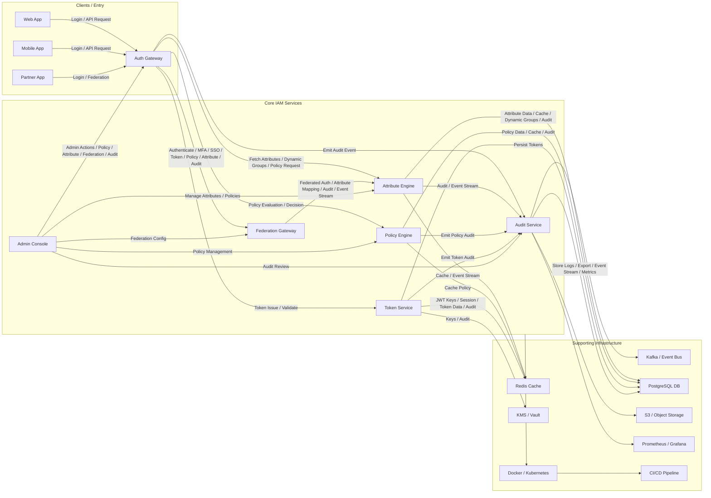
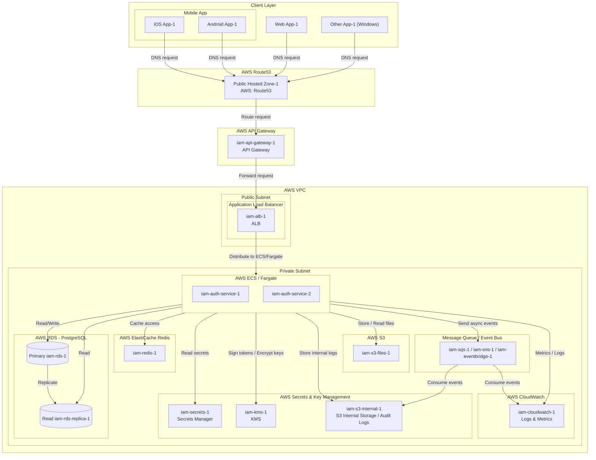

# 🧩 Overview

| Title            | Description                                                                                                                                             |
| ---------------- | ------------------------------------------------------------------------------------------------------------------------------------------------------- |
| Design By        | Ittikorn Sopawan                                                                                                                                        |
| Design At        | 20-Oct-2025                                                                                                                                             |
| Version          | 1.0.0                                                                                                                                                   |
| Service Name     | IAM Service - For Ecosystem                                                                                                                             |
| Service Detailed | Identity & Access Management for users, roles, permissions,authentication (login/2FA/social),authorization (RBAC/ABAC),sessions & attribute management. |

## 0. Change History

- **01-Nov-2025:** - Ittikorn Sopawan
  - **Version:** 1.0.0  
  - **Change / Notes:**  
    - Update Service Design align requirements
- **20-Oct-2025:** - Ittikorn Sopawan
  - **Version:** 1.0.0  
  - **Change / Notes:**  
    - Initialize full IAM Service specification
    - Define service overview, goals, and scope  
    - Outline all domains: Authentication, Authorization (RBAC/ABAC), User Management, Session Management, Attribute Management, Infra/DevOps
    - Draft all entities, commands, queries, and handlers
    - Map initial API endpoints per domain
    - Create initial conceptual workflow diagrams (sequence / flow)
    - Define token lifecycle (JWT / Refresh / Revocation)
    - Plan initial observability: logging, metrics, alerts, audit trail
    - Specify infrastructure considerations (ECS, RDS, Redis, S3, KMS, Secrets Manager, ALB, API Gateway)
    - Include initial change history & versioning framework

## 1. Service Name

> **Identity & Access Management (IAM) Service**

## 2. Purpose

The **IAM Service** serves as the **centralized identity layer** for the entire platform, designed to provide a unified, secure, and extensible foundation for user authentication, authorization, and identity federation across all internal and external products.

### Core Objectives

1. **Single Sign-On (SSO)**
   - Provide seamless login across all platform products with a single authentication session.
   - Reduce redundant login processes and password fatigue.
   - Improve user experience through centralized session handling and token propagation.

2. **Attribute-Based User Profile**
   - Maintain a **centralized directory** of user data in an **attribute-based model**.
   - Allow each product to define custom attributes (e.g., department, project_id, employee_code) without impacting the global schema.
   - Support dynamic attribute synchronization between systems (e.g., HR, Project, Vendor).

3. **Attribute-Based Access Control (ABAC)**
   - Implement fine-grained, **context-aware access control** policies.
   - Grant or restrict access based on user, resource, and environment attributes.
   - Automatically adjust permissions when user attributes (e.g., department, role, or tenant) change.

4. **Federation & External Authentication**
   - Support standard identity protocols (OAuth2, OpenID Connect, SAML 2.0).
   - Act as an **Identity Broker** between external identity providers (Google Workspace, Microsoft 365, Azure AD) and internal systems.
   - Allow both directions of federation:
     - External login via external providers (e.g., “Login with Google”)
     - IAM acting as an authentication provider for partner systems (“Login with Platform Account”).

5. **Multi-Tenant Identity Layer**
   - Isolate user and policy data per organization (tenant).
   - Support cross-tenant users and tenant-level policy management.
   - Enable partner and vendor integrations under secure tenant boundaries.

6. **Audit, Compliance, and Observability**
   - Record all authentication, authorization, and attribute modification events.
   - Provide full traceability for compliance with PDPA, GDPR, and ISO27001.
   - Integrate with centralized monitoring and SIEM tools for proactive security analytics.

### Vision Alignment

> IAM is the **foundation of the entire ecosystem**, ensuring that all products share a unified, compliant, and scalable identity framework that supports both current and future business growth.

---

## 3. Conceptual Workflow

The IAM Service functions as the **core identity orchestration layer** that governs how every entity (user, system, or service) is authenticated, authorized, and governed within the platform.  
It enables **federation**, **multi-tenancy**, **policy-driven access**, and **compliance-grade auditability** across the entire ecosystem.

### 3.1 Concept Overview

IAM operates as a **central trust authority** and **policy enforcement hub**, integrating with:

- Internal microservices (e.g., HR, Project, Vendor, Subscription)
- External systems (e.g., Google Workspace, Azure AD, SSO partners)
- Platform SDKs (used by all frontend/backends)

It provides both **synchronous APIs** (REST/gRPC) and **event-driven communication** for continuous identity updates and audit trails.

IAM Core Domains:

1. **Authentication & Federation Gateway**
2. **Authorization & Policy Engine (ABAC)**
3. **Multi-Tenant Context Isolation**
4. **Attribute Management & Dynamic Grouping**
5. **Audit, Compliance & Observability**
6. **Integration APIs & SDK Layer**

Each domain contributes to a unified identity experience and ensures scalable governance across the ecosystem.

### 3.2 End-to-End Flow (System Narrative)

1. **Access Request**
   - A user or system initiates access to a tenant-specific application (e.g., HRMS, FlowerFlow).
   - The application redirects to IAM `/authorize` endpoint with `client_id` and `tenant_id`.

2. **Tenant Context Resolution**
   - IAM determines tenant boundary from the request (domain, subdomain, or header).
   - Loads tenant-specific configurations:
     - Branding
     - MFA settings
     - Federation options
     - Policy namespace
     - Attribute schema extensions

3. **Identity Verification**
   - IAM authenticates user via one of the following:
     - Local credentials (username/password)
     - OTP or passwordless link (email, SMS)
     - External identity via Federation Gateway (Google, AzureAD, etc.)
     - Service account / API key for backend integration
   - MFA or adaptive rules (geo, IP, device) may trigger secondary verification.

4. **Token Generation**
   - IAM issues a combination of:
     - **ID Token** – identity & claims
     - **Access Token** – scope & permissions
     - **Refresh Token** – renews sessions
   - Tokens are **signed per-tenant via KMS** and **tracked for revocation** in Redis/DB.

5. **Session Establishment**
   - The frontend receives tokens and stores them in secure storage (cookie, memory).
   - Applications use Access Token to interact with other microservices.

6. **Policy Evaluation (Authorization Phase)**
   - When a service receives a request with an Access Token:
     - It validates token via IAM `/introspect` endpoint.
     - Sends policy evaluation request to `/policy/evaluate`.
   - The **Policy Engine** performs:
     - Attribute lookup (from IAM or linked services)
     - Rule evaluation (JSON/YAML ABAC policy)
     - Decision response (Permit / Deny / Conditional)

7. **Audit Emission**
   - Every event (auth success, token issue, policy evaluation, federation handshake) emits an audit event → **Audit Service**
   - Event schema: `{ event_type, actor, target, result, timestamp, tenant_id, trace_id }`
   - Stored for compliance (PDPA/GDPR/ISO) and searchable in SIEM.

8. **Observability Loop**
   - Metrics (auth latency, token error rate, MFA failure, federation delay) exported to Prometheus/Grafana
   - Alerts configured for anomaly detection (e.g., failed login spikes, unusual federation patterns).

### 3.3 Authentication Domain

#### 3.3.1 Supported Authentication Modes

- Username/Password (BCrypt/Argon2)
- OTP / Passwordless via Email or SMS
- Social Login (Google, Facebook)
- Enterprise Federation (AzureAD, Okta, LDAP)
- Service Account (Machine-to-Machine)
- Multi-Factor Authentication (TOTP / WebAuthn / Push)

#### 3.3.2 Authentication Lifecycle

1. App → `/authorize`
2. IAM → Challenge (credential or external redirect)
3. User verifies credentials → returns auth code
4. IAM → `/token` issues tokens
5. Application → uses access token for APIs
6. IAM monitors session lifetime, rotation, and revocation

#### 3.3.3 Federation Gateway

- **Inbound:** accept external identities (SSO)
- **Outbound:** expose IAM as OIDC/SAML IdP
- **Token Mapping:** normalize external claims to IAM’s attribute schema
- **JIT Provisioning:** auto-create user profiles on first login

### 3.4 Authorization Domain (ABAC Policy Engine)

#### 3.4.1 Policy Evaluation Flow

1. Resource service requests decision `/policy/evaluate`
2. IAM loads:
   - User attributes
   - Resource metadata
   - Environment context
3. Policy Engine checks JSON/YAML rules
4. Returns `Permit`, `Deny`, or `Conditional`
5. Decision cached with TTL for performance

#### 3.4.2 Example Policy Definition

```yaml
policy:
  id: "document-view-access"
  description: "Allow managers to view documents in their department"
  effect: permit
  condition:
    and:
      - equals: [ user.department, resource.department ]
      - in: [ user.role, ["Manager", "Admin"] ]
```

### 3.4.3 ABAC Features

- Policy versioning and rollback
- Tenant-level isolation
- Real-time policy update propagation
- Integration with external context providers (HRMS, Project Service)

### 3.5 Multi-Tenant Context Management

#### 3.5.1 Tenant Scoping

- Each tenant has:
  - Unique namespace for users, roles, policies, and attributes
  - Separate encryption keys (KMS)
  - Configurable authentication providers

#### 3.5.2 Cross-Tenant Access

- Delegation Policy:
  - Allows user from Tenant A to access Tenant B’s resources under scoped token
- Full audit traceability with `origin_tenant_id` and `target_tenant_id`

#### 3.5.3 Tenant Lifecycle

- Onboarding → creates IAM tenant config, namespace, keys
- Offboarding → disables tenant endpoints and revokes tokens

### 3.6 Attribute & Group Management

#### 3.6.1 Attribute Directory

- Central user attribute store (JSONB / NoSQL)
- Supports schema extension and custom fields
- Attributes linked to ABAC and SSO federation mapping

#### 3.6.2 Dynamic Grouping

- Rules auto-assign users into groups

```yaml
  group: "Project Admins"
  rule:
    equals: [ user.project_role, "Admin" ]
```

- Groups can trigger dynamic permission sets or notifications

### 3.6.3 Sync & Propagation

- Periodic attribute sync from HR / CRM / Project services
- Supports webhook and event-driven updates

### 3.7 Audit & Compliance Flow

#### 3.7.1 Event Generation

Every IAM event produces:

- Authentication attempt
- Token lifecycle event
- Policy evaluation result
- Federation handshake
- Tenant admin changes

#### 3.7.2 Audit Pipeline

- Events → Kafka → Audit Service → Elastic/SIEM
- Retention by tenant (90–365 days)
- Exportable JSON/CSV for compliance audits

#### 3.7.3 Compliance Features

- PDPA / GDPR data subject traceability
- Anomaly detection on access patterns
- Immutable audit log (append-only ledger option)

### 3.8 Integration & SDK Flow

#### 3.8.1 SDK Functions

- Login / Refresh / Logout
- Token introspection
- Policy evaluation
- Tenant resolution
- Attribute fetch

#### 3.8.2 SDK Architecture

- Language support: TypeScript (NestJS), Go, Python
- Auto-caching of tokens
- Built-in retry, exponential backoff
- Plug-and-play for any service in the ecosystem

### 3.9 Observability & Security Monitoring

- **Metrics:** Auth latency, token failure rate, policy decision time
- **Dashboards:** Grafana / Kibana
- **Alerts:** SIEM integration for unusual access
- **Zero Trust Compatibility:** Supports continuous verification and behavioral anomaly detection
- **Traceability:** OpenTelemetry tracing through all auth flows

### 3.10 End-to-End Sequence (Narrative Summary)

1. **User** → **Application** → redirect to **IAM Auth Gateway**  
2. IAM authenticates (local/federated) → issues tokens  
3. **Application** → **API Service** → validates token via IAM  
4. IAM evaluates ABAC policy → returns authorization decision  
5. IAM emits audit & metrics → **Audit + SIEM**  
6. IAM auto-syncs user attributes across tenants (if applicable)

> This lifecycle represents the **trusted identity pipeline**:  
> *Authenticate → Authorize → Federate → Audit → Govern → Observe*

### 3.11 Summary

IAM orchestrates all identity interactions in the ecosystem with:

- **Unified Authentication & SSO**
- **Policy-Based Authorization (ABAC)**
- **Multi-Tenant Isolation**
- **Federation & External Identities**
- **Dynamic Attribute Profiles**
- **Complete Audit & Compliance Coverage**
- **Integrated SDK & Observability**

This design ensures a **secure, scalable, and adaptive** identity framework that supports enterprise-grade operations across multiple tenants and products.

---

## 4. Key Responsibilities (ABAC Focus)

| Responsibility                            | Description                                                                                                                          |
| ----------------------------------------- | ------------------------------------------------------------------------------------------------------------------------------------ |
| **Single Sign-On (SSO)**                  | Centralized authentication for all products—users log in once to access every system in the platform.                                |
| **Attribute Management**                  | Maintain a flexible, centralized directory of user profiles and attributes; support dynamic schema and cross-system sync.            |
| **Attribute-Based Access Control (ABAC)** | Evaluate access using user, resource, and environment attributes via dynamic policies for fine-grained, context-aware authorization. |
| **Federation & External Authentication**  | Integrate with external identity providers (Google, Microsoft, SAML, OIDC); act as both Identity Provider and Broker.                |
| **Multi-Tenant Identity Isolation**       | Isolate user data and access policies per organization (tenant); support cross-tenant users and tenant-level controls.               |
| **Audit & Compliance**                    | Log all authentication, authorization, attribute change, and federation events for compliance (PDPA, GDPR, ISO27001).                |
| **Integration APIs & SDKs**               | Provide standards-based APIs and SDKs for authentication, attribute retrieval, ABAC evaluation, and federation integration.          |

---

## 5. Service Scope

The IAM (Identity & Access Management) system acts as the **centralized identity and access layer** for all internal platform products and external partner systems. It covers the following core service functions:

### 5.1 Authentication

**Pain Points Before IAM:**

- Users need to remember multiple passwords
- Repeated logins for different systems
- MFA/OTP processes are fragmented and inconsistent

**Business Benefits After IAM:**

- Single Sign-On (SSO) across all systems
- Centralized Multi-Factor Authentication (MFA) and passwordless login
- Support for organizational login accounts (Google Workspace, Microsoft 365, SAML/OIDC)

**Example Use Cases:**

- Employee logs into Project Management system and immediately accesses E-Sign and HRMS without re-login
- External partner uses Microsoft 365 account to log into the Platform without creating a new account

**User Quote:**
> “Now I can log in once and use every system without remembering multiple passwords.”

### 5.2 User Profile & Attribute Management

**Pain Points Before IAM:**

- User data scattered across multiple systems
- Difficult to add system-specific fields
- Attributes inconsistent across products

**Business Benefits After IAM:**

- Centralized Attribute Directory
- Support for Core, Custom, and System-defined Attributes
- Real-time synchronization of user attributes across systems

**Example Use Cases:**

- HR adds “employee_code” attribute; other products can access it via IAM
- Project Management system retrieves user roles from IAM instead of storing locally

**User Quote:**
> “User data is centralized and automatically updated, making it instantly accessible.”

### 5.3 Authorization & ABAC

**Pain Points Before IAM:**

- Repeated creation of roles/groups in multiple systems
- Manual permission adjustments
- Difficult to implement ABAC or context-aware authorization

**Business Benefits After IAM:**

- Attribute-Based Access Control (ABAC)
- Automatic permission adjustments when user attributes change
- Centralized, tenant-aware, context-aware policy management

**Example Use Cases:**

- Users with role=manager can approve documents in their department
- Users in department=HR access employee data for their tenant only

**User Quote:**
> “IAM automatically adjusts permissions based on my role, reducing admin workload.”

### 5.4 Dynamic Group Management

**Pain Points Before IAM:**

- Manual addition of members to groups
- Permission updates required when user data changes

**Business Benefits After IAM:**

- Groups created and updated automatically based on attributes
- Groups can drive policy or access control
- Reduces errors and speeds up administration

**Example Use Cases:**

- Employee moves from HR → Finance; IAM updates permissions automatically
- Group "Project Admins" auto-updates based on project_id attribute

### 5.5 Federation & External Authentication

**Pain Points Before IAM:**

- Multiple accounts needed for partners
- SSO and OAuth integration challenging

**Business Benefits After IAM:**

- Supports identity federation (Google Workspace, Microsoft 365, SAML, OIDC)
- Acts as an Identity Broker for internal platform or partner systems
- Users can choose to log in with organizational accounts

**Example Use Cases:**

- Partner selects “Login with Microsoft 365” → IAM validates → issues platform token

**Partner Quote:**
> “I can use my company’s Google account to access the platform without creating a new account.”

### 5.6 Multi-Tenant & Tenant Isolation

**Pain Points Before IAM:**

- User data from different organizations mixed together
- Users unable to access multiple tenants safely

**Business Benefits After IAM:**

- Separate databases and policies per tenant
- Supports multi-tenant users
- Synchronizes attributes/roles between tenants securely

**Example Use Cases:**

- Company A and B use the same platform, but data is isolated
- Multi-tenant users can switch tenants without permission conflicts

### 5.7 Audit & Compliance

**Pain Points Before IAM:**

- No centralized audit log
- Hard to track access history
- Difficult to generate compliance reports

**Business Benefits After IAM:**

- Centralized logging for login, token, attribute, and policy events
- Supports PDPA / GDPR / ISO27001 compliance
- Logs can be exported to external SIEM systems

**Example Use Cases:**

- Audit who accessed what data, when, and from which tenant
- Generate compliance reports automatically

**Compliance Team Quote:**
> “All access and changes are traceable, making PDPA audits and security reviews much easier.”

---

## 6. Non-Goals

The IAM Service is designed to provide centralized identity and access management for the platform. However, there are specific areas and responsibilities that are **explicitly out of scope** for this service, to ensure clear boundaries and alignment with platform requirements:

1. **No Storage or Management of Business-Specific Data**
   - IAM does **not** store, process, or manage business or application-specific data such as project content, business documents, transactional records, or any domain data unrelated to user identity, attributes, or access control.
   - **Reason:** Business data remains the responsibility of each product or service domain to ensure proper data segregation, compliance, and scalability. IAM focuses strictly on user, attribute, and access information.

2. **No End-User Application UI**
   - IAM does **not** provide user-facing application interfaces (e.g., web portals, mobile apps, dashboards) for end users to interact directly with their accounts.
   - **Reason:** All user interfaces are developed and managed by consuming products. IAM exposes APIs and SDKs for integration, but UI/UX is handled by each application to meet product-specific requirements.

3. **Not a General-Purpose Multi-Factor Authentication (MFA) Provider**
   - IAM does **not** act as a standalone, universal MFA/2FA service for arbitrary external systems or as a generic OTP delivery platform.
   - **Reason:** IAM integrates with external, specialized MFA/2FA providers (e.g., SMS/email OTP gateways, authenticator apps, or third-party services) and orchestrates MFA flows as part of authentication, but does not offer MFA as an independent service for use outside of IAM-managed identity flows.

4. **No Storage of Highly Sensitive Financial Data**
   - IAM does **not** store, process, or manage sensitive financial or payment data such as credit card numbers, bank account details, or PCI-regulated data.
   - **Reason:** Handling such data requires compliance with additional regulatory standards (e.g., PCI DSS) and is outside the scope of IAM, which is focused on identity, authentication, and authorization data only.

5. **No Fine-Grained In-App Permission Management**
   - IAM does **not** manage or enforce detailed, application-specific UI permissions, feature toggles, or workflow-level access within individual product modules.
   - **Reason:** IAM provides access decisions (Permit/Deny/Conditional) and user attributes to consuming systems. Each application is responsible for interpreting these decisions and implementing fine-grained access control at the UI or feature level as appropriate.

6. **No Management of External System Credentials or Secrets**
   - IAM does **not** store or manage credentials, passwords, or secrets for external systems, databases, or third-party applications.
   - **Reason:** Secret management for infrastructure, integrations, or applications is delegated to dedicated secret management solutions (e.g., AWS KMS, Vault). IAM only manages credentials relevant to its own authentication flows.

7. **No Product-Specific Attribute or Policy Logic**
   - IAM does **not** define or enforce business-specific logic or workflows (e.g., HR approval flows, document signing processes, project-specific validations).
   - **Reason:** IAM provides a flexible attribute and policy engine, but the definition and enforcement of product-specific logic must be handled by the respective product teams using IAM's APIs and policy outcomes.

---

## 7. Technology Stack

| Component                  | Technology                                   | Description                                                                                                 |
| -------------------------- | -------------------------------------------- | ----------------------------------------------------------------------------------------------------------- |
| Language / Framework       | .NET 8/9 (C#), ASP.NET Core Web API, gRPC    | Microservices architecture for scalable, modular IAM core services                                          |
| Database                   | PostgreSQL, JSONB                            | Stores users, tenants, roles, policies, attributes; JSONB allows flexible/dynamic attribute schema          |
| Cache                      | Redis                                        | Caching for sessions, tokens, policy decisions, and login throttling                                        |
| Message Queue              | Kafka or RabbitMQ                            | Event-driven architecture for audit, notification, and attribute sync flows                                 |
| Token Management           | JWT (RS256, OIDC-compliant), AWS KMS         | Secure token issuance, per-tenant signing keys managed by AWS KMS                                           |
| Secret Management          | AWS KMS, HashiCorp Vault                     | Manages encryption keys, OIDC secrets, federation keys                                                      |
| Containerization           | Docker, Kubernetes (EKS/GKE/AKS)             | Service orchestration, deployment, and scaling                                                              |
| CI/CD                      | GitHub Actions, GitLab CI/CD                 | Automated build, test, deploy, and security scanning                                                        |
| Monitoring & Observability | Prometheus, Grafana, OpenTelemetry, ELK/SIEM | Metrics collection, dashboards, distributed tracing, and centralized audit log management                   |
| File/Object Storage        | S3-compatible storage                        | Optional: For storing logs, archives, and file attachments                                                  |
| Admin Console              | React or Angular SPA                         | Web UI for IAM administration (user, group, policy, audit management), connects to IAM Admin API            |
| Federation Gateway         | OIDC/SAML2 Proxy Service                     | Integrates with external IdPs (Google, Microsoft, SAML, OIDC); handles inbound/outbound federation flows    |
| Attribute Engine           | Dedicated microservice                       | Manages attribute schema, mapping, synchronization, and dynamic group logic                                 |
| Policy Engine              | Dedicated microservice                       | ABAC/RBAC evaluation, policy versioning, real-time updates, caching, and integration with context providers |
| Audit Service              | Dedicated microservice                       | Centralized logging for auth, policy, attribute, federation, admin actions; SIEM/ELK export, compliance     |
| Token Service              | Dedicated microservice                       | Issues, verifies, revokes JWTs (access, ID, refresh); manages signing keys per tenant                       |
| SDK Layer                  | TypeScript, Go, Python SDKs                  | Official SDKs for login, token, attribute, and policy APIs for integration with all platform services       |
| DevOps/Platform            | CI/CD, Docker/K8s, Monitoring, Security      | Platform services for deployment, orchestration, monitoring, alerting, and security scanning                |

### Component Details

- **Auth Gateway**: Handles all authentication flows (password, OTP, SSO, federation), session lifecycle, MFA, and login throttling.
- **Federation Gateway**: Manages inbound (external IdP) and outbound (IAM as IdP) federation, SSO brokering, mapping external claims to internal attributes, and JIT provisioning.
- **Attribute Engine**: Provides dynamic, extensible attribute schema for users and resources; manages custom fields, attribute mapping, and dynamic group rules; supports sync from HR/ERP systems.
- **Policy Engine**: ABAC/RBAC evaluation, policy versioning, real-time policy updates, and caching; supports complex conditions and external context providers.
- **Admin Console**: Web UI for administrators to manage users, groups, attributes, tenants, policies, federation settings, and view audit logs.
- **Audit Service**: Centralized event logging (auth, policy, attribute, federation, admin actions), exports to SIEM/ELK, supports compliance retention and search.
- **Token Service**: Issues, verifies, and revokes JWTs (access, ID, refresh); manages per-tenant signing keys via KMS.
- **SDK Layer**: Official SDKs for major languages (TypeScript, Go, Python) providing login, token, attribute, and policy APIs.
- **DevOps/Platform**: CI/CD, container orchestration, monitoring, alerting, and security scanning.

---



---

## 8. Success Metrics

| Metric                        | Target / Description                                               |
| ----------------------------- | ------------------------------------------------------------------ |
| Authentication Latency        | Average login response time < 500ms                                |
| Availability                  | Service uptime ≥ 99.9%                                             |
| Audit Coverage                | 100% of authentication, authorization, and attribute events logged |
| Policy Evaluation Accuracy    | 100% correct ABAC/RBAC decisions                                   |
| API Compliance                | All endpoints follow OpenAPI specification                         |
| Security Compliance           | OWASP ASVS Level 2 compliance                                      |
| Multi-Tenant Isolation        | No cross-tenant data leakage                                       |
| Federation Success Rate       | ≥ 99% successful logins via external IdPs                          |
| Token Issuance Reliability    | ≥ 99.9% success rate for JWT / Refresh token generation            |
| Incident Detection & Alerting | All anomalies detected and alerted within defined SLA              |

---

## 9. Ubiquitous Language (Expanded)

| Term                                    | Definition / Meaning                                      | Notes / Examples                                                        |
| --------------------------------------- | --------------------------------------------------------- | ----------------------------------------------------------------------- |
| Registration                            | User signs up for the platform                            | May include email/mobile verification                                   |
| Login                                   | User authentication process                               | Username/password, OTP, social login, SSO                               |
| Logout                                  | Termination of an active session                          | Invalidates access & refresh tokens                                     |
| Password Policy                         | Rules for creating secure passwords                       | Minimum length, complexity, expiration, reuse restrictions              |
| Password Reset                          | User-initiated reset of forgotten password                | Usually via email or OTP link                                           |
| Account Lockout                         | Temporary blocking of account after failed attempts       | May trigger user/admin alerts                                           |
| Session                                 | Active authentication context of a user                   | Includes token, device, IP, tenant info                                 |
| Session Timeout                         | Automatic logout after inactivity                         | Ensures account/session security                                        |
| Token                                   | Security artifact representing identity or access rights  | JWT (access, ID, refresh)                                               |
| Refresh Token                           | Token used to extend session validity                     | Maintains seamless access                                               |
| Access Token                            | Token granting access to resources                        | Short-lived, used by APIs                                               |
| ID Token                                | Token containing user claims for identity                 | Often used in OIDC                                                      |
| Claim                                   | Attribute attached to a user                              | e.g., roles, department, clearance                                      |
| Attribute                               | User or resource property                                 | Used in ABAC policies                                                   |
| Role                                    | Collection of permissions                                 | Assigned to users or groups                                             |
| Permission                              | Specific operation or action a role grants                | e.g., read, write, approve                                              |
| Policy                                  | Set of rules governing access rights                      | ABAC / RBAC definitions                                                 |
| ABAC                                    | Attribute-Based Access Control                            | Context-aware access: e.g., only managers in dept X can approve budgets |
| RBAC                                    | Role-Based Access Control                                 | Access decisions based on static role-permission mapping                |
| Authorization                           | Granting access based on roles or attributes              | Determines actions/resources a user can access                          |
| Authentication                          | Verifying user identity                                   | Password, MFA, social login, external IdP                               |
| Multi-Factor Authentication (MFA / 2FA) | Additional verification factors                           | SMS, Email, Authenticator App, Hardware Token                           |
| OTP                                     | One-time password for verification                        | Short-lived via SMS or Email                                            |
| Federation                              | Authentication via external identity providers            | Enables SSO from Google, Microsoft, SAML, OIDC                          |
| Identity Provider (IdP)                 | External system for authenticating users                  | e.g., Google, Microsoft 365, corporate SSO                              |
| Social Login                            | Authentication via third-party platforms                  | OAuth2-based (Google, Facebook, etc.)                                   |
| Consent                                 | User permission for personal data usage                   | Required for GDPR/PDPA compliance                                       |
| Attribute Mapping                       | Mapping external IdP claims to internal attributes        | Used during federation or SSO                                           |
| Just-in-Time Provisioning               | Auto-creation of user accounts during first login         | For federated external users                                            |
| Tenant                                  | Organizational boundary for isolation                     | Defines users, roles, policies, attributes                              |
| Multi-Tenant User                       | User existing across multiple tenants                     | May have scoped permissions                                             |
| Cross-Tenant Access                     | Controlled access between tenants                         | Requires explicit delegation policies                                   |
| Dynamic Group                           | Group whose membership is calculated based on attributes  | e.g., project role = "Admin"                                            |
| Audit Log                               | Record of critical system events                          | Authentication, authorization, attribute changes                        |
| Event                                   | Significant action or occurrence related to users         | e.g., UserLoggedIn, PasswordChanged, TokenRevoked                       |
| Observability                           | Metrics, logging, tracing                                 | Prometheus, Grafana, OpenTelemetry                                      |
| Security Alert                          | Notification of anomalous or suspicious activity          | Failed login spikes, token abuse                                        |
| Revocation                              | Invalidation of tokens or permissions                     | Access termination                                                      |
| Identity Verification                   | Confirming user identity                                  | KYC, email, phone verification                                          |
| Service Account                         | Non-human user account for automated or backend processes | API keys or JWT-based credentials                                       |
| API Key                                 | Secret token for programmatic access                      | Used for service-to-service authentication                              |
| Rate Limiting                           | Restriction on number of requests per unit time           | Prevent brute-force or abuse                                            |
| Session Revocation                      | Force termination of an active session                    | Admin or system triggered                                               |
| Policy Versioning                       | Maintaining multiple versions of policies                 | Supports rollback or auditing                                           |
| Policy Evaluation                       | Runtime decision based on current attributes and policies | Returns Permit / Deny / Conditional                                     |
| Token Expiry                            | Duration after which a token is invalid                   | Enforced by IAM                                                         |
| Consent Revocation                      | User revokes previously granted permissions               | Requires system to remove granted access                                |
| SLA / Availability                      | Expected service uptime and response targets              | e.g., ≥ 99.9% uptime                                                    |
| Compliance                              | Adherence to laws, standards, or internal policies        | PDPA, GDPR, ISO27001                                                    |
| Encryption                              | Protection of sensitive data in transit and at rest       | e.g., TLS, AES, RSA                                                     |
| Secret Management                       | Secure storage of credentials, keys, and secrets          | AWS KMS, Vault                                                          |
| Token Signing Key                       | Cryptographic key to sign JWTs                            | Managed per-tenant in KMS                                               |
| Identity Federation                     | Trust relationship between IdPs                           | Allows single-sign-on across organizations                              |
| Login Attempt                           | Record of a login trial                                   | Includes timestamp, IP, device, and result                              |
| Anomaly Detection                       | Detect unusual behavior or access patterns                | Failed logins, abnormal location/device                                 |
| User Lifecycle                          | Full account journey                                      | Registration → Active → Deactivation / Deprovision                      |
| Passwordless Authentication             | Login without password                                    | Email link, magic link, or OTP-based                                    |
| Token Introspection                     | API to validate token and inspect claims                  | `/introspect` endpoint                                                  |
| Audit Export                            | Export of logs for compliance                             | JSON, CSV, or integration with SIEM                                     |
| OpenID Connect (OIDC)                   | Standard protocol for federated authentication            | Token-based authentication                                              |
| SAML                                    | Security Assertion Markup Language for SSO                | XML-based federation protocol                                           |

---

## 10. Domain (Complete & Refactored for IAM)

### 10.1 Authentication Domain

Responsible for verifying user identities via multiple mechanisms (username/password, OTP, passwordless, 2FA, social/external login) and issuing tokens for secure, centralized access. Supports Single Sign-On (SSO) and federated authentication for seamless access across all platform products. Also includes token introspection and revocation.

- **Object Values:**
  - **username:** Unique login identifier for the user.
  - **password:** Secret credential, subject to password policies.
  - **email:** Used for login, verification, OTP, and passwordless flows.
  - **mobile number:** Used for OTP/passwordless login and as a contact attribute.
  - **OTP:** One-time password (SMS/email) for secure, time-limited authentication.
  - **social provider token:** Token from external identity providers (Google, Microsoft, etc.).
  - **2FA code:** Secondary verification code for multi-factor authentication.
  - **auth token:** JWTs (access, ID, refresh) for session management and SSO.
  - **token claims:** Identity and authorization claims embedded in JWT.
  - **token status:** Indicates if a token is valid, revoked, or expired.

- **Entities:**
  - **User:** User profile containing credentials, contact info, status, and authentication history.
  - **AuthToken:** JWTs (access, ID, refresh) for session management and SSO.
  - **LoginAttempt:** Records authentication attempts with timestamp, IP, device, and result.
  - **Session:** Active authentication context.

- **Use Cases:**
  1. **Login via username/password**
     - **Command:** LoginUserCommand - Authenticate user via username/password.
     - **CommandHandler:** LoginUserCommandHandler - Handles authentication, issues tokens, records login attempts.
     - **Query:** GetUserSessionQuery - Retrieve session and token information for authenticated user.
     - **QueryHandler:** GetUserSessionQueryHandler - Fetches user session data.
  2. **Login via mobile OTP**
     - **Command:** LoginViaMobileOtpCommand - Authenticate user via mobile number and OTP.
     - **CommandHandler:** LoginViaMobileOtpCommandHandler - Verifies OTP, issues tokens, records login.
     - **Query:** GetUserSessionQuery - Retrieve session and token information.
     - **QueryHandler:** GetUserSessionQueryHandler - Fetches user session data.
  3. **Login via email OTP**
     - **Command:** LoginViaEmailOtpCommand - Authenticate user via email OTP.
     - **CommandHandler:** LoginViaEmailOtpCommandHandler - Verifies OTP, issues tokens, records login.
     - **Query:** GetUserSessionQuery - Retrieve session and token information.
     - **QueryHandler:** GetUserSessionQueryHandler - Fetches user session data.
  4. **Login with 2FA (external 2FA)**
     - **Command:** VerifyTwoFactorCommand - Verify second factor authentication code.
     - **CommandHandler:** VerifyTwoFactorCommandHandler - Handles external 2FA verification, issues tokens.
     - **Query:** GetUserSessionQuery - Retrieve session and token information.
     - **QueryHandler:** GetUserSessionQueryHandler - Fetches user session data.
  5. **Login via social provider**
     - **Command:** LoginViaSocialCommand - Authenticate user via social provider OAuth.
     - **CommandHandler:** LoginViaSocialCommandHandler - Validates token from provider, maps user attributes, issues tokens.
     - **Query:** GetUserSessionQuery - Retrieve session and token information.
     - **QueryHandler:** GetUserSessionQueryHandler - Fetches user session data.
  6. **Token Introspection**
     - **Query:** IntrospectTokenQuery - Check validity and claims of a token.
     - **QueryHandler:** IntrospectTokenQueryHandler - Validates token signature, expiry, and returns claims/status.
  7. **Token Revocation**
     - **Command:** RevokeTokenCommand - Revoke access/refresh tokens for a session.
     - **CommandHandler:** RevokeTokenCommandHandler - Marks token as revoked, terminates session if needed.

---

### 10.2 Authorization / ABAC Domain

Governs access to resources and APIs using RBAC (via attribute: role) and ABAC. Evaluates user attributes, resource context, and dynamic policies to grant or deny access. Supports context-aware, flexible authorization and policy management.

- **Object Values:**
  - **attributes:** Properties of users, resources, or environment for ABAC evaluation (role, department, clearance, tenant).
  - **permissions:** Specific actions allowed on resources (read, write, approve).
  - **resources:** Entities requiring access control (APIs, documents, modules).
  - **policies:** Declarative ABAC rules defining access conditions.
  - **context:** Runtime/environmental information (time, location, device, tenant).
  - **policy versions:** Versioned policy definitions for rollback/audit.

- **Entities:**
  - **Attribute:** Data used in policy evaluation.
  - **Policy:** ABAC rules with conditions and effects (Permit/Deny).
  - **PolicyVersion:** Versioned snapshot of policy for audit/rollback.
  - **Resource:** Object or service being protected.

- **Use Cases:**
  1. **Evaluate Access**
     - **Query:** EvaluateAccessQuery - Evaluate user access using attributes and context.
     - **QueryHandler:** EvaluateAccessQueryHandler - Loads user/resource attributes, evaluates ABAC policies.
  2. **Evaluate Policy**
     - **Query:** EvaluatePolicyQuery - Evaluate user access based on ABAC policies.
     - **QueryHandler:** EvaluatePolicyQueryHandler - Evaluates specific policy for access decision.
  3. **Policy Management**
     - **Command:** CreatePolicyCommand / UpdatePolicyCommand / DeletePolicyCommand
     - **CommandHandler:** Corresponding handlers manage policy lifecycle.
     - **Query:** GetPolicyQuery / GetPolicyVersionQuery
     - **QueryHandler:** Corresponding handlers fetch policy and version details.
  4. **Attribute Management**
     - **Command:** CreateAttributeCommand / UpdateAttributeCommand / DeleteAttributeCommand
     - **CommandHandler:** Corresponding handlers manage attributes.
     - **Query:** GetUserAttributesQuery
     - **QueryHandler:** GetUserAttributesQueryHandler

---

### 10.3 User Management Domain

Manages user profiles, preferences, account settings, and assigned attributes across the platform.

- **Object Values:**
  - **personal details:** Name, email, and contact information.
  - **department:** Organizational unit or team.
  - **preferences:** User-specific settings.
  - **account settings:** Security and notification configurations.
  - **user attributes:** Assigned roles (as attributes), department, dynamic groups.

- **Entities:**
  - **UserProfile:** Core user information.
  - **UserSettings:** Preferences and account configuration.

- **Use Cases:**
  1. **Create / Update / Delete User**
     - **Command:** CreateUserCommand / UpdateUserCommand / DeleteUserCommand
     - **CommandHandler:** Handles user profile lifecycle.
  2. **Get User Profile**
     - **Query:** GetUserProfileQuery
     - **QueryHandler:** GetUserProfileQueryHandler
  3. **Assign / Revoke User Attributes**
     - **Command:** AssignUserAttributeCommand / RevokeUserAttributeCommand
     - **CommandHandler:** Assign/Revoke handler
     - **Query:** GetUserAttributesQuery
     - **QueryHandler:** GetUserAttributesQueryHandler
  4. **Get User Dynamic Groups**
     - **Query:** GetUserDynamicGroupsQuery
     - **QueryHandler:** GetUserDynamicGroupsQueryHandler

---

### 10.4 Session Management Domain

Manages active sessions, token issuance, session validation, refresh tokens, and logout processes.

- **Object Values:**
  - **session tokens:** JWT representing active sessions.
  - **refresh tokens:** Tokens to renew session validity.
  - **session metadata:** Session start time, last activity, status.
  - **device info:** Device used to access the system.
  - **IP address:** Client IP address.

- **Entities:**
  - **Session:** Represents an active user session.
  - **AuthToken:** Access and refresh token objects.

- **Use Cases:**
  1. **Validate Session**
     - **Query:** ValidateSessionQuery
     - **QueryHandler:** ValidateSessionQueryHandler
  2. **Refresh Token**
     - **Command:** RefreshTokenCommand
     - **CommandHandler:** RefreshTokenCommandHandler
  3. **Logout**
     - **Command:** LogoutUserCommand
     - **CommandHandler:** LogoutUserCommandHandler

---

### 10.5 Attribute Management Domain

Manages user, resource, and environment attributes for ABAC policies, dynamic groups, and policy evaluation.

- **Object Values:**
  - **attribute definition:** Name, type, validation, scope.
  - **user attributes:** Role, department, project, etc.
  - **attribute groups:** Logical groupings for policy or assignment.
  - **dynamic group rules:** Logic for automatic group membership.
  - **dynamic permissions:** Access rights calculated from attribute/group rules.

- **Entities:**
  - **Attribute:** Single attribute for user or resource.
  - **AttributeGroup:** Group of attributes used for policy evaluation.
  - **DynamicGroup:** Group with rule-based membership.

- **Use Cases:**
  1. **Manage Attribute Definitions**
     - **Command:** Create/Update/DeleteAttributeCommand
     - **CommandHandler:** Corresponding handler
     - **Query:** GetUserAttributesQuery
     - **QueryHandler:** GetUserAttributesQueryHandler
  2. **Manage Dynamic Groups**
     - **Command:** Create/Update/DeleteAttributeGroupCommand
     - **CommandHandler:** Corresponding handler
     - **Query:** GetAttributeGroupQuery
     - **QueryHandler:** GetAttributeGroupQueryHandler
  3. **Assign/Revoke Attributes to Users**
     - **Command:** AssignUserAttributeCommand / RevokeUserAttributeCommand
     - **CommandHandler:** Corresponding handler
     - **Query:** GetUserAttributesQuery
     - **QueryHandler:** GetUserAttributesQueryHandler

---

### 10.6 Tenant Management Domain

Manages organizational boundaries, tenant-specific configuration, and isolation.

- **Object Values:**
  - **tenant name:** Organization identifier.
  - **tenant config:** MFA, branding, federation, policy namespace.
  - **tenant status:** Active, suspended, deleted.
  - **encryption keys:** Per-tenant signing/encryption.

- **Entities:**
  - **Tenant:** Represents an organization/tenant.
  - **TenantConfig:** Configuration for authentication, federation, branding, etc.

- **Use Cases:**
  1. **Tenant Lifecycle**
     - **Command:** CreateTenantCommand / UpdateTenantCommand / DeleteTenantCommand
     - **CommandHandler:** Corresponding handler
     - **Query:** GetTenantQuery
     - **QueryHandler:** GetTenantQueryHandler

---

### 10.7 Federation / External IdP Domain

Manages integration with external IdPs, handles federation flows, claim mapping, and just-in-time (JIT) provisioning.

- **Object Values:**
  - **IdP config:** SAML/OIDC endpoints, metadata, keys.
  - **claim mapping:** Rules for mapping external claims to internal attributes.
  - **jit provisioning:** Rules for auto-creating users on first login.
  - **federation status:** Active, pending, disabled.

- **Entities:**
  - **IdentityProvider (IdP)**
  - **ClaimMapping**
  - **FederatedUser**

- **Use Cases:**
  1. **Manage IdP Configurations**
     - **Command:** Create/Update/DeleteIdPCommand
     - **CommandHandler:** Corresponding handler
     - **Query:** GetIdPQuery
     - **QueryHandler:** GetIdPQueryHandler
  2. **JIT Provisioning**
     - **Command:** JITProvisionCommand
     - **CommandHandler:** JITProvisionCommandHandler
  3. **Claim Mapping**
     - **Command:** MapClaimsCommand
     - **CommandHandler:** MapClaimsCommandHandler

---

### 10.8 Infrastructure / DevOps Domain

Provides logging, monitoring, and security alerting to support authentication, authorization, and compliance.

- **Object Values:**
  - **audit events:** Records of security-relevant actions.
  - **operational events:** System events related to service health and runtime operations.
  - **security alerts:** Notifications for anomalous or potentially malicious activity.

- **Entities:**
  - **AuditLog**
  - **EventLog**

- **Use Cases:**
  1. **Log Authentication Events**
     - **Command:** LogAuthEventCommand
     - **CommandHandler:** LogAuthEventCommandHandler
  2. **Monitor Failed Login Attempts**
     - **Query:** GetFailedLoginAttemptsQuery
     - **QueryHandler:** GetFailedLoginAttemptsQueryHandler
  3. **Send Notifications / Alerts**
     - **Command:** SendSecurityAlertCommand
     - **CommandHandler:** SendSecurityAlertCommandHandler

---

## 11. API Endpoints

| Environment    | URL                      |
| -------------- | ------------------------ |
| Dev            | dev-api.example.com      |
| QA             | qa-api.example.com       |
| UAT            | uat-api.example.com      |
| Staging        | staging-api.example.com  |
| Pre-Production | pre-prod-api.example.com |
| Production     | api.example.com          |

### 11.1 Authentication Domain

| Endpoint                  | Method | Command / Query                                | Description                                  |
| ------------------------- | ------ | ---------------------------------------------- | -------------------------------------------- |
| /api/v1/auth/login        | POST   | LoginUserCommand / GetUserSessionQuery         | Authenticate user via username/password.     |
| /api/v1/auth/login/mobile | POST   | LoginViaMobileOtpCommand / GetUserSessionQuery | Authenticate user via mobile number + OTP.   |
| /api/v1/auth/login/email  | POST   | LoginViaEmailOtpCommand / GetUserSessionQuery  | Authenticate user via email + OTP.           |
| /api/v1/auth/login/2fa    | POST   | VerifyTwoFactorCommand / GetUserSessionQuery   | Verify login using external 2FA mechanism.   |
| /api/v1/auth/login/social | POST   | LoginViaSocialCommand / GetUserSessionQuery    | Authenticate user via social provider OAuth. |
| /api/v1/token/introspect  | POST   | IntrospectTokenQuery                           | Check validity and claims of a token.        |
| /api/v1/token/revoke      | POST   | RevokeTokenCommand                             | Revoke access/refresh tokens for a session.  |

### 11.2 Authorization / ABAC Domain

| Endpoint                       | Method | Command / Query             | Description                                               |
| ------------------------------ | ------ | --------------------------- | --------------------------------------------------------- |
| /api/v1/auth/authorize/abac    | POST   | EvaluateAccessQuery         | Evaluate user access using attributes and context.        |
| /api/v1/auth/authorize/policy  | POST   | EvaluatePolicyQuery         | Evaluate user access based on ABAC policies.              |
| /api/v1/policies               | POST   | CreatePolicyCommand         | Create a new ABAC policy.                                 |
| /api/v1/policies/{id}          | GET    | GetPolicyQuery              | Retrieve a single ABAC policy details.                    |
| /api/v1/policies/{id}          | PUT    | UpdatePolicyCommand         | Update an existing ABAC policy.                           |
| /api/v1/policies/{id}          | DELETE | DeletePolicyCommand         | Delete a policy.                                          |
| /api/v1/policies/{id}/versions | GET    | GetPolicyVersionQuery       | List all versions of a policy.                            |
| /api/v1/policies/{id}/versions | POST   | CreatePolicyVersionCommand  | Create new version of a policy.                           |
| /api/v1/attributes             | POST   | CreateAttributeCommand      | Create a new attribute definition.                        |
| /api/v1/attributes/{id}        | PUT    | UpdateAttributeCommand      | Update an existing attribute definition.                  |
| /api/v1/attributes/{id}        | DELETE | DeleteAttributeCommand      | Delete an existing attribute definition.                  |
| /api/v1/attributes             | GET    | GetUserAttributesQuery      | Retrieve all system attributes for assignment/evaluation. |
| /api/v1/attributes/groups      | POST   | CreateAttributeGroupCommand | Create dynamic attribute group with rules.                |
| /api/v1/attributes/groups/{id} | PUT    | UpdateAttributeGroupCommand | Update dynamic group rules.                               |
| /api/v1/attributes/groups/{id} | DELETE | DeleteAttributeGroupCommand | Delete dynamic group.                                     |
| /api/v1/attributes/groups/{id} | GET    | GetAttributeGroupQuery      | Retrieve dynamic group details.                           |

### 11.3 User Management Domain

| Endpoint                          | Method | Command / Query            | Description                                           |
| --------------------------------- | ------ | -------------------------- | ----------------------------------------------------- |
| /api/v1/users                     | POST   | CreateUserCommand          | Create a new user record.                             |
| /api/v1/users/{id}                | PUT    | UpdateUserCommand          | Update user details.                                  |
| /api/v1/users/{id}                | DELETE | DeleteUserCommand          | Delete a user from the system.                        |
| /api/v1/users/{id}/profile        | GET    | GetUserProfileQuery        | Retrieve user profile data.                           |
| /api/v1/users/{id}/attributes     | POST   | AssignUserAttributeCommand | Assign attributes to a user (role, department, etc.). |
| /api/v1/users/{id}/attributes     | GET    | GetUserAttributesQuery     | Retrieve attributes assigned to a specific user.      |
| /api/v1/users/{id}/attributes     | DELETE | RevokeUserAttributeCommand | Remove attributes from a user.                        |
| /api/v1/users/{id}/dynamic-groups | GET    | GetUserDynamicGroupsQuery  | Retrieve dynamic groups assigned based on attributes. |

### 11.4 Session Management Domain

| Endpoint                  | Method | Command / Query      | Description                                |
| ------------------------- | ------ | -------------------- | ------------------------------------------ |
| /api/v1/sessions/validate | POST   | ValidateSessionQuery | Validate user session or access token.     |
| /api/v1/sessions/refresh  | POST   | RefreshTokenCommand  | Generate a new access token using refresh. |
| /api/v1/sessions/logout   | POST   | LogoutUserCommand    | Logout user and invalidate active session. |

### 11.5 Tenant Management Domain

| Endpoint             | Method | Command / Query     | Description                                 |
| -------------------- | ------ | ------------------- | ------------------------------------------- |
| /api/v1/tenants      | POST   | CreateTenantCommand | Create a new tenant.                        |
| /api/v1/tenants/{id} | PUT    | UpdateTenantCommand | Update tenant configurations.               |
| /api/v1/tenants/{id} | DELETE | DeleteTenantCommand | Remove a tenant and revoke associated data. |
| /api/v1/tenants/{id} | GET    | GetTenantQuery      | Retrieve tenant details.                    |

### 11.6 Federation / External IdP Domain

| Endpoint                         | Method | Command / Query     | Description                                          |
| -------------------------------- | ------ | ------------------- | ---------------------------------------------------- |
| /api/v1/federation/idp           | POST   | CreateIdPCommand    | Register new external IdP (SAML/OIDC).               |
| /api/v1/federation/idp/{id}      | PUT    | UpdateIdPCommand    | Update IdP configuration.                            |
| /api/v1/federation/idp/{id}      | DELETE | DeleteIdPCommand    | Remove IdP configuration.                            |
| /api/v1/federation/idp/{id}      | GET    | GetIdPQuery         | Retrieve IdP details.                                |
| /api/v1/federation/jit-provision | POST   | JITProvisionCommand | Auto-provision users on first login from IdP.        |
| /api/v1/federation/claim-mapping | POST   | MapClaimsCommand    | Map external IdP claims to internal user attributes. |

### 11.7 Infrastructure / DevOps Domain

| Endpoint                 | Method | Command / Query             | Description                                     |
| ------------------------ | ------ | --------------------------- | ----------------------------------------------- |
| /api/v1/logs/auth        | POST   | LogAuthEventCommand         | Log authentication and security events.         |
| /api/v1/logs/auth/failed | GET    | GetFailedLoginAttemptsQuery | Retrieve list of failed login attempts.         |
| /api/v1/alerts/security  | POST   | SendSecurityAlertCommand    | Send security-related notifications or alerts.  |
| /api/v1/mq/publish       | POST   | PublishEventCommand         | Publish event to message queue / event bus.     |
| /api/v1/mq/consume       | GET    | ConsumeEventQuery           | Retrieve events from message queue / event bus. |

---

## 12. Infrastructure

| Component / Responsibility    | AWS Service                        | Instance Name                             | Purpose                                                                                                  |
| ----------------------------- | ---------------------------------- | ----------------------------------------- | -------------------------------------------------------------------------------------------------------- |
| API Entry                     | Amazon API Gateway                 | iam-api-gateway-1                         | Front door for all incoming requests; handles throttling, routing, CORS                                  |
| Load Balancing                | Application Load Balancer (ALB)    | iam-alb-1                                 | Distribute incoming traffic from public subnet to ECS/Fargate services                                   |
| Microservice Runtime          | ECS Fargate / EKS                  | iam-auth-service-1, iam-auth-service-2    | Run stateless containers; handle authentication, authorization, business logic                           |
| Relational Database           | Amazon RDS (PostgreSQL)            | iam-rds-1 (primary), iam-rds-replica-1    | Store users, attributes, policies, sessions; replicated for high availability                            |
| Caching Layer                 | Amazon ElastiCache (Redis)         | iam-redis-1                               | Store short-lived session tokens, access tokens, ABAC policy caches, frequently accessed data            |
| Token Signing / Encryption    | AWS KMS                            | iam-kms-1                                 | Store signing keys for JWT; manage cryptographic operations                                              |
| Secrets Management            | AWS Secrets Manager                | iam-secrets-1                             | Store DB credentials, OAuth client secrets, federation keys, and other sensitive information             |
| File Storage                  | Amazon S3                          | iam-s3-files-1                            | Store application files, user uploads, static content                                                    |
| Internal Logs / Audit Storage | Amazon S3                          | iam-s3-internal-1                         | Store internal logs, audit logs, immutable event data                                                    |
| Message Queue / Event Bus     | Amazon SQS / SNS / EventBridge     | iam-sqs-1 / iam-sns-1 / iam-eventbridge-1 | Handle async communication between microservices (e.g., attribute updates, audit events, notifications)  |
| Observability / Logging       | Amazon CloudWatch (Logs & Metrics) | iam-cloudwatch-1                          | Monitor service health, log events, generate metrics, trigger alarms                                     |
| VPC / Networking              | Amazon VPC                         | vpc-iam-1                                 | Public subnet (ALB) + private subnet (ECS, RDS, ElastiCache, S3, MQ); isolate resources, control traffic |

### 12.1. Infrastructure Diagram


