# 🧩 Overview

| Title           | Description                                                                                                                                                                                                                                                                                                                                                                                                                                                                          |
| --------------- | ------------------------------------------------------------------------------------------------------------------------------------------------------------------------------------------------------------------------------------------------------------------------------------------------------------------------------------------------------------------------------------------------------------------------------------------------------------------------------------ |
| Designed By     | Ittikorn Sopawan                                                                                                                                                                                                                                                                                                                                                                                                                                                                     |
| Designed At     | 28-Oct-2025                                                                                                                                                                                                                                                                                                                                                                                                                                                                          |
| Version         | 1.0.0                                                                                                                                                                                                                                                                                                                                                                                                                                                                                |
| Service Name    | Privilege Service - Member Tier & Benefit Management                                                                                                                                                                                                                                                                                                                                                                                                                                 |
| Service Summary | The **Privilege Service** is responsible for managing member **tiers**, **benefits**, and **point conversion rules** in a dynamic and configurable way. It supports flexible tier progression (automatic, manual, or via invitation), benefit mapping, and real-time rule evaluation. The service integrates with **IAM**, **Campaign**, **Mission**, and **Point** microservices, enabling organizations to configure member privileges and reward logic without code redeployment. |

## 0. Change History

- **28-Oct-2025:** - Ittikorn Sopawan  
  - **Version:** 1.0.0  
  - **Change / Notes:**  
    - Initial draft of Privilege Service Specification. Defined dynamic tier model, rule engine, integrations, and configuration workflow.

## 1. Service Name

> **Privilege Service — Member Tier & Benefit Management**

This microservice provides a configurable framework to manage membership tiers, benefits, and reward calculation logic.  
It acts as the decision and rules engine that determines how a member’s actions or transactions translate into privileges and benefits within the ecosystem.

---

## 2. Purpose

The **Privilege Service** enables businesses to design and operate dynamic loyalty programs without redeploying code.  
It defines how members earn, maintain, and upgrade their status based on transactional and behavioral data from multiple integrated services.

### Key Objectives:
- Allow flexible **Tier configurations** (automatic progression, manual assignment, invitation-based, or immutable tiers).  
- Support **Benefit catalog management** for mapping privileges such as discounts, point multipliers, vouchers, or access rights.  
- Manage **Point conversion rules**, including time-based or campaign-based modifiers.  
- Automate **Tier promotion and demotion** decisions based on configurable business rules.  
- Integrate seamlessly with **IAM**, **Campaign**, **Mission**, and **Point** services.  
- Provide **Admin and Simulation APIs** for business users to preview and validate configurations before deployment.  

---

## 3. Conceptual Workflow

The Privilege Service operates as an **event-driven rules engine**.  
It listens to events from transactions, mission completions, campaign redemptions, invitations, and event codes to determine member tier upgrades/downgrades, benefit allocations, and point calculations.  

It then propagates updates to connected microservices (IAM, Point, Notification) and logs all actions for auditing purposes.

## 3. Conceptual Workflow

The **Privilege Service** operates as a **centralized, event-driven engine** for managing **member tiers, benefits, and point calculations**.  
It evaluates events from multiple sources, applies configurable rules, updates member states, and triggers notifications or point assignments.  

This workflow explains **how tiers behave**, **how benefits are applied**, **how points are calculated**, and **how the system ensures consistency**.

---

### 3.1 Member Event Flow

This flow handles **user-triggered events** that may affect tiers, benefits, or points.

#### 3.1.1. **Event Reception**

- Listens to events: `transaction.completed`, `mission.completed`, `campaign.redeemed`, `event_code.redeemed`.
- Each event includes metadata: `user_id`, `amount`, `timestamp`, `campaign_id`, `payment_method`, etc.
- Events are **queued** for asynchronous processing to ensure scalability.

#### 3.1.2. **Fetch Member Profile**

- Queries IAM Service for:  
  - Current Tier (`tier_id`)  
  - Current points and benefit eligibility  
  - Historical activity (for accumulative rules)

#### 3.1.3. **Evaluate Tier Rules**

- Check **Promotion Rules**:
  - Accumulative spend thresholds
  - Points earned
  - Transaction count
  - Mission or campaign completions
- Check **Demotion Rules**:
  - Inactivity period
  - Rule violation (optional)
- Check **Invitation / Event Code Rules**:
  - Admin-invited tier upgrade
  - Event-code triggered promotion
- **Immutable tiers** cannot be upgraded/demoted.

#### 3.1.4. **Evaluate Benefit Rules**

- Determine benefits eligible for the current tier:
  - Discount percentages
  - Free shipping
  - Cashback
  - Priority support
  - Event or campaign access
  - Point multipliers
- Check **time-bound modifiers** or **campaign-specific benefits**.

#### 3.1.5. **Evaluate Point Conversion**

- Apply base point conversion (e.g., 100 THB → 1 point).
- Apply **tier multiplier** (e.g., Gold = 1.2x).
- Apply **time/campaign modifiers** (e.g., X2 points during promotion period).
- Validate against any **daily/monthly caps**.

#### 3.1.6. **Apply Changes**

- Update **Member Tier** in IAM Service (if promoted/demoted).  
- Send **points** to Point Service.  
- Assign **benefits** internally or trigger external notifications.  
- Emit **events** for downstream microservices (`tier.changed`, `benefit.applied`, `points.applied`).  

#### 3.1.7. **Audit & Logging**

- Store complete audit log: `who`, `what`, `when`, `why`, `source_event_id`.
- Enables rollback if a transaction is reversed.

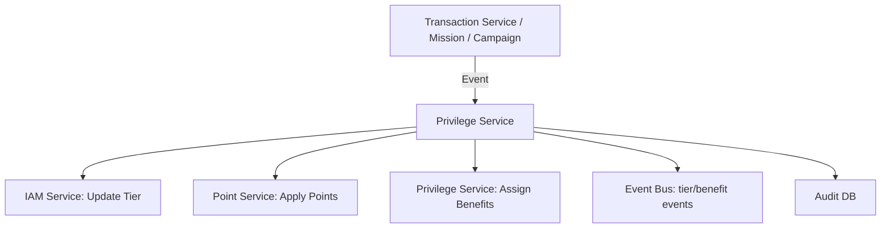

### 3.2 Tier Behavior & Lifecycle

- Dynamic Tier Creation
- Admin can create new tiers on the fly.
  - Define:
    - tier_name, rank, climbable, immutable, default_benefits
    - Accumulative spend thresholds, point thresholds
    - Allowed promotion/demotion rules
- Tier Progression
  - Automatic: Users accumulate points or complete tasks → system evaluates rules → upgrade/downgrade tier.
  - Manual / Invitation: Admin can assign tier directly or via invitation code.
  - Event Code Triggered: Specific promotions can push a member to a higher tier.
- Tier Restrictions
  - Immutable Tiers: Certain tiers cannot be changed.
  - Climbable Flag: Defines if tier can be promoted/demoted.
  - Promotion Window: Only valid during certain dates (campaign-specific).
- Benefit Mapping
  - Each tier maps to multiple benefits.
  - Benefits can have:
    - Quantity limits
    - Time-bound validity
    - Conditional logic (e.g., only apply if transaction > 1000 THB)

### 3.3 Admin Configuration Flow

- Admin accesses Portal / API.
- Can Create / Edit / Delete:
  - Tiers
  - Benefits
  - Promotion / Demotion Rules
- Simulation Engine:
  - Admin can simulate:
    - What tier a member would achieve given a set of transactions
    - Benefits eligibility
    - Points calculation
- Rule Validation:
  - Prevent conflicts (e.g., tier promotion loop, overlapping time modifiers)
  - Auto-check thresholds

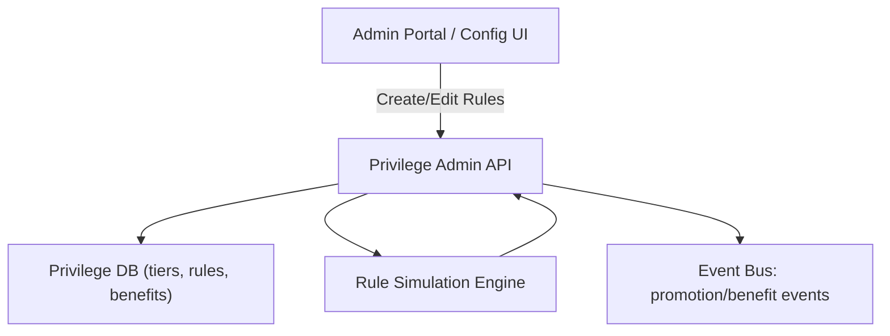

### 3.4 Point Conversion & Benefit Application Flow

1. Receive transaction/milestone event
2. Determine base points
3. Apply tier multiplier
4. Apply time/campaign modifier
5. Update Point Service
6. Evaluate benefit eligibility
7. Assign benefits or trigger notifications
8. Record audit

### 3.5 Event Propagation & Notification

- Event Bus publishes:
  - tier.changed
  - points.applied
  - benefit.assigned
- Subscribers (Notification Service, CRM, Frontend) update UI or send messages.
- Supports async retries and dead-letter queue for failed events.

### 3.6 Audit & Reconciliation

- Every tier change, benefit assignment, and point transaction is logged.
- Provides reconciliation jobs to verify:
  - Tier assignments
  - Points consistency
  - Benefit allocation
- Supports rollback for refunded/canceled transactions.

---

## 4. Key Responsibilities

| Responsibility                       | Description / How It Works                                                                                                                                                         |
| ------------------------------------ | ---------------------------------------------------------------------------------------------------------------------------------------------------------------------------------- |
| **Tier Management**                  | Create, update, delete tiers dynamically. Configure rank, climbable/immutable flags, thresholds, and default benefits. Automatically evaluates promotion/demotion based on rules.  |
| **Benefit Management**               | Define benefits (discounts, vouchers, priority support, point multipliers) and map them to tiers. Support time-bound and conditional application.                                  |
| **Promotion/Demotion Rules**         | Evaluate tier advancement or demotion based on accumulated spend, points, transaction count, event codes, invitations, or missions. Support campaign-based rules and time windows. |
| **Point Conversion & Multiplier**    | Convert transaction or event value into points using base rate, tier multiplier, and campaign/time modifiers. Send points to Point Service.                                        |
| **Event Handling & Integration**     | Subscribe to external events (Transaction, Mission, Campaign, IAM), emit internal events (`tier.changed`, `benefit.assigned`, `points.applied`) for downstream services.           |
| **Admin Configuration & Simulation** | Expose API/UI for admin to configure tiers, benefits, and rules. Includes simulation engine to validate changes before production.                                                 |
| **Audit & Compliance**               | Maintain full audit trail for tier changes, point assignment, and benefit allocation. Supports rollback for refunds/cancelled transactions.                                        |
| **Safety & Consistency**             | Ensure rule evaluation and point calculations are idempotent. Handle retries and dead-letter events to prevent data loss.                                                          |

---

## 5. Service Scope

**In-Scope:**

- Tier lifecycle management (create/update/delete tiers)
- Benefit catalog management and assignment
- Promotion/demotion rule evaluation
- Point conversion calculation
- Event-driven integration with IAM, Point, Campaign, Mission
- Admin API and simulation capabilities
- Audit logging and reconciliation jobs

**Out-of-Scope:**

- Actual storage of points ledger (managed by Point Service)
- Payment processing (handled by Transaction Service)
- Direct front-end UI (API only)
- User authentication (managed by IAM Service)

---

## 6. Non-Goals

- Not responsible for processing or storing raw financial transactions.  
- Does not manage loyalty point ledger persistence.  
- Not responsible for authentication or user identity management (delegated to IAM).  
- Will not provide front-end UI components (focus on API and event-driven backend).  
- Does not enforce business logic outside of tier, benefit, and point rules.  

---

## 7. Technology Stack (Initial Proposal)

| Component                | Technology / Recommendation           | Notes                                                                                |
| ------------------------ | ------------------------------------- | ------------------------------------------------------------------------------------ |
| **Language / Framework** | .NET Core (C#) or NestJS (TypeScript) | Chosen for scalability and microservice architecture                                 |
| **Database**             | PostgreSQL                            | Store tiers, rules, benefits, audit logs                                             |
| **Cache**                | Redis                                 | Cache frequently accessed tier/rule data for fast evaluation                         |
| **Message Queue**        | RabbitMQ / Kafka                      | Event-driven processing: transaction.completed, mission.completed, campaign.redeemed |
| **Token Management**     | JWT (RS256)                           | Secure API authentication for internal and admin calls                               |
| **Secret Management**    | KMS / Vault                           | Secure storage of credentials and API keys                                           |
| **Containerization**     | Docker + Kubernetes                   | Run microservices in isolated, scalable containers                                   |
| **CI/CD**                | GitHub Actions / GitLab CI            | Automated build, test, and deployment pipelines                                      |
| **Observability**        | Prometheus / Grafana / CloudWatch     | Metrics, logging, and alerting for service health                                    |

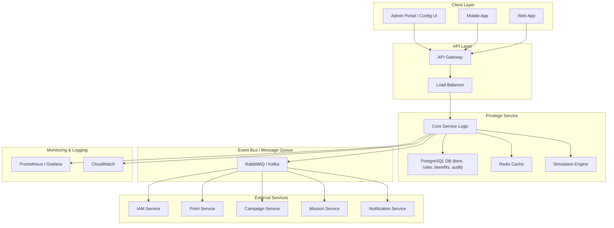

---

## 8. Success Metrics

| Metric                         | Target / Description                                                                    |
| ------------------------------ | --------------------------------------------------------------------------------------- |
| **Rule Evaluation Latency**    | < 200ms per request (real-time evaluation)                                              |
| **Point Calculation Accuracy** | 100% accuracy of points assigned based on configured rules                              |
| **Tier Assignment Accuracy**   | 100% of promotions/demotions correctly applied according to rules                       |
| **Event Delivery Reliability** | ≥ 99.9% successful event processing and delivery                                        |
| **Admin Config Rollout Time**  | Changes to tiers/rules effective within 5 minutes of saving configuration               |
| **Availability**               | ≥ 99.9% uptime                                                                          |
| **Audit Coverage**             | All tier changes, benefit applications, and point calculations are logged and traceable |
| **Security Compliance**        | All internal and admin API endpoints follow OWASP standards and JWT-based auth          |

---

## 9. Ubiquitous Language

This section defines all key terms used in the **Privilege Service**.  
It provides a shared vocabulary for **BA, SA, DEV, and Business Stakeholders**.

| Term                         | Meaning / Definition                                                         | Description / Notes                                                                                             |
| ---------------------------- | ---------------------------------------------------------------------------- | --------------------------------------------------------------------------------------------------------------- |
| **Tier**                     | Membership level assigned to a user (Silver, Gold, Platinum, Diamond)        | Determines benefits, point multipliers, promotion/demotion rules, and privilege access                          |
| **Benefit**                  | Reward or privilege assigned to a user based on tier                         | Examples: discount, voucher, free shipping, priority support, campaign/event access, cashback, point multiplier |
| **Promotion Rule**           | Logic that decides how a user advances to a higher tier                      | Evaluates spend, points, transactions, mission/campaign completion, event codes, invitation                     |
| **Demotion Rule**            | Logic that decides how a user is downgraded                                  | Evaluates inactivity, rule violations, or business policy triggers                                              |
| **Time-bound Modifier**      | Adjustment to points or benefits during a specific time frame                | Examples: X2 points during promotion, limited-time discount benefits                                            |
| **Invitation**               | Admin-initiated promotion to a higher tier                                   | Can override normal progression, respecting immutable flags if applicable                                       |
| **Event Code**               | Special code that triggers a tier change or benefit assignment               | Can be single-use or multi-use, tied to campaigns or promotions                                                 |
| **Point Conversion Rule**    | Formula to calculate points from transaction or event                        | Includes base rate, tier multiplier, time/campaign modifier, and caps                                           |
| **Promotion Event**          | Event emitted when a member tier changes                                     | Triggers downstream updates to Point, Notification, and IAM services                                            |
| **Benefit Assignment Event** | Event emitted when a benefit is applied                                      | Enables other services to update UI or notify users                                                             |
| **Simulation**               | Tool to preview rule impact on member without applying changes               | Used by Admin to validate tiers, points, benefits, and promotions                                               |
| **Immutable Tier**           | Tier that cannot be automatically promoted or demoted                        | Only manual/admin assignment allowed                                                                            |
| **Climbable Tier**           | Tier that can be promoted or demoted automatically                           | Evaluated via Promotion/Demotion Rules                                                                          |
| **Promotion Window**         | Timeframe during which promotions or campaigns are valid                     | Helps enforce campaign-specific tier/benefit rules                                                              |
| **Audit Log**                | Complete record of tier changes, point assignments, and benefit applications | Required for compliance, rollback, and reconciliation                                                           |
| **Tier Multiplier**          | Factor applied to base points based on tier                                  | Example: Gold tier gets 1.2x points                                                                             |
| **Benefit Constraint**       | Rules restricting benefit application                                        | Examples: minimum spend, frequency limits, campaign eligibility                                                 |
| **Event Metadata**           | Data passed with an event (transaction, mission, campaign, invitation)       | Includes user_id, amount, timestamp, campaign_id, payment_method, etc.                                          |
| **Admin Role**               | User or service with permissions to configure tiers, benefits, and rules     | Can create/edit/delete and run simulations                                                                      |
| **Event Bus**                | Messaging system for asynchronous communication                              | Publishes tier, point, and benefit events to subscribers                                                        |
| **Dead Letter Queue (DLQ)**  | Queue for failed event processing                                            | Ensures reliability and traceability                                                                            |
| **Reconciliation Job**       | Background process that verifies tier, points, and benefit consistency       | Detects mismatches and supports rollback                                                                        |
| **Rollback**                 | Reversion of points, tier, or benefit due to refund/cancellation             | Must be recorded in audit logs                                                                                  |
| **Transaction Event**        | Event representing a completed payment                                       | Used to calculate points and evaluate promotion rules                                                           |
| **Mission Event**            | Event representing completion of a mission or task                           | Can trigger points, tier promotion, or benefit eligibility                                                      |
| **Campaign Event**           | Event representing participation or redemption in a campaign                 | Can trigger point multipliers or tier upgrades                                                                  |
| **Event Code Redemption**    | Event when a user redeems a special code                                     | Can promote tier or assign benefit                                                                              |
| **MemberTierAssignment**     | Database entity linking user to current tier                                 | Includes reason, source event, and timestamp                                                                    |
| **BenefitMapping**           | Mapping between tiers and their assigned benefits                            | Defines which benefits apply to which tier                                                                      |
| **PointLedger**              | Record of points assigned to users                                           | Typically stored in Point Service, referenced by Privilege Service                                              |
| **Admin Simulation**         | Admin tool to test scenarios before applying rules                           | Validates tier progression, benefits, and points calculations                                                   |
| **Climbing Threshold**       | Required spend, points, or transactions to move to a higher tier             | Can be cumulative or time-limited                                                                               |
| **Demotion Threshold**       | Conditions that trigger automatic tier downgrade                             | May depend on inactivity or rule violation                                                                      |
| **Rule Priority**            | Order of evaluation when multiple rules could apply                          | Higher priority rules evaluated first                                                                           |
| **Tier Effective Dates**     | Dates when tier or rules become active                                       | Supports campaign-specific or seasonal tiers                                                                    |
| **Notification Event**       | Message sent to users or systems regarding tier, benefit, or points changes  | Can be email, push, or internal system                                                                          |

## 10. Domain

### 10.1. Setup / Admin CRUD Use Cases

- **Entities:**
  - Tier
  - Benefit
  - PromotionRule
  - PointConversionRule
  - EventCode

- **Use Cases:**
  - **Tier CRUD**
    - **Command:** CreateTierCommand / UpdateTierCommand / DeleteTierCommand
    - **CommandHandler:** Validates attributes, persists changes, updates simulation engine, emits tier.created/updated/deleted events
    - **Query:** GetTierQuery / ListTiersQuery
    - **QueryHandler:** Returns tier details
  - **Benefit CRUD**
    - **Command:** CreateBenefitCommand / UpdateBenefitCommand / DeleteBenefitCommand
    - **CommandHandler:** Persist benefit definition, validate constraints, emit events
    - **Query:** GetBenefitQuery / ListBenefitsQuery
    - **QueryHandler:** Return benefit info
  - **PromotionRule CRUD**
    - **Command:** CreatePromotionRuleCommand / UpdatePromotionRuleCommand / DeletePromotionRuleCommand
    - **CommandHandler:** Persist rule, validate logic, emit events
    - **Query:** GetPromotionRuleQuery / ListPromotionRulesQuery
    - **QueryHandler:** Return rules
  - **PointConversionRule CRUD**
    - **Command:** CreatePointConversionRuleCommand / UpdatePointConversionRuleCommand / DeletePointConversionRuleCommand
    - **CommandHandler:** Persist conversion rules, emit events
    - **Query:** GetPointConversionRuleQuery / ListPointConversionRulesQuery
    - **QueryHandler:** Return rules
  - **EventCode CRUD**
    - **Command:** CreateEventCodeCommand / UpdateEventCodeCommand / DeleteEventCodeCommand
    - **CommandHandler:** Validate, persist, emit events
    - **Query:** GetEventCodeQuery / ListEventCodesQuery
    - **QueryHandler:** Return event code info

---

### 10.2. Member Event Handling

- **Entities:**
  - MemberTierAssignment
  - PointTransaction
  - EventBusMessage

- **Use Cases:**
  - **Transaction / Mission / Campaign Event**
    - Command: EvaluateMemberEventCommand
    - CommandHandler: Fetch member profile, evaluate promotion/demotion rules, calculate points, assign benefits, emit events, log audit
    - Query: GetMemberTierQuery, GetMemberPointsQuery, GetMemberBenefitsQuery
    - QueryHandler: Return current member state
  - **Event Code Redemption**
    - Command: RedeemEventCodeCommand
    - CommandHandler: Apply tier/benefit, emit events, log audit
    - Query: GetRedeemedEventCodeQuery
    - QueryHandler: Return code redemption status
  - **Admin Invitation**
    - Command: InviteToTierCommand
    - CommandHandler: Assign tier via invitation, emit events, log audit
    - Query: GetPendingInvitationsQuery
    - QueryHandler: Return pending invitations

---

### 10.3. Tier Evaluation

- **Entities:**
  - Tier
  - PromotionRule
  - MemberTierAssignment

- **Use Cases:**
  - **Automatic Tier Promotion**
    - Command: EvaluatePromotionCommand
    - CommandHandler: Apply thresholds, climbable logic, campaign window, assign tier, emit tier.changed, log audit
    - Query: GetMemberTierQuery
    - QueryHandler: Return tier info
  - **Automatic Tier Demotion**
    - Command: EvaluateDemotionCommand
    - CommandHandler: Check inactivity/rule violations, assign lower tier, emit events, log audit
    - Query: GetDemotionEligibilityQuery
    - QueryHandler: Return demotion eligibility

---

### 10.4. Points & Benefit Management

- **Entities:**
  - PointConversionRule
  - PointTransaction
  - Benefit
  - TierBenefitMapping

- **Use Cases:**
  - **Calculate Points**
    - Command: CalculatePointsCommand
    - CommandHandler: Apply base rate, tier multiplier, time/campaign modifiers, update Point Service, emit points.applied, log audit
    - Query: GetMemberPointsQuery
    - QueryHandler: Return total points
  - **Assign Benefits**
    - Command: ApplyBenefitCommand
    - CommandHandler: Evaluate tier & rules, assign benefits, emit benefit.assigned, log audit
    - Query: GetMemberBenefitsQuery
    - QueryHandler: Return active benefits

---

### 10.5. Event & Notification

- **Entities:**
  - EventBusMessage
  - Notification

- **Use Cases:**
  - **Publish Events**
    - Command: PublishEventCommand
    - CommandHandler: Format and send event messages to Event Bus
    - Query: GetPublishedEventsQuery
    - QueryHandler: Return event history
  - **Send Notifications**
    - Command: SendNotificationCommand
    - CommandHandler: Format and send notifications via email, push, in-app
    - Query: GetNotificationStatusQuery
    - QueryHandler: Return delivery status

---

### 10.6. Simulation & Audit

- **Entities:**
  - SimulationResult
  - PromotionAudit

- **Use Cases:**
  - **Simulate Member Impact**
    - Query: SimulateMemberImpactQuery
    - QueryHandler: Return predicted tier, points, and benefits
  - **Record Audit**
    - Command: CreateAuditEntryCommand
    - CommandHandler: Persist audit logs for all changes
  - **Reconciliation Job**
    - Command: RunReconciliationJobCommand
    - CommandHandler: Verify consistency of tier, points, benefits, support rollback

---

### 10.7. Rollback / Reversal

- **Entities:**
  - MemberTierAssignment
  - PointTransaction
  - PromotionAudit

- **Use Cases:**
  - **Rollback Tier / Points / Benefits**
    - Command: RevertPromotionCommand / RevertPointsCommand / RevokeBenefitCommand
    - CommandHandler: Revert tier, points, benefits, emit rollback events, log audit
    - Query: GetRollbackHistoryQuery
    - QueryHandler: Return rollback history

---

## 11. API Endpoints

### 11.1. Tier Management (CRUD)

| Endpoint                     | Method | Command / Query         | Description                         |
| ---------------------------- | ------ | ----------------------- | ----------------------------------- |
| /api/tiers                   | POST   | CreateTierCommand       | Create a new membership tier        |
| /api/tiers/{tierId}          | GET    | GetTierQuery            | Retrieve details of a specific tier |
| /api/tiers                   | GET    | ListTiersQuery          | List all tiers                      |
| /api/tiers/{tierId}          | PUT    | UpdateTierCommand       | Update attributes of a tier         |
| /api/tiers/{tierId}          | DELETE | DeleteTierCommand       | Delete a tier                       |
| /api/members/{memberId}/tier | POST   | AssignTierCommand       | Assign a tier to a member           |
| /api/members/{memberId}/tier | PUT    | UpdateMemberTierCommand | Update member tier                  |
| /api/members/{memberId}/tier | DELETE | RemoveMemberTierCommand | Remove member tier                  |
| /api/members/{memberId}/tier | GET    | GetMemberTierQuery      | Get current tier of a member        |

#### /api/tiers (POST)

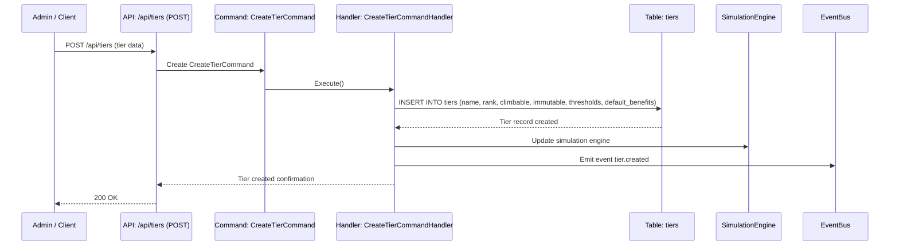

#### /api/tiers/{tierId} (GET)

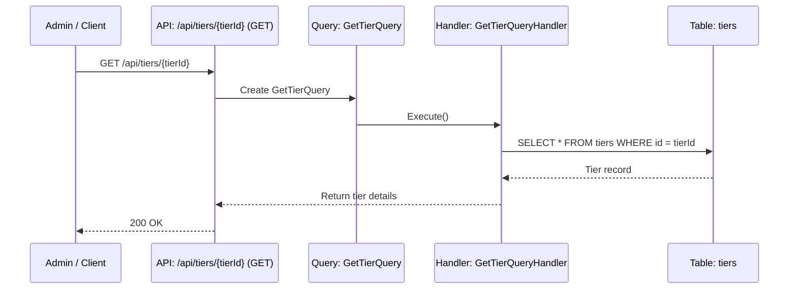

#### /api/tiers (GET)

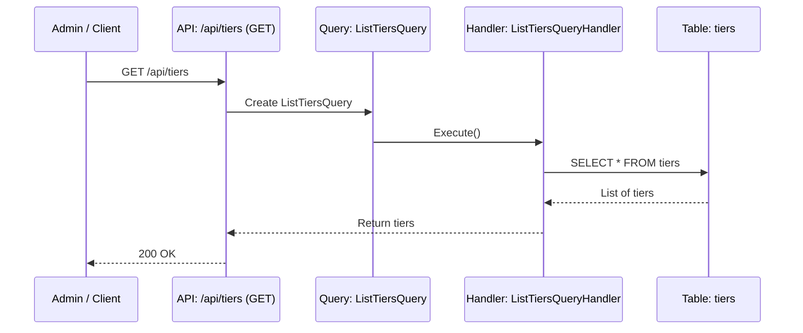

#### /api/tiers/{tierId} (PUT)

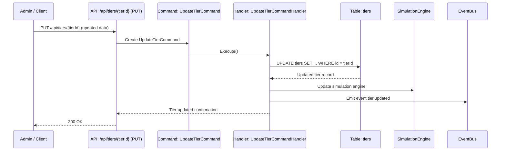

#### /api/tiers/{tierId} (DELETE)

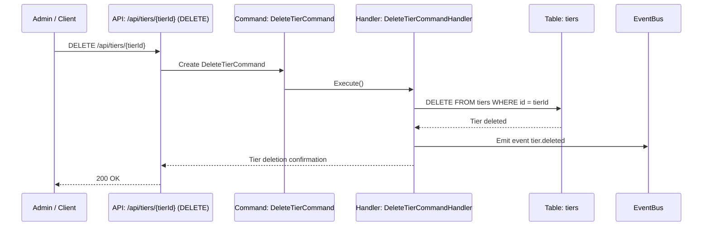

#### /api/members/{memberId}/tier (POST)

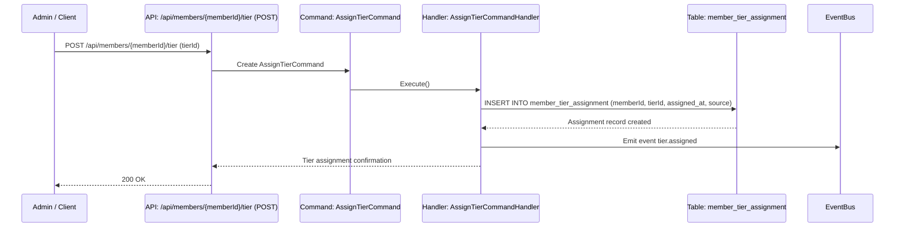

#### /api/members/{memberId}/tier (PUT)

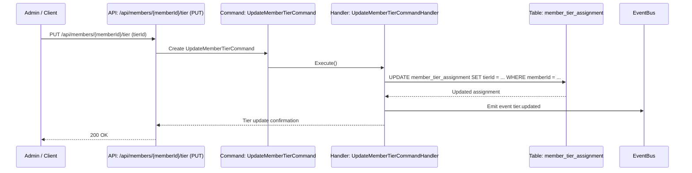

#### /api/members/{memberId}/tier (DELETE)

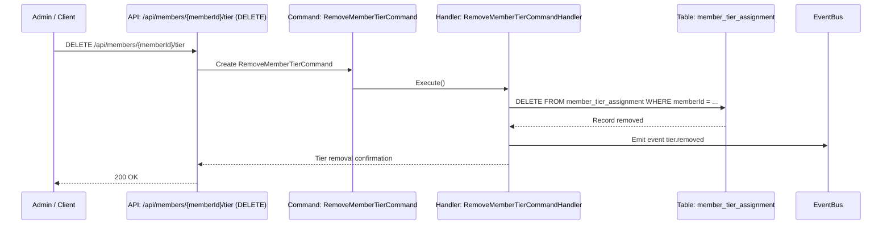

#### /api/members/{memberId}/tier (GET)

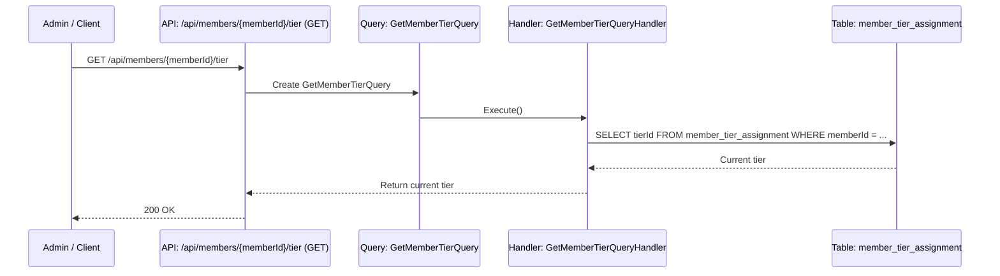

### 11.2. Benefit Management (CRUD & Mapping)

| Endpoint                          | Method | Command / Query             | Description                          |
| --------------------------------- | ------ | --------------------------- | ------------------------------------ |
| /api/benefits                     | POST   | CreateBenefitCommand        | Create a new benefit                 |
| /api/benefits/{benefitId}         | GET    | GetBenefitQuery             | Retrieve benefit details             |
| /api/benefits                     | GET    | ListBenefitsQuery           | List all benefits                    |
| /api/benefits/{benefitId}         | PUT    | UpdateBenefitCommand        | Update benefit attributes            |
| /api/benefits/{benefitId}         | DELETE | DeleteBenefitCommand        | Delete a benefit                     |
| /api/tiers/{tierId}/benefits      | POST   | MapBenefitToTierCommand     | Map a benefit to a tier              |
| /api/tiers/{tierId}/benefits/{id} | DELETE | UnmapBenefitFromTierCommand | Remove benefit mapping from tier     |
| /api/members/{memberId}/benefits  | GET    | GetMemberBenefitsQuery      | Get all active benefits for a member |

#### /api/benefits (POST)

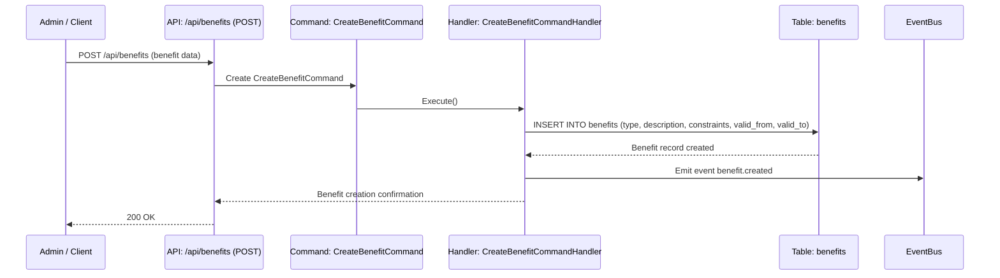

#### /api/benefits/{benefitId} (GET)

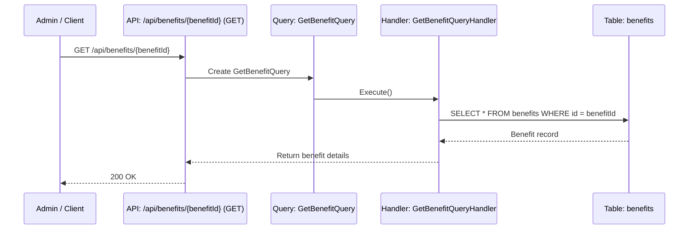

#### /api/benefits (GET)

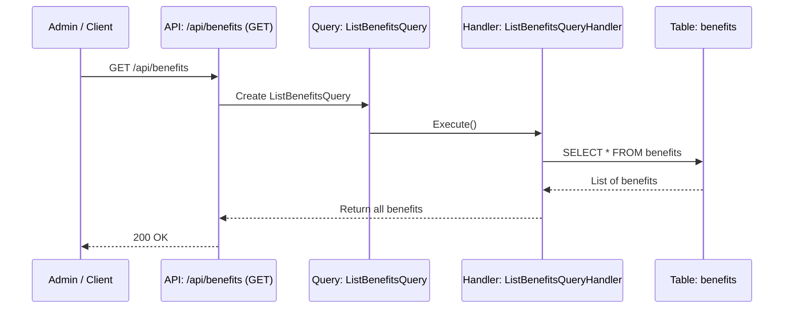

#### /api/benefits/{benefitId} (PUT)

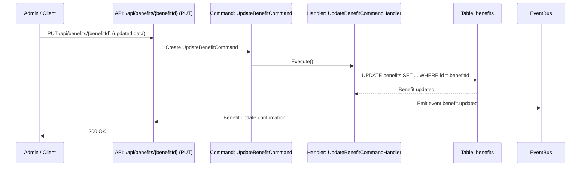

#### /api/benefits/{benefitId} (DELETE)

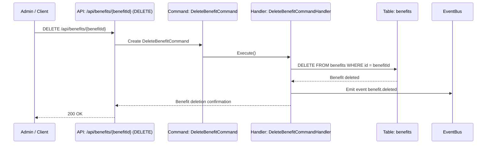

#### /api/tiers/{tierId}/benefits (POST)

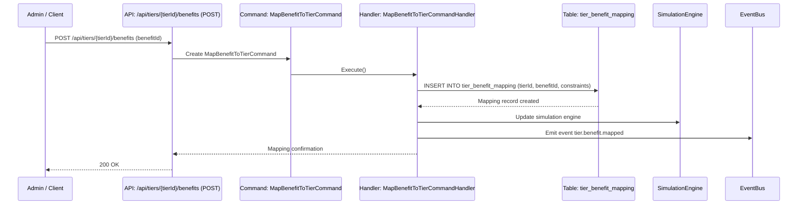

#### /api/tiers/{tierId}/benefits/{id} (DELETE)

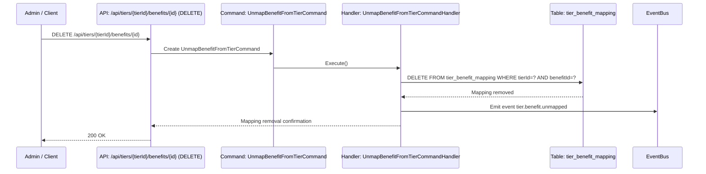

#### /api/members/{memberId}/benefits (GET)

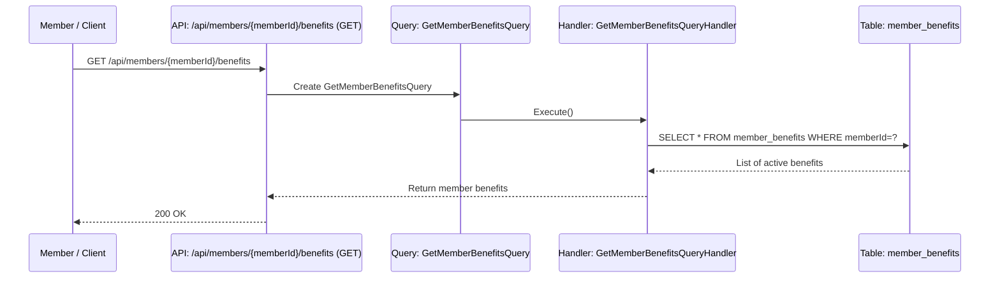

### 11.3. Promotion Rule Management (CRUD)

| Endpoint                      | Method | Command / Query            | Description                          |
| ----------------------------- | ------ | -------------------------- | ------------------------------------ |
| /api/promotion-rules          | POST   | CreatePromotionRuleCommand | Create a new promotion/demotion rule |
| /api/promotion-rules/{ruleId} | GET    | GetPromotionRuleQuery      | Retrieve rule details                |
| /api/promotion-rules          | GET    | ListPromotionRulesQuery    | List all promotion/demotion rules    |
| /api/promotion-rules/{ruleId} | PUT    | UpdatePromotionRuleCommand | Update rule attributes               |
| /api/promotion-rules/{ruleId} | DELETE | DeletePromotionRuleCommand | Delete a promotion/demotion rule     |

### /api/promotion-rules (POST)

```mermaid
sequenceDiagram
    participant Admin as Admin / Client
    participant API as API: /api/promotion-rules (POST)
    participant CMD as Command: CreatePromotionRuleCommand
    participant H as Handler: CreatePromotionRuleCommandHandler
    participant DB as Table: promotion_rules
    participant SIM as SimulationEngine
    participant EB as EventBus

    Admin->>API: POST /api/promotion-rules (rule data)
    API->>CMD: Create CreatePromotionRuleCommand
    CMD->>H: Execute()
    H->>DB: INSERT INTO promotion_rules (name, conditions, actions, priority, effective_from, effective_to)
    DB-->>H: Rule record created
    H->>SIM: Update simulation engine
    H->>EB: Emit event promotionRule.created
    H-->>API: Rule creation confirmation
    API-->>Admin: 200 OK
```

### /api/promotion-rules/{ruleId} (GET)

```mermaid
sequenceDiagram
    participant Admin as Admin / Client
    participant API as API: /api/promotion-rules/{ruleId} (GET)
    participant Q as Query: GetPromotionRuleQuery
    participant H as Handler: GetPromotionRuleQueryHandler
    participant DB as Table: promotion_rules

    Admin->>API: GET /api/promotion-rules/{ruleId}
    API->>Q: Create GetPromotionRuleQuery
    Q->>H: Execute()
    H->>DB: SELECT * FROM promotion_rules WHERE id = ruleId
    DB-->>H: Rule record
    H-->>API: Return rule details
    API-->>Admin: 200 OK
```

### /api/promotion-rules (GET)

```mermaid
sequenceDiagram
    participant Admin as Admin / Client
    participant API as API: /api/promotion-rules (GET)
    participant Q as Query: ListPromotionRulesQuery
    participant H as Handler: ListPromotionRulesQueryHandler
    participant DB as Table: promotion_rules

    Admin->>API: GET /api/promotion-rules
    API->>Q: Create ListPromotionRulesQuery
    Q->>H: Execute()
    H->>DB: SELECT * FROM promotion_rules
    DB-->>H: List of rules
    H-->>API: Return promotion rules
    API-->>Admin: 200 OK
```

### /api/promotion-rules/{ruleId} (PUT)

```mermaid
sequenceDiagram
    participant Admin as Admin / Client
    participant API as API: /api/promotion-rules/{ruleId} (PUT)
    participant CMD as Command: UpdatePromotionRuleCommand
    participant H as Handler: UpdatePromotionRuleCommandHandler
    participant DB as Table: promotion_rules
    participant SIM as SimulationEngine
    participant EB as EventBus

    Admin->>API: PUT /api/promotion-rules/{ruleId} (updated data)
    API->>CMD: Create UpdatePromotionRuleCommand
    CMD->>H: Execute()
    H->>DB: UPDATE promotion_rules SET ... WHERE id = ruleId
    DB-->>H: Rule updated
    H->>SIM: Update simulation engine
    H->>EB: Emit event promotionRule.updated
    H-->>API: Rule update confirmation
    API-->>Admin: 200 OK
```

### /api/promotion-rules/{ruleId} (DELETE)

```mermaid
sequenceDiagram
    participant Admin as Admin / Client
    participant API as API: /api/promotion-rules/{ruleId} (DELETE)
    participant CMD as Command: DeletePromotionRuleCommand
    participant H as Handler: DeletePromotionRuleCommandHandler
    participant DB as Table: promotion_rules
    participant EB as EventBus

    Admin->>API: DELETE /api/promotion-rules/{ruleId}
    API->>CMD: Create DeletePromotionRuleCommand
    CMD->>H: Execute()
    H->>DB: DELETE FROM promotion_rules WHERE id = ruleId
    DB-->>H: Rule deleted
    H->>EB: Emit event promotionRule.deleted
    H-->>API: Rule deletion confirmation
    API-->>Admin: 200 OK
```

### 11.4. Point Conversion Rule Management (CRUD)

| Endpoint                             | Method | Command / Query                  | Description                        |
| ------------------------------------ | ------ | -------------------------------- | ---------------------------------- |
| /api/point-conversion-rules          | POST   | CreatePointConversionRuleCommand | Create a new point conversion rule |
| /api/point-conversion-rules/{ruleId} | GET    | GetPointConversionRuleQuery      | Retrieve a point conversion rule   |
| /api/point-conversion-rules          | GET    | ListPointConversionRulesQuery    | List all point conversion rules    |
| /api/point-conversion-rules/{ruleId} | PUT    | UpdatePointConversionRuleCommand | Update a point conversion rule     |
| /api/point-conversion-rules/{ruleId} | DELETE | DeletePointConversionRuleCommand | Delete a point conversion rule     |

#### /api/point-conversion-rules (POST)

```mermaid
sequenceDiagram
    participant Admin as Admin / Client
    participant API as API: /api/point-conversion-rules (POST)
    participant CMD as Command: CreatePointConversionRuleCommand
    participant H as Handler: CreatePointConversionRuleCommandHandler
    participant DB as Table: point_conversion_rules
    participant SIM as SimulationEngine
    participant EB as EventBus

    Admin->>API: POST /api/point-conversion-rules (rule data)
    API->>CMD: Create CreatePointConversionRuleCommand
    CMD->>H: Execute()
    H->>DB: INSERT INTO point_conversion_rules (base_amount, base_point, tier_modifier, time_modifiers, campaign_modifier)
    DB-->>H: Rule record created
    H->>SIM: Update simulation engine
    H->>EB: Emit event pointConversionRule.created
    H-->>API: Rule creation confirmation
    API-->>Admin: 200 OK
```

#### /api/point-conversion-rules/{ruleId} (GET)

```mermaid
sequenceDiagram
    participant Admin as Admin / Client
    participant API as API: /api/point-conversion-rules/{ruleId} (GET)
    participant Q as Query: GetPointConversionRuleQuery
    participant H as Handler: GetPointConversionRuleQueryHandler
    participant DB as Table: point_conversion_rules

    Admin->>API: GET /api/point-conversion-rules/{ruleId}
    API->>Q: Create GetPointConversionRuleQuery
    Q->>H: Execute()
    H->>DB: SELECT * FROM point_conversion_rules WHERE id = ruleId
    DB-->>H: Rule record
    H-->>API: Return point conversion rule details
    API-->>Admin: 200 OK
```

#### /api/point-conversion-rules (GET)

```mermaid
sequenceDiagram
    participant Admin as Admin / Client
    participant API as API: /api/point-conversion-rules (GET)
    participant Q as Query: ListPointConversionRulesQuery
    participant H as Handler: ListPointConversionRulesQueryHandler
    participant DB as Table: point_conversion_rules

    Admin->>API: GET /api/point-conversion-rules
    API->>Q: Create ListPointConversionRulesQuery
    Q->>H: Execute()
    H->>DB: SELECT * FROM point_conversion_rules
    DB-->>H: List of point conversion rules
    H-->>API: Return rules
    API-->>Admin: 200 OK
```

#### /api/point-conversion-rules/{ruleId} (PUT)

```mermaid
sequenceDiagram
    participant Admin as Admin / Client
    participant API as API: /api/point-conversion-rules/{ruleId} (PUT)
    participant CMD as Command: UpdatePointConversionRuleCommand
    participant H as Handler: UpdatePointConversionRuleCommandHandler
    participant DB as Table: point_conversion_rules
    participant SIM as SimulationEngine
    participant EB as EventBus

    Admin->>API: PUT /api/point-conversion-rules/{ruleId} (updated data)
    API->>CMD: Create UpdatePointConversionRuleCommand
    CMD->>H: Execute()
    H->>DB: UPDATE point_conversion_rules SET ... WHERE id = ruleId
    DB-->>H: Rule updated
    H->>SIM: Update simulation engine
    H->>EB: Emit event pointConversionRule.updated
    H-->>API: Rule update confirmation
    API-->>Admin: 200 OK
```

#### /api/point-conversion-rules/{ruleId} (DELETE)

```mermaid
sequenceDiagram
    participant Admin as Admin / Client
    participant API as API: /api/point-conversion-rules/{ruleId} (DELETE)
    participant CMD as Command: DeletePointConversionRuleCommand
    participant H as Handler: DeletePointConversionRuleCommandHandler
    participant DB as Table: point_conversion_rules
    participant EB as EventBus

    Admin->>API: DELETE /api/point-conversion-rules/{ruleId}
    API->>CMD: Create DeletePointConversionRuleCommand
    CMD->>H: Execute()
    H->>DB: DELETE FROM point_conversion_rules WHERE id = ruleId
    DB-->>H: Rule deleted
    H->>EB: Emit event pointConversionRule.deleted
    H-->>API: Rule deletion confirmation
    API-->>Admin: 200 OK
```

### 11.5. Event Code Management (CRUD)

| Endpoint                            | Method | Command / Query        | Description                   |
| ----------------------------------- | ------ | ---------------------- | ----------------------------- |
| /api/event-codes                    | POST   | CreateEventCodeCommand | Create a new event code       |
| /api/event-codes/{codeId}           | GET    | GetEventCodeQuery      | Retrieve event code details   |
| /api/event-codes                    | GET    | ListEventCodesQuery    | List all event codes          |
| /api/event-codes/{codeId}           | PUT    | UpdateEventCodeCommand | Update an existing event code |
| /api/event-codes/{codeId}           | DELETE | DeleteEventCodeCommand | Delete an event code          |
| /api/members/{memberId}/redeem-code | POST   | RedeemEventCodeCommand | Member redeems an event code  |

#### /api/event-codes (POST)

```mermaid
sequenceDiagram
    participant Admin as Admin / Client
    participant API as API: /api/event-codes (POST)
    participant CMD as Command: CreateEventCodeCommand
    participant H as Handler: CreateEventCodeCommandHandler
    participant DB as Table: event_codes
    participant EB as EventBus

    Admin->>API: POST /api/event-codes (code data)
    API->>CMD: Create CreateEventCodeCommand
    CMD->>H: Execute()
    H->>DB: INSERT INTO event_codes (code, action, single_use, expires_at)
    DB-->>H: Event code record created
    H->>EB: Emit event eventCode.created
    H-->>API: Event code creation confirmation
    API-->>Admin: 200 OK
```

#### /api/event-codes/{codeId} (GET)

```mermaid
sequenceDiagram
    participant Admin as Admin / Client
    participant API as API: /api/event-codes/{codeId} (GET)
    participant Q as Query: GetEventCodeQuery
    participant H as Handler: GetEventCodeQueryHandler
    participant DB as Table: event_codes

    Admin->>API: GET /api/event-codes/{codeId}
    API->>Q: Create GetEventCodeQuery
    Q->>H: Execute()
    H->>DB: SELECT * FROM event_codes WHERE id = codeId
    DB-->>H: Event code record
    H-->>API: Return event code details
    API-->>Admin: 200 OK
```

#### /api/event-codes (GET)

```mermaid
sequenceDiagram
    participant Admin as Admin / Client
    participant API as API: /api/event-codes (GET)
    participant Q as Query: ListEventCodesQuery
    participant H as Handler: ListEventCodesQueryHandler
    participant DB as Table: event_codes

    Admin->>API: GET /api/event-codes
    API->>Q: Create ListEventCodesQuery
    Q->>H: Execute()
    H->>DB: SELECT * FROM event_codes
    DB-->>H: List of event codes
    H-->>API: Return event codes
    API-->>Admin: 200 OK
```

#### /api/event-codes/{codeId} (PUT)

```mermaid
sequenceDiagram
    participant Admin as Admin / Client
    participant API as API: /api/event-codes/{codeId} (PUT)
    participant CMD as Command: UpdateEventCodeCommand
    participant H as Handler: UpdateEventCodeCommandHandler
    participant DB as Table: event_codes
    participant EB as EventBus

    Admin->>API: PUT /api/event-codes/{codeId} (updated data)
    API->>CMD: Create UpdateEventCodeCommand
    CMD->>H: Execute()
    H->>DB: UPDATE event_codes SET ... WHERE id = codeId
    DB-->>H: Event code updated
    H->>EB: Emit event eventCode.updated
    H-->>API: Event code update confirmation
    API-->>Admin: 200 OK
```

#### /api/event-codes/{codeId} (DELETE)

```mermaid
sequenceDiagram
    participant Admin as Admin / Client
    participant API as API: /api/event-codes/{codeId} (DELETE)
    participant CMD as Command: DeleteEventCodeCommand
    participant H as Handler: DeleteEventCodeCommandHandler
    participant DB as Table: event_codes
    participant EB as EventBus

    Admin->>API: DELETE /api/event-codes/{codeId}
    API->>CMD: Create DeleteEventCodeCommand
    CMD->>H: Execute()
    H->>DB: DELETE FROM event_codes WHERE id = codeId
    DB-->>H: Event code deleted
    H->>EB: Emit event eventCode.deleted
    H-->>API: Event code deletion confirmation
    API-->>Admin: 200 OK
```

#### /api/members/{memberId}/redeem-code (POST)

```mermaid
sequenceDiagram
    participant Member as Member / Client
    participant API as API: /api/members/{memberId}/redeem-code (POST)
    participant CMD as Command: RedeemEventCodeCommand
    participant H as Handler: RedeemEventCodeCommandHandler
    participant DB1 as Table: event_codes
    participant DB2 as Table: member_tier_assignment
    participant DB3 as Table: member_benefits
    participant EB as EventBus

    Member->>API: POST /api/members/{memberId}/redeem-code (code)
    API->>CMD: Create RedeemEventCodeCommand
    CMD->>H: Execute()

    H->>DB1: SELECT * FROM event_codes WHERE code = ?
    DB1-->>H: Event code record
    H->>DB2: Evaluate tier changes (if applicable)
    DB2-->>H: Tier updated if needed
    H->>DB3: Apply benefits to member
    DB3-->>H: Benefits assigned
    H->>EB: Emit events (tier.changed, benefit.assigned)
    H-->>API: Redemption confirmation
    API-->>Member: 200 OK
```

### 11.6. Member Event & Tier Evaluation

| Endpoint                              | Method | Command / Query            | Description                                |
| ------------------------------------- | ------ | -------------------------- | ------------------------------------------ |
| /api/members/{memberId}/events        | POST   | EvaluateMemberEventCommand | Process transaction/mission/campaign event |
| /api/members/{memberId}/tier/evaluate | POST   | EvaluatePromotionCommand   | Evaluate tier promotion eligibility        |
| /api/members/{memberId}/tier/demotion | POST   | EvaluateDemotionCommand    | Evaluate tier demotion eligibility         |

#### /api/members/{memberId}/events (POST)

```mermaid
sequenceDiagram
    participant Member as Member / Client
    participant API as API: /api/members/{memberId}/events (POST)
    participant CMD as Command: EvaluateMemberEventCommand
    participant H as Handler: EvaluateMemberEventCommandHandler
    participant DB1 as Table: member_profile
    participant DB2 as Table: member_tier_assignment
    participant DB3 as Table: point_transactions
    participant DB4 as Table: member_benefits
    participant EB as EventBus

    Member->>API: POST /api/members/{memberId}/events (event data)
    API->>CMD: Create EvaluateMemberEventCommand
    CMD->>H: Execute()
    H->>DB1: Fetch member profile and current tier
    DB1-->>H: Member data
    H->>DB2: Evaluate promotion/demotion rules
    DB2-->>H: Tier updated if eligible
    H->>DB3: Calculate points and insert/update transactions
    DB3-->>H: Points updated
    H->>DB4: Assign benefits based on tier/rules
    DB4-->>H: Benefits applied
    H->>EB: Emit events (tier.changed, points.applied, benefit.assigned)
    H-->>API: Event processing confirmation
    API-->>Member: 200 OK
```

#### /api/members/{memberId}/tier/evaluate (POST)

```mermaid
sequenceDiagram
    participant Admin as Admin / Client
    participant API as API: /api/members/{memberId}/tier/evaluate
    participant CMD as Command: EvaluatePromotionCommand
    participant H as Handler: EvaluatePromotionCommandHandler
    participant DB as Table: member_tier_assignment
    participant RULES as Table: promotion_rules
    participant EB as EventBus

    Admin->>API: POST /api/members/{memberId}/tier/evaluate
    API->>CMD: Create EvaluatePromotionCommand
    CMD->>H: Execute()
    H->>DB: Fetch current tier of member
    H->>RULES: Fetch promotion rules
    RULES-->>H: Rules data
    H->>DB: Update member tier if promotion conditions met
    DB-->>H: Tier updated
    H->>EB: Emit event tier.promoted
    H-->>API: Promotion evaluation confirmation
    API-->>Admin: 200 OK
```

#### /api/members/{memberId}/tier/demotion (POST)

```mermaid
sequenceDiagram
    participant Admin as Admin / Client
    participant API as API: /api/members/{memberId}/tier/demotion
    participant CMD as Command: EvaluateDemotionCommand
    participant H as Handler: EvaluateDemotionCommandHandler
    participant DB as Table: member_tier_assignment
    participant RULES as Table: promotion_rules
    participant EB as EventBus

    Admin->>API: POST /api/members/{memberId}/tier/demotion
    API->>CMD: Create EvaluateDemotionCommand
    CMD->>H: Execute()
    H->>DB: Fetch current tier of member
    H->>RULES: Fetch demotion rules
    RULES-->>H: Rules data
    H->>DB: Update member tier if demotion conditions met
    DB-->>H: Tier updated
    H->>EB: Emit event tier.demoted
    H-->>API: Demotion evaluation confirmation
    API-->>Admin: 200 OK
```

### 11.7. Points & Benefit Application

| Endpoint                                 | Method | Command / Query        | Description                         |
| ---------------------------------------- | ------ | ---------------------- | ----------------------------------- |
| /api/members/{memberId}/points/calculate | POST   | CalculatePointsCommand | Calculate points for a member       |
| /api/members/{memberId}/benefits/apply   | POST   | ApplyBenefitCommand    | Assign benefits based on tier/rules |

#### /api/members/{memberId}/points/calculate (POST)

```mermaid
sequenceDiagram
    participant Member as Member / Client
    participant API as API: /api/members/{memberId}/points/calculate
    participant CMD as Command: CalculatePointsCommand
    participant H as Handler: CalculatePointsCommandHandler
    participant DB1 as Table: member_profile
    participant DB2 as Table: point_conversion_rules
    participant DB3 as Table: point_transactions
    participant EB as EventBus

    Member->>API: POST /api/members/{memberId}/points/calculate (transaction data)
    API->>CMD: Create CalculatePointsCommand
    CMD->>H: Execute()
    H->>DB1: Fetch member profile and current tier
    DB1-->>H: Member data
    H->>DB2: Fetch applicable point conversion rules
    DB2-->>H: Conversion rules
    H->>DB3: Calculate points and insert/update transactions
    DB3-->>H: Points updated
    H->>EB: Emit event points.applied
    H-->>API: Points calculation confirmation
    API-->>Member: 200 OK
```

#### /api/members/{memberId}/benefits/apply (POST)

```mermaid
sequenceDiagram
    participant Member as Member / Client
    participant API as API: /api/members/{memberId}/benefits/apply
    participant CMD as Command: ApplyBenefitCommand
    participant H as Handler: ApplyBenefitCommandHandler
    participant DB1 as Table: member_tier_assignment
    participant DB2 as Table: member_benefits
    participant RULES as Table: promotion_rules
    participant EB as EventBus

    Member->>API: POST /api/members/{memberId}/benefits/apply
    API->>CMD: Create ApplyBenefitCommand
    CMD->>H: Execute()
    H->>DB1: Fetch member tier
    DB1-->>H: Tier info
    H->>RULES: Fetch applicable benefit rules
    RULES-->>H: Rules data
    H->>DB2: Assign benefits based on tier/rules
    DB2-->>H: Benefits updated
    H->>EB: Emit event benefit.assigned
    H-->>API: Benefits assignment confirmation
    API-->>Member: 200 OK
```

### 11.8. Event & Notification

| Endpoint                             | Method | Command / Query            | Description                        |
| ------------------------------------ | ------ | -------------------------- | ---------------------------------- |
| /api/events/publish                  | POST   | PublishEventCommand        | Publish tier/benefit/points events |
| /api/notifications/send              | POST   | SendNotificationCommand    | Send notification to member        |
| /api/notifications/{memberId}/status | GET    | GetNotificationStatusQuery | Check notification delivery status |

#### /api/events/publish (POST)

```mermaid
sequenceDiagram
    participant Admin as Admin / Client
    participant API as API: /api/events/publish
    participant CMD as Command: PublishEventCommand
    participant H as Handler: PublishEventCommandHandler
    participant EB as EventBus

    Admin->>API: POST /api/events/publish (event data)
    API->>CMD: Create PublishEventCommand
    CMD->>H: Execute()
    H->>EB: Publish event to EventBus (tier/benefit/points events)
    H-->>API: Event published confirmation
    API-->>Admin: 200 OK
```

#### /api/notifications/send (POST)

```mermaid
sequenceDiagram
    participant Admin as Admin / Client
    participant API as API: /api/notifications/send
    participant CMD as Command: SendNotificationCommand
    participant H as Handler: SendNotificationCommandHandler
    participant DB as Table: notifications
    participant EB as EventBus

    Admin->>API: POST /api/notifications/send (notification data)
    API->>CMD: Create SendNotificationCommand
    CMD->>H: Execute()
    H->>DB: INSERT INTO notifications (memberId, message, type, status)
    DB-->>H: Notification recorded
    H->>EB: Optionally emit event notification.sent
    H-->>API: Notification sent confirmation
    API-->>Admin: 200 OK
```

#### /api/notifications/{memberId}/status (GET)

```mermaid
sequenceDiagram
    participant Member as Member / Client
    participant API as API: /api/notifications/{memberId}/status
    participant Q as Query: GetNotificationStatusQuery
    participant H as Handler: GetNotificationStatusQueryHandler
    participant DB as Table: notifications

    Member->>API: GET /api/notifications/{memberId}/status
    API->>Q: Create GetNotificationStatusQuery
    Q->>H: Execute()
    H->>DB: SELECT status FROM notifications WHERE memberId = ?
    DB-->>H: Notification statuses
    H-->>API: Return notification status
    API-->>Member: 200 OK
```

### 11.9. Simulation & Audit

| Endpoint                           | Method | Command / Query             | Description                                      |
| ---------------------------------- | ------ | --------------------------- | ------------------------------------------------ |
| /api/simulation/members/{memberId} | GET    | SimulateMemberImpactQuery   | Simulate tier, points, benefits without applying |
| /api/audit                         | POST   | CreateAuditEntryCommand     | Record audit entry                               |
| /api/reconciliation/run            | POST   | RunReconciliationJobCommand | Execute reconciliation job                       |

#### /api/simulation/members/{memberId} (GET)

```mermaid
sequenceDiagram
    participant Admin as Admin / Client
    participant API as API: /api/simulation/members/{memberId}
    participant Q as Query: SimulateMemberImpactQuery
    participant H as Handler: SimulateMemberImpactQueryHandler
    participant DB1 as Table: member_profile
    participant DB2 as Table: member_tier_assignment
    participant DB3 as Table: point_transactions
    participant DB4 as Table: member_benefits
    participant SIM as SimulationEngine

    Admin->>API: GET /api/simulation/members/{memberId}
    API->>Q: Create SimulateMemberImpactQuery
    Q->>H: Execute()
    H->>DB1: Fetch member profile
    H->>DB2: Fetch current tier assignment
    H->>DB3: Fetch point transactions
    H->>DB4: Fetch member benefits
    H->>SIM: Run simulation engine
    SIM-->>H: Predicted tier, points, benefits
    H-->>API: Return simulation results
    API-->>Admin: 200 OK
```

#### /api/audit (POST)

```mermaid
sequenceDiagram
    participant Admin as Admin / Client
    participant API as API: /api/audit
    participant CMD as Command: CreateAuditEntryCommand
    participant H as Handler: CreateAuditEntryCommandHandler
    participant DB as Table: promotion_audit

    Admin->>API: POST /api/audit (audit data)
    API->>CMD: Create CreateAuditEntryCommand
    CMD->>H: Execute()
    H->>DB: INSERT INTO promotion_audit (entity, action, previous_value, new_value, performed_by, timestamp)
    DB-->>H: Audit entry recorded
    H-->>API: Audit entry confirmation
    API-->>Admin: 200 OK
```

#### /api/reconciliation/run (POST)

```mermaid
sequenceDiagram
    participant Admin as Admin / Client
    participant API as API: /api/reconciliation/run
    participant CMD as Command: RunReconciliationJobCommand
    participant H as Handler: RunReconciliationJobCommandHandler
    participant DB1 as Table: member_tier_assignment
    participant DB2 as Table: point_transactions
    participant DB3 as Table: member_benefits
    participant EB as EventBus

    Admin->>API: POST /api/reconciliation/run
    API->>CMD: Create RunReconciliationJobCommand
    CMD->>H: Execute()
    H->>DB1: Verify member tier consistency
    H->>DB2: Verify point transaction consistency
    H->>DB3: Verify member benefits consistency
    DB1-->>H: Tier consistency checked
    DB2-->>H: Points consistency checked
    DB3-->>H: Benefits consistency checked
    H->>EB: Emit events if discrepancies found
    H-->>API: Reconciliation job completed
    API-->>Admin: 200 OK
```

### 11.10. Rollback / Reversal

| Endpoint                                  | Method | Command / Query         | Description               |
| ----------------------------------------- | ------ | ----------------------- | ------------------------- |
| /api/members/{memberId}/rollback/tier     | POST   | RevertPromotionCommand  | Rollback tier changes     |
| /api/members/{memberId}/rollback/points   | POST   | RevertPointsCommand     | Rollback points           |
| /api/members/{memberId}/rollback/benefits | POST   | RevokeBenefitCommand    | Revoke assigned benefits  |
| /api/members/{memberId}/rollback/history  | GET    | GetRollbackHistoryQuery | Retrieve rollback history |

### /api/members/{memberId}/rollback/tier (POST)

```mermaid
sequenceDiagram
    participant Admin as Admin / Client
    participant API as API: /api/members/{memberId}/rollback/tier
    participant CMD as Command: RevertPromotionCommand
    participant H as Handler: RevertPromotionCommandHandler
    participant DB as Table: member_tier_assignment
    participant EB as EventBus

    Admin->>API: POST /api/members/{memberId}/rollback/tier
    API->>CMD: Create RevertPromotionCommand
    CMD->>H: Execute()
    H->>DB: Revert member tier to previous value
    DB-->>H: Tier rollback completed
    H->>EB: Emit event tier.rolledback
    H-->>API: Tier rollback confirmation
    API-->>Admin: 200 OK
```

### /api/members/{memberId}/rollback/points (POST)

```mermaid
sequenceDiagram
    participant Admin as Admin / Client
    participant API as API: /api/members/{memberId}/rollback/points
    participant CMD as Command: RevertPointsCommand
    participant H as Handler: RevertPointsCommandHandler
    participant DB as Table: point_transactions
    participant EB as EventBus

    Admin->>API: POST /api/members/{memberId}/rollback/points
    API->>CMD: Create RevertPointsCommand
    CMD->>H: Execute()
    H->>DB: Revert point transactions to previous state
    DB-->>H: Points rollback completed
    H->>EB: Emit event points.rolledback
    H-->>API: Points rollback confirmation
    API-->>Admin: 200 OK
```

### /api/members/{memberId}/rollback/benefits (POST)

```mermaid
sequenceDiagram
    participant Admin as Admin / Client
    participant API as API: /api/members/{memberId}/rollback/benefits
    participant CMD as Command: RevokeBenefitCommand
    participant H as Handler: RevokeBenefitCommandHandler
    participant DB as Table: member_benefits
    participant EB as EventBus

    Admin->>API: POST /api/members/{memberId}/rollback/benefits
    API->>CMD: Create RevokeBenefitCommand
    CMD->>H: Execute()
    H->>DB: Revoke assigned benefits
    DB-->>H: Benefits rollback completed
    H->>EB: Emit event benefit.rolledback
    H-->>API: Benefits rollback confirmation
    API-->>Admin: 200 OK
```

### /api/members/{memberId}/rollback/history (GET)

```mermaid
sequenceDiagram
    participant Admin as Admin / Client
    participant API as API: /api/members/{memberId}/rollback/history
    participant Q as Query: GetRollbackHistoryQuery
    participant H as Handler: GetRollbackHistoryQueryHandler
    participant DB as Table: rollback_history

    Admin->>API: GET /api/members/{memberId}/rollback/history
    API->>Q: Create GetRollbackHistoryQuery
    Q->>H: Execute()
    H->>DB: SELECT * FROM rollback_history WHERE memberId = ?
    DB-->>H: Rollback history records
    H-->>API: Return rollback history
    API-->>Admin: 200 OK
```

---

## 12. Infrastructure

| Component / Responsibility | AWS Service | Instance Name / Identifier | Purpose / Notes |
| -------------------------- | ----------- | -------------------------- | --------------- |
|                            |             |                            |                 |

## 12. Infrastructure

| Component / Responsibility     | AWS Service / Tech Stack   | Instance Name / Identifier | Purpose / Notes                                                                |
| ------------------------------ | -------------------------- | -------------------------- | ------------------------------------------------------------------------------ |
| API Gateway / Ingress          | AWS API Gateway / NGINX    | api-gateway                | Entry point for all HTTP requests                                              |
| Auth / Identity                | IAM + JWT (RS256)          | service-iam                | Verify admin/user identity, issue JWT tokens                                   |
| Privilege Microservice         | .NET Core (C#)             | service-privilege          | Handles Tier, Benefit, PromotionRule, PointConversionRule, EventCode, Rollback |
| Database (Primary)             | PostgreSQL / RDS           | rds-privilege              | Store Tiers, Benefits, Rules, Member Assignments, Transactions                 |
| Cache                          | Redis / ElastiCache        | redis-privilege            | Cache frequently accessed tiers, benefits, point rules                         |
| Message Queue / Event Bus      | Amazon SQS / Kafka         | event-bus                  | Publish/subscribe tier/points/benefit events                                   |
| Simulation Engine              | .NET Core / Internal       | simulation-engine          | Run tier/point/benefit simulations without affecting production                |
| Audit & Logging                | PostgreSQL / DynamoDB      | audit-db                   | Store audit logs for all changes                                               |
| Reconciliation Job / Scheduler | AWS Lambda / ECS / Cron    | reconciliation-job         | Periodically validate tier, points, benefits consistency                       |
| Containerization               | Docker + EKS / ECS         | service containers         | Containerized microservice deployments                                         |
| Secret Management              | AWS KMS / HashiCorp Vault  | kms-privilege              | Manage secrets for DB, API, event bus                                          |
| CI/CD Pipeline                 | GitHub Actions / GitLab CI | ci-cd-pipeline             | Automate build, test, deployment                                               |
| Monitoring / Metrics           | CloudWatch / Prometheus    | privilege-metrics          | Monitor API latency, DB performance, cache hit/miss rate                       |
| Alerts / Notifications         | CloudWatch Alarms / SNS    | privilege-alerts           | Notify devops/admins on service failures or anomalies                          |

### 12.1. Infrastructure Diagram

```mermaid
graph LR
    Client[Admin / Member Client] -->|HTTP/HTTPS| APIGW[API Gateway / NGINX]
    APIGW --> PrivMS[Privilege Microservice]
    PrivMS --> DB[PostgreSQL / RDS]
    PrivMS --> Cache[Redis / ElastiCache]
    PrivMS --> EventBus[Message Queue / Kafka/SQS]
    PrivMS --> Simulation[Simulation Engine]
    PrivMS --> AuditDB[Audit & Logging DB]
    PrivMS --> KMS[KMS / Vault]
    EventBus --> PrivMS
    Simulation --> DB
    Simulation --> Cache
    Reconciliation[Reconciliation Job / Scheduler] --> DB
    Reconciliation --> Cache
    PrivMS --> Monitoring[CloudWatch / Prometheus]
    Monitoring --> Alerts[Cloud Alerts / SNS]
```