# 🧩 Overview

| Title           | Description                                                                                                                                                                                                                                                                                                                                                                                                                                                                          |
| --------------- | ------------------------------------------------------------------------------------------------------------------------------------------------------------------------------------------------------------------------------------------------------------------------------------------------------------------------------------------------------------------------------------------------------------------------------------------------------------------------------------ |
| Designed By     | Ittikorn Sopawan                                                                                                                                                                                                                                                                                                                                                                                                                                                                     |
| Designed At     | 28-Oct-2025                                                                                                                                                                                                                                                                                                                                                                                                                                                                          |
| Version         | 1.0.0                                                                                                                                                                                                                                                                                                                                                                                                                                                                                |
| Service Name    | Privilege Service - Member Tier & Benefit Management                                                                                                                                                                                                                                                                                                                                                                                                                                 |
| Service Summary | The **Privilege Service** is responsible for managing member **tiers**, **benefits**, and **point conversion rules** in a dynamic and configurable way. It supports flexible tier progression (automatic, manual, or via invitation), benefit mapping, and real-time rule evaluation. The service integrates with **IAM**, **Campaign**, **Mission**, and **Point** microservices, enabling organizations to configure member privileges and reward logic without code redeployment. |

## 0. Change History

- **31-Oct-2025:** - Ittikorn Sopawan  
  - **Version:** 1.0.0  
  - **Change / Notes:**  
    - Update topic 3 with workflow.
- **28-Oct-2025:** - Ittikorn Sopawan  
  - **Version:** 1.0.0  
  - **Change / Notes:**  
    - Initial draft of Privilege Service Specification. Defined dynamic tier model, rule engine, integrations, and configuration workflow.## 1. Service Name

**Privilege Service — Member Tier & Benefit Management**

**Description:**  
Privilege Service is the central **Member Privilege Management** microservice that manages **Member Tier**, **Benefit**, **Point Policy**, and **Privilege Events**.  
It supports both **Dynamic**, **Fixed**, and **Hybrid Tiers**, **manual privilege assignment**, **Benefit Templates**, and **real-time condition evaluation**.  
The service acts as a **Single Source of Truth** for privileges, integrates with **IAM**, **Loyalty**, **Partner**, **Campaign**, and **Mission** microservices, and enables organizations to configure **Dynamic Reward Logic** without modifying code.  

**Key Objectives:**

- **Member Tier Management:**  
  - Define multiple Tiers (Dynamic/Fixed/Hybrid) per Product/Partner  
  - Set Promotion/Demotion Criteria based on Transaction, Engagement, IAM Attributes, or Custom Rules  
  - Support Tier Lifespan, Grace Period, Reset Cycle, and Priority/Weight to handle conflicts  
  - Audit Trail & History Tracking for every Tier change, including Bulk and Manual Override  

- **Benefit Management:**  
  - Define Benefits per Tier, Product, Partner with **Inheritance**, **Accumulative**, **Bundle**, **Exclusive**, **Limited User**, and **Template** support  
  - Support multiple Benefit types: Permanent, Temporary (Time/Event-based), Conditional (e.g., after N usage)  
  - Real-time Benefit assignment, Claim, Expiry, and Revocation  
  - Integration with Loyalty and Partner systems for cross-system Benefit validation  

- **Point Policy & Conversion:**  
  - Configure Point Rate, Cap, Multiplier per Tier/Product/Partner  
  - Support Multi-source Points Aggregation with Priority Rule and Retroactive Adjustment  
  - Track all transactions for audit/reconciliation and connect with Loyalty/Partner for redemption or conversion  

- **Event-driven Privilege & Campaigns:**  
  - Create Tier-, Product-, Partner-, or Cross-System-based Reward Events  
  - Define Reward Pool, Eligibility Conditions, Claim Rules, Limited Cap, Random Draw, First-come-first-serve  
  - Trigger events manually or automatically (schedule/event-driven)  
  - Track metrics: Engagement Rate, Reward Claim Rate, Conversion Rate  

- **Integration & Federation:**  
  - Connect with IAM for identity, attributes, multi-tenant context  
  - Sync Points and Rewards with Loyalty Service in Real-time  
  - Expose Open API / Webhook / Event Bus for Products and Partners  
  - Handle Attribute Mapping, Validation Rules, Out-of-Order Events, Retry Logic, Data Consistency, Multi-Tenant Isolation  

- **Analytics & Personalization:**  
  - Collect Usage Patterns, Event Participation, Reward Redemption  
  - ML/AI-based Personalized Recommendations for Tier Upgrade, Benefit, or Reward Campaign  
  - Business Dashboard for Tier Distribution, Benefit Utilization, Reward ROI, KPI Tracking, and Trend Analysis  

- **Data-driven Evolution:**  
  - Adaptive Policy suggestion based on historical and real-time data  
  - Predictive Modeling and Scenario Simulation for Tier Growth, Reward Utilization, Event Impact  
  - Fraud Detection and Outlier Monitoring for privilege abuse or anomaly  

---

## 2. Purpose

**Overview:**  
Privilege Service centralizes **Tier, Benefit, Point, and Event management**, enabling flexible **Loyalty Programs**.  
Members can hold multiple Tiers across multiple Products/Partners simultaneously. Conflicts, priority, and combination of privileges are handled automatically.  
The service ensures consistent privilege data across IAM, Loyalty, Partner, and other systems, serving as the **Single Source of Truth**.

**Key Goals:**

- **Flexible Tier Management:**  
  - Multi-Tier, Multi-Product, Multi-Partner support  
  - Dynamic/Fixed/Hybrid Tier definitions  
  - Promotion/Demotion Criteria evaluation from Transactions, Engagement, or IAM Attributes  
  - Priority and Conflict Resolution, Grace Periods, Reset Cycle, Manual Override, Audit Trail  

- **Centralized Benefit Management:**  
  - Tier-specific Benefits with Inheritance, Accumulative, Bundle, Exclusive, Limited User, and Template support  
  - Real-time Benefit assignment, Claim, Expiry, Revocation  
  - Integration with Partner/Loyalty systems for cross-system validation  

- **Point Policy Management:**  
  - Configurable Rate, Cap, Multiplier per Tier/Product/Partner  
  - Multi-source Points Aggregation and Priority Rules  
  - Real-time and retroactive calculation, transaction logging, redemption/conversion  

- **Event-driven Privilege & Campaigns:**  
  - Cross-Platform Reward Events with Eligibility, Claim Rules, Reward Pools  
  - Scheduled or Event-triggered automation  
  - Metrics Tracking and Duplicate Claim Prevention  

- **Integration & Federation:**  
  - Multi-Tenant, Multi-Attribute context mapping  
  - Real-time / Batch sync with IAM, Loyalty, Partner, Event Bus  
  - Open API for Partner Self-service and Federated Privilege Validation  
  - Secure, compliant (GDPR/PDPA), and robust against failures and inconsistencies  

- **Analytics & Personalization:**  
  - Usage Pattern Analysis, Predictive Modeling, Scenario Simulation  
  - ML/AI-based personalized recommendations  
  - Dashboard with KPI, Trend Analysis, Reward ROI, and Segment Analysis  

- **Data-driven Evolution:**  
  - Adaptive Policy adjustments  
  - Scenario Simulation and Forecasting  
  - Fraud and Outlier Detection  
  - Continuous improvement of Tier, Benefit, Event, and Point Policies  

**Business Benefits:**

- Enables **Multi-Tier / Multi-Product / Multi-Partner** programs with accurate privilege combination management  
- Reduces redundancy and increases accuracy of Tier and Benefit assignment  
- Improves Engagement, Retention, Upsell/Cross-sell, and ROI of Loyalty Programs  
- Provides a **Centralized, Scalable, Extensible, Data-driven, and Federated Privilege Platform**

## 3. Conceptual Workflow (Detailed)

This section provides a **comprehensive workflow** for the Privilege Service, covering member onboarding, event processing, tier evaluation, benefit assignment, point calculation, synchronization, admin configuration, rule simulation, event propagation, and auditing. Each step includes description, key operations, edge cases, and integration points.

### 3.1 Member Onboarding Flow

**Member Onboarding – Registration, Linking, and Initial Privileges**  
Handles the full onboarding of new members: registration, IAM linking, tier and benefit assignment, welcome points, and event emission to downstream systems. Ensures a correct initial state across all systems.

- **3.1.1 Registration & Initialization:** Create a new member profile with required data. Validate email, phone, identity, and store in Member DB.  
- **3.1.2 Profile Linking with IAM:** Sync with IAM for authentication, access control, and retrieval of attributes used in tier evaluation.  
- **3.1.3 Privilege Assignment:** Assign default tiers and benefits. Evaluate eligibility for onboarding tiers or promotions.  
- **3.1.4 Welcome Bonus / Initial Points:** Grant initial points and welcome benefits per policy and tier template.  
- **3.1.5 Event Emission (`member.created`):** Notify downstream services (Campaign, Point, Partner systems) of the new member. Implement retry logic for robustness.

**Edge Cases:** Duplicate registrations, partial failures during IAM link, rollback if initial benefits cannot be assigned.  
**Integration:** IAM, Loyalty Service, Campaign Service, Partner APIs.

### 3.2 Member Event Flow

**Event Reception and Routing**  
Receives events triggered by member actions (transactions, missions, campaigns, promo codes), validates, categorizes, and routes them to the evaluation engine.

- **3.2.1 Event Reception & Queueing:** Accept events from multiple sources, enqueue for asynchronous processing to prevent overload.  
- **3.2.2 Event Validation:** Validate payloads including member_id, timestamp, event type, source, and completeness.  
- **3.2.3 Event Categorization:** Classify events as Transaction, Mission, Campaign, or Promo. Tag metadata and priority for downstream processing.  
- **3.2.4 Routing to Evaluation Engine:** Forward events to the evaluation engine. Maintain ordering for events from the same member.

**Edge Cases:** Out-of-order events, duplicates, invalid payloads, events from unregistered members.  
**Integration:** Event Bus, Message Queue, IAM.

### 3.3 Event Evaluation & Processing

**Rule-based Event Evaluation Engine**  
Evaluates events against configurable rules to determine tier changes, benefits, and points.

- **3.3.1 Rule Matching:** Identify rules applicable to the event (multi-tier, multi-product, partner-specific).  
- **3.3.2 Tier Evaluation:** Calculate promotion/demotion based on points, thresholds, engagement scores, and external attributes. Check immutable/climbable flags and campaign validity.  
- **3.3.3 Benefit Re-evaluation:** Determine benefits to assign, revoke, or adjust after tier changes. Apply inheritance, bundling, exclusivity, and conditional rules.  
- **3.3.4 Point Conversion:** Apply base conversion, tier multipliers, campaign/time modifiers, caps, and multi-source aggregation.  
- **3.3.5 Event Output & Updates:** Update internal state and emit events (`tier.changed`, `benefit.applied`, `points.applied`) to downstream systems (Campaign, Loyalty, Partner).  

**Edge Cases:** Conflicting tier rules, overlapping promotions, point overflow, partner overrides, benefit re-evaluation conflicts.  
**Integration:** Privilege MS, Point Service, Campaign Service, IAM, Partner API, Event Bus.

### 3.4 Tier Behavior & Lifecycle

**Tier Lifecycle Management & Re-evaluation**  
Manages tier creation, evaluation, promotions/demotions, immutable flags, time-bound tiers, admin overrides, and post-tier-change re-evaluation.

- **3.4.1 Tier Definition & Attributes:** Rank, climbable/immutable flags, default benefits, evaluation criteria, priority rules.  
- **3.4.2 Promotion / Demotion Rules:** Automatic assessment based on transactions, points, engagement, or external attributes.  
- **3.4.3 Immutable & Climbable Flags:** Protect tiers from unintended changes or restrict movements.  
- **3.4.4 Time-Bound Tiers:** Temporary tiers for specific campaigns or periods.  
- **3.4.5 Admin-Triggered Upgrades/Downgrades:** Manual overrides for VIP members with audit logging.  
- **3.4.6 Post-Tier Change Re-evaluation:**  
  - Recalculate eligible benefits and points.  
  - Apply changes to Campaign participation or Loyalty balances.  
  - Emit events for IAM, Loyalty, Partner synchronization.

**Edge Cases:** Conflicting rules, expired tiers, merged/split accounts, grace period handling, re-evaluation failures.  
**Integration:** Privilege MS, IAM, Point Service, Campaign Service, Admin Portal.

### 3.5 Benefit Determination & Application

**Benefit Assignment & Eligibility**  
Assign benefits based on tier, campaigns, or custom conditions. Supports inheritance, bundling, exclusivity, and conditional usage.

- **3.5.1 Benefit Eligibility Rules:** Evaluate conditions based on tier, events, member attributes, or custom rules.  
- **3.5.2 Tier-Based Benefits:** Apply benefits associated with current tiers.  
- **3.5.3 Campaign-Specific Benefits:** Apply benefits linked to campaign participation or thresholds.  
- **3.5.4 Time-Limited or Conditional Benefits:** Enforce expiry, usage limits, or conditional rules.  
- **3.5.5 Benefit Assignment & Notification:** Update internal state, emit `benefit.applied` event, notify IAM and external systems.

**Edge Cases:** Expired benefits, duplicate assignment, bundle conflicts, fraud detection.  
**Integration:** Campaign Service, Loyalty Service, IAM, Partner API.

### 3.6 Point Conversion & Calculation

**Points Computation Engine**  
Converts member actions into points, applying tier multipliers, campaign modifiers, caps, and validations.

- **3.6.1 Base Conversion Formula:** Standard calculation based on activity, spend, or event type.  
- **3.6.2 Tier Multipliers:** Apply multipliers based on member tier.  
- **3.6.3 Time / Campaign Modifiers:** Apply temporary multipliers for promotions or campaigns.  
- **3.6.4 Point Caps & Validation:** Ensure points do not exceed daily, weekly, monthly, or campaign caps.  
- **3.6.5 Integration with Point Service:** Send points to Loyalty or Point service for recording and redemption.

**Edge Cases:** Refunds, multi-source aggregation, priority conflicts, retroactive adjustments.  
**Integration:** Loyalty Service, Event Bus, Privilege MS.

### 3.7 Tier & Benefit Synchronization

**Data Synchronization Across Systems**  
Ensures tiers and benefits are consistent across Privilege MS, IAM, Partner systems, and event subscribers.

- **3.7.1 Sync Tier Updates to IAM**  
- **3.7.2 Sync Benefit States**  
- **3.7.3 Event Emission (`tier.changed`, `benefit.applied`)**  
- **3.7.4 Retry & Recovery Handling:** Automatic retries and eventual consistency.

**Edge Cases:** Network failures, partial updates, multi-tenant conflicts.  
**Integration:** IAM, Event Bus, Partner APIs.

### 3.8 Admin Configuration Flow

**Admin Management & Configuration**  
Admin portal/API allows configuration of tiers, benefits, rules, and policies with version control and audit trails.

- **3.8.1 Tier Management:** Create, edit, delete tiers.  
- **3.8.2 Benefit Management:** Define benefits, inheritance, bundling, exclusivity.  
- **3.8.3 Rule Configuration:** Configure promotion, demotion, eligibility, and point rules.  
- **3.8.4 Version Control & Audit Trail:** Track changes, rollback, maintain history for compliance.

**Edge Cases:** Conflicting rules, invalid configuration, incomplete data.  
**Integration:** Privilege MS, Admin Portal, Audit Service.

### 3.9 Rule Simulation & Validation

**Predictive Rule Testing**  
Simulate and validate rules before applying to members to prevent conflicts and unintended outcomes.

- **3.9.1 Simulation Input & Parameters:** Test member data, events, thresholds.  
- **3.9.2 Threshold & Conflict Checking:** Detect overlapping or conflicting rules.  
- **3.9.3 Predictive Tier Outcome:** Forecast member tier after applying rules.  
- **3.9.4 Result Visualization:** Present predictions, allow adjustments before deployment.

**Integration:** Admin Portal, Simulation Engine, Privilege MS.

### 3.10 Event Propagation & Notification

**Event Emission & Notification**  
Notify internal and external systems of changes to tiers, benefits, or points.

- **3.10.1 Event Bus Integration:** Publish asynchronous events to subscribers.  
- **3.10.2 Event Types:** `points.applied`, `benefit.assigned`, `tier.changed`, etc.  
- **3.10.3 Notification Service Integration:** Notify users or CRM systems.  
- **3.10.4 Dead-Letter Queue & Retry Logic:** Handle delivery failures and retries.

**Edge Cases:** Subscriber downtime, network issues, duplicate events.

### 3.11 Audit, Logging & Reconciliation

**Audit & Reconciliation**  
Maintain audit trails, traceability, reconcile points/tiers/benefits, and support rollback.

- **3.11.1 Audit Record Structure:** Track who, what, when, why.  
- **3.11.2 Traceability:** Trace actions across microservices and events.  
- **3.11.3 Reconciliation Jobs:** Periodically verify consistency of points, tiers, benefits.  
- **3.11.4 Rollback Support:** Reverse erroneous transactions or apply corrections.

**Edge Cases:** Fraud detection, data drift, GDPR/PDPA compliance.  
**Integration:** Privilege MS, Point Service, Campaign Service, IAM, Logging/Audit Service.

---

## 4. Key Responsibilities

### 4.1 Tier Management

- Define, create, update, and delete membership tiers dynamically.
- Configure rank, climbable/immutable flags, thresholds, default benefits, and campaign/time-bound modifiers.
- Automatically evaluate promotion/demotion based on:
  - Transaction history, points, engagement scores
  - IAM attributes or custom rules
- Support admin overrides and invitation-based upgrades.
- Handle grace periods, tier reset cycles, and conflict resolution with priority rules.
- Maintain full audit trail for all tier changes, including bulk or manual updates.
- **Integration:** IAM, Privilege MS, Point Service, Campaign Service, Event Bus.
- **Edge Cases:** Conflicting rules, expired tiers, merged/split accounts, re-evaluation failures.

### 4.2 Benefit Management

- Define and manage benefits (discounts, vouchers, priority support, point multipliers, campaign rewards) per tier, product, or partner.
- Support benefit types:
  - Permanent
  - Temporary / Time-bound
  - Conditional (e.g., after N usage, first-come-first-serve)
  - Inheritance, accumulative, bundle, exclusive, limited user
- Automatically re-evaluate benefits when tier changes or events occur.
- Integrate with Loyalty, Partner, Campaign services for validation.
- Emit events for downstream systems (`benefit.applied`, `benefit.revoked`).
- **Edge Cases:** Duplicate benefits, bundle conflicts, fraud detection.

### 4.3 Promotion/Demotion Rules

- Configure rules for tier advancement or demotion based on:
  - Accumulated spend, points, transaction count
  - Event codes, missions, invitations, campaigns
- Support campaign-specific rules, effective windows, thresholds, priority, and conflict resolution.
- Ensure deterministic tier assignment with logging and audit.
- Simulation engine to validate rules before applying.
- **Integration:** Privilege MS, Event Bus, Admin Portal, IAM.
- **Edge Cases:** Overlapping rules, out-of-order events, multi-tenant conflicts.

### 4.4 Point Conversion & Calculation

- Convert transactions or event values into points using:
  - Base rate
  - Tier multipliers
  - Campaign/time modifiers
  - Caps (daily/weekly/monthly)
- Aggregate points from multiple sources with priority rules and retroactive adjustments.
- Send calculated points to Point Service for recording and redemption.
- Maintain idempotent calculation and audit traceability.
- **Integration:** Point Service, Loyalty Service, Event Bus, Privilege MS.
- **Edge Cases:** Refunds, multi-source aggregation, retroactive adjustments, point overflow.

### 4.5 Event Handling & Integration

- Subscribe to external events (Transaction, Mission, Campaign, IAM) and process asynchronously.
- Emit internal events (`tier.changed`, `benefit.applied`, `points.applied`) for downstream services.
- Handle retries, dead-letter queues, and out-of-order events.
- Ensure data consistency and synchronization across Privilege MS, IAM, Loyalty, Partner, and Campaign services.
- **Edge Cases:** Network failures, partial updates, subscriber downtime.

### 4.6 Admin Configuration & Simulation

- Provide API/UI for admins to configure tiers, benefits, rules, and point policies.
- Simulation engine to predict impact of changes on:
  - Tier progression
  - Benefit assignment
  - Point calculation
- Support version control, rollback, and audit trails for admin actions.
- **Integration:** Admin Portal, Privilege MS, Simulation Engine, Audit Service.
- **Edge Cases:** Invalid configurations, incomplete data, conflicting rules.

### 4.7 Audit, Logging & Reconciliation

- Maintain full audit trail for:
  - Tier changes
  - Point assignments
  - Benefit allocations
  - Rule updates and admin actions
- Periodic reconciliation jobs to verify consistency across tiers, benefits, and points.
- Support rollback or reversal for refunds, canceled transactions, or errors.
- Ensure GDPR/PDPA compliance.
- **Integration:** Privilege MS, Point Service, Campaign Service, IAM, Logging/Audit Service.
- **Edge Cases:** Data drift, fraud detection, reconciliation failures.

### 4.8 Safety, Idempotency & Consistency

- Ensure all rule evaluations, tier changes, point calculations, and benefit assignments are idempotent.
- Handle retries, partial failures, and network issues gracefully.
- Implement safeguards to prevent data loss, conflicts, or duplicate assignments.
- Guarantee eventual consistency across multi-tenant systems and integration services.
- **Edge Cases:** Dead-letter events, out-of-order processing, multi-tenant conflicts.

---

## 5. Service Scope

### 5.1 In-Scope

#### 5.1.1 Tier & Privilege Management

- Full lifecycle management of membership tiers: create, update, delete.
- Tier evaluation and rules:
  - Automatic promotion and demotion
  - Immutable or climbable flags
  - Campaign/time-bound tiers
- Support admin-triggered tier changes with audit logging.
- Ensure priority and conflict resolution when multiple tiers or rules apply.
- Integration with IAM, Privilege MS, Point Service, Campaign Service.

#### 5.1.2 Benefit Management

- Benefit catalog management: create, update, delete benefits.
- Tier-based benefit assignment and mapping.
- Campaign-specific benefit application.
- Time-limited or conditional benefits (expiry, usage limits, conditional eligibility).
- Automatic re-evaluation of benefits when tiers change or events occur.
- Integration with Loyalty, Partner, Campaign, and Privilege MS for cross-system validation.

#### 5.1.3 Rule Engine & Evaluation

- Evaluate rules for:
  - Tier promotion/demotion
  - Benefit assignment
  - Points conversion
- Simulation and validation of rules before production deployment.
- Threshold and conflict checking to prevent overlapping or contradictory rules.
- Predictive tier outcomes for test scenarios and admin simulations.
- Integration with Simulation Engine, Admin Portal, and Event Bus.

#### 5.1.4 Points Conversion & Calculation

- Base conversion formulas for points from transactions or events.
- Apply tier multipliers and campaign/time modifiers.
- Validate point caps (daily, weekly, monthly, campaign-based).
- Integration with Point Service to record and track calculated points.
- Support multi-source aggregation and retroactive adjustments.

#### 5.1.5 Event-Driven Integration

- Emit standard events: `member.created`, `tier.changed`, `benefit.applied`, `points.applied`.
- Event bus integration with downstream services: IAM, Point, Campaign, Mission.
- Notifications for external systems or users.
- Support dead-letter queues and retry logic to ensure reliable event processing.

#### 5.1.6 Admin & Configuration Capabilities

- Provide API / portal for managing tiers, benefits, and rules.
- Version control and full audit trail for configuration changes.
- Simulation and predictive tools to validate rule impact before applying.
- Admin overrides for special scenarios or VIP members.

#### 5.1.7 Audit, Logging & Reconciliation

- Capture audit logs for all tier, benefit, point, and rule changes.
- Enable traceability across microservices and event flows.
- Reconciliation jobs to verify consistency of points, tiers, and benefits.
- Rollback support for errors, refunds, or discrepancies.
- Compliance with GDPR/PDPA and internal audit standards.

### 5.2 Out-of-Scope

- Storage or persistence of points ledger (handled by Point Service).
- Financial transaction processing or payment execution (handled by Transaction Service).
- Direct front-end UI for end-users (Privilege Service is API-driven).
- Authentication or identity management (delegated to IAM Service).
- Execution of campaigns or missions logic (handled by respective Campaign or Mission MS).

---

## 6. Non-Goals

- Not responsible for processing or storing raw financial transactions.
- Does not manage loyalty point ledger persistence.
- Not responsible for authentication or user identity management (delegated to IAM).
- Will not provide front-end UI components (focus on API and event-driven backend).
- Does not enforce business logic outside of tier, benefit, and point rules.

---

## 7. Data-Driven Decision Making

The system collects and structures detailed data on member activities, tier changes, benefits, and points. This data can be leveraged for:

- **Performance Analytics:** Track engagement, retention, and redemption rates across different tiers and campaigns.
- **Behavioral Insights:** Analyze member behavior patterns to identify high-value segments or predict churn.
- **Campaign Effectiveness:** Measure the impact of campaigns, promotions, and benefit programs on member activity.
- **Rule Optimization:** Refine promotion/demotion rules or benefit allocation strategies based on historical outcomes.
- **Forecasting & Predictive Modeling:** Use trends in points accrual, tier progression, and event participation to forecast future behavior.
- **Personalized Recommendations:** Support targeted offers or benefits for members based on their activity and tier.
- **Reporting & Dashboards:** Provide actionable insights to management for strategy and operational decision-making.

---

## 8. Technology Stack & Architecture

| Component                | Technology / Recommendation             | Notes                                                                  |
| ------------------------ | --------------------------------------- | ---------------------------------------------------------------------- |
| **Language / Framework** | .NET Core (C#) or NestJS (TypeScript)   | Supports async/await, microservices, and event-driven CQRS patterns    |
| **Database**             | PostgreSQL (Write DB) / Read DB replica | Write DB for commands, Read DB optimized for queries                   |
| **Cache**                | Redis                                   | Store frequently queried read models for low-latency responses         |
| **Message Queue**        | RabbitMQ / Kafka                        | Event-driven communication, async propagation for eventual consistency |
| **Token Management**     | JWT (RS256)                             | Secure API authentication for internal and admin calls                 |
| **Secret Management**    | KMS / Vault                             | Secure storage for API keys, credentials, and config                   |
| **Containerization**     | Docker + Kubernetes                     | Deploy microservices in isolated, scalable containers                  |
| **CI/CD**                | GitHub Actions / GitLab CI              | Automated build, test, and deployment pipelines                        |
| **Observability**        | Prometheus / Grafana / CloudWatch       | Monitor metrics, logs, and alerting for service health and CQRS flows  |

### Architecture Overview

#### **1. Client Layer**

- Admin Portal / Config UI → issue commands and view read models
- Web App / Mobile App → primarily query read models for member privileges

#### **2. API Layer**

- **API Gateway:** authentication, routing, rate-limiting
- **Load Balancer:** horizontal scaling for high availability
- Commands and queries routed to separate command/query handlers

#### **3. Privilege Service Microservice (CQRS)**

- **Command Side (Write):**
  - Handles creating/updating/deleting tiers, benefits, rules
  - Applies promotion/demotion logic, points calculation, benefit assignment
  - Emits domain events for changes (`tier.changed`, `benefit.applied`, `points.applied`)
  - Persisted in PostgreSQL Write DB with full audit logging
- **Query Side (Read):**
  - Read DB or materialized views optimized for fast queries
  - Cache layer (Redis) for frequently accessed data (tiers, member benefits, points)
  - Serves APIs for dashboards, member queries, admin reports

- **Simulation Engine:**
  - Predictive modeling of tier progression, benefit impact, and rule validation
  - Updates read models after simulation

#### **4. Event & Messaging**

- **Event Bus:** RabbitMQ / Kafka for async propagation
- **Events Produced:** `member.created`, `tier.changed`, `benefit.applied`, `points.applied`
- **Events Consumed:** Transaction, campaign, mission events; updates read models asynchronously

#### **5. Integration Services**

- **IAM Service:** identity, attributes, multi-tenant context; receives tier/benefit updates
- **Point Service:** points recording, aggregation, redemption, audit
- **Campaign Service:** campaign eligibility based on tier/benefit changes
- **Mission Service:** mission completion triggers points/benefit evaluation
- **Notification Service:** push/email/internal notifications for tier, benefit, or points changes

#### **6. Observability / Monitoring**

- **Metrics & Dashboards:** Prometheus / Grafana for command/query latency, event throughput, error rates
- **Logging & Alerts:** CloudWatch or ELK for auditing events and SLA monitoring
- **Distributed Tracing:** Track commands, queries, and events across microservices (e.g., OpenTelemetry)

### CQRS Best Practices in Privilege Service

- **Separation of Concerns:** Write models handle commands; Read models optimized for queries
- **Event Sourcing:** Domain events emitted for all state changes; can rebuild read models or audit history
- **Idempotency:** Commands are idempotent; events support retry and DLQ
- **Consistency:** Eventual consistency between Write and Read sides via async event propagation
- **Multi-Tenant:** Tenant-aware data and event flows across commands, queries, and integrations
- **Scalability:** Commands and queries can scale independently based on load

```mermaid
flowchart LR
    %% Presentation Layer
    subgraph PresentationLayer["Presentation Layer"]
        Admin["Admin Portal / Config UI"]
        Web["Web App"]
        Mobile["Mobile App"]
    end

    %% Application Layer
    subgraph ApplicationLayer["Application Layer"]
        APIGW["API Gateway / Load Balancer"]
        CommandHandlers["Command Handlers"]
        QueryHandlers["Query Handlers"]
    end

    %% Domain Layer
    subgraph DomainLayer["Domain Layer"]
        Member["Member Aggregate / Entity"]
        Tier["Tier Aggregate / Entity"]
        Benefit["Benefit Aggregate / Entity"]
        Points["PointTransaction / ValueObject"]
        Event["Domain Events"]
        Rule["Promotion/Demotion Rule"]
    end

    %% Infrastructure Layer
    subgraph InfraLayer["Infrastructure Layer"]
        WriteDB["PostgreSQL Write DB"]
        ReadDB["PostgreSQL Read DB / Materialized Views"]
        Cache["Redis Cache"]
        MQ["RabbitMQ / Kafka"]
        AuditLog["Audit / Logging"]
        Simulation["Simulation Engine"]
    end

    %% Presentation → Application
    Admin --> APIGW
    Web --> APIGW
    Mobile --> APIGW

    %% API Gateway → Handlers
    APIGW --> CommandHandlers
    APIGW --> QueryHandlers

    %% Command Handlers → Domain
    CommandHandlers --> Member
    CommandHandlers --> Tier
    CommandHandlers --> Benefit
    CommandHandlers --> Points
    CommandHandlers --> Event
    CommandHandlers --> Rule

    %% Query Handlers → Domain / Read Models
    QueryHandlers --> Member
    QueryHandlers --> Tier
    QueryHandlers --> Benefit

    %% Domain → Infrastructure
    Member --> WriteDB
    Tier --> WriteDB
    Benefit --> WriteDB
    Points --> WriteDB
    Rule --> WriteDB
    Event --> MQ
    Event --> AuditLog

    %% Query / Read Layer
    QueryHandlers --> ReadDB
    ReadDB --> Cache

    %% Simulation Engine
    Simulation --> Tier
    Simulation --> Benefit
```



---

## 9. Success Metrics

| Metric                          | Target / Description                                                                                         |
| ------------------------------- | ------------------------------------------------------------------------------------------------------------ |
| **Rule Evaluation Latency**     | < 200ms per command or query request (real-time evaluation for tier, benefit, points)                        |
| **Point Calculation Accuracy**  | 100% accurate point assignments based on configured conversion rules, modifiers, and caps                    |
| **Tier Assignment Accuracy**    | 100% promotions/demotions correctly applied per configured rules and priorities                              |
| **Benefit Assignment Accuracy** | 100% of benefits correctly applied, revoked, or updated per tier, campaign, and event conditions             |
| **Event Delivery Reliability**  | ≥ 99.9% of emitted events (`tier.changed`, `benefit.applied`, `points.applied`) successfully delivered       |
| **Admin Config Rollout Time**   | Changes to tiers, benefits, or rules effective within 5 minutes via API/Portal                               |
| **Availability**                | ≥ 99.9% uptime for CQRS read/write endpoints and background processing                                       |
| **Audit Coverage**              | All tier, benefit, point, and rule changes are fully logged with traceability across services                |
| **Simulation Accuracy**         | ≥ 99% predictive accuracy of rule simulations on tier, point, and benefit changes                            |
| **Security Compliance**         | All internal and admin API endpoints comply with OWASP standards, JWT-based auth, and multi-tenant isolation |

---

## 12. Ubiquitous Language

| Term                         | Meaning / Definition                                                            | Notes / Examples                                                                                       |
| ---------------------------- | ------------------------------------------------------------------------------- | ------------------------------------------------------------------------------------------------------ |
| **Tier**                     | Membership level assigned to a user (Silver, Gold, Platinum, Diamond)           | Determines benefits, point multipliers, promotion/demotion rules, and privilege access                 |
| **Benefit**                  | Reward or privilege assigned to a user based on tier                            | Types: discount, voucher, free shipping, priority support, campaign access, cashback, point multiplier |
| **Promotion Rule**           | Logic that determines tier advancement                                          | Based on spend, points, transactions, mission/campaign completion, invitations, or event codes         |
| **Demotion Rule**            | Logic that determines tier downgrade                                            | Triggered by inactivity, rule violations, or business policy                                           |
| **Time-bound Modifier**      | Temporary adjustment to points or benefits                                      | Examples: X2 points during promotion, limited-time benefits                                            |
| **Invitation**               | Admin-triggered tier promotion                                                  | Overrides normal progression, respects immutable/climbable flags                                       |
| **Event Code**               | Special code triggering tier change or benefit assignment                       | Can be single-use or multi-use; linked to campaigns or promotions                                      |
| **Point Conversion Rule**    | Formula to calculate points from transaction or event                           | Base rate × tier multiplier × campaign/time modifier; includes caps                                    |
| **Promotion Event**          | Event emitted when a member's tier changes                                      | Triggers downstream updates: Point Service, Notification, IAM                                          |
| **Benefit Assignment Event** | Event emitted when a benefit is applied                                         | Enables downstream systems to update UI, notify users, or trigger campaigns                            |
| **Simulation**               | Tool to preview impact of rules on tier, points, and benefits                   | Used by admins before applying changes to production                                                   |
| **Immutable Tier**           | Tier that cannot be promoted/demoted automatically                              | Only admin/manual changes allowed                                                                      |
| **Climbable Tier**           | Tier eligible for automatic promotion/demotion                                  | Evaluated via configured rules                                                                         |
| **Promotion Window**         | Timeframe in which promotions or campaigns are valid                            | Supports seasonal or campaign-specific tier/benefit rules                                              |
| **Audit Log**                | Complete record of all tier, point, benefit, and rule changes                   | Required for compliance, rollback, and reconciliation                                                  |
| **Tier Multiplier**          | Factor applied to points based on tier                                          | Example: Gold tier = 1.2x points                                                                       |
| **Benefit Constraint**       | Restrictions on benefit application                                             | Minimum spend, usage limits, campaign eligibility                                                      |
| **Event Metadata**           | Data attached to events (transaction, mission, campaign, invitation)            | Includes user_id, amount, timestamp, campaign_id, payment_method                                       |
| **Admin Role**               | User/service able to manage tiers, benefits, rules, and run simulations         | Create, update, delete, simulate rules                                                                 |
| **Event Bus**                | Messaging system for asynchronous communication                                 | Publishes events: `tier.changed`, `benefit.applied`, `points.applied`                                  |
| **Dead Letter Queue (DLQ)**  | Queue for failed event processing                                               | Ensures reliability and traceability                                                                   |
| **Reconciliation Job**       | Background job verifying consistency of tiers, benefits, and points             | Detects mismatches and supports rollback                                                               |
| **Rollback**                 | Reversal of points, tiers, or benefits due to errors, refunds, or cancellations | Must be recorded in audit logs                                                                         |
| **Transaction Event**        | Event representing a completed transaction                                      | Used for tier evaluation and point calculation                                                         |
| **Mission Event**            | Event representing mission/task completion                                      | Can trigger points, tier upgrades, or benefit assignment                                               |
| **Campaign Event**           | Event representing participation or redemption in a campaign                    | Can trigger point multipliers, tier upgrades, or conditional benefits                                  |
| **Event Code Redemption**    | When a member redeems an event code                                             | Can trigger tier promotion or benefit assignment                                                       |
| **MemberTierAssignment**     | Entity linking a member to a current tier                                       | Includes reason, source event, timestamp                                                               |
| **BenefitMapping**           | Entity mapping tiers to benefits                                                | Determines which benefits apply to each tier                                                           |
| **PointLedger**              | Record of points assigned to a member                                           | Stored in Point Service; referenced by Privilege Service                                               |
| **Admin Simulation**         | Tool to test scenarios before applying rules                                    | Validates tier progression, benefit assignment, and point calculations                                 |
| **Climbing Threshold**       | Required spend, points, or transaction count for promotion                      | Can be cumulative or time-limited                                                                      |
| **Demotion Threshold**       | Conditions triggering automatic tier downgrade                                  | Based on inactivity, rule violation, or policy triggers                                                |
| **Rule Priority**            | Evaluation order when multiple rules apply                                      | Higher priority rules evaluated first                                                                  |
| **Tier Effective Dates**     | Dates when tiers or rules become active                                         | Supports campaign-specific or seasonal activation                                                      |
| **Notification Event**       | Messages sent to users/systems about tier, benefit, or points changes           | Can be email, push, or internal system                                                                 |

---

## 13. Domain - Member & Loyalty System

### 13.1 Member Onboarding Domain

Responsible for registering members, initializing profiles, assigning default tiers, and sending welcome points.

- **Object Values:**
  - **member_id:** Unique identifier for a member.
  - **name:** Full name of the member.
  - **email:** Email address for notifications and login linkage.
  - **mobile_number:** Contact number for OTPs or notifications.
  - **registration_date:** Timestamp of member creation.
  - **initial_points:** Points granted upon registration.
  - **tier:** Default tier assigned to new member.
  - **IAM_linked:** Boolean flag indicating if the member is linked to IAM.

- **Entities:**
  - **MemberProfile:** Stores personal info, registration date, and status.
  - **MemberTierAssignment:** Stores tier assigned to member.
  - **InitialPoints:** Represents points granted at registration.
  - **EventBusMessage:** Event object emitted to other microservices.

- **Use Cases:**
  1. **Member Registration & Initialization**
     - **Command:**
       - `RegisterMemberCommand` – Create a new member profile with basic information.
       - `LinkMemberToIAMCommand` – Link the new member profile to IAM system.
       - `AssignDefaultTierCommand` – Assign the default tier and benefits.
       - `GrantInitialPointsCommand` – Issue initial welcome points to the member.
       - `EmitMemberCreatedEventCommand` – Emit an event notifying other services about new member.
     - **CommandHandler:**
       - `RegisterMemberCommandHandler` – Validates input and persists MemberProfile.
       - `LinkMemberToIAMCommandHandler` – Calls IAM API and stores linkage.
       - `AssignDefaultTierCommandHandler` – Applies default tier and related benefits.
       - `GrantInitialPointsCommandHandler` – Sends points to Point Service and emits events.
       - `EmitMemberCreatedEventCommandHandler` – Publishes event to EventBus for Campaign, Point, Product services.
     - **Query:**
       - `GetMemberProfileQuery` – Retrieve full member profile by ID.
       - `GetMemberTierQuery` – Retrieve tier assigned to a member.
     - **QueryHandler:**
       - `GetMemberProfileQueryHandler` – Returns MemberProfile data.
       - `GetMemberTierQueryHandler` – Returns tier assignment information.

### 13.2 Member Event Handling Domain

Responsible for receiving and processing member events.

- **Object Values:**
  - **event_id:** Unique identifier for an event.
  - **member_id:** Member who triggered the event.
  - **event_type:** Type of event (transaction, mission, campaign, promo).
  - **timestamp:** Event occurrence time.
  - **status:** Validation or processing status.

- **Entities:**
  - **MemberEvent:** Represents an event associated with a member.
  - **EventBusMessage:** Event for async processing or notification.
  - **MemberProfile:** Reference to member information.
  - **MemberTierAssignment:** Current tier at the time of event.

- **Use Cases:**
  1. **Event Reception & Validation**
     - **Command:**
       - `ReceiveMemberEventCommand` – Receive and enqueue member event.
       - `ValidateEventCommand` – Validate member ID, timestamp, and event type.
       - `CategorizeEventCommand` – Classify event type for evaluation.
       - `RouteEventToEvaluationEngineCommand` – Forward event to evaluation engine.
     - **CommandHandler:**
       - `ReceiveMemberEventCommandHandler` – Enqueues event in processing queue.
       - `ValidateEventCommandHandler` – Ensures event data integrity and member existence.
       - `CategorizeEventCommandHandler` – Determines event category (transaction, promo, etc.).
       - `RouteEventToEvaluationEngineCommandHandler` – Sends event to evaluation engine for scoring and processing.
     - **Query:** None required at this stage.
     - **QueryHandler:** None required.

### 13.3 Event Evaluation & Processing Domain

Responsible for evaluating events, applying rules, calculating points, and updating member state.

- **Object Values:**
  - **event_id:** Identifier for the event.
  - **matched_rules:** Rules applied for this event.
  - **points_awarded:** Points calculated from event.
  - **tier_change:** Promotion/demotion result.
  - **benefits_assigned:** Benefits granted due to this event.

- **Entities:**
  - **MemberEvent:** Event data used for evaluation.
  - **MemberTierAssignment:** Current tier info.
  - **MemberBenefits:** Benefits associated with member.
  - **PointTransaction:** Record of points awarded or deducted.

- **Use Cases:**
  1. **Event Evaluation**
     - **Command:**
       - `MatchEventRulesCommand` – Identify applicable rules for the event.
       - `EvaluateTierCommand` – Determine if member is promoted/demoted.
       - `EvaluateBenefitsCommand` – Determine eligible benefits based on tier and event.
       - `ConvertPointsCommand` – Calculate points based on rules, multipliers, campaigns.
       - `ApplyEvaluationResultsCommand` – Update tier, benefits, points, and emit events.
     - **CommandHandler:**
       - `MatchEventRulesCommandHandler` – Evaluates rules against event attributes.
       - `EvaluateTierCommandHandler` – Applies tier evaluation logic.
       - `EvaluateBenefitsCommandHandler` – Determines which benefits apply.
       - `ConvertPointsCommandHandler` – Calculates point conversion and modifications.
       - `ApplyEvaluationResultsCommandHandler` – Persists results and triggers notifications/events.
     - **Query:**
       - `GetEvaluationResultQuery` – Fetch calculated points, tier, benefits for an event.
     - **QueryHandler:**
       - `GetEvaluationResultQueryHandler` – Returns result of event evaluation.

### 13.4 Tier Type & Tier Management Domain

Responsible for defining Tier Types, Tiers, and rules for promotions/demotions.

- **Object Values:**
  - **tier_type_id:** Unique identifier for a tier type.
  - **name:** Name of the tier type.
  - **description:** Description of tier type or tier.
  - **tier_id:** Unique identifier for a tier.
  - **rank:** Numeric rank of tier (1 = lowest).
  - **climbable:** Boolean, indicates if tier can be promoted/demoted.
  - **default_benefits:** Benefits automatically applied to members at this tier.
  - **active:** Boolean status of tier or tier type.

- **Entities:**
  - **TierType:** Defines a category of tiers (e.g., Silver, Gold, Platinum).
  - **Tier:** Individual tier belonging to a TierType.
  - **PromotionRule:** Rules for automatic promotion/demotion.
  - **MemberTierAssignment:** Tracks member's current tier.

- **Use Cases:**
  1. **Tier Type Management**
     - **Command:**
       - `CreateTierTypeCommand` – Create a new tier type.
       - `UpdateTierTypeCommand` – Update existing tier type attributes.
       - `DeleteTierTypeCommand` – Remove a tier type.
     - **CommandHandler:**
       - `CreateTierTypeCommandHandler` – Persists new tier type.
       - `UpdateTierTypeCommandHandler` – Applies updates to tier type.
       - `DeleteTierTypeCommandHandler` – Deletes tier type and associated tiers.
     - **Query:**
       - `GetTierTypeQuery` – Fetch a tier type by ID.
       - `ListTierTypesQuery` – List all tier types.
     - **QueryHandler:**
       - `GetTierTypeQueryHandler` – Returns tier type details.
       - `ListTierTypesQueryHandler` – Returns list of tier types.

  2. **Tier Management**
     - **Command:**
       - `CreateTierCommand` – Create a new tier within a tier type.
       - `UpdateTierCommand` – Update tier attributes.
       - `DeleteTierCommand` – Delete a tier.
       - `ManualTierChangeCommand` – Admin manually changes member's tier.
     - **CommandHandler:**
       - `CreateTierCommandHandler` – Persists new tier.
       - `UpdateTierCommandHandler` – Applies updates to tier.
       - `DeleteTierCommandHandler` – Deletes tier safely.
       - `ManualTierChangeCommandHandler` – Validates permissions, applies tier change.
     - **Query:**
       - `GetTierQuery` – Fetch tier details by ID.
       - `ListTiersQuery` – List tiers by TierType.
     - **QueryHandler:**
       - `GetTierQueryHandler` – Returns tier information.
       - `ListTiersQueryHandler` – Returns tiers for a tier type.

### 13.5 Benefit Management Domain

Responsible for creating, updating, deleting, assigning, and applying benefits.

- **Object Values:**
  - **benefit_id:** Unique identifier for benefit.
  - **name:** Name of the benefit.
  - **description:** Description of benefit functionality.
  - **tier_id:** Associated tier for benefit.
  - **campaign_id:** Associated campaign for conditional benefit.
  - **eligibility_criteria:** Rules defining which members qualify.
  - **applied:** Boolean, indicates if applied to a member.

- **Entities:**
  - **Benefit:** Benefit definition and rules.
  - **MemberBenefits:** Benefits assigned to members.
  - **TierBenefitMapping:** Links tiers to benefits.

- **Use Cases:**
  1. **Benefit Management**
     - **Command:**
       - `CreateBenefitCommand` – Create a new benefit definition.
       - `UpdateBenefitCommand` – Update existing benefit.
       - `DeleteBenefitCommand` – Delete a benefit.
       - `AssignTierBenefitsCommand` – Assign benefit to a tier.
       - `AssignCampaignBenefitsCommand` – Assign benefit to campaign.
       - `ApplyBenefitCommand` – Apply benefit to a member.
       - `CheckBenefitEligibilityCommand` – Evaluate if a member is eligible.
     - **CommandHandler:**
       - `CreateBenefitCommandHandler` – Persists new benefit.
       - `UpdateBenefitCommandHandler` – Updates benefit attributes.
       - `DeleteBenefitCommandHandler` – Removes benefit safely.
       - `AssignTierBenefitsCommandHandler` – Links benefits to tiers.
       - `AssignCampaignBenefitsCommandHandler` – Links benefits to campaigns.
       - `ApplyBenefitCommandHandler` – Applies benefits to member and emits events.
       - `CheckBenefitEligibilityCommandHandler` – Evaluates eligibility criteria.
     - **Query:**
       - `GetBenefitQuery` – Retrieve benefit details by ID.
       - `ListBenefitsQuery` – List benefits, optionally filtered by tier/campaign.
     - **QueryHandler:**
       - `GetBenefitQueryHandler` – Returns benefit information.
       - `ListBenefitsQueryHandler` – Returns list of benefits.

### 13.6 Point Conversion & Calculation Domain

Responsible for calculating, modifying, validating points, and updating the Point Service.

- **Object Values:**
  - **point_transaction_id:** Unique identifier for point transaction.
  - **member_id:** Member receiving points.
  - **points:** Number of points.
  - **conversion_rule_id:** Rule applied to convert event to points.
  - **tier_multiplier:** Multiplier based on member tier.
  - **campaign_modifier:** Adjustment for campaigns.
  - **capped_points:** Maximum points allowed.

- **Entities:**
  - **PointTransaction:** Records points awarded or redeemed.
  - **PointConversionRule:** Rules for converting events to points.

- **Use Cases:**
  1. **Point Calculation**
     - **Command:**
       - `CalculateBasePointsCommand` – Calculate points from event base formula.
       - `ApplyPointModifiersCommand` – Apply tier and campaign modifiers.
       - `ValidatePointCapCommand` – Ensure points do not exceed cap.
       - `UpdatePointServiceCommand` – Send final points to Point Service.
     - **CommandHandler:**
       - `CalculateBasePointsCommandHandler` – Computes base points.
       - `ApplyPointModifiersCommandHandler` – Applies multipliers and modifiers.
       - `ValidatePointCapCommandHandler` – Checks against point caps.
       - `UpdatePointServiceCommandHandler` – Updates Point Service and emits events.
     - **Query:**
       - `GetPointTransactionQuery` – Fetch transaction by ID.
     - **QueryHandler:**
       - `GetPointTransactionQueryHandler` – Returns point transaction information.

### 13.7 Tier & Benefit Synchronization Domain

Responsible for syncing tier and benefits to IAM or other systems and emitting events.

- **Object Values:**
  - **member_id:** Member for sync.
  - **tier_id:** Tier being synced.
  - **benefits:** Benefits to sync.
  - **sync_status:** Status of synchronization.

- **Entities:**
  - **MemberTierAssignment:** Current tier info.
  - **MemberBenefits:** Benefits assigned to member.

- **Use Cases:**
  1. **Sync and Notification**
     - **Command:**
       - `SyncTierToIAMCommand` – Sync member tier to IAM system.
       - `SyncBenefitsCommand` – Sync member benefits to IAM.
       - `EmitTierBenefitEventsCommand` – Emit events for tier/benefit updates.
     - **CommandHandler:**
       - `SyncTierToIAMCommandHandler` – Handles tier sync.
       - `SyncBenefitsCommandHandler` – Handles benefits sync.
       - `EmitTierBenefitEventsCommandHandler` – Handles event emission.
     - **Query:** None required.
     - **QueryHandler:** None required.

### 13.8 Admin Configuration & Simulation Domain

Responsible for admin CRUD of tiers, tier types, benefits, rules, and simulations.

- **Object Values:**
  - **tier_type_id, tier_id, benefit_id, promotion_rule_id, point_conversion_rule_id, event_code_id:** IDs for CRUD operations.
  - **simulation_input:** Input data for simulation.
  - **predicted_tier, predicted_points, predicted_benefits:** Simulation outputs.

- **Entities:**
  - **TierType, Tier, Benefit, PromotionRule, PointConversionRule, EventCode**

- **Use Cases:**
  1. **Tier Type Management**
     - **Command:** `CreateTierTypeCommand`, `UpdateTierTypeCommand`, `DeleteTierTypeCommand`
     - **CommandHandler:** Handles persisting, updating, deleting TierType.
     - **Query:** `GetTierTypeQuery`, `ListTierTypesQuery`
     - **QueryHandler:** Returns requested TierType data.
  2. **Tier Management**
     - **Command:** `CreateTierCommand`, `UpdateTierCommand`, `DeleteTierCommand`, `ManualTierChangeCommand`
     - **CommandHandler:** Handles Tier CRUD and manual assignment.
     - **Query:** `GetTierQuery`, `ListTiersQuery`
     - **QueryHandler:** Returns Tier data.
  3. **Benefit Management**
     - **Command:** `CreateBenefitCommand`, `UpdateBenefitCommand`, `DeleteBenefitCommand`
     - **CommandHandler:** Handles Benefit CRUD.
     - **Query:** `GetBenefitQuery`, `ListBenefitsQuery`
     - **QueryHandler:** Returns Benefit data.
  4. **Promotion/Demotion Rule Management**
     - **Command:** `CreatePromotionRuleCommand`, `UpdatePromotionRuleCommand`, `DeletePromotionRuleCommand`
     - **CommandHandler:** Handles rule CRUD.
     - **Query:** `GetPromotionRuleQuery`, `ListPromotionRulesQuery`
     - **QueryHandler:** Returns rule data.
  5. **Point Conversion Rule Management**
     - **Command:** `CreatePointConversionRuleCommand`, `UpdatePointConversionRuleCommand`, `DeletePointConversionRuleCommand`
     - **CommandHandler:** Handles point conversion rule CRUD.
     - **Query:** `GetPointConversionRuleQuery`, `ListPointConversionRulesQuery`
     - **QueryHandler:** Returns conversion rule data.
  6. **Event Code Management**
     - **Command:** `CreateEventCodeCommand`, `UpdateEventCodeCommand`, `DeleteEventCodeCommand`
     - **CommandHandler:** Handles EventCode CRUD.
     - **Query:** `GetEventCodeQuery`, `ListEventCodesQuery`
     - **QueryHandler:** Returns EventCode data.
  7. **Simulation / Rule Validation**
     - **Command:** None (read-only simulation)
     - **Query:** `SimulateMemberImpactQuery` – Predict tier, points, benefits impact.
     - **QueryHandler:** Returns predicted simulation results.

### 13.9 Event Propagation & Notification Domain

Responsible for publishing events and sending notifications.

- **Object Values:**
  - **event_type:** Type of event.
  - **target:** Target system or member.
  - **payload:** Data of the event.
  - **notification_channel:** Email, SMS, push, etc.

- **Entities:**
  - **EventBusMessage, Notification**

- **Use Cases:**
  1. **Event Publishing**
     - **Command:** `PublishEventCommand` – Publish an event to message bus.
     - **CommandHandler:** `PublishEventCommandHandler` – Handles event publication.
  2. **Send Notifications**
     - **Command:** `SendNotificationCommand` – Send notification to user/system.
     - **CommandHandler:** `SendNotificationCommandHandler` – Handles notification sending.
     - **Query:** None required.
     - **QueryHandler:** None required.

### 13.10 Audit, Logging & Reconciliation Domain

Responsible for audit logs, reconciliation, and rollback.

- **Object Values:**
  - **audit_entry_id, reconciliation_job_id:** Identifiers for tracking.
  - **timestamp, actor, target, action, result:** Metadata for logging and auditing.

- **Entities:**
  - **AuditEntry:** Records system actions.
  - **ReconciliationJob:** Batch job to check consistency.

- **Use Cases:**
  1. **Audit Logging**
     - **Command:** `CreateAuditEntryCommand` – Log audit events.
     - **CommandHandler:** `CreateAuditEntryCommandHandler` – Handles logging.
  2. **Reconciliation Job**
     - **Command:** `RunReconciliationJobCommand` – Verify tier, points, benefits consistency.
     - **CommandHandler:** `RunReconciliationJobCommandHandler` – Executes reconciliation.
  3. **Rollback / Reversal**
     - **Command:** `RevertPromotionCommand`, `RevertPointsCommand`, `RevokeBenefitCommand`
     - **CommandHandler:** Revert changes, emit events, log audit.
     - **Query:** `GetRollbackHistoryQuery` – Retrieve rollback history.
     - **QueryHandler:** `GetRollbackHistoryQueryHandler` – Returns history.

---

## 14. API Endpoints (v1) - Resource/Subresource Style

### 14.1. Tier Type Management

| Endpoint               | Method | Command / Query       | Description                              |
| ---------------------- | ------ | --------------------- | ---------------------------------------- |
| /api/v1/tier/type      | POST   | CreateTierTypeCommand | Create a new tier type                   |
| /api/v1/tier/type/{id} | GET    | GetTierTypeQuery      | Retrieve details of a specific tier type |
| /api/v1/tier/type      | GET    | ListTierTypesQuery    | List all tier types                      |
| /api/v1/tier/type/{id} | PUT    | UpdateTierTypeCommand | Update tier type attributes              |
| /api/v1/tier/type/{id} | DELETE | DeleteTierTypeCommand | Delete a tier type and associated tiers  |

### 14.2. Tier Management

| Endpoint                        | Method | Command / Query          | Description                                  |
| ------------------------------- | ------ | ------------------------ | -------------------------------------------- |
| /api/v1/tier/type/{typeId}/tier | POST   | CreateTierCommand        | Create a new tier within a tier type         |
| /api/v1/tier/{tierId}           | GET    | GetTierQuery             | Retrieve details of a specific tier          |
| /api/v1/tier                    | GET    | ListTiersQuery           | List all tiers                               |
| /api/v1/tier/{tierId}           | PUT    | UpdateTierCommand        | Update attributes of a tier                  |
| /api/v1/tier/{tierId}           | DELETE | DeleteTierCommand        | Delete a tier                                |
| /api/v1/member/{memberId}/tier  | POST   | AssignDefaultTierCommand | Assign default tier to a member              |
| /api/v1/member/{memberId}/tier  | PUT    | ManualTierChangeCommand  | Manually change member tier (admin override) |
| /api/v1/member/{memberId}/tier  | DELETE | RemoveMemberTierCommand  | Remove assigned tier from a member           |
| /api/v1/member/{memberId}/tier  | GET    | GetMemberTierQuery       | Get current tier of a member                 |

### 14.3. Benefit Management

| Endpoint                                      | Method | Command / Query                | Description                               |
| --------------------------------------------- | ------ | ------------------------------ | ----------------------------------------- |
| /api/v1/benefit                               | POST   | CreateBenefitCommand           | Create a new benefit                      |
| /api/v1/benefit/{id}                          | GET    | GetBenefitQuery                | Retrieve benefit details                  |
| /api/v1/benefit                               | GET    | ListBenefitsQuery              | List all benefits                         |
| /api/v1/benefit/{id}                          | PUT    | UpdateBenefitCommand           | Update benefit attributes                 |
| /api/v1/benefit/{id}                          | DELETE | DeleteBenefitCommand           | Delete a benefit                          |
| /api/v1/tier/{tierId}/benefit                 | POST   | AssignTierBenefitsCommand      | Assign benefit to a tier                  |
| /api/v1/tier/{tierId}/benefit/{id}            | DELETE | UnassignTierBenefitCommand     | Remove benefit assignment from tier       |
| /api/v1/member/{memberId}/benefit             | GET    | GetMemberBenefitsQuery         | Get all active benefits for a member      |
| /api/v1/campaign/{campaignId}/benefit         | POST   | AssignCampaignBenefitsCommand  | Assign benefit for a specific campaign    |
| /api/v1/campaign/{campaignId}/benefit/{id}    | DELETE | UnassignCampaignBenefitCommand | Remove campaign-specific benefit          |
| /api/v1/member/{memberId}/benefit/apply       | POST   | ApplyBenefitCommand            | Apply benefits based on tier/rules/events |
| /api/v1/member/{memberId}/benefit/eligibility | POST   | CheckBenefitEligibilityCommand | Check if member is eligible for a benefit |

### 14.4. Promotion / Demotion Rule Management

| Endpoint                    | Method | Command / Query            | Description                          |
| --------------------------- | ------ | -------------------------- | ------------------------------------ |
| /api/v1/promotion/rule      | POST   | CreatePromotionRuleCommand | Create a new promotion/demotion rule |
| /api/v1/promotion/rule/{id} | GET    | GetPromotionRuleQuery      | Retrieve rule details                |
| /api/v1/promotion/rule      | GET    | ListPromotionRulesQuery    | List all promotion/demotion rules    |
| /api/v1/promotion/rule/{id} | PUT    | UpdatePromotionRuleCommand | Update rule attributes               |
| /api/v1/promotion/rule/{id} | DELETE | DeletePromotionRuleCommand | Delete a promotion/demotion rule     |

### 14.5. Point Conversion Rule Management

| Endpoint                           | Method | Command / Query                  | Description                        |
| ---------------------------------- | ------ | -------------------------------- | ---------------------------------- |
| /api/v1/point-conversion/rule      | POST   | CreatePointConversionRuleCommand | Create a new point conversion rule |
| /api/v1/point-conversion/rule/{id} | GET    | GetPointConversionRuleQuery      | Retrieve a point conversion rule   |
| /api/v1/point-conversion/rule      | GET    | ListPointConversionRulesQuery    | List all point conversion rules    |
| /api/v1/point-conversion/rule/{id} | PUT    | UpdatePointConversionRuleCommand | Update a point conversion rule     |
| /api/v1/point-conversion/rule/{id} | DELETE | DeletePointConversionRuleCommand | Delete a point conversion rule     |

### 14.6. Event Code Management

| Endpoint                                    | Method | Command / Query        | Description                   |
| ------------------------------------------- | ------ | ---------------------- | ----------------------------- |
| /api/v1/event/code                          | POST   | CreateEventCodeCommand | Create a new event code       |
| /api/v1/event/code/{id}                     | GET    | GetEventCodeQuery      | Retrieve event code details   |
| /api/v1/event/code                          | GET    | ListEventCodesQuery    | List all event codes          |
| /api/v1/event/code/{id}                     | PUT    | UpdateEventCodeCommand | Update an existing event code |
| /api/v1/event/code/{id}                     | DELETE | DeleteEventCodeCommand | Delete an event code          |
| /api/v1/member/{memberId}/event-code/redeem | POST   | RedeemEventCodeCommand | Member redeems an event code  |

### 14.7. Member Event & Tier Evaluation

| Endpoint                                 | Method | Command / Query            | Description                                |
| ---------------------------------------- | ------ | -------------------------- | ------------------------------------------ |
| /api/v1/member/{memberId}/event          | POST   | EvaluateMemberEventCommand | Process transaction/mission/campaign event |
| /api/v1/member/{memberId}/tier/promotion | POST   | EvaluatePromotionCommand   | Evaluate tier promotion eligibility        |
| /api/v1/member/{memberId}/tier/demotion  | POST   | EvaluateDemotionCommand    | Evaluate tier demotion eligibility         |

### 14.8. Points & Benefit Application

| Endpoint                                      | Method | Command / Query                | Description                        |
| --------------------------------------------- | ------ | ------------------------------ | ---------------------------------- |
| /api/v1/member/{memberId}/points/calculate    | POST   | CalculatePointsCommand         | Calculate points for a member      |
| /api/v1/member/{memberId}/benefit/apply       | POST   | ApplyBenefitCommand            | Apply benefits based on tier/rules |
| /api/v1/member/{memberId}/benefit/eligibility | POST   | CheckBenefitEligibilityCommand | Check member benefit eligibility   |

### 14.9. Event & Notification

| Endpoint                               | Method | Command / Query            | Description                        |
| -------------------------------------- | ------ | -------------------------- | ---------------------------------- |
| /api/v1/event/publish                  | POST   | PublishEventCommand        | Publish tier/benefit/points events |
| /api/v1/notification/send              | POST   | SendNotificationCommand    | Send notification to member/system |
| /api/v1/notification/{memberId}/status | GET    | GetNotificationStatusQuery | Check notification delivery status |

### 14.10. Simulation & Audit

| Endpoint                             | Method | Command / Query             | Description                                      |
| ------------------------------------ | ------ | --------------------------- | ------------------------------------------------ |
| /api/v1/simulation/member/{memberId} | GET    | SimulateMemberImpactQuery   | Simulate tier, points, benefits without applying |
| /api/v1/audit                        | POST   | CreateAuditEntryCommand     | Record audit entry                               |
| /api/v1/reconciliation/run           | POST   | RunReconciliationJobCommand | Execute reconciliation job                       |

### 14.11. Rollback / Reversal

| Endpoint                                   | Method | Command / Query         | Description               |
| ------------------------------------------ | ------ | ----------------------- | ------------------------- |
| /api/v1/member/{memberId}/rollback/tier    | POST   | RevertPromotionCommand  | Rollback tier changes     |
| /api/v1/member/{memberId}/rollback/points  | POST   | RevertPointsCommand     | Rollback points           |
| /api/v1/member/{memberId}/rollback/benefit | POST   | RevokeBenefitCommand    | Revoke assigned benefits  |
| /api/v1/member/{memberId}/rollback/history | GET    | GetRollbackHistoryQuery | Retrieve rollback history |

### 14.12. Health Check

| Endpoint       | Method | Command / Query  | Description                                  |
| -------------- | ------ | ---------------- | -------------------------------------------- |
| /api/v1/health | GET    | HealthCheckQuery | Check service health and dependent services. |

---

## 15. Infrastructure

| Component / Responsibility     | AWS Service / Tech Stack   | Instance Name(s) / Identifier(s)             | Purpose / Notes                                                                |
| ------------------------------ | -------------------------- | -------------------------------------------- | ------------------------------------------------------------------------------ |
| API Gateway / Ingress          | AWS API Gateway / NGINX    | api-gateway-1                                | Entry point for all HTTP requests                                              |
| Auth / Identity                | IAM + JWT (RS256)          | service-iam-1                                | Verify admin/user identity, issue JWT tokens                                   |
| Privilege Microservice         | .NET Core (C#)             | service-privilege-1, service-privilege-2     | Handles Tier, Benefit, PromotionRule, PointConversionRule, EventCode, Rollback |
| Database (Primary)             | PostgreSQL / RDS           | rds-privilege-primary, rds-privilege-replica | Store Tiers, Benefits, Rules, Member Assignments, Transactions                 |
| Cache                          | Redis / ElastiCache        | redis-privilege-1, redis-privilege-2         | Cache frequently accessed tiers, benefits, point rules                         |
| Message Queue / Event Bus      | Amazon SQS / Kafka         | event-bus-1, event-bus-2                     | Publish/subscribe tier/points/benefit events                                   |
| Simulation Engine              | .NET Core / Internal       | simulation-engine-1                          | Run tier/point/benefit simulations without affecting production                |
| Audit & Logging                | PostgreSQL / DynamoDB      | audit-db-1                                   | Store audit logs for all changes                                               |
| Reconciliation Job / Scheduler | AWS Lambda / ECS / Cron    | reconciliation-job-1, reconciliation-job-2   | Periodically validate tier, points, benefits consistency                       |
| Containerization               | Docker + EKS / ECS         | service-container-1, service-container-2     | Containerized microservice deployments                                         |
| Secret Management              | AWS KMS / HashiCorp Vault  | kms-privilege-1                              | Manage secrets for DB, API, event bus                                          |
| CI/CD Pipeline                 | GitHub Actions / GitLab CI | ci-cd-pipeline-1                             | Automate build, test, deployment                                               |
| Monitoring / Metrics           | CloudWatch / Prometheus    | privilege-metrics-1, privilege-metrics-2     | Monitor API latency, DB performance, cache hit/miss rate                       |
| Alerts / Notifications         | CloudWatch Alarms / SNS    | privilege-alerts-1                           | Notify devops/admins on service failures or anomalies                          |

```mermaid
graph LR
    Client[Admin / Member Client] -->|HTTP/HTTPS| APIGW[API Gateway / NGINX (api-gateway-1)]
    APIGW --> PrivMS1[Privilege Microservice (service-privilege-1)]
    APIGW --> PrivMS2[Privilege Microservice (service-privilege-2)]
    PrivMS1 --> DB1[PostgreSQL / RDS (rds-privilege-primary)]
    PrivMS1 --> DB2[PostgreSQL / RDS (rds-privilege-replica)]
    PrivMS2 --> DB1
    PrivMS2 --> DB2
    PrivMS1 --> Cache1[Redis / ElastiCache (redis-privilege-1)]
    PrivMS2 --> Cache2[Redis / ElastiCache (redis-privilege-2)]
    PrivMS1 --> EventBus1[Message Queue / Kafka/SQS (event-bus-1)]
    PrivMS2 --> EventBus2[Message Queue / Kafka/SQS (event-bus-2)]
    PrivMS1 --> Simulation[Simulation Engine (simulation-engine-1)]
    PrivMS2 --> Simulation
    PrivMS1 --> AuditDB[Audit & Logging DB (audit-db-1)]
    PrivMS2 --> AuditDB
    PrivMS1 --> KMS[KMS / Vault (kms-privilege-1)]
    PrivMS2 --> KMS
    EventBus1 --> PrivMS1
    EventBus2 --> PrivMS2
    Simulation --> DB1
    Simulation --> Cache1
    Simulation --> Cache2
    Reconciliation1[Reconciliation Job / Scheduler (reconciliation-job-1)] --> DB1
    Reconciliation1 --> Cache1
    Reconciliation2[Reconciliation Job / Scheduler (reconciliation-job-2)] --> DB2
    Reconciliation2 --> Cache2
    PrivMS1 --> Monitoring1[CloudWatch / Prometheus (privilege-metrics-1)]
    PrivMS2 --> Monitoring2[CloudWatch / Prometheus (privilege-metrics-2)]
    Monitoring1 --> Alerts[Cloud Alerts / SNS (privilege-alerts-1)]
    Monitoring2 --> Alerts
```
